

  

# Universidad Peruana de Ciencias Aplicadas

### **Curso:** Arquitectura de Software Emergentes
### **NRC:** 17957
### **Profesor:** Marino Humberto Jara Palacios

### **Ingeniería de Software**

## Informe de Trabajo Final

### **Nombre del Startup:** Collabrium

### **Nombre del producto:** SynHub

## Integrantes

| Nombres                       | Código     |
|-------------------------------|------------|
| Acuña Tomas, Diego Rolin      | u202221436 |
| Gomez Hurtado, Miguel Angel   | u202220294 |
| Guerrero Vasquez, Jhon Danny  | U202116246 |
| Paitan Pumacahua, Max Anthony | U201314454 |
| Paiva Quispe, Josue Gonzalo   | U202119095 |

*Junio 2026*

## Registro de Versiones del Informe

| Versión | Fecha | Autor | Descripción de modificación |
|----|----|----|----|
| 0.1 | 2026-04-14 | Miguel Gomez | Creación de la primera versión del documento |
| 1.0 | 2026-04-21 | Miguel Gomez   Diego Acuña   Jhon Guerrero   Max Paitan   Josue Paiva | - Capítulo 1   - Capítulo 2   - Capítulo 3   - Capítulo 4 |
| 2.0 | 2026-04-21 | Miguel Gomez   Diego Acuña   Jhon Guerrero   Max Paitan   Josue Paiva | - Capítulo 5   - Capítulo 6 hasta 6.4   |
| 3.0 | 2026-06-17 | Miguel Gomez   Diego Acuña   Jhon Guerrero   Max Paitan   Josue Paiva | - Capítulo 6 finalizado   - Capítulo 7 - Sprint 1   |

## Project Report Collaboration Insights

### TB1:

[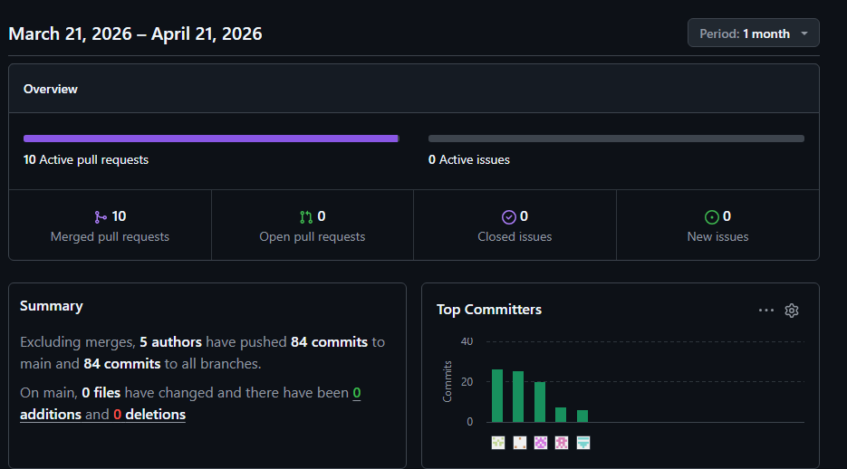](https://postimg.cc/nXDFBnBp)

[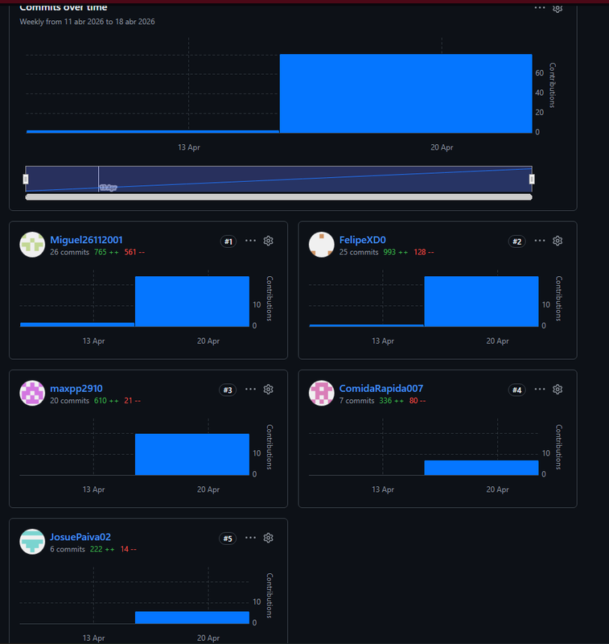](https://postimg.cc/VSw8tnzJ)

[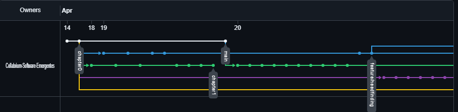](https://postimg.cc/rD16qs5S)

[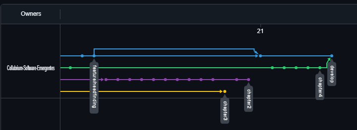](https://postimg.cc/Sj3H8Crp)

### TP:

### TB2:

Feliz y Felipe son dos cuentas de Jhon Guerrero.

## Contenido

- [Universidad Peruana de Ciencias Aplicadas](#universidad-peruana-de-ciencias-aplicadas)
    - [**Curso:** Arquitectura de Software Emergentes](#curso-arquitectura-de-software-emergentes)
    - [**NRC:** 17957](#nrc-17957)
    - [**Profesor:** Marino Humberto Jara Palacios](#profesor-marino-humberto-jara-palacios)
    - [**Ingeniería de Software**](#ingeniería-de-software)
  - [Informe de Trabajo Final](#informe-de-trabajo-final)
    - [**Nombre del Startup:** Collabrium](#nombre-del-startup-collabrium)
    - [**Nombre del producto:** SynHub](#nombre-del-producto-synhub)
  - [Integrantes](#integrantes)
  - [Registro de Versiones del Informe](#registro-de-versiones-del-informe)
  - [Project Report Collaboration Insights](#project-report-collaboration-insights)
    - [TB1:](#tb1)
    - [TB2:](#tb2)
    - [TB3:](#tb3)
  - [Contenido](#contenido)
  - [Student Outcome](#student-outcome)
  - [**1.1. Startup Profile**](#11-startup-profile)
    - [1.1.1. Descripción de la Startup](#111-descripción-de-la-startup)
  - [**1.2. Solution Profile**](#12-solution-profile)
    - [1.2.1 Nombre del producto](#121-nombre-del-producto)
    - [1.2.2 Antecedentes y problemática](#122-antecedentes-y-problemática)
    - [1.2.3. Lean UX Process](#123-lean-ux-process)
      - [1.2.3.1. Lean UX Problem Statements](#1231-lean-ux-problem-statements)
      - [1.2.3.2. Lean UX Assumptions](#1232-lean-ux-assumptions)
      - [1.2.3.3. Lean UX Hypothesis](#1233-lean-ux-hypothesis)
      - [1.2.3.4. Lean UX Canvas](#1234-lean-ux-canvas)
  - [**1.3. Segmento objetivo**](#13-segmento-objetivo)
- [2. Capítulo II: Requirements Elicitation \& Analysis](#2-capítulo-ii-requirements-elicitation--analysis)
  - [2.1. Competidores](#21-competidores)
    - [2.1.1. Análisis competitivo](#211-análisis-competitivo)
    - [2.1.2. Estrategias y tácticas frente a competidores](#212-estrategias-y-tácticas-frente-a-competidores)
  - [2.2. Entrevistas](#22-entrevistas)
    - [2.2.1. Diseño de entrevistas](#221-diseño-de-entrevistas)
    - [2.2.2. Registro de entrevistas](#222-registro-de-entrevistas)
    - [2.2.3. Análisis de entrevistas](#223-análisis-de-entrevistas)
  - [2.3. Needfinding](#23-needfinding)
    - [2.3.1. User Personas](#231-user-personas)
      - [A. User Persona: Coordinador de equipos](#a-user-persona-coordinador-de-equipos)
      - [B. User Persona: Miembro de equipo](#b-user-persona-miembro-de-equipo)
    - [2.3.2. User Task Matrix](#232-user-task-matrix)
      - [A. Segmento 1: Coordinadores o Líderes de Grupo](#a-segmento-1-coordinadores-o-líderes-de-grupo)
      - [B. Segmento 2: Miembros del Equipo o Grupo](#b-segmento-2-miembros-del-equipo-o-grupo)
    - [2.3.3. Empathy Mapping](#233-empathy-mapping)
      - [A. Empathy Map: Coordinador de equipos](#a-empathy-map-coordinador-de-equipos)
      - [B. Empathy Map: Miembro de equipo](#b-empathy-map-miembro-de-equipo)
    - [2.3.4. As-is Scenario Mapping](#234-as-is-scenario-mapping)
      - [A. As-is Segmento 1: Coordinador de equipos](#a-as-is-segmento-1-coordinador-de-equipos)
      - [B. As-is Segmento 2: Miembro de equipo](#b-as-is-segmento-2-miembro-de-equipo)
  - [2.4. Ubiquitous Language](#24-ubiquitous-language)
- [3. Capítulo III: Requirements Specification](#3-capítulo-iii-requirements-specification)
  - [3.1. To-Be Scenario Mapping](#31-to-be-scenario-mapping)
  - [3.2. User Stories](#32-user-stories)
  - [3.3. Impact Mapping](#33-impact-mapping)
  - [3.4. Product Backlog](#34-product-backlog)
- [4. Capítulo IV: Strategic-Level Software Design](#4-capítulo-iv-strategic-level-software-design)
  - [4.1. Strategic-Level Attribute-Driven Design](#41-strategic-level-attribute-driven-design)
    - [4.1.1. Design Purpose](#411-design-purpose)
  - [Enfoque Arquitectónico](#enfoque-arquitectónico)
    - [4.1.2. Attribute-Driven Design Inputs](#412-attribute-driven-design-inputs)
      - [4.1.2.1. Primary Functionality (Primary User Stories)](#4121-primary-functionality-primary-user-stories)
      - [4.1.2.2. Quality attribute Scenarios](#4122-quality-attribute-scenarios)
      - [4.1.2.3. Constraints](#4123-constraints)
    - [4.1.3. Architectural Drivers Backlog](#413-architectural-drivers-backlog)
    - [4.1.4. Architectural Design Decisions](#414-architectural-design-decisions)
    - [4.1.5. Quality Attribute Scenario Refinements](#415-quality-attribute-scenario-refinements)
  - [4.2. Strategic-Level Domain-Driven Design](#42-strategic-level-domain-driven-design)
    - [4.2.1. EventStorming](#421-eventstorming)
    - [4.2.2. Candidate Context Discovery](#422-candidate-context-discovery)
    - [4.2.3. Domain Message Flows Modeling](#423-domain-message-flows-modeling)
    - [4.2.4. Bounded Context Canvases](#424-bounded-context-canvases)
    - [4.2.5. Context Mapping](#425-context-mapping)
  - [4.3. Software Architecture](#43-software-architecture)
    - [4.3.1. Software Architecture System Landscape Diagram](#431-software-architecture-system-landscape-diagram)
    - [4.3.2. Software Architecture Context Level Diagrams](#432-software-architecture-context-level-diagrams)
    - [4.3.3. Software Architecture Container Level Diagrams](#433-software-architecture-container-level-diagrams)
    - [4.3.4. Software Architecture Deployment Diagrams](#434-software-architecture-deployment-diagrams)
- [5. Capítulo V: Tactical-Level Software Design](#5-capítulo-v-tactical-level-software-design)
  - [5.1. Bounded Context: Iam](#51-bounded-context-iam)
    - [5.1.1. Domain Layer](#511-domain-layer)
    - [5.1.2. Interface Layer](#512-interface-layer)
    - [5.1.3. Application Layer](#513-application-layer)
    - [5.1.4. Infrastructure Layer](#514-infrastructure-layer)
    - [5.1.5. Bounded Context Software Architecture Component Level Diagrams](#515-bounded-context-software-architecture-component-level-diagrams)
    - [5.1.6. Bounded Context Software Architecture Code Level Diagrams](#516-bounded-context-software-architecture-code-level-diagrams)
      - [5.1.6.1. Bounded Context Domain Layer Class Diagrams](#5161-bounded-context-domain-layer-class-diagrams)
      - [5.1.6.2. Bounded Context Database Design Diagram](#5162-bounded-context-database-design-diagram)
    - [5.1.1. Domain Layer](#511-domain-layer-1)
    - [5.1.2. Interface Layer](#512-interface-layer-1)
    - [5.1.3. Application Layer](#513-application-layer-1)
    - [5.1.4. Infrastructure Layer](#514-infrastructure-layer-1)
    - [5.1.5. Bounded Context Software Architecture Component Level Diagrams](#515-bounded-context-software-architecture-component-level-diagrams-1)
    - [5.1.6. Bounded Context Software Architecture Code Level Diagrams](#516-bounded-context-software-architecture-code-level-diagrams-1)
      - [5.1.6.1. Bounded Context Domain Layer Class Diagrams](#5161-bounded-context-domain-layer-class-diagrams-1)
      - [5.1.6.2. Bounded Context Database Design Diagram](#5162-bounded-context-database-design-diagram-1)
  - [5.2. Bounded Context: Groups](#52-bounded-context-groups)
    - [5.2.1. Domain Layer](#521-domain-layer)
      - [Aggregate Root: `Group`](#aggregate-root-group)
        - [Atributos](#atributos)
        - [Métodos](#métodos)
        - [Invariantes de negocio](#invariantes-de-negocio)
      - [Aggregate Root: `Invitation`](#aggregate-root-invitation)
        - [Atributos](#atributos-1)
        - [Métodos](#métodos-1)
        - [Invariantes de negocio](#invariantes-de-negocio-1)
      - [Aggregate Root: `Leader`](#aggregate-root-leader)
        - [Atributos](#atributos-2)
        - [Métodos](#métodos-2)
        - [Invariantes de negocio](#invariantes-de-negocio-2)
      - [Value Object: `GroupCode`](#value-object-groupcode)
        - [Atributos](#atributos-3)
        - [Métodos](#métodos-3)
        - [Invariantes](#invariantes)
      - [Value Object: `ImgUrl`](#value-object-imgurl)
        - [Atributos](#atributos-4)
        - [Métodos](#métodos-4)
        - [Invariantes](#invariantes-1)
      - [Value Object: `MemberId`](#value-object-memberid)
        - [Atributos](#atributos-5)
        - [Métodos](#métodos-5)
        - [Invariantes](#invariantes-2)
    - [5.2.2. Interface Layer](#522-interface-layer)
      - [Recursos de entrada (Request)](#recursos-de-entrada-request)
        - [`CreateGroupResource`](#creategroupresource)
        - [`UpdateGroupResource`](#updategroupresource)
      - [Recursos de salida (Response)](#recursos-de-salida-response)
        - [`GroupResource`](#groupresource)
        - [`LeaderResource`](#leaderresource)
        - [`LeaderDetailsResource`](#leaderdetailsresource)
        - [`GroupMemberResource`](#groupmemberresource)
        - [`InvitationMemberResource`](#invitationmemberresource)
        - [`InvitationResource`](#invitationresource)
      - [Resumen de recursos](#resumen-de-recursos)
      - [Controllers](#controllers)
        - [1. `GroupController`](#1-groupcontroller)
        - [2. `InvitationController`](#2-invitationcontroller)
        - [3. `LeaderController`](#3-leadercontroller)
        - [4. `LeaderGroupController`](#4-leadergroupcontroller)
        - [5. `LeaderInvitationController`](#5-leaderinvitationcontroller)
      - [Resumen de Controllers](#resumen-de-controllers)
    - [5.2.3. Application Layer](#523-application-layer)
      - [Command Services](#command-services)
        - [1. `GroupCommandServiceImpl`](#1-groupcommandserviceimpl)
        - [2. `InvitationCommandServiceImpl`](#2-invitationcommandserviceimpl)
        - [3. `LeaderCommandServiceImpl`](#3-leadercommandserviceimpl)
      - [Query Services](#query-services)
        - [1. `GroupQueryServiceImpl`](#1-groupqueryserviceimpl)
        - [2. `InvitationQueryServiceImpl`](#2-invitationqueryserviceimpl)
        - [3. `LeaderQueryServiceImpl`](#3-leaderqueryserviceimpl)
      - [Clients / Ports (Interfaces hacia Infraestructura)](#clients--ports-interfaces-hacia-infraestructura)
        - [1. `IamServiceClient`](#1-iamserviceclient)
        - [2. `TasksServiceClient`](#2-tasksserviceclient)
    - [5.2.4. Infrastructure Layer](#524-infrastructure-layer)
      - [Persistencia (JPA Repositories)](#persistencia-jpa-repositories)
        - [1. `GroupRepository`](#1-grouprepository)
        - [2. `InvitationRepository`](#2-invitationrepository)
        - [3. `LeaderRepository`](#3-leaderrepository)
      - [Configuración (Configuration)](#configuración-configuration)
        - [1. `RabbitMQConfig`](#1-rabbitmqconfig)
        - [2. `WebClientConfig`](#2-webclientconfig)
      - [Mensajería (Messaging)](#mensajería-messaging)
        - [Publishers](#publishers)
          - [1. `IamEventPublisher`](#1-iameventpublisher)
          - [2. `TasksEventPublisher`](#2-taskseventpublisher)
        - [Listeners (Consumidores)](#listeners-consumidores)
          - [1. `LeaderCreatedEventListener`](#1-leadercreatedeventlistener)
        - [2. `MemberLeftEventListener`](#2-memberlefteventlistener)
      - [Resumen de la capa de infraestructura](#resumen-de-la-capa-de-infraestructura)
    - [5.2.5. Bounded Context Software Architecture Component Level Diagrams](#525-bounded-context-software-architecture-component-level-diagrams)
    - [5.2.6. Bounded Context Software Architecture Code Level Diagrams](#526-bounded-context-software-architecture-code-level-diagrams)
      - [5.2.6.1. Bounded Context Domain Layer Class Diagrams](#5261-bounded-context-domain-layer-class-diagrams)
      - [5.2.6.2 Bounded Context Database Design Diagram](#5262-bounded-context-database-design-diagram)
  - [5.3. Bounded Context: Tasks](#53-bounded-context-tasks)
    - [5.3.1. Domain Layer](#531-domain-layer)
      - [Aggregate Root: `Task`](#aggregate-root-task)
        - [Métodos](#métodos-6)
        - [Invariantes de negocio](#invariantes-de-negocio-3)
      - [Aggregate Root: `Member`](#aggregate-root-member)
        - [Métodos](#métodos-7)
        - [Invariantes de negocio](#invariantes-de-negocio-4)
      - [Value Object: `GroupId`](#value-object-groupid)
        - [Atributos](#atributos-6)
        - [Métodos](#métodos-8)
        - [Invariantes](#invariantes-3)
      - [Value Object: `TaskStatus`](#value-object-taskstatus)
        - [Valores](#valores)
        - [Métodos](#métodos-9)
        - [Invariantes](#invariantes-4)
    - [5.3.2. Interface Layer](#532-interface-layer)
    - [Recursos de entrada (Request)](#recursos-de-entrada-request-1)
        - [`CreateTaskResource`](#createtaskresource)
        - [`UpdateTaskResource`](#updatetaskresource)
        - [`CreateMemberResource`](#creatememberresource)
      - [Recursos de salida (Response)](#recursos-de-salida-response-1)
        - [`TaskResource`](#taskresource)
        - [`TaskMemberResource`](#taskmemberresource)
        - [`MemberResource`](#memberresource)
        - [`MemberOnlyResource`](#memberonlyresource)
        - [`ExtendedGroupResource`](#extendedgroupresource)
      - [Resumen de recursos](#resumen-de-recursos-1)
      - [Controllers](#controllers-1)
        - [1. `MemberController`](#1-membercontroller)
        - [2. `MemberTaskController`](#2-membertaskcontroller)
        - [3. `TaskController`](#3-taskcontroller)
      - [Resumen de Controllers](#resumen-de-controllers-1)
    - [5.3.3. Application Layer](#533-application-layer)
      - [Command Services](#command-services-1)
        - [1. `MemberCommandServiceImpl`](#1-membercommandserviceimpl)
        - [2. `TaskCommandServiceImpl`](#2-taskcommandserviceimpl)
      - [Query Services](#query-services-1)
        - [1. `MemberQueryServiceImpl`](#1-memberqueryserviceimpl)
        - [2. `TaskQueryServiceImpl`](#2-taskqueryserviceimpl)
      - [Clients / Ports (Interfaces hacia Infraestructura)](#clients--ports-interfaces-hacia-infraestructura-1)
        - [1. `IamServiceClient`](#1-iamserviceclient-1)
        - [2. `GroupsServiceClient`](#2-groupsserviceclient)
    - [5.3.4. Infrastructure Layer](#534-infrastructure-layer)
      - [Persistencia (JPA Repositories)](#persistencia-jpa-repositories-1)
        - [1. `MemberRepository`](#1-memberrepository)
        - [2. `TaskRepository`](#2-taskrepository)
      - [Configuración (Configuration)](#configuración-configuration-1)
        - [1. `RabbitMQConfig`](#1-rabbitmqconfig-1)
        - [2. `WebClientConfig`](#2-webclientconfig-1)
      - [Mensajería (Messaging)](#mensajería-messaging-1)
    - [Publishers](#publishers-1)
        - [1. `IamEventPublisher`](#1-iameventpublisher-1)
        - [2. `GroupEventsPublisher`](#2-groupeventspublisher)
    - [Listeners (Consumidores)](#listeners-consumidores-1)
        - [1. `MemberCreatedEventListener`](#1-membercreatedeventlistener)
        - [2. `InvitationAcceptedEventListener`](#2-invitationacceptedeventlistener)
        - [3. `MemberRemovedEventListener`](#3-memberremovedeventlistener)
        - [4. `GroupDeletedEventListener`](#4-groupdeletedeventlistener)
      - [Resumen de la capa de infraestructura](#resumen-de-la-capa-de-infraestructura-1)
    - [5.3.5. Bounded Context Software Architecture Component Level Diagrams](#535-bounded-context-software-architecture-component-level-diagrams)
    - [5.3.6. Bounded Context Software Architecture Code Level Diagrams](#536-bounded-context-software-architecture-code-level-diagrams)
    - [5.3.6.1 Bounded Context Domain Layer Class Diagrams](#5361-bounded-context-domain-layer-class-diagrams)
    - [5.3.6.2 Bounded Context Database Design Diagram](#5362-bounded-context-database-design-diagram)
  - [5.4. Bounded Context: Requests](#54-bounded-context-requests)
    - [5.4.1. Domain Layer](#541-domain-layer)
    - [5.4.2. Interface Layer](#542-interface-layer)
    - [5.4.3. Application Layer](#543-application-layer)
    - [5.4.4. Infrastructure Layer](#544-infrastructure-layer)
    - [5.4.5. Bounded Context Software Architecture Component Level Diagrams](#545-bounded-context-software-architecture-component-level-diagrams)
    - [5.4.6. Bounded Context Software Architecture Code Level Diagrams](#546-bounded-context-software-architecture-code-level-diagrams)
    - [5.4.7. Bounded Context Domain Layer Class Diagrams](#547-bounded-context-domain-layer-class-diagrams)
    - [5.4.8. Bounded Context Database Design Diagram](#548-bounded-context-database-design-diagram)
  - [5.5. Bounded Context: Analítica y Reportes](#55-bounded-context-analítica-y-reportes)
    - [5.5.1. Domain Layer](#551-domain-layer)
      - [**Justificación:**](#justificación)
      - [**Aggregate: ActivityLog**](#aggregateactivitylog)
      - [**Aggregate: Report**](#aggregatereport)
      - [**Value Object: Metric**](#value-objectmetric)
    - [**5.5.2. Interface Layer**](#552-interface-layer)
      - [**Controller: ReportController**](#controllerreportcontroller)
      - [**Atributos**](#atributos-7)
      - [**Métodos**](#métodos-10)
    - [**5.5.3. Application Layer**](#553-application-layer)
      - [**Service: ReportQueryService**](#servicereportqueryservice)
      - [**Atributos**](#atributos-8)
      - [**Métodos**](#métodos-11)
      - [**Service: ReportCommandService**](#servicereportcommandservice)
      - [**Atributos**](#atributos-9)
      - [**Métodos**](#métodos-12)
      - [**Command Handlers**](#command-handlers)
      - [**Event Handlers**](#event-handlers)
    - [**5.5.4. Infrastructure Layer**](#554-infrastructure-layer)
      - [**Repository: ActivityLogRepositoryImpl**](#repositoryactivitylogrepositoryimpl)
      - [**Repository: ReportRepositoryImpl**](#repositoryreportrepositoryimpl)
    - [**5.5.5. Bounded Context Software Architecture Component Level Diagrams**](#555-bounded-context-software-architecture-component-level-diagrams)
    - [**5.5.6. Bounded Context Software Architecture Code Level Diagrams**](#556-bounded-context-software-architecture-code-level-diagrams)
      - [**5.5.6.1. Bounded Context Domain Layer Class Diagrams**](#5561-bounded-context-domain-layer-class-diagrams)
    - [5.5.8. Bounded Context Database Design Diagram](#558-bounded-context-database-design-diagram)
  - [5.6. Bounded Context: Notifications](#56-bounded-context-notifications)
    - [5.6.1. Domain Layer](#561-domain-layer)
      - [Aggregate Root: `Notification`](#aggregate-root-notification)
        - [Atributos](#atributos-10)
        - [Métodos](#métodos-13)
        - [Invariantes de negocio](#invariantes-de-negocio-5)
      - [Entity: `EmailDeliveryLog`](#entity-emaildeliverylog)
        - [Atributos](#atributos-11)
        - [Métodos](#métodos-14)
        - [Invariantes de negocio](#invariantes-de-negocio-6)
      - [Value Object: `NotificationStatus`](#value-object-notificationstatus)
        - [Atributos](#atributos-12)
        - [Métodos](#métodos-15)
        - [Invariantes de negocio](#invariantes-de-negocio-7)
      - [Value Object: `EventType`](#value-object-eventtype)
        - [Atributos](#atributos-13)
        - [Métodos](#métodos-16)
        - [Invariantes de negocio](#invariantes-de-negocio-8)
    - [5.6.2. Interface Layer](#562-interface-layer)
      - [Recursos de entrada (Request)](#recursos-de-entrada-request-2)
        - [`CreateNotificationResource`](#createnotificationresource)
      - [Recursos de salida (Response)](#recursos-de-salida-response-2)
        - [`NotificationResource`](#notificationresource)
        - [`NotificationSummaryResource`](#notificationsummaryresource)
        - [`EmailDeliveryLogResource`](#emaildeliverylogresource)
        - [`NotificationStatusResource`](#notificationstatusresource)
      - [Resumen de recursos](#resumen-de-recursos-2)
      - [Controllers](#controllers-2)
        - [1. `NotificationController`](#1-notificationcontroller)
        - [2. `NotificationRetryController`](#2-notificationretrycontroller)
      - [Resumen de Controllers](#resumen-de-controllers-2)
    - [5.6.3. Application Layer](#563-application-layer)
      - [Command Services](#command-services-2)
        - [1. `NotificationCommandServiceImpl`](#1-notificationcommandserviceimpl)
        - [2. `NotificationDeliveryService` (Infrastructure Service expuesto vía Application Layer)](#2-notificationdeliveryservice-infrastructure-service-expuesto-vía-application-layer)
      - [Query Services](#query-services-2)
        - [1. `NotificationQueryServiceImpl`](#1-notificationqueryserviceimpl)
      - [Resumen de servicios de aplicación](#resumen-de-servicios-de-aplicación)
    - [5.6.4. Infrastructure Layer](#564-infrastructure-layer)
      - [Persistencia (JPA Repositories)](#persistencia-jpa-repositories-2)
        - [1. `NotificationRepository`](#1-notificationrepository)
        - [2. `EmailDeliveryLogRepository`](#2-emaildeliverylogrepository)
      - [Configuración (Configuration)](#configuración-configuration-2)
        - [1. `SendGridConfig`](#1-sendgridconfig)
        - [2. `WebClientConfig`](#2-webclientconfig-2)
        - [3. `SchedulerConfig`](#3-schedulerconfig)
      - [Clientes HTTP (HTTP Clients)](#clientes-http-http-clients)
        - [1. `IamServiceClient`](#1-iamserviceclient-2)
      - [Mensajería (Messaging)](#mensajería-messaging-2)
        - [Listeners (Consumidores)](#listeners-consumidores-2)
          - [1. `MemberJoinedEventListener`](#1-memberjoinedeventlistener)
          - [2. `MemberLeftEventListener`](#2-memberlefteventlistener-1)
          - [3. `InvitationSentEventListener`](#3-invitationsenteventlistener)
          - [4. `TaskAssignedEventListener`](#4-taskassignedeventlistener)
          - [5. `GroupCreatedEventListener`](#5-groupcreatedeventlistener)
      - [Resumen de la capa de infraestructura](#resumen-de-la-capa-de-infraestructura-2)
    - [5.6.5. Bounded Context Software Architecture Component Level Diagrams](#565-bounded-context-software-architecture-component-level-diagrams)
    - [5.6.6. Bounded Context Software Architecture Code Level Diagrams](#566-bounded-context-software-architecture-code-level-diagrams)
      - [5.6.6.1. Bounded Context Domain Layer Class Diagrams](#5661-bounded-context-domain-layer-class-diagrams)
      - [5.6.6.2. Bounded Context Database Design Diagram](#5662-bounded-context-database-design-diagram)
- [Capítulo VI: Solution UX Design](#capítulo-vi-solution-ux-design)
  - [6.1. Style Guidelines](#61-style-guidelines)
    - [6.1.1. General Style Guidelines](#611-general-style-guidelines)
    - [6.1.2. Web, Mobile \& Devices Style Guidelines](#612-web-mobile--devices-style-guidelines)
    - [6.1.1. General Style Guidelines](#611-general-style-guidelines-1)
    - [6.1.2. Web, Mobile \& Devices Style Guidelines](#612-web-mobile--devices-style-guidelines-1)
  - [6.2. Information Architecture](#62-information-architecture)
    - [6.2.1. Labeling Systems](#621-labeling-systems)
    - [6.2.2. Searching Systems](#622-searching-systems)
    - [6.2.3. SEO Tags and Meta Tags](#623-seo-tags-and-meta-tags)
    - [6.2.4. Navigation Systems](#624-navigation-systems)
  - [6.3. Landing Page UI Design](#63-landing-page-ui-design)
    - [6.3.1. Landing Page Wireframe](#631-landing-page-wireframe)
    - [6.3.2. Landing Page Mock-up](#632-landing-page-mock-up)
  - [6.4. Applications UX/UI Design](#64-applications-uxui-design)
    - [6.4.1. Applications Wireframes](#641-applications-wireframes)
    - [6.4.2. Applications Wireflow Diagrams](#642-applications-wireflow-diagrams)
    - [6.4.3. Applications Mock-ups](#643-applications-mock-ups)
    - [6.4.4. Applications User Flow Diagrams](#644-applications-user-flow-diagrams)
  - [6.5. Applications Prototyping](#65-applications-prototyping)
- [Capítulo VII: Product Implementation, Validation \& Deployment](#capítulo-vii-product-implementation-validation--deployment)
  - [7.1. Software Configuration Management](#71-software-configuration-management)
    - [7.1.1. Software Development Environment Configuration](#711-software-development-environment-configuration)
    - [7.1.2. Source Code Management](#712-source-code-management)
    - [7.1.3. Source Code Style Guide \& Conventions](#713-source-code-style-guide--conventions)
    - [7.1.4. Software Deployment Configuration](#714-software-deployment-configuration)
  - [7.2. Solution Implementation](#72-solution-implementation)
    - [7.2.1 Sprint 1](#721-sprint-1)
      - [7.2.1.1. Sprint Planning 1](#7211-sprint-planning-1)
      - [7.2.1.2. Sprint Backlog 1](#7212-sprint-backlog-1)
      - [7.2.1.3. Development Evidence for Sprint Review.](#7213-development-evidence-for-sprint-review)
      - [7.2.1.4.	Testing Suite Evidence for Sprint Review](#7214testing-suite-evidence-for-sprint-review)
      - [7.2.1.5.	Execution Evidence for Sprint Review](#7215execution-evidence-for-sprint-review)
      - [7.2.1.6.	Services Documentation Evidence for Sprint Review](#7216services-documentation-evidence-for-sprint-review)
      - [7.2.1.7.	Software Deployment Evidence for Sprint Review](#7217software-deployment-evidence-for-sprint-review)
      - [7.2.1.8.	Team Collaboration Insights during Sprint](#7218team-collaboration-insights-during-sprint)
  - [7.3.	Validation Interviews](#73validation-interviews)
    - [7.3.1.	Diseño de Entrevistas](#731diseño-de-entrevistas)
    - [7.3.2.	Registro de Entrevistas](#732registro-de-entrevistas)
    - [7.3.3.	Evaluaciones según heurísticas](#733evaluaciones-según-heurísticas)
    - [7.4.	Video About-the-Product](#74video-about-the-product)
  - [Conclusiones](#conclusiones)
    - [TB1:](#tb1-1)
    - [TB2:](#tb2-1)
    - [TB3:](#tb3-1)

## Student Outcome

El curso contribuye al cumplimiento del Student Outcome ABET:

**ABET – EAC - Student Outcome 3**

**Criterio:** *Capacidad de comunicarse efectivamente con un rango de
audiencias.*

En el siguiente cuadro se describe las acciones realizadas y enunciados
de conclusiones por parte del grupo, que permiten sustentar el haber
alcanzado el logro del ABET – EAC - Student Outcome 3.

<table>
  <thead>
    <tr>
      <th style="text-align: left;">Criterio específico</th>
      <th style="text-align: left;">Acciones realizadas</th>
      <th style="text-align: left;">Conclusiones</th>
    </tr>
  </thead>
  <tbody>
    <tr>
      <td>1. Comunica oralmente sus ideas y/o resultados con objetividad a público de diferentes especialidades y niveles jerarquicos, en el marco del desarrollo de un proyecto en ingeniería.</td>
      <td>
        <strong>Gomez Hurtado, Miguel Angel</strong>
          <em>TB1</em>  
        Expliqué al profesor y a mis compañeros el avance del proyecto, describiendo objetivos, resultados y conclusiones de manera clara. Además, aclare dudas en cuanto a conceptos de cada capítulo en este entrega y los formato de envíos de la misma. 
          <em>TP</em>  
        Realizé consultas al profesor sobre los avances parciales del proyecto antes de la presente entrega. Le hice presente la distribución de bounded contexts y recibi su retroalimentación respecto al enfoque de las tecnologías emergentes del proyecto. 
          <em>TB2</em>  
        Mantuve el contacto con el profesor para comunicar con mis compañeroes sobre los requerimientos de este entregable. Apoye en la creacion y orquestacion de los microservicios deployados.    
        <strong>Paiva Quispe, Josue Gonzalo</strong>
          <em>TB1</em>  
        Mantuve comunicación activa con mis compañeros para el planteamiento del asistente de IA y su impacto en las US del producto. 
          <em>TP</em>   Realice la documentacion del bounded context asignado en los plazos asignados y aporte al trabajo colaborativo con la presentacion de Synhub en Canva.
          <em>TB2</em>   Implemente el microservicio de tasks en su totalidad en su repositorio dedicado en la organizacion de Collabrium
          
        <strong>Guerrero Vasquez, Jhon Danny</strong>
          <em>TB1</em>  
        Aporte en la organización y ejecución de las actividades del equipo, asegurando que el trabajo avanzara de manera ordenada y estructurada. Esta participación permitió que las tareas se desarrollaran con claridad y consistencia, facilitando la coordinación y el progreso del proyecto frente a diferentes públicos y niveles jerárquicos. 
          <em>TP</em>   Comuniqué objetivamente los avances y bounded contexts con los integrantes de mi equipo para recibir retroalimentación. Asimismo, coordiné con el líder y mi equipo el impacto de la IA y la división de tareas, adaptando mi mensaje a cada nivel jerárquico para asegurar la entrega.
          
           <em>TB2</em>   Mantuve y me mantuve en constante coordinación con los miembros de mi equipo y así tener en cuenta las actualización en cada microservicio que tenian a cargo ellos y por mi parte permitirme desarrollar correctamente mi propio microservicio
          
        <strong>Paitan Pumacahua, Max Anthony</strong>
          <em>TB1</em>  
        Mantuve comunicación activa con mis compañeros de grupo, coordinando el avance y la división del trabajo. Además, participé activamente brindando mis puntos de vista, mis dudas y recomendaciones en el trabajo, específicamente en la sección de competidores y entrevistas. 
          <em>TP</em>  
        Hice coordinaciones con los mis compañeros de grupo para esta entrega, coordinando y dividiendo el trabajo. Realicé las respectivas consultas al líder de grupo, y absolví mis dudas con el grupo, así como apoyé a mis compañeros con sus problemas.
          
          <em>TB2</em>   Coordiné con el grupo para la división de tareas y dudas existentes. Ayude a absolver algunas dudas del equipo, así como consulté a mis compañeros ante los problemas que tuve durante la implementación del proyecto.
          
        <strong>Acuña Tomas, Diego Rolin</strong>
          <em>TB1</em>  
        Para asegurar una comunicación clara y directa, nos pusimos de acuerdo y realizamos una reunión virtual en la que explicamos de qué trata el trabajo, cuáles son los objetivos de la startup y las características del producto. Además, si alguien tenía alguna duda, podíamos resolverla fácilmente. También realizamos reuniones presenciales al final de cada clase para reforzar la coordinación del equipo. 
          <em>TP</em>
         Tuvimos reuniones periódicas para coordinar el trabajo y resolver dudas a través de Meet. En estas reuniones explicamos cada bounded context y la función que cumple dentro del proyecto. Asimismo, nos distribuimos las tareas entre los integrantes del equipo. Además, presentamos y analizamos los diagramas desarrollados, así como el diseño visual y la lógica tanto del landing page como de la aplicación móvil. 
          <em>TB2</em>
         Tuvimos reuniones periodicas para el avance de los microservicios, pues es necesario que trabajen en conjunto. Estuve a cargo de Iam-Microservice, al avanzar cada endpoint explique en llamadas como funcionaba y como era util para otros microservicios. 
      </td>
      <td>
        <strong>TB1</strong> 
        Se evidenció la capacidad del grupo para comunicar oralmente ideas y resultados con claridad, objetividad y seguridad durante la creación del trabajo. La comunicación para pulir mediante softwares emergentes una solución ya sólida permitió la finalización de un primer avance. 
          <strong>TP</strong>  
        En esta entrega presentamos una mejora al momento de p´resentar los entregables parciales para medir los avances de cada participante. Se presentó un modelo de ejemplo para que se guiarán y que el entendimiento del formato del reporte sea lo más uniforme posible.  
          <strong>TB2</strong>  
        En esta entrega nos encargamos del desarrollo de la primera parte del proyecto. La cual se encarga de todas las historias de usuario que no estan relacionadas a las tecnologias emergentes.
      </td>
    </tr>
    <tr>
      <td>2. Comunica en forma escrita ideas y/o resultados con objetividad a público de diferentes especialidades y niveles jerarquicos, en el marco del desarrollo de un proyecto en ingeniería.</td>
      <td>
        <strong>Gomez Hurtado, Miguel Angel</strong>
          <em>TB1</em>  
        Realize el análisis DDD del capítulo 4. Esto abarca desde el EventStorming hasta el Context Mapping. Además, diseñe la infraestructura de nuestro proyecto en los diferentes tipos de diagramas del mismo capítulo. Por último, registre mis entrevistas y documente los resultados del proyyecto. 
          <em>TP</em>  
        Realize la descomposicion de dos bounded context, siendo Notification y Groups. Los desglose enfocandome en patrones de diseño como Clean Architecture y CQRS.  
         <em>TB2</em>  
        Realizé el deploy de los microservicios, además añadi mejores prácticas a las implementaciones de todos los microservicios, a la vez que corregi vulnerabilidades en las dependencias. Me encargue netamente del microservicio de Groups.     
        <strong>Paiva Quispe, Josue Gonzalo</strong>
          <em>TB1</em>  
        Desarrollé la épica nueva de agente de IA, además de sus US y TS respectivas. Elaboré impact mapping y To-be scenario mapping. 
          <em>TP</em>   Desarrolle y documente el bounded context de Tasks y elabore sus correspondientes diagramas de componentes, uml y database
          <em>TB2</em>   Integre 4 pruebas unitarias para el microservicio de tasks y las documente, junto con la documentacion de los endpoints de la misma
          
        <strong>Guerrero Vasquez, Jhon Danny</strong>
          <em>TB1</em>  
        En el desarrollo del proyecto, mi aporte se centró en la elaboración del Capítulo I, donde comuniqué de manera escrita y objetiva las ideas y resultados iniciales. Presenté el perfil de la startup y del producto, describí la problemática y los antecedentes, y estructuré el proceso Lean UX con sus supuestos e hipótesis, asegurando que la información se transmitiera con claridad y coherencia. Esta participación permitió que los avances se documentaran de forma organizada y comprensible para públicos de diferentes especialidades y niveles jerárquicos, facilitando la coordinación y el entendimiento del proyecto en su etapa inicial. 
          <em>TP</em>   Documenté objetivamente la arquitectura y patrones (como CQRS) de los bounded contexts mediante diagramas UML para guiar al equipo técnico. Además, diseñé wireframes para comunicar visualmente el producto a perfiles no técnicos, garantizando su comprensión en diferentes niveles y especialidades.
          
          <em>TB2</em>   Integre varias pruebas unitarias para la la comprobación correcta del funcionamiento de mi microservicio realizado. También las documente cada una y poder garantizar el correcto funcionamiento de los endpoints
          
        <strong>Paitan Pumacahua, Max Anthony</strong>
          <em>TB1</em>  
        Realicé la primera parte del capítulo 2, el análisis de competidores, las preguntas de las entrevistas. Además, colaboré en la realización del Architectural Design Decisions, Quality Attribute Scenario Refinements, Architectural Drivers Backlog y los Constraints. 
          <em>TP</em>  
        Realicé toda la descomposición del bounded context Requests, considerando los patrones de diseño correspondientes; hice uso de un diagrama de componentes, diagrama de clases, y diagrama de base de datos para una mayor comprensión. Además, realicé el diseño del wireframe y mockup del landing page. 
          
          <em>TB2</em>   Realicé todo el código del backend correspondiente al microservicio de Requests. Realicé 12 pruebas unitarias para verificar el correcto funcionamiento de la parte del producto que avancé.
          
        <strong>Acuña Tomas, Diego Rolin</strong>
          <em>TB1</em>  
        Realicé el Needfinding junto al análisis de los User Persona 
          <em>TP</em>
         Al completar este reporte, procuré utilizar un lenguaje claro y sencillo para que cualquier persona, incluso fuera del mundo del software, pudiera comprenderlo. Asimismo, cada diagrama desarrollado dentro de los *bounded contexts* cuenta con una explicación simple y fácil de entender. 
          <em>TB2</em>
         Al diseñar como funcionan en conjunto los microservicios, ayude en la creacion de un PDF donde se pueda leer la documentacion del funcionamiento de cada microservicio y que endpoint usara de otro. Asi pudimos facilitar la comprension del sistema, sobretodo mientras creaba Iam-Microservice. 
      </td>
      <td>
        <strong>TB1</strong> 
        Se evidenció la capacidad del grupo para comunicar por escrito ideas y resultados mediante una presentación estructurada, clara y técnicamente adecuada. Se realizaron de manera debido la documentación delos capítulos 1, 2, 3 y 4 para la culminación del primer avance. 
          <strong>TP</strong>  
        Se completo de manera satisfactoria los capitulos 5 y el capitulo 6 hasta el punto 6.4. El formato de compartio a lo largo de la estructura del capitulo 5 con los bounded context.  
          <strong>TB2</strong>  
        En esta entrega nos se realizó el deploy de algunos microservicios que ya se consideraban listos. Además, de investigar todas las tecnologias emergentes que se usarán en las entregas posteriores.
      </td>
    </tr>
  </tbody>
</table>

## **1.1. Startup Profile**

### 1.1.1. Descripción de la Startup

Collabrium es una startup tecnológica que nace con el propósito de
mejorar la forma en que las personas trabajan y colaboran en equipo. A
través de su plataforma principal, SynHub, busca ofrecer un espacio
digital accesible e intuitivo que ayude a los grupos académicos,
laborales o comunitarios a organizar sus actividades, repartir
responsabilidades de manera justa y mantener una comunicación clara y
constante.

Collabrium entiende que detrás de cada proyecto hay personas con
diferentes ritmos, talentos y necesidades. Por ello, su propuesta no se
limita a gestionar tareas, sino que promueve un entorno de
corresponsabilidad y equilibrio, donde cada integrante pueda aportar de
forma activa, sentirse escuchado y crecer junto a su equipo.

**Visión:** Ser un referente global en la creación de soluciones
digitales que fortalezcan la organización, la comunicación y el
bienestar dentro de los equipos, contribuyendo a construir comunidades
más colaborativas, equilibradas y humanas.

**Misión:** Desarrollar herramientas innovadoras y accesibles que
acompañen a las personas en sus dinámicas de trabajo en equipo,
facilitando la coordinación, la distribución justa de responsabilidades
y el diálogo constante. Collabrium busca que cada grupo, sin importar su
contexto, logre trabajar de forma más organizada, eficiente y en
armonía.

  
1.1.2. Perfiles de integrantes del equipo

<table>
<colgroup>
<col style="width: 35%" />
<col style="width: 64%" />
</colgroup>
<thead>
<tr>
<th>Integrante</th>
<th>Descripción:</th>
</tr>
<tr>
<th style="text-align: center;"></th>
<th style="text-align: left;">
Jhon Danny Guerrero Vasquez -
U202116246

>Soy ingeniero de software especializado en backend con Java y
frameworks como Spring. Me enfoco en crear microservicios escalables y
eficientes, aplicando programación reactiva con Spring WebFlux. Tengo
experiencia en diseño de APIs RESTful y optimización de bases de datos
como MySQL y PostgreSQL. Además, implementó pruebas unitarias y sigo
metodologías Agile para garantizar la calidad del código. Estoy
comprometido con la integración continua en los aportes de cada
integrante de mi equipo.
</th>
</tr>
<tr>
<th></th>
<th style="text-align: left;">
Acuña Tomas, Diego Rolin -
U202221436

Soy estudiante de Ingeniería de Software en la UPC, actualmente
cursando el octavo ciclo. Durante mi formación académica he adquirido
sólidos conocimientos en múltiples lenguajes de programación y
frameworks, desarrollando competencias especializadas en frontend,
backend y bases de datos. Me interesa especialmente contribuir a
proyectos de código abierto, como Angular, Spring y otras herramientas
modernas. Me considero una persona curiosa y proactiva, con una visión
optimista del futuro tecnológico.
</th>
</tr>
<tr>
<th style="text-align: center;"></th>
<th style="text-align: left;">
Paitan Pumacahua, Max Anthony -
U201314454

Soy Max Anthony y tengo 29 años. Estoy retomando Ingeniería de
Software como segunda carrera, ya que siempre tuvo ello como objetivo;
en la actualidad, me encuentro cursando el noveno ciclo. Entre mis
habilidades están: Ágil capacidad de análisis -tanto individual como
también en colectivo-, empático en un contexto determinado -tomando
decisiones de manera sensata-, y puedo ser tanto gestor como un
participante activo dentro de un grupo de trabajo.
</th>
</tr>
<tr>
<th></th>
<th style="text-align: left;">
Josue Gonzalo Paiva Quispe -
U202119095

Soy estudiante de Ingeniería de Software, me encuentro cursando
el 8vo ciclo y realizando prácticas pre profesionales como fullstack
junior web developer
</th>
</tr>
<tr>
<th></th>
<th style="text-align: left;">
Miguel Angel Gomez Hurtado - U202220294

Tengo 24 años y estoy estudiando la carrera de Ingeniería Informática. Me encuentro en mi octavo ciclo en la UPC Sede San Miguel. Soy una persona académica y siempre estoy abierto al diálogo. Me apasiona mi carrera y siempre estoy dispuesto a aprender sobre este curso para brindar a mis futuros usuarios un buen producto acorde a sus necesidades.
</th></th>
</tr>
</thead>
<tbody>
</tbody>
</table>

## **1.2. Solution Profile**

### 1.2.1 Nombre del producto

El producto principal de Collabrium lleva por nombre SynHub. El término
surge de la combinación de dos ideas clave: “Syn”, inspirado en
“sincronizar” y “sinergia”, y “Hub”, entendido como un centro o punto de
encuentro.

Este nombre refleja la esencia del producto: ser un espacio digital
donde los equipos pueden sincronizar esfuerzos, centralizar la
organización y generar sinergias que fortalezcan la colaboración.

### 1.2.2 Antecedentes y problemática

What

- ¿Cuál es el problema?

El problema radica en la baja adopción de soluciones diseñadas para la
organización colaborativa. A pesar de la disponibilidad de diversas
herramientas digitales, muchas personas y grupos siguen recurriendo a
métodos improvisados o poco eficientes para coordinar actividades, lo
que genera distribución desigual de tareas, falta de seguimiento,
comunicación fragmentada y pérdida de productividad.

- ¿Cuál es la relación con la persona en cuestión?

La relación es ofrecer a los miembros de equipos o grupos una
herramienta accesible y centrada en sus necesidades reales, que facilite
una organización más clara, una distribución de tareas efectiva y una
comunicación más fluida, promoviendo así su uso y adopción en el día a
día.

When

- ¿Cuándo sucede el problema?

El problema surge cuando los equipos y grupos deben coordinar
actividades, repartir responsabilidades o mantener una comunicación
constante para alcanzar objetivos comunes.

- ¿Cuándo utiliza el cliente el producto?

El cliente utiliza SynHub cuando necesita organizar, coordinar o
participar en actividades grupales de manera eficiente, ya sea al inicio
de un proyecto, durante la planificación de tareas o en el seguimiento
de responsabilidades.

Where

- ¿Dónde está el cliente cuando usa el producto?

El cliente utiliza SynHub desde cualquier lugar con acceso a Internet,
ya sea en su hogar, en la oficina, en el aula o incluso mientras se
traslada, dependiendo de la plataforma que utilice.

- ¿Dónde surge el problema?

El problema surge dentro de los propios entornos donde se desarrollan
actividades grupales, como oficinas, instituciones educativas,
organizaciones comunitarias o espacios colaborativos, en los que la
coordinación efectiva es clave para lograr objetivos comunes.

Who

- ¿Quienes se ven involucrados en el problema?

Se ven involucrados tanto los organizadores o coordinadores de equipos
(como líderes de proyecto, docentes, jefes de área o representantes
comunitarios) miembros de equipos de trabajo (como estudiantes,
colaboradores, voluntarios o participantes) que enfrentan dificultades
para organizarse, distribuir responsabilidades y comunicarse
eficazmente. Why

- ¿Cuáles son las causas del problema?

Las causas del problema radican en la falta de adopción de soluciones
para la organización de equipos. Esto se debe, en gran parte, a la
resistencia al cambio, la baja percepción de valor inmediato y la falta
de hábitos digitales consolidados en ciertos grupos. Aunque existen
herramientas disponibles, muchas personas prefieren métodos
tradicionales como chats informales, hojas de cálculo o notas físicas,
ya que perciben las apps como innecesarias, complicadas o poco
integradas a su rutina diaria. Además, la escasa promoción interna o el
desconocimiento de las funcionalidades clave también limitan su uso
efectivo.

How

- ¿En qué condiciones los clientes usan nuestro producto?

Los clientes usan SynHub cuando forman parte de equipos o grupos que
necesitan coordinar actividades de manera organizada y colaborativa,
especialmente en contextos donde hay múltiples tareas, horarios
variables y responsabilidades compartidas.

How Much

- ¿Cuál es la magnitud del problema?

La magnitud del problema de desorganización y comunicación ineficaz en
equipos es considerable. Según el State of Teams Report de Atlassian
(2021), solo el 17% de los equipos se consideran "saludables", mientras
que el 54% son parcialmente saludables y el 29% directamente insalubres
(p. 12). Además, el 57% de los participantes admitió que sus equipos no
operan con la eficiencia necesaria, lo que genera retrasos y afecta la
productividad (Atlassian, 2021, p. 18). Esto se agrava por la falta de
conexión interpersonal: el 56% de los miembros reportó sentirse poco
vinculado con sus compañeros, y el 37% mencionó que no puede expresar
ideas libremente por falta de seguridad psicológica (Atlassian, 2021, p.
24).

### 1.2.3. Lean UX Process

#### 1.2.3.1. Lean UX Problem Statements

En el entorno actual, tanto en contextos familiares como laborales y
comunitarios, los grupos enfrentan grandes desafíos para coordinar
tareas y mantener una comunicación fluida y estructurada entre sus
miembros. Aunque existen herramientas digitales como aplicaciones de
mensajería o tableros de tareas, muchas de estas soluciones son
fragmentadas, poco integradas o carecen de una lógica colaborativa
adaptada al trabajo en equipo cotidiano.

Esta falta de soluciones centralizadas y personalizables genera
desorganización, distribución desigual de responsabilidades, olvidos,
retrasos y fricciones entre los integrantes de un grupo. Ya sea en un
entorno familiar, una oficina, un equipo de voluntariado o un pequeño
negocio, la necesidad de una herramienta unificada que facilite la
colaboración, la planificación y el seguimiento de actividades es cada
vez más evidente.

SynHub nace como una plataforma digital diseñada para cubrir esta
brecha: una solución integral para la gestión de grupos que permite
distribuir tareas, visualizar reportes, recibir recordatorios y mejorar
la eficiencia del trabajo en conjunto.

#### 1.2.3.2. Lean UX Assumptions

User Assumptions (Suposiciones de Usuario)

- ¿Quién es el usuario?: El usuario es alguien que busca una solución
  para organizar las tareas en un equipo y mejorar la comunicación entre
  los miembros.

- ¿Dónde encaja nuestro producto en su trabajo o vida?: Nuestro producto
  encaja en actividades grupales donde el usuario es partícipe junto a
  otros miembros, facilitando la gestión de tareas y responsabilidades
  dentro del equipo.

- ¿Qué problemas resuelve nuestro producto?: Nuestro producto resuelve
  problemas de desorganización y falta de comunicación dentro del
  equipo.

- ¿Cuándo y cómo se usa nuestro producto?: Nuestro producto se usa
  cuando hay necesidad de organización en actividades grupales,
  especialmente en momentos de planificación, seguimiento de tareas y
  coordinación entre miembros del equipo.

- ¿Qué características son importantes?: Las características importantes
  incluyen la asignación de tareas, el seguimiento del avance del
  equipo, la visualización de horarios del equipo, la comunicación
  estructurada y la posibilidad de adaptar la herramienta a diferentes
  dinámicas de grupo.

- ¿Cómo debe verse y comportarse nuestro producto?: Nuestro producto
  debe tener una interfaz intuitiva y amigable, que permita a los
  usuarios navegar fácilmente entre las distintas funcionalidades.

Business Assumptions (Suposiciones de Negocio)

- Necesidades y problemas: Creemos que los equipos de trabajo tienen la
  necesidad de organizar sus tareas de manera eficiente y mejorar la
  comunicación entre sus miembros.

- Plataforma: Estas necesidades se pueden resolver a través de una
  aplicación que ofrezca herramientas para la gestión de tareas y la
  comunicación, proporcionando una experiencia fluida y accesible.

- Segmentación: Los usuarios de la aplicación serán coordinadores de
  equipos e integrantes de esos equipos que buscan una forma accesible
  de organizar sus responsabilidades.

- Comportamientos: El valor principal que un usuario quiere obtener de
  nuestro servicio es la facilidad de uso y la mejora en la organización
  y comunicación dentro del equipo.

- Beneficios: Los usuarios obtendrán beneficios como una mejor
  organización personal, mayor claridad sobre sus responsabilidades
  dentro del equipo, y una sensación de logro al completar tareas.

- Captación de clientes: Adquiriremos la mayoría de nuestros usuarios a
  través de campañas de marketing digital y recomendaciones de usuarios
  actuales en el ámbito laboral y educativo.

- Modelo de ingresos: Generaremos ingresos a través de la clasificación
  de la aplicación como uno de pago.

- Competencia: Nuestra principal competencia en el mercado serán
  aplicaciones similares que ofrecen funciones de organización y gestión
  de tareas.

- Ventaja competitiva: Superaremos a la competencia gracias a nuestro
  enfoque en la personalización, la facilidad de uso y la integración de
  funciones específicas para la gestión de equipos.

#### 1.2.3.3. Lean UX Hypothesis

Hypothesis Statement 01:

- Creemos que el producto encaja en actividades grupales donde el
  usuario es partícipe junto a otros miembros, facilitando la gestión de
  tareas y responsabilidades dentro del equipo.

- Sabremos que estamos en lo correcto cuando veamos comentarios
  positivos sobre la facilidad de uso y la integración del producto en
  la dinámica de equipo.

Hypothesis Statement 02:

- Creemos que el producto resuelve problemas de desorganización y falta
  de comunicación dentro del equipo.

- Sabremos que estamos en lo correcto cuando los usuarios reporten una
  mejora en la organización y coordinación de su equipo mediante
  encuestas o reseñas.

Hypothesis Statement 03:

- Creemos que el producto se usa cuando hay necesidad de organización en
  actividades grupales, especialmente en momentos de planificación,
  seguimiento de tareas y coordinación.

- Sabremos que estamos en lo correcto cuando veamos un aumento en la
  frecuencia de uso de la aplicación.

Hypothesis Statement 04:

- Creemos que las características importantes incluyen la asignación de
  tareas, la visualización de horarios del equipo, conocer la
  disponibilidad de los miembros y la posibilidad de personalizar roles
  y permisos.

- Sabremos que estamos en lo correcto cuando veamos comentarios
  positivos de los usuarios sobre estas características y un aumento en
  la satisfacción del usuario.

Hypothesis Statement 05:

- Creemos que los equipos de trabajo tienen la necesidad de organizar
  sus tareas de manera eficiente y mejorar la comunicación entre sus
  miembros.

- Sabremos que estamos en lo correcto cuando veamos un aumento en la
  adopción del producto por parte de equipos y comentarios positivos
  sobre su utilidad.

Hypothesis Statement 06:

- Creemos que los usuarios serán coordinadores de equipos e integrantes
  que buscan una forma accesible de organizar sus responsabilidades.

- Sabremos que estamos en lo correcto cuando la mayoría de los registros
  y perfiles de usuario coincidan con estos perfiles y necesidades.

#### 1.2.3.4. Lean UX Canvas

## **1.3. Segmento objetivo**

Segmento Objetivo \#1: Coordinadores o Líderes de Grupo

Este grupo incluye a personas que asumen la responsabilidad de organizar
y gestionar las actividades dentro de un equipo o grupo. Pueden ser
líderes de proyectos, responsables de logística en voluntariados,
administradores de espacios compartidos, docentes coordinadores o
encargados de comunidades (vecinales, académicas o laborales). Estas
personas buscan una herramienta que les permita distribuir tareas,
planificar actividades, hacer seguimiento del cumplimiento y facilitar
la comunicación interna. Características clave:

- Edad: 25 a 60 años

  - Género: Ambos

  - Contexto: Trabajo en equipo (laboral, educativo, comunitario o
    institucional)

  - Ocupación: Líderes de proyectos, jefes de equipo, coordinadores,
    docentes, voluntarios, emprendedores

  - Uso de tecnología: Usuarios activos de plataformas colaborativas y
    herramientas de gestión de tareas (como Trello, Notion, Slack, etc.)

  - Necesidades: Distribuir responsabilidades, establecer fechas límite,
    tener visibilidad del progreso del equipo, mejorar la coordinación y
    reducir fricciones en la organización diaria.

Segmento Objetivo \#2: Miembros del Equipo o Grupo

Corresponde a las personas que forman parte activa de un grupo con
tareas y roles específicos, pero que no necesariamente tienen funciones
administrativas. Incluye desde colaboradores de un proyecto, estudiantes
de un curso, miembros de una comunidad, hasta empleados de una pequeña
empresa. Este grupo busca mantenerse al tanto de sus responsabilidades,
recibir recordatorios, y colaborar de forma clara y organizada con los
demás. Características clave:

- Edad: 13 a 60 años

  - Género: Ambos

  - Contexto: Participación activa en un grupo organizado (laboral,
    educativo, social, comunitario, voluntariado, etc.)

  - Ocupación: Colaboradores, estudiantes, asistentes, voluntarios,
    trabajadores, participantes de redes de apoyo

  - Uso de tecnología: Habitualmente usan apps móviles, redes sociales,
    herramientas de trabajo remoto o colaboración básica

  - Necesidades: Consultar tareas, recibir recordatorios, gestionar su
    tiempo dentro del equipo, proponer cambios o ajustes, y mantenerse
    alineados con los objetivos grupales.

# 2. Capítulo II: Requirements Elicitation & Analysis

## 2.1. Competidores

En esta sección se expone un estudio de los principales actores que
compiten con nuestra startup, enfocándonos en aquellos que cuentan con
modelos digitales similares o que, aunque no sean idénticos, ofrecen
soluciones que coinciden en parte con la propuesta de SynHome. Se
consideran tanto competidores directos, ubicados en el mismo segmento,
como indirectos, que abarcan aspectos relacionados con la organización
de actividades, planificación y coordinación colaborativa.

**1. Asana**

**Descripción:**

Asana es una plataforma orientada a la gestión de proyectos que permite
a los equipos estructurar tareas, asignar responsables y monitorear el
avance de sus proyectos. Dispone de diversas visualizaciones, como
listas y tableros Kanban, lo que facilita su adaptación a distintas
dinámicas de trabajo.

**Características principales:**

- **Proyectos y tareas** estructurados en listas y tableros tipo Kanban.
- **Subtareas y relaciones de dependencia** para organizar procesos de
  trabajo.
- **Colaboración**: asignación de responsabilidades, comentarios y
  archivos.
- **Alertas y recordatorios** mediante correo electrónico y la
  aplicación.
- **Monitoreo e informes** del progreso (gráficos y porcentajes).
- **Integraciones** con herramientas como Slack, Google Drive y
  Microsoft Teams.
- **Aplicación móvil** intuitiva que permite gestionar tareas y
  colaborar.

**2. FamilyWall**

**Descripción:**

FamilyWall es una solución digital orientada al entorno familiar que
reúne múltiples funcionalidades en una sola plataforma. Su diseño
amigable y visual la hace adecuada para familias con integrantes de
distintas edades.

**Principales características:**

- **Listas colaborativas** de tareas y compras.
- **Geolocalización en tiempo real**, útil para ubicar a los miembros de
  la familia.
- **Sistema de mensajería** privada y grupal.
- **Espacio compartido multimedia** para fotos y videos familiares.

**3. ClickUp**

**Descripción:**

ClickUp es una herramienta integral que combina funcionalidades de
gestión de tareas, documentación, metas y más. Se destaca por su alto
nivel de personalización y su capacidad de adaptarse a diversos flujos
de trabajo.

**Características principales:**

- **Estructura jerárquica adaptable**: espacios, carpetas, listas y
  tareas.
- **Diversas vistas**: lista, tablero, cronograma y carga de trabajo.
- **Registro de tiempo** incorporado.
- **Documentación interna**, notas y wikis colaborativos.
- **Automatizaciones configurables**.
- **Comentarios con menciones** y edición colaborativa.
- **Plantillas reutilizables** para proyectos y tareas.
- **Aplicación móvil** completa, aunque puede resultar compleja para
  nuevos usuarios.

### 2.1.1. Análisis competitivo

### 2.1.2. Estrategias y tácticas frente a competidores

**1. Estrategia de Diferenciación por Simplicidad y Usabilidad**

**Objetivo:** Posicionar a SynHub como la alternativa más sencilla,
intuitiva y accesible para todo tipo de grupos.

**Tácticas:**

- Crear una **interfaz clara y visual**, fácil de navegar incluso para
  usuarios sin experiencia.
- Implementar un **onboarding ágil** (menos de 2 minutos para empezar).
- Incluir **tutoriales interactivos** y ayuda contextual dentro de la
  plataforma.
- Destacar frente a Asana y ClickUp con el mensaje: *“No necesitas ser
  experto para organizarte”*.

**2. Estrategia de Enfoque en Nichos Desatendidos**

**Objetivo:** Dirigirse a segmentos como estudiantes, voluntarios y
comunidades.

**Tácticas:**

- Diseñar funcionalidades específicas para grupos no empresariales.
- Expandirse hacia **equipos híbridos** que combinan familia, trabajo y
  estudio.

**3. Estrategia de Humanización y Cercanía de Marca**

**Objetivo:** Generar confianza mediante una comunicación cercana y una
experiencia positiva.

**Tácticas:**

- Brindar **soporte rápido y empático**.
- Utilizar un **lenguaje simple y humano**, evitando tecnicismos.
- Posicionarse como una plataforma cercana, a diferencia del enfoque
  corporativo de otros competidores.

**4. Estrategia de Precio Accesible y Transparente**

**Objetivo:** Captar usuarios que buscan soluciones completas a bajo
costo.

**Tácticas:**

- Ofrecer un **plan gratuito funcional** y un **premium accesible**.
- Aplicar descuentos para sectores educativos y organizaciones sin fines
  de lucro.
- Incluir funcionalidades clave sin obligar a cambiar de plan
  constantemente.

## 2.2. Entrevistas

En esta sección se plantea el diseño, registro y análisis de entrevistas
dirigidas a los segmentos objetivo.

### 2.2.1. Diseño de entrevistas

**1. Entrevista para el Coordinador o Líder de Grupo**

- Preguntas principales:

1.¿Podrías contarme un poco sobre ti? (edad, ocupación, lugar de
residencia, estado civil)

2.¿A qué tipo de grupo o equipos perteneces o lideras actualmente?

3.¿Cuál es tu rol dentro de ese grupo?

- -Preguntas complementarias:

4.¿Con qué frecuencia se reúnen o interactúan?

5.Cuántas personas conforman el grupo o equipo que lideras?

6.¿Qué herramientas o plataformas digitales utilizas para coordinar al
equipo?

7.¿Sueles tener problemas con la puntualidad, comunicación o
cumplimiento?

8.¿Qué dispositivos usas más frecuentemente para organizarte (móvil,
laptop, tablet)?

9.¿Usas redes sociales, apps colaborativas o agendas digitales?

10.¿Qué valoras más en una herramienta para organizar a tu equipo?

**2. Entrevista para el Miembro del Equipo o Grupo**

- Preguntas principales:

1.¿Podrías contarme un poco sobre ti? (edad, ocupación, lugar de
residencia, estado civil)

2.¿A qué tipo de grupo o equipo perteneces actualmente?

3.¿Cuál es tu rol dentro del grupo? (por ejemplo: participante,
colaborador, voluntario)

- Preguntas complementarias:

4.¿Qué tipo de tareas realizas habitualmente?

5.¿Qué herramientas o plataformas digitales utilizas para conocer tus
actividades en el equipo?

6.¿Cómo te enteras de tus responsabilidades dentro del grupo?

7.¿Qué cosas te molestan o dificultan al trabajar en grupo?

8.¿Qué tipo de apps o plataformas te gustan más? (Ej: fáciles de usar,
visuales, rápidas)

9.¿Usas más el celular o la computadora para tus tareas diarias?

10.¿Qué tipo de apps o plataformas te gustan más? (Ej: fáciles de usar,
visuales, rápidas)

### 2.2.2. Registro de entrevistas

En esta sección se recopilan y resumen las ideas y hallazgos más
relevantes obtenidos de las entrevistas realizadas tanto a coordinadores
como a miembros de grupo. La información completa, incluidas las
grabaciones de cada entrevista, está disponible en los siguientes
enlaces:

### 2.2.3. Análisis de entrevistas

En esta sección se recopilan y resumen las ideas y hallazgos más
relevantes obtenidos de las entrevistas realizadas tanto a coordinadores
como a miembros de grupo. La información completa, incluidas las
grabaciones de cada entrevista, está disponible en el siguiente enlace:

URL:
<https://1drv.ms/v/c/9fed6c4f629930aa/IQA_ZEu7K2-7RrQH7CcVA6CFAYyE1I6TyF9RFQiOzFxuHDg?e=McVfoR>

**Segmento Objetivo 1: Coordinadores o Líderes de Grupo**

- **Demografía:** La edad promedio de los coordinadores entrevistados es
  de 25 años, con todos los participantes trabajando en campos
  relacionados con la tecnología. Esto indica un perfil demográfico
  juvenil en roles de liderazgo dentro de entornos tecnológicos.
- **Tamaño del equipo:** Los coordinadores gestionan equipos de tamaños
  variados, habiendo un líder que supervisa un equipo de seis miembros.
  Esto sugiere una preferencia por equipos de tamaño pequeño a mediano
  para una gestión efectiva.
- **Frecuencia de comunicación:** Todos los coordinadores reportaron
  participar en reuniones o interacciones diarias, lo que destaca un
  enfoque estructurado de comunicación que fomenta la alineación del
  equipo. Esta comunicación constante es crucial para el éxito del
  proyecto.
- **Frecuencia de comunicación:** Todos los coordinadores reportaron
  participar en reuniones o interacciones diarias, lo que destaca un
  enfoque estructurado de comunicación que fomenta la alineación del
  equipo. Esta comunicación constante es crucial para el éxito del
  proyecto.

**Segmento Objetivo 2: Miembros del Equipo o Grupo**

- **Preferencias de comunicación:** El 67 % de los miembros del equipo
  prefiere una combinación de comunicación presencial y digital, con un
  fuerte énfasis en interacciones en tiempo real para la resolución de
  problemas. Esto refleja la necesidad de flexibilidad en los métodos de
  comunicación.
- **Estrategias de compromiso:** El 67 % de los miembros del equipo
  mencionó el uso de materiales creativos, como infografías y
  presentaciones, para mejorar el compromiso y la comprensión dentro del
  equipo. Esto sugiere que se valoran los métodos de comunicación
  innovadores.
- **Herramientas de gestión de tareas:** Todos los miembros del equipo
  informaron utilizar herramientas que les permiten seguir sus tareas de
  forma visual, lo que indica una preferencia universal por ayudas
  visuales para monitorear el progreso y mantener la motivación.

## 2.3. Needfinding

### 2.3.1. User Personas

#### A. User Persona: Coordinador de equipos

#### B. User Persona: Miembro de equipo

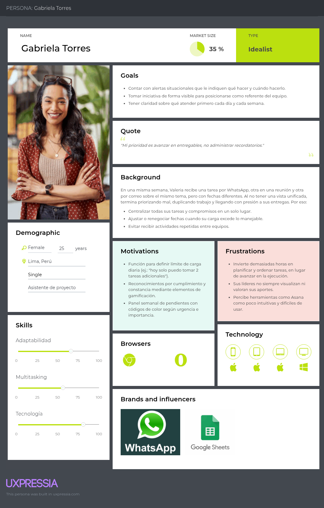

### 2.3.2. User Task Matrix

#### A. Segmento 1: Coordinadores o Líderes de Grupo

| Tarea | Frecuencia | Severidad |
|----|----|----|
| Seleccionar integrantes del equipo y definir objetivo común | Alta | Media |
| Establecer grupos de trabajo y programar horarios | Baja | Alta |
| Organizar reuniones a través de diferentes canales de comunicación | Media | Media |
| Distribuir y asignar responsabilidades entre los miembros | Alta | Alta |
| Monitorear el progreso y actualizar estado de avances | Alta | Alta |
| Compilar y centralizar información de todos los participantes | Alta | Alta |
| Analizar resultados finales e identificar áreas de mejora | Media | Baja |

#### B. Segmento 2: Miembros del Equipo o Grupo

| Tarea | Frecuencia | Severidad |
|----|----|----|
| Comprender los objetivos y el alcance del proyecto asignado | Baja | Media |
| Revisar y cumplir con los horarios y pautas establecidas | Alta | Alta |
| Participar activamente en reuniones de coordinación y seguimiento | Media | Alta |
| Ejecutar las tareas designadas conforme al cronograma establecido | Alta | Alta |
| Informar regularmente al líder sobre el progreso de sus actividades | Alta | Alta |
| Compartir resultados, hallazgos y documentación con el equipo | Media | Media |
| Proporcionar retroalimentación para identificar mejoras continuas | Baja | Media |

### 2.3.3. Empathy Mapping

En esta sección se muestra el **mapa de empatía**, una herramienta clave
para entender con mayor profundidad lo que nuestros usuarios piensan,
sienten y necesitan. Gracias a este análisis, podemos detectar
oportunidades concretas para mejorar su experiencia.

#### A. Empathy Map: Coordinador de equipos

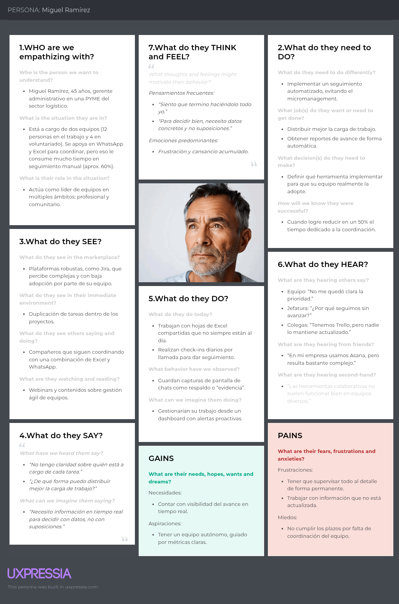

#### B. Empathy Map: Miembro de equipo

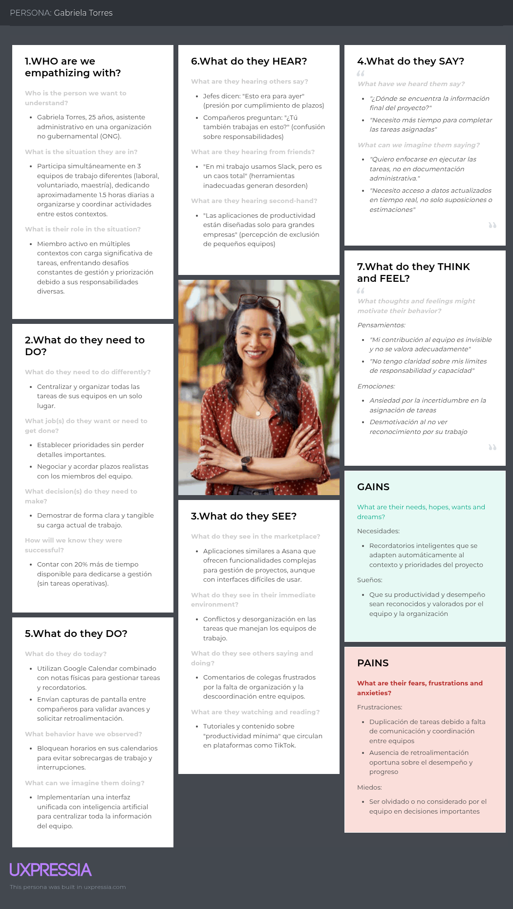

### 2.3.4. As-is Scenario Mapping

En esta sección se estructuran los escenarios actuales (As-Is)
diferenciados por cada segmento objetivo, detallando para cada fase las
actividades concretas que realizan, sus reflexiones internas y sus
estados emocionales durante el proceso.

#### A. As-is Segmento 1: Coordinador de equipos

#### B. As-is Segmento 2: Miembro de equipo

## 2.4. Ubiquitous Language

A continuación se presenta el glosario de términos y conceptos del
dominio de negocio de SynHub. Este lenguaje ubiquo es compartido por
todos los miembros del equipo y stakeholders para garantizar una
comunicación clara y sin ambigüedad.

| Término | Definición |
|----|----|
| **Group (Grupo)** | Unidad de colaboración formada por un conjunto de personas con un objetivo común. Los grupos pueden tener naturaleza académica, laboral o comunitaria. Cada grupo tiene un ciclo de vida propio que incluye su creación, actividad y eventual eliminación o archivo. |
| **Leader (Líder)** | Integrante del grupo que asume la responsabilidad de organizar las actividades, crear y asignar tareas, gestionar invitaciones y validar el trabajo de los demás miembros. El líder tiene permisos extendidos dentro del grupo. |
| **Member (Miembro)** | Persona que pertenece a un grupo y tiene tareas o responsabilidades asignadas. Puede consultar sus tareas, actualizar su estado, enviar solicitudes y recibir notificaciones, pero no tiene permisos administrativos sobre el grupo. |
| **Task (Tarea)** | Unidad de trabajo que el líder crea y asigna a uno o más miembros del grupo. Toda tarea tiene un responsable, una descripción y una fecha límite, y atraviesa distintos estados a lo largo de su ciclo de vida. |
| **Task Status (Estado de Tarea)** | Condición actual en la que se encuentra una tarea dentro de su ciclo de vida. Los estados posibles son: En progreso, En revisión, Completada, Vencida y Cancelada. |
| **Assignment (Asignación)** | Acción mediante la cual el líder vincula una tarea a un miembro específico del grupo, estableciendo quién es el responsable de su ejecución y la fecha límite correspondiente. |
| **Due Date (Fecha Límite)** | Fecha y hora máxima establecida para que un miembro complete una tarea. Pasada esta fecha sin completarse, la tarea pasa automáticamente al estado Vencida. |
| **Invitation (Invitación)** | Solicitud formal enviada por un líder a un usuario para que se una a su grupo. El usuario recibe una notificación y puede aceptar o rechazar la invitación. |
| **Approval Request (Solicitud de Aprobación)** | Petición que realiza un miembro al marcar una tarea como completada, para que el líder la revise y valide. Mientras aguarda revisión, la tarea entra en estado En revisión. |
| **Extension Request (Solicitud de Extensión de Plazo)** | Petición formal de un miembro al líder para ampliar la fecha límite de una tarea, acompañada de un motivo justificado. El líder puede aceptarla o rechazarla. |
| **Validation (Validación)** | Acción mediante la cual el líder aprueba o rechaza una tarea enviada para revisión. Si se aprueba, la tarea queda definitivamente Completada; si se rechaza, regresa a En progreso con comentarios de feedback. |
| **Notification (Notificación)** | Aviso automático generado por el sistema ante eventos relevantes del dominio, como asignaciones de tareas, vencimientos de plazos, resultados de validaciones o cambios de estado. Puede entregarse dentro de la aplicación (in-app) o por correo electrónico. |
| **Productivity Dashboard (Panel de Productividad)** | Vista visual que consolida métricas de desempeño individual y grupal, permitiendo al líder conocer la carga de trabajo por miembro, la distribución de estados de tareas y el cumplimiento general del grupo. |
| **Productivity Metrics (Métricas de Productividad)** | Indicadores cuantitativos del desempeño de los miembros y del grupo en conjunto. Incluyen: número de tareas completadas, tasa de aprobación en primera revisión, tareas vencidas y solicitudes de extensión realizadas. |
| **Validation History (Histórico de Validaciones)** | Registro cronológico de todas las aprobaciones y rechazos realizados por el líder sobre las tareas del grupo. Permite identificar patrones de calidad y seguimiento individual por miembro. |
| **Workload Balance (Equilibrio de Carga)** | Distribución equitativa de tareas entre los miembros de un grupo, de modo que ningún integrante concentre una cantidad desproporcionada de responsabilidades. Es un valor central en la propuesta de SynHub. |
| **Co-responsibility (Corresponsabilidad)** | Principio que implica que todos los integrantes de un grupo comparten activamente el compromiso de cumplir con sus responsabilidades para el logro de los objetivos comunes. |
| **Group Lifecycle (Ciclo de Vida del Grupo)** | Conjunto de etapas por las que atraviesa un grupo desde su creación hasta su eliminación o archivo. Incluye: creación, incorporación de miembros, asignación de tareas, seguimiento, y cierre o archivo. |

# 3. Capítulo III: Requirements Specification

## 3.1. To-Be Scenario Mapping

**Segmento objetivo: Líderes de equipos de trabajo**

**Segmento Objetivo: Miembros de equipos de trabajo**

## 3.2. User Stories

**Epics**

Además de las épicas referentes a la funcionalidad principal de Synhub,
se añadió una séptima épica referente a la integración de un agente
inteligente de asistencia basado en IA, que analiza datos del sistema
parra generar recomendaciones y apoyo personalizado.

| Epic ID | Título | Descripción |
|----|----|----|
| EP-001 | Gestión de Grupos | Creación, configuración y administración de grupos colaborativos e invitaciones. Cubre todo el ciclo de vida del grupo. |
| EP-002 | Gestión de Tareas | Creación, asignación (con responsables y fechas) y seguimiento de estados (En progreso, completada, caducada y cancelada). |
| EP-003 | Notificaciones Inteligentes | Sistema centralizado de notificaciones (in-app/email) para eventos críticos, con gestión de preferencias, agrupamiento y recordatorios automáticos. |
| EP-004 | Analítica y Reportes | Generación automatizada de dashboards y métricas de productividad (individual/grupal). |
| EP-005 | Solicitudes y Validaciones | Flujo completo para solicitudes de procesamiento de tareas con estados, comentarios y notificaciones asociadas. |
| EP-006 | Gestión de Usuarios | Registro, inicio de sesión, edición de perfil y gestión de credenciales. Incluye autenticación y recuperación de acceso. |
| EP-007 | Agente Inteligente de Asistencia | Integración de un agente basado en IA que analiza datos del sistema para generar recomendaciones, detectar riesgos y asistir a los usuarios en la gestión de tareas y toma de decisiones. |

**User Stories**

Con base en las épicas definidas se formularon las siguientes historias
de usuario, incluyendo nuevas historias relacionadas con el agente
inteligente de asistencia:

| ID | Título | Descripción | Criterios de Aceptación | Epic |
|----|----|----|----|----|
| US-001 | Creación de grupo | Como líder, quiero crear grupos para organizar el trabajo de mi equipo. | Escenario 1: Creación básica: Given que soy líder, When completo nombre y descripción, Then el grupo se crea conmigo como único miembro. Escenario 2: Imagen de grupo: Given que subo una imagen, When guardo los cambios, Then aparece como identificación visual del grupo. | EP-001 |
| US-002 | Envío de invitaciones | Como líder, quiero invitar miembros a mi grupo para conformar el equipo. | Escenario 1: Invitación válida: Given que selecciono usuarios, When envío invitaciones, Then los usuarios reciben notificación. Escenario 2: Invitación a miembro existente: Given que el usuario ya está en el grupo, When intento invitarlo, Then el sistema muestra error "Usuario ya pertenece al grupo". | EP-001 |
| US-003 | Eliminación de grupo | Como líder, quiero eliminar grupos inactivos para mantener la organización. | Escenario 1: Confirmación requerida: Given que selecciono eliminar grupo, When confirmo la acción, Then todos los datos asociados se archivan. Escenario 2: Grupo con tareas activas: Given que hay tareas pendientes, When intento eliminar, Then el sistema pide reasignar tareas primero. | EP-001 |
| US-004 | Creación de tareas | Como líder, quiero crear tareas para asignar trabajo a los miembros. | Escenario 1: Tarea básica: Given que completo título y descripción, When guardo la tarea, Then aparece en el listado con estado "En progreso". Escenario 2: Tarea sin responsable: Given que creo tarea sin asignar, When intento guardar, Then el sistema muestra error "Se requiere responsable". | EP-002 |
| US-005 | Asignación de tareas | Como líder, quiero asignar tareas a miembros específicos para distribuir el trabajo. | Escenario 1: Asignación individual: Given que selecciono un miembro, When asigno la tarea, Then recibe notificación y aparece en su listado. Escenario 2: Reasignación: Given que la tarea está asignada, When cambio el responsable, Then ambos miembros reciben notificación. | EP-002 |
| US-006 | Eliminación de tareas | Como líder, quiero eliminar tareas incorrectas o duplicadas. | Escenario 1: Eliminación estándar: Given que selecciono una tarea, When la elimino, Then desaparece del listado principal. Escenario 2: Tarea completada: Given que la tarea está marcada como completada, When intento eliminarla, Then el sistema requiere confirmación adicional. | EP-002 |
| US-007 | Actualización de estado | Como miembro, quiero actualizar el estado de mis tareas para reflejar mi progreso. | Escenario 1: Marcar como completada: Given que finalizo una tarea, When cambio el estado, Then el líder recibe notificación. Escenario 2: Cancelación: Given que una tarea ya no es necesaria, When la marco como cancelada, Then se registra con motivo opcional. | EP-002 |
| US-008 | Reprogramación de tareas | Como líder, quiero cambiar fechas límite cuando surgen imprevistos. | Escenario 1: Cambio de fecha: Given que selecciono una tarea, When modifico la fecha límite, Then el responsable recibe notificación. Escenario 2: Histórico de cambios: Given que reprogramo una tarea, When consulto su historial, Then muestra fechas anteriores y justificación. | EP-002 |
| US-009 | Notificaciones multicanal | Como miembro, quiero recibir notificaciones tanto en la plataforma como por email para estar informado. | Escenario 1: Notificación in-app: Given que ocurre un evento relevante, When el sistema genera notificación, Then aparece un badge en el icono de campana. Escenario 2: Notificación por email: Given que ocurre un evento importante y no estoy activo, When pasan 24h sin iniciar sesión, Then recibo resumen por email. | EP-003 |
| US-010 | Gráfico de distribución de tareas | Como líder, quiero ver un gráfico pastel con la distribución de tareas por miembro para balancear cargas. | Escenario 1: Visualización básica: Given que accedo al dashboard, When selecciono "Distribución", Then muestra porcentajes por miembro. Escenario 2: Filtro por periodo: Given que elijo un rango de fechas, When aplico el filtro, Then el gráfico se actualiza. | EP-004 |
| US-011 | Gráfico de estados de tareas | Como líder, quiero ver un gráfico de barras con el estado de todas las tareas del grupo. | Escenario 1: Datos actualizados: Given que hay tareas en diferentes estados, When visualizo el reporte, Then muestra cantidades por estado. Escenario 2: Exportación: Given que el gráfico está cargado, When hago clic en "Exportar", Then descarga imagen PNG. | EP-004 |
| US-012 | Reporte de reprogramaciones | Como líder, quiero ver un gráfico de líneas con la cantidad de tareas reprogramadas por semana. | Escenario 1: Tendencia temporal: Given que selecciono último trimestre, When genero el reporte, Then muestra línea con picos por semana. Escenario 2: Detalle por motivo: Given que hay reprogramaciones, When paso el cursor sobre un punto, Then muestra motivos frecuentes. | EP-004 |
| US-013 | Reporte de productividad individual | Como líder, quiero evaluar el desempeño de cada miembro a través de métricas claras. | Escenario 1: Datos básicos: Given que selecciono un miembro, When genero su reporte, Then muestra: tareas completadas/tiempo promedio. Escenario 2: Comparativa: Given que veo dos reportes, When los comparo, Then resalta diferencias significativas. | EP-004 |
| US-014 | Solicitud de aprobación de tarea | Como miembro, quiero enviar tareas completadas para validación del líder. | Escenario 1: Envío estándar: Given que marco tarea como completada, When envío a validación, Then cambia a estado "En revisión". Escenario 2: Documentación adjunta: Given que agrego evidencia, When envío la solicitud, Then el líder ve los archivos asociados. | EP-005 |
| US-015 | Validación de tareas | Como líder, quiero aprobar o rechazar tareas completadas para asegurar calidad. | Escenario 1: Aprobación: Given que la tarea cumple estándares, When la apruebo, Then se marca como definitivamente completada. Escenario 2: Rechazo con comentarios: Given que encuentro deficiencias, When rechazo con feedback, Then la tarea vuelve a "En progreso". | EP-005 |
| US-016 | Solicitud de extensión de plazo | Como miembro, quiero pedir más tiempo para una tarea cuando surgen impedimentos. | Escenario 1: Solicitud básica: Given que selecciono una tarea, When pido extensión con motivo, Then el líder recibe notificación. Escenario 2: Aprobación: Given que el líder acepta, When actualiza la fecha, Then el sistema registra el cambio. | EP-005 |
| US-017 | Histórico de validaciones | Como líder, quiero ver el historial de aprobaciones/rechazos para identificar patrones. | Escenario 1: Filtro por miembro: Given que selecciono un colaborador, When consulto su historial, Then muestra tasa de aprobación. Escenario 2: Detalle por tarea: Given que veo una entrada, When hago clic, Then muestra comentarios del validador. | EP-005 |
| US-018 | Notificaciones de cambio de estado | Como miembro, quiero recibir alertas cuando mis solicitudes cambian de estado. | Escenario 1: Aprobación recibida: Given que mi solicitud es aprobada, When el líder toma acción, Then recibo notificación con detalles. Escenario 2: Rechazo: Given que mi solicitud es rechazada, When hay comentarios, Then los incluye en la notificación. | EP-005 |
| US-019 | Visualización de miembros del grupo | Como líder, quiero ver la lista de miembros de mi grupo para gestionar la colaboración. | Escenario 1: Lista de miembros: Given que accedo a la sección de miembros, When visualizo la lista, Then se muestran los nombres y roles de cada miembro. Escenario 2: Detalles del miembro: Given que selecciono un miembro, When hago clic en su nombre, Then se muestran sus tareas asignadas y estado actual. | EP-001 |
| US-020 | Edición de información del grupo | Como líder, quiero editar la información de mi grupo para mantenerla actualizada. | Escenario 1: Actualización de nombre: Given que accedo a la configuración del grupo, When modifico el nombre y guardo los cambios, Then el nuevo nombre se refleja en todas las vistas. Escenario 2: Cambio de descripción: Given que edito la descripción del grupo, When guardo los cambios, Then la nueva descripción se muestra en la página principal del grupo. | EP-001 |
| US-021 | Visualización de tareas asignadas | Como miembro, quiero ver las tareas que me han sido asignadas para gestionar mi trabajo. | Escenario 1: Lista de tareas: Given que accedo a mi panel de tareas, When visualizo la lista, Then se muestran todas las tareas asignadas con su estado actual. Escenario 2: Detalle de tarea: Given que selecciono una tarea, When hago clic en ella, Then se muestran los detalles completos de la tarea. | EP-002 |
| US-022 | Comentario en tareas | Como miembro, quiero comentar en las tareas para comunicarme con el líder sobre el progreso. | Escenario 1: Añadir comentario: Given que accedo a una tarea asignada, When escribo un comentario y lo envío, Then el comentario aparece en el hilo de la tarea. Escenario 2: Notificación al líder: Given que envío un comentario, When el líder accede a la tarea, Then ve el nuevo comentario destacado. | EP-002 |
| US-023 | Configuración de preferencias de notificación | Como usuario, quiero configurar mis preferencias de notificación para recibir solo las alertas relevantes. | Escenario 1: Selección de tipos de notificación: Given que accedo a la configuración de notificaciones, When selecciono los tipos de eventos que deseo recibir, Then solo recibo notificaciones de esos eventos. Escenario 2: Desactivación de notificaciones: Given que desactivo todas las notificaciones, When ocurre un evento, Then no recibo ninguna alerta. | EP-003 |
| US-024 | Resumen semanal de actividad | Como miembro, quiero recibir un resumen semanal de mi actividad para revisar mi desempeño. | Escenario 1: Generación del resumen: Given que ha transcurrido una semana, When se genera el resumen, Then recibo un informe con mis tareas completadas y pendientes. Escenario 2: Acceso al resumen: Given que recibo el resumen, When accedo al enlace proporcionado, Then puedo ver el detalle completo en la plataforma. | EP-003 |
| US-025 | Visualización de carga de trabajo por miembro | Como líder, quiero ver la carga de trabajo de cada miembro para equilibrar las asignaciones. | Escenario 1: Gráfico de barras: Given que accedo al panel de analítica, When selecciono "Carga de trabajo", Then se muestra un gráfico de barras con el número de tareas por miembro. Escenario 2: Identificación de sobrecarga: Given que un miembro tiene más tareas que otros, When visualizo el gráfico, Then se resalta su barra. | EP-004 |
| US-026 | Reporte de cumplimiento de plazos | Como líder, quiero ver un reporte de cumplimiento de plazos para evaluar la eficiencia del equipo. | Escenario 1: Generación del reporte: Given que accedo a la sección de reportes, When selecciono "Cumplimiento de plazos", Then se muestra un informe con el porcentaje de tareas completadas a tiempo. Escenario 2: Filtro por periodo: Given que elijo un rango de fechas, When aplico el filtro, Then el reporte se actualiza. | EP-004 |
| US-027 | Revisión de comentarios en tareas | Como líder, quiero revisar los comentarios en las tareas para proporcionar retroalimentación oportuna. | Escenario 1: Acceso a comentarios: Given que accedo a una tarea, When visualizo la sección de comentarios, Then puedo leer todos los mensajes. Escenario 2: Responder a comentarios: Given que leo un comentario, When escribo una respuesta y la envío, Then el miembro recibe una notificación. | EP-005 |
| US-028 | Confirmación antes de eliminar una tarea | Como líder, quiero recibir una confirmación antes de eliminar una tarea para evitar borrados accidentales. | Escenario 1: Confirmación requerida: Given que selecciono eliminar una tarea, When hago clic en eliminar, Then se muestra un mensaje de confirmación. Escenario 2: Cancelación: Given que aparece el mensaje, When elijo "Cancelar", Then la tarea no se elimina. | EP-005 |
| US-029 | Recomendación de asignación de tareas | Como líder, quiero que el sistema sugiera automáticamente a qué miembro asignar una tarea para optimizar la carga de trabajo. | Escenario 1: Sugerencia automática: Given que creo una tarea, When solicito recomendación, Then el sistema sugiere un miembro basado en carga y desempeño. Escenario 2: Sin datos suficientes: Given que no hay historial suficiente, When solicito recomendación, Then el sistema indica que no puede generar sugerencia. | EP-007 |
| US-030 | Generación automática de resúmenes | Como miembro, quiero que el sistema genere resúmenes automáticos de mi actividad para ahorrar tiempo. | Escenario 1: Resumen generado: Given que hay actividad semanal, When solicito resumen, Then el sistema genera un resumen claro de tareas. Escenario 2: Sin actividad: Given que no hay actividad, When solicito resumen, Then indica que no hay datos suficientes. | EP-007 |
| US-031 | Priorización inteligente de tareas | Como miembro, quiero que el sistema ordene mis tareas automáticamente según prioridad para trabajar de forma más eficiente. | Escenario 1: Priorización automática: Given múltiples tareas, When accedo a mi lista, Then se ordenan por urgencia e importancia. Escenario 2: Actualización dinámica: Given cambios en tareas, When se actualiza el estado, Then la prioridad se recalcula. | EP-007 |
| US-032 | Detección de sobrecarga de trabajo | Como líder, quiero que el sistema detecte miembros sobrecargados para redistribuir tareas. | Escenario 1: Sobrecarga detectada: Given un miembro con muchas tareas, When el sistema analiza carga, Then lo marca como sobrecargado. Escenario 2: Balance adecuado: Given carga equilibrada, When el sistema analiza, Then no genera alerta. | EP-007 |
| US-033 | Recomendación de reprogramación | Como líder, quiero que el sistema sugiera nuevas fechas cuando detecta retrasos para mejorar la planificación. | Escenario 1: Recomendación de nueva fecha: Given una tarea en riesgo, When el sistema analiza, Then sugiere nueva fecha límite. Escenario 2: Sin necesidad: Given tarea en tiempo, When analiza, Then no sugiere cambios. | EP-007 |
| TS-001 | Gestión de grupos (CRUD) | Como developer, quiero gestionar grupos para crear, actualizar, consultar y eliminar equipos. | Escenario 1: CRUD exitoso → operaciones GET/POST/PATCH/DELETE responden correctamente (200/201). Escenario 2: Error → IDs inválidos retornan 404 o 400. | EP-001 |
| TS-002 | Gestión de miembros en grupos | Como developer, quiero agregar, listar y obtener miembros de grupos. | Escenario 1: Miembro agregado → POST exitoso (200). Escenario 2: Miembro inexistente → error 404. | EP-001 |
| TS-003 | Gestión de solicitudes de unión | Como developer, quiero manejar solicitudes para unirse a grupos. | Escenario 1: Crear solicitud → POST exitoso (200). Escenario 2: Duplicada → error 409. | EP-001 |
| TS-004 | Procesamiento de solicitudes | Como developer, quiero aceptar, rechazar o eliminar solicitudes. | Escenario 1: Cambio de estado → PATCH cambia estado (200). Escenario 2: Eliminación → DELETE elimina correctamente (204). | EP-001 |
| TS-005 | Gestión de tareas (CRUD) | Como developer, quiero crear, actualizar, obtener y eliminar tareas. | Escenario 1: CRUD exitoso → operaciones correctas (200/201). Escenario 2: Error → datos inválidos retornan 400/404. | EP-002 |
| TS-006 | Asignación y consulta de tareas | Como developer, quiero asignar tareas y consultarlas por miembro o grupo. | Escenario 1: Consulta válida → devuelve lista de tareas (200). Escenario 2: Sin tareas → array vacío. | EP-002 |
| TS-007 | Gestión de estados de tareas | Como developer, quiero actualizar estados de tareas (pendiente, completada, rechazada, vencida). | Escenario 1: Cambio válido → estado actualizado (200). Escenario 2: Estado inválido → error 400. | EP-002 |
| TS-008 | Comentarios en tareas | Como developer, quiero permitir comentarios en tareas para colaboración. | Escenario 1: Comentario creado → POST exitoso (201). Escenario 2: Tarea inexistente → error 404. | EP-002 |
| TS-009 | Validaciones automáticas de tareas | Como developer, quiero automatizar validaciones de tareas vencidas. | Escenario 1: Tareas vencidas → estado cambia automáticamente. Escenario 2: Sin cambios → respuesta 204. | EP-002 |
| TS-010 | Gestión de notificaciones | Como developer, quiero enviar y consultar notificaciones. | Escenario 1: Notificación enviada → POST exitoso (200). Escenario 2: Consulta → lista de notificaciones (200). | EP-003 |
| TS-011 | Gestión de estado de notificaciones | Como developer, quiero marcar notificaciones como leídas. | Escenario 1: Actualización → cambia estado (200). Escenario 2: Ya leída → mensaje informativo. | EP-003 |
| TS-012 | Generación de reportes | Como developer, quiero generar y consultar reportes de métricas. | Escenario 1: Generación → POST exitoso (200). Escenario 2: Sin datos → respuesta válida con contenido vacío. | EP-004 |
| TS-013 | Autenticación (Login) | Como developer, quiero autenticar usuarios mediante JWT. | Escenario 1: Login exitoso → token generado (200). Escenario 2: Error → credenciales inválidas (401). | EP-006 |
| TS-014 | Gestión de usuarios | Como developer, quiero crear, editar y obtener usuarios. | Escenario 1: CRUD usuario → operaciones exitosas (200/201). Escenario 2: Usuario no encontrado → 404. | EP-006 |
| TS-015 | Cambio de contraseña | Como developer, quiero permitir actualizar contraseña de usuarios. | Escenario 1: Cambio válido → éxito (200). Escenario 2: Datos inválidos → error 400. | EP-006 |
| TS-016 | Microservice IAM | Como developer, quiero gestionar autenticación centralizada. | Escenario 1: Generación de JWT → incluye roles y expiración. | EP-006 |
| TS-017 | Microservice Tasks | Como developer, quiero gestionar tareas de forma desacoplada. | Escenario 1: Crear tarea → estado inicial "pendiente". | EP-002 |
| TS-018 | Microservice Metrics | Como developer, quiero generar métricas de tareas. | Escenario 1: Consulta → devuelve resumen de tareas. | EP-004 |
| TS-019 | Microservice Requests | Como developer, quiero gestionar solicitudes del sistema. | Escenario 1: Crear solicitud → estado "abierta". | EP-005 |
| TS-020 | Microservice Groups | Como developer, quiero gestionar grupos desde un servicio independiente. | Escenario 1: Crear grupo → valida usuarios y responde (201). | EP-001 |
| TS-021 | Generación automática de resúmenes con IA | Como developer, quiero generar resúmenes automáticos de actividad usando IA. | Escenario 1: Resumen generado → Given actividad existente, When se solicita resumen, Then devuelve texto resumido (200). Escenario 2: Sin actividad → Then devuelve mensaje "sin datos". | EP-007 |
| TS-022 | Algoritmo de priorización de tareas | Como developer, quiero ordenar tareas automáticamente según prioridad. | Escenario 1: Priorización válida → Given múltiples tareas, When se ejecuta el algoritmo, Then devuelve lista ordenada. Escenario 2: Datos incompletos → Then mantiene orden original. | EP-007 |
| TS-023 | Detección de sobrecarga de usuarios | Como developer, quiero detectar usuarios con exceso de tareas asignadas. | Escenario 1: Sobrecarga detectada → Given tareas asignadas, When se analiza carga, Then marca usuario como sobrecargado. Escenario 2: Carga balanceada → Then no genera alerta. | EP-007 |
| TS-024 | Motor de recomendaciones de reprogramación | Como developer, quiero sugerir nuevas fechas para tareas en riesgo. | Escenario 1: Recomendación generada → Given tarea con retraso, When se analiza, Then sugiere nueva fecha. Escenario 2: Tarea en tiempo → Then no sugiere cambios. | EP-007 |
| TS-025 | Integración con modelo de IA externo | Como developer, quiero integrar un servicio de IA (API) para procesar datos. | Escenario 1: Integración exitosa → Given request válido, When se envía a la API, Then devuelve respuesta procesada (200). Escenario 2: Error de API → Then maneja fallback o error controlado. | EP-007 |
| TS-026 | Servicio de análisis de métricas para IA | Como developer, quiero consumir datos de métricas para alimentar el agente inteligente. | Escenario 1: Datos disponibles → Given métricas existentes, When se consultan, Then se devuelven correctamente (200). Escenario 2: Sin datos → Then devuelve estructura vacía. | EP-007 |

## 3.3. Impact Mapping

## 3.4. Product Backlog

A continuación se presenta el backlog de producto con las historias de
usuario y tareas técnicas priorizadas para el desarrollo de Synhub

| Prioridad | Story ID | Título | Descripción | SP |
|----|----|----|----|----|
| 1 | US-001 | Creación de grupo | Como líder, quiero crear grupos para organizar el trabajo de mi equipo. | 5 |
| 1 | US-004 | Creación de tareas | Como líder, quiero crear tareas para asignar trabajo a los miembros. | 5 |
| 1 | US-005 | Asignación de tareas | Como líder, quiero asignar tareas a miembros específicos para distribuir el trabajo. | 5 |
| 1 | TS-001 | Gestión de grupos (CRUD) | Como developer, quiero gestionar grupos para crear, actualizar, consultar y eliminar equipos. | 5 |
| 1 | TS-005 | Gestión de tareas (CRUD) | Como developer, quiero crear, actualizar, obtener y eliminar tareas. | 5 |
| 1 | TS-013 | Autenticación (Login) | Como developer, quiero autenticar usuarios mediante JWT. | 5 |
| 1 | TS-020 | Microservice Groups | Como developer, quiero gestionar grupos desde un servicio independiente. | 3 |
| 1 | TS-017 | Microservice Tasks | Como developer, quiero gestionar tareas de forma desacoplada. | 3 |
| 2 | US-002 | Envío de invitaciones | Como líder, quiero invitar miembros a mi grupo para conformar el equipo. | 5 |
| 2 | US-007 | Actualización de estado | Como miembro, quiero actualizar el estado de mis tareas para reflejar mi progreso. | 3 |
| 2 | US-021 | Visualización de tareas asignadas | Como miembro, quiero ver las tareas que me han sido asignadas para gestionar mi trabajo. | 3 |
| 2 | US-019 | Visualización de miembros del grupo | Como líder, quiero ver la lista de miembros de mi grupo para gestionar la colaboración. | 3 |
| 2 | TS-002 | Gestión de miembros en grupos | Como developer, quiero agregar, listar y obtener miembros de grupos. | 3 |
| 2 | TS-006 | Asignación y consulta de tareas | Como developer, quiero asignar tareas y consultarlas por miembro o grupo. | 3 |
| 2 | TS-007 | Gestión de estados de tareas | Como developer, quiero actualizar estados de tareas. | 3 |
| 2 | TS-014 | Gestión de usuarios | Como developer, quiero crear, editar y obtener usuarios. | 3 |
| 3 | US-008 | Reprogramación de tareas | Como líder, quiero cambiar fechas límite cuando surgen imprevistos. | 2 |
| 3 | US-022 | Comentario en tareas | Como miembro, quiero comentar en las tareas para comunicarme con el líder. | 2 |
| 3 | US-009 | Notificaciones multicanal | Como miembro, quiero recibir notificaciones tanto en la plataforma como por email. | 3 |
| 3 | TS-003 | Gestión de solicitudes de unión | Como developer, quiero manejar solicitudes para unirse a grupos. | 3 |
| 3 | TS-004 | Procesamiento de solicitudes | Como developer, quiero aceptar, rechazar o eliminar solicitudes. | 3 |
| 3 | TS-010 | Gestión de notificaciones | Como developer, quiero enviar y consultar notificaciones. | 3 |
| 3 | TS-011 | Gestión de estado de notificaciones | Como developer, quiero marcar notificaciones como leídas. | 2 |
| 3 | TS-019 | Microservice Requests | Como developer, quiero gestionar solicitudes del sistema. | 3 |
| 4 | US-010 | Gráfico de distribución de tareas | Como líder, quiero ver un gráfico pastel con la distribución de tareas. | 3 |
| 4 | US-011 | Gráfico de estados de tareas | Como líder, quiero ver un gráfico de barras con el estado de tareas. | 3 |
| 4 | US-012 | Reporte de reprogramaciones | Como líder, quiero ver un gráfico de líneas de tareas reprogramadas. | 2 |
| 4 | US-013 | Reporte de productividad individual | Como líder, quiero evaluar el desempeño de cada miembro. | 2 |
| 4 | US-025 | Visualización de carga de trabajo | Como líder, quiero ver la carga de trabajo por miembro. | 1 |
| 4 | US-026 | Reporte de cumplimiento de plazos | Como líder, quiero evaluar la eficiencia del equipo. | 1 |
| 4 | TS-012 | Generación de reportes | Como developer, quiero generar y consultar reportes de métricas. | 5 |
| 4 | TS-018 | Microservice Metrics | Como developer, quiero generar métricas de tareas. | 3 |
| 5 | US-014 | Solicitud de aprobación de tarea | Como miembro, quiero enviar tareas completadas para validación. | 3 |
| 5 | US-015 | Validación de tareas | Como líder, quiero aprobar o rechazar tareas completadas. | 3 |
| 5 | US-016 | Solicitud de extensión de plazo | Como miembro, quiero pedir más tiempo para una tarea. | 2 |
| 5 | US-017 | Histórico de validaciones | Como líder, quiero ver historial de aprobaciones. | 2 |
| 5 | US-018 | Notificaciones de cambio de estado | Como miembro, quiero recibir alertas de cambios. | 2 |
| 6 | TS-015 | Cambio de contraseña | Como developer, quiero permitir actualizar contraseña. | 2 |
| 6 | TS-016 | Microservice IAM | Como developer, quiero gestionar autenticación centralizada. | 3 |
| 7 | US-029 | Recomendación de asignación de tareas | Como líder, quiero que el sistema sugiera asignaciones. | 5 |
| 7 | US-030 | Generación automática de resúmenes | Como miembro, quiero resúmenes automáticos. | 3 |
| 7 | US-031 | Priorización inteligente de tareas | Como miembro, quiero que el sistema ordene tareas automáticamente. | 3 |
| 7 | US-032 | Detección de sobrecarga de trabajo | Como líder, quiero detectar miembros sobrecargados. | 3 |
| 7 | US-033 | Recomendación de reprogramación | Como líder, quiero sugerencias de nuevas fechas. | 3 |
| 7 | TS-021 | Generación automática de resúmenes con IA | Como developer, quiero generar resúmenes con IA. | 5 |
| 7 | TS-022 | Algoritmo de priorización de tareas | Como developer, quiero ordenar tareas automáticamente. | 3 |
| 7 | TS-023 | Detección de sobrecarga de usuarios | Como developer, quiero detectar usuarios sobrecargados. | 3 |
| 7 | TS-024 | Motor de recomendaciones de reprogramación | Como developer, quiero sugerir nuevas fechas. | 3 |
| 7 | TS-025 | Integración con modelo de IA externo | Como developer, quiero integrar un servicio de IA. | 5 |
| 7 | TS-026 | Servicio de análisis de métricas para IA | Como developer, quiero consumir métricas para IA. | 3 |

# 4. Capítulo IV: Strategic-Level Software Design

## 4.1. Strategic-Level Attribute-Driven Design

### 4.1.1. Design Purpose

El propósito del diseño de la aplicación es proporcionar una plataforma
integral para la gestión de grupos, miembros, tareas, notificaciones,
reportes y procesos de validación, asegurando una experiencia de usuario
consistente y funcional para ambos segmentos.

La aplicación tiene como objetivo principal facilitar la colaboración,
la asignación de responsabilidades y el seguimiento de avances en
equipos de trabajo, ofreciendo funcionalidades que van desde la
organización de grupos y distribución de tareas, hasta la generación de
métricas y reportes.

## Enfoque Arquitectónico

Desde el punto de vista arquitectónico, el diseño prioriza:

- **Escalabilidad:** Soportando un número elevado de usuarios, grupos y
  transacciones.
- **Seguridad:** Gestionando accesos y roles mediante autenticación y
  control de permisos.
- **Disponibilidad:** Asegura que la plataforma tenga una accesibilidad
  del 99% con mínimas interrupciones en la gestión de tareas y
  notificaciones.

### 4.1.2. Attribute-Driven Design Inputs

#### 4.1.2.1. Primary Functionality (Primary User Stories)

| Requisito Funcional | US - ID | Título |
|----|----|----|
| Gestión de grupos | US-001 | Creación de grupo |
| Gestión de grupos | US-002 | Envío de invitaciones |
| Gestión de Tareas | US-004 | Creación de tareas |
| Gestión de Tareas | US-005 | Asignación de tareas |
| Gestión de Tareas | US-007 | Actualización de estado |
| Notificaciones Inteligentes | US-009 | Notificaciones in-app |
| Notificaciones Inteligentes | US-010 | Notificaciones por email |
| Analíticas y Reportes | US-012 | Gráfico de distribución de tareas |
| Analíticas y Reportes | US-015 | Reporte de productividad individual |
| Solicitudes y Validaciones | US-016 | Solicitud de aprobación de tarea |
| Solicitudes y Validaciones | US-017 | Validación de tareas |
| Gestión de Usuarios | US-025 | Configuración de preferencias de notificación |

#### 4.1.2.2. Quality attribute Scenarios

| ID | Atributo de calidad | Fuente | Estímulo | Medioambiente | Artefacto | Respuesta | Medida |
|----|----|----|----|----|----|----|----|
| QA-1 | Disponibilidad | Usuario que desea acceder a sus tareas | Solicita ver la lista de tareas en tiempo real | Aplicación en horario normal con tráfico promedio | Servicio de gestión de tareas | La aplicación devuelve la lista completa sin errores | Tiempo de respuesta \< 2s y 99% de disponibilidad del servicio |
| QA-2 | Interoperabilidad | Usuario que recibe notificaciones por email | Configurar preferencias de notificación | Sistema conectado a la red, servicio de correo activo | Servicio de notificaciones inteligentes | Notificación enviada y recibida correctamente | Porcentaje de emails entregados correctamente = 100% |
| QA-3 | Modificabilidad | Equipo de desarrollo | Agrega un nuevo tipo de gráfico de productividad | Entorno de desarrollo con datos de prueba | Servicio de reportes y dashboards | Nuevo gráfico integrado sin afectar funcionalidades | Integración \< 2 días y pruebas unitarias exitosas |
| QA-4 | Performance | Usuario genera reporte | Solicita reporte con gran volumen de datos | Aplicación bajo carga alta | Servicio de generación de reportes | Reporte generado correctamente con todos los datos | Tiempo de generación \< 10s |
| QA-5 | Seguridad | Usuario o atacante externo | Intento de acceso sin permisos | Aplicación y red funcionando normalmente | Servicio de autenticación y usuarios | Acceso bloqueado y registrado en logs | 100% de accesos no autorizados bloqueados + logs generados |
| QA-6 | Testeabilidad | Equipo de QA | Ejecuta pruebas de creación de grupos y tareas | Entorno de pruebas controlado | Servicios de gestión de grupos y tareas | Resultados registrados y reproducibles | Cobertura de pruebas \> 90% |
| QA-7 | Usabilidad | Usuario final | Intenta crear o editar grupo o tarea | App móvil funcionando | Interfaz de usuario | Usuario completa operación sin confusión | Tiempo promedio \< 2 min por operación |

#### 4.1.2.3. Constraints

| Factor | Constraint (restricción posible para la aplicación) |
|----|----|
| Topología de la red | Si la red tiene alta latencia o está segmentada, las notificaciones in-app y la sincronización de tareas podrían retrasarse. **Ejemplo:** un miembro marcó una tarea como completada (US-007), pero el líder no recibió la notificación inmediatamente debido a problemas de red. |
| Uso de un proveedor de base de datos | Si solo se puede usar un tipo específico de base de datos, puede limitar la optimización de consultas complejas. **Ejemplo:** generar un reporte de productividad individual (US-015) puede tardar más si la base de datos no soporta consultas avanzadas de agregación eficientemente. |
| Entorno web / móvil | Configuraciones restrictivas podrían bloquear correos o integraciones externas. **Ejemplo:** las notificaciones por email (US-010) no llegan a los usuarios, porque el servidor de correo está bloqueado por el firewall de la red corporativa. |
| Servidores (hardware, sistema operativo) | Servidores con recursos limitados pueden causar lentitud en operaciones intensivas. **Ejemplo:** al generar gráficos de carga de trabajo por miembro (US-027), la visualización se retrasa cuando varios líderes acceden al dashboard simultáneamente. |
| Uso de software de terceros o tecnología particular | Dependencias de librerías externas puede generar incompatibilidades futuras. **Ejemplo:** el módulo de gráficos de barras (US-012 y US-013) deja de renderizar correctamente después de actualizar la versión de las librerías involucradas. |
| Cumplimiento de normas existentes | La aplicación debe cumplir con las políticas internas de la empresa sobre auditoría y registro de acciones de los usuarios. **Ejemplo:** cada actualización de estado de tarea (US-007) debe registrarse con el fin de tener un seguimiento. |

### 4.1.3. Architectural Drivers Backlog

En esta iteración, hemos priorizado los drivers de **usabilidad** y
**mantenibilidad**, orientando el diseño hacia un componente de
asignación de tareas que permita crear, asignar y dar seguimiento a
tareas por usuario de manera intuitiva, manteniendo responsabilidades
desacopladas para facilitar la evolución del sistema.

| Driver ID | Título de Driver | Descripción | Importancia (Stakeholders) | Impacto (Technical Complexity) |
|----|----|----|----|----|
| AD-01 | Usabilidad | El componente de asignación de tareas debe permitir la creación, asignación y seguimiento de tareas de forma simple, clara e intuitiva para los usuarios. | Alto | Medio |
| AD-02 | Mantenibilidad | El componente debe diseñarse con responsabilidades desacopladas para facilitar mantenimiento, pruebas y evolución del sistema. | Alto | Alto |
| AD-03 | Gestión de tareas por usuario | El sistema debe soportar la administración y seguimiento de tareas asignadas a cada usuario dentro del grupo. | Alto | Medio |
| AD-04 | Separación de responsabilidades | La arquitectura debe dividir interfaz, lógica de negocio y acceso a datos para reducir acoplamiento. | Alto | Alto |
| AD-05 | Consistencia de datos | La asignación y actualización de tareas debe preservar integridad y coherencia en estados y responsables. | Alto | Medio |

### 4.1.4. Architectural Design Decisions

El equipo evaluó decisiones arquitectónicas para el componente de
asignación de tareas, considerando como drivers principales la
usabilidad y la mantenibilidad. El objetivo fue definir una solución que
permita crear, asignar y dar seguimiento a tareas por usuario,
manteniendo una estructura desacoplada y fácil de evolucionar.

### 4.1.5. Quality Attribute Scenario Refinements

## 4.2. Strategic-Level Domain-Driven Design

En esta sección se presenta el enfoque adoptado para la toma de
decisiones estratégicas en el desarrollo del sistema, aplicando los
principios del Domain-Driven Design (DDD). El objetivo principal
consistió en identificar y establecer los límites naturales del dominio,
descomponiendo la solución en contextos delimitados (Bounded Contexts).

Para llevar a cabo dicha descomposición, el equipo empleó herramientas
colaborativas clave, tales como el Event Storming, que permite mapear y
visualizar de manera dinámica los flujos de eventos, comandos y actores
dentro del dominio; y el Bounded Context Canvas, utilizado para definir
los elementos esenciales de cada contexto, incluyendo objetivos,
modelos, responsabilidades y relaciones con otros contextos.

Dicho proceso estratégico permite no solo estructurar el sistema de
forma más coherente, sino también alinear las decisiones técnicas con
los objetivos de negocio, facilitando la comunicación entre los
distintos actores involucrados en el desarrollo del proyecto.

### 4.2.1. EventStorming

En esta sección se expone y justifica el proceso de EventStorming
ejecutado por el equipo, con el fin de construir una aproximación
inicial al modelado general del dominio del problema. Dicha técnica,
centrada en la identificación de eventos relevantes dentro del sistema,
facilita la captura del conocimiento colectivo de los participantes y
promueve conversaciones fundamentales acerca del comportamiento esperado
del sistema ante diversos escenarios.

La sesión fue planificada estratégicamente con una duración comprendida
entre una y dos horas. Durante esta actividad, se emplearon notas
adhesivas digitales para representar eventos y comandos, lo que permite
una exploración visual e iterativa del flujo de trabajo.

[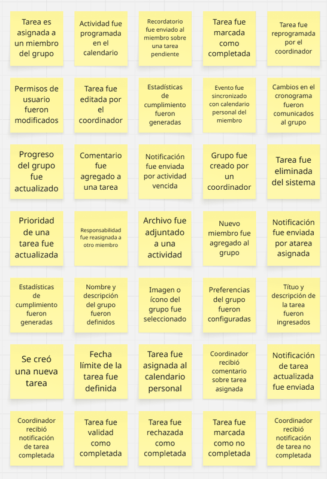](https://postimg.cc/2V53Yz1n)

### 4.2.2. Candidate Context Discovery

Una vez concluida la sesión de Event Storming, se llevó a cabo un
análisis detallado de los eventos identificados con el propósito de
descubrir los contextos candidatos potencialmente relevantes para el
dominio del problema. Dicho análisis consistió en la identificación de
patrones y relaciones entre los eventos, así como en la evaluación de su
impacto sobre el sistema. Como resultado, se establecieron agrupaciones
de eventos pertenecientes a un mismo proceso de acción dentro de la
aplicación.

[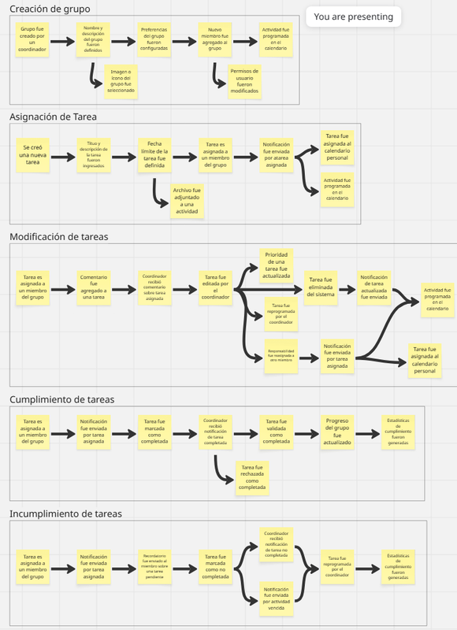](https://postimg.cc/5XcF5X9L)

A continuación se muestra con detalle las líneas de acción creadas:

**Creación de grupo**

[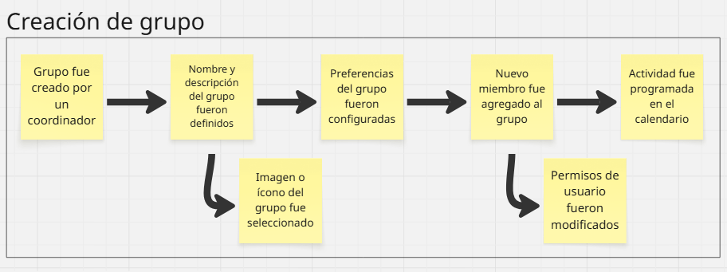](https://postimg.cc/vxrwp2nK)

**Asignación de tareas**

[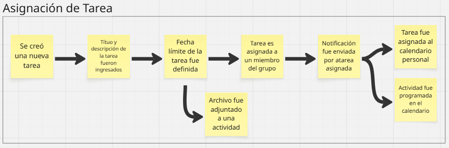](https://postimg.cc/hX6gQmK6)

**Modificación de tareas**

[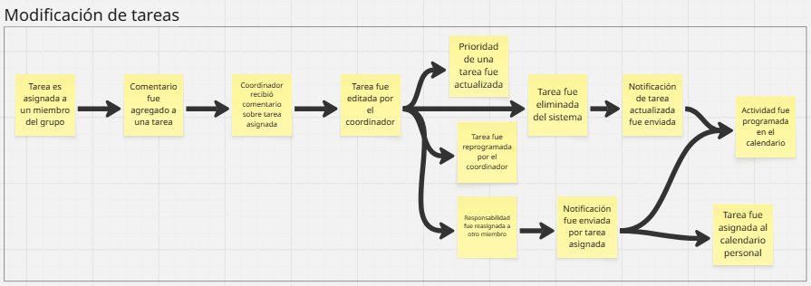](https://postimg.cc/tZbKFtwh)

**Cumplimiento de tareas**

[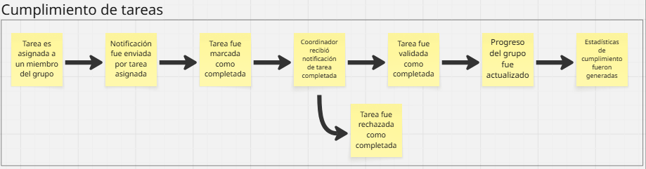](https://postimg.cc/bdNM8JhQ)

**Incumplimiento de tareas**

[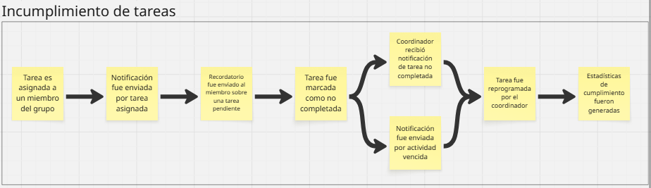](https://postimg.cc/w3vWZGX1)

Una vez creadas las líneas de acción se buscó encontrar los "pain
points", solo se tuvo que modificar la línea de acción de creación de
grupo.

**Creación de grupo**

[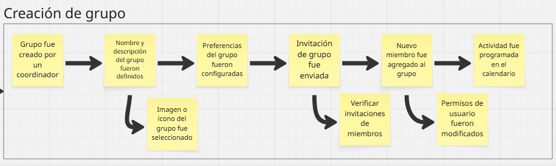](https://postimg.cc/LJKFHpDy)

Una vez terminadas las líneas de acción se buscó encontrar los "pivotal
point", los cuales son eventos que pueden cambiar el flujo de la
aplicación. Los pivotal point encontrados fueron:

- La creación de un grupo
- La creación de una tarea
- La modificación de una tarea
- La asignación de una tarea
- Acciones que requieran enviar notificaciones
- El cumplimiento de tareas
- El incumplimiento de tareas

Gracias a encontrar los pivotal points se pudo identificar como los
distintos eventos formaban parte de distintos contextos, los cuales son:

- Líderes
- Notificaciones
- Tareas
- Métricas
- Solicitudes

Finalmente se dividio cada evento en comandos, eventos, agregados,
vistas y entidades, los cuales son los siguientes:

**Líderes**

[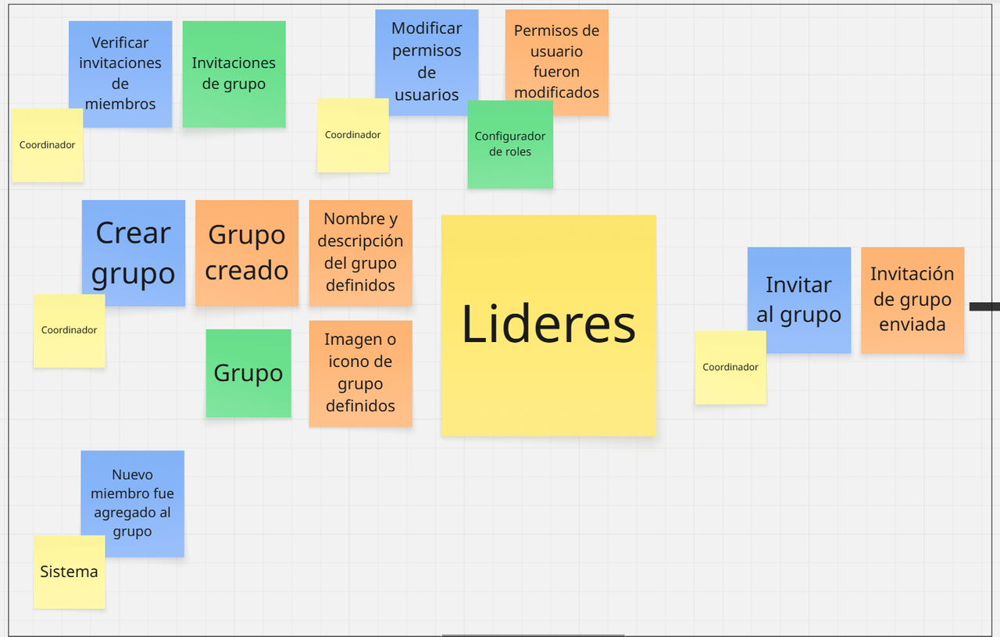](https://postimg.cc/7fr6pc3w)

**Notificaciones**

[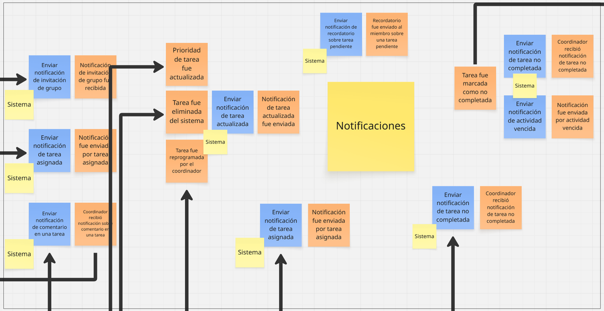](https://postimg.cc/xNDfVJbF)

**Tareas**

[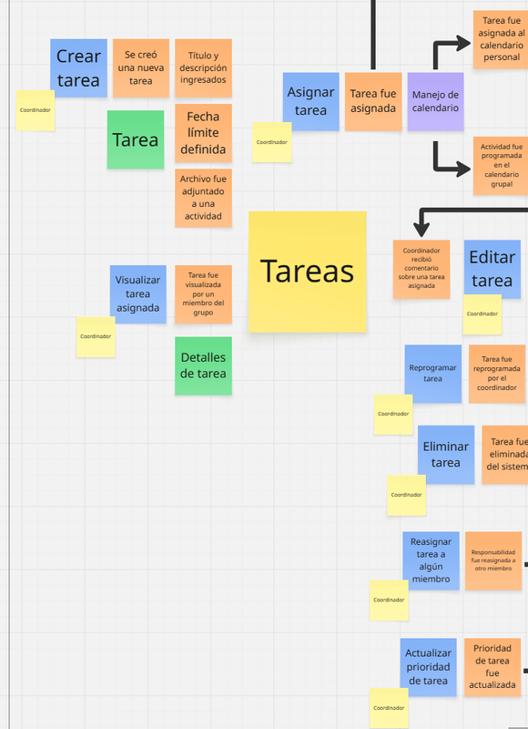](https://postimg.cc/TyKfyqVt)

**Métricas**

[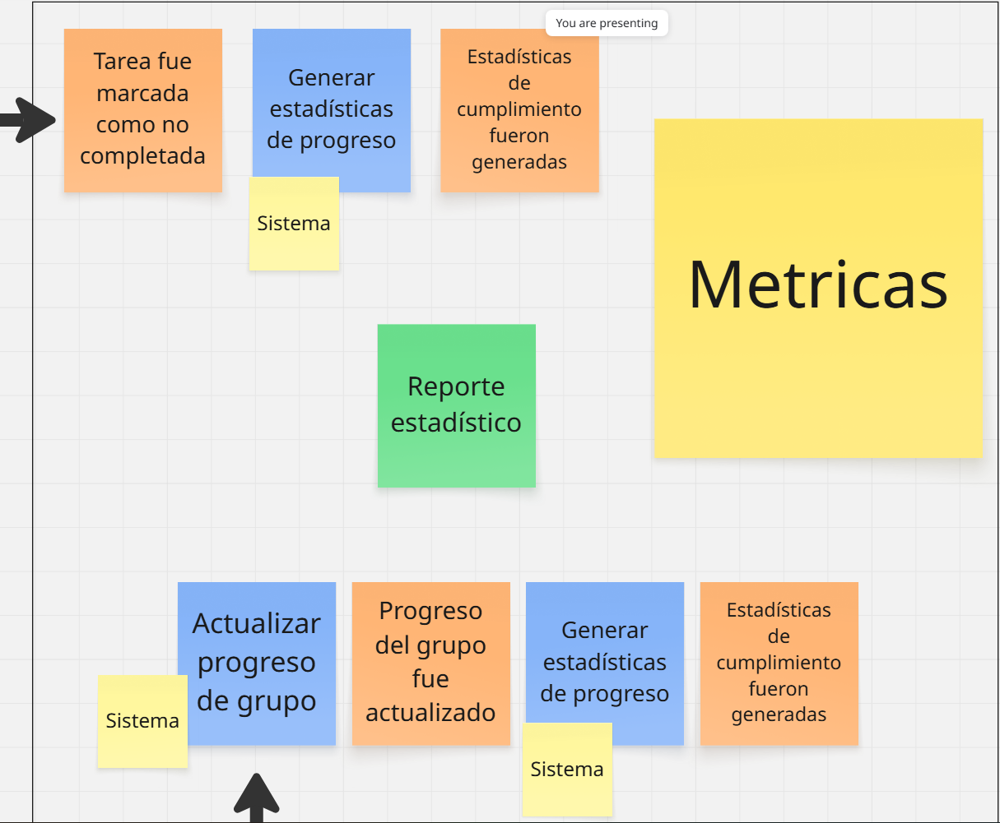](https://postimg.cc/N5bcpPb8)

**Solicitudes**

[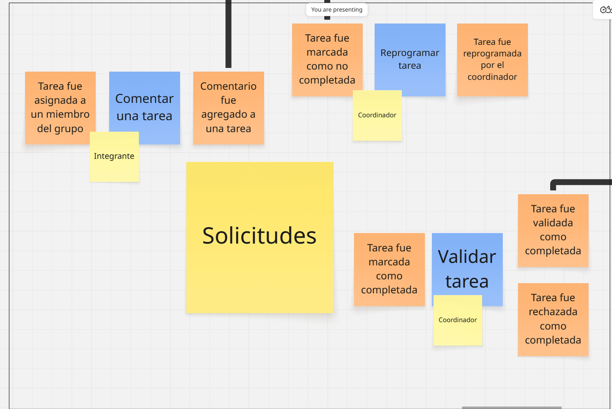](https://postimg.cc/jwV0DVd2)

### 4.2.3. Domain Message Flows Modeling

Como siguiente paso se buscó interconectar los bounded contexts
encontrados en la sección anterior, para esto se buscó encontrar los
eventos que se comunican entre los distintos contextos.

**Líderes y Notificaciones:** Al generar una invitación de grupo se
envía una notificación al usuario invitado, y al aceptar la invitación
se envía una notificación al creador del grupo.

[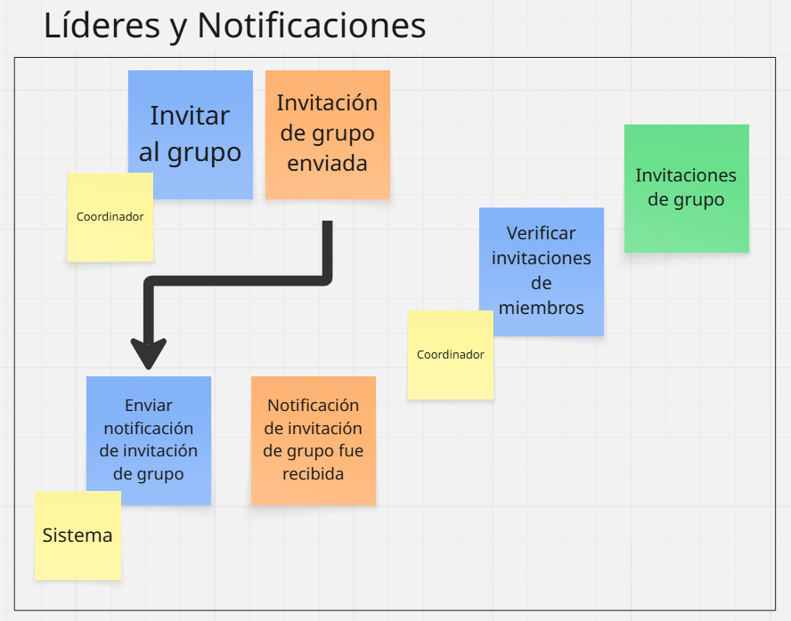](https://postimg.cc/H8VhzBL2)

**Tareas y Notificaciones:** Al crear una tarea se envía una
notificación al usuario asignado, y al cumplir la tarea se envía una
notificación al creador de la tarea.

[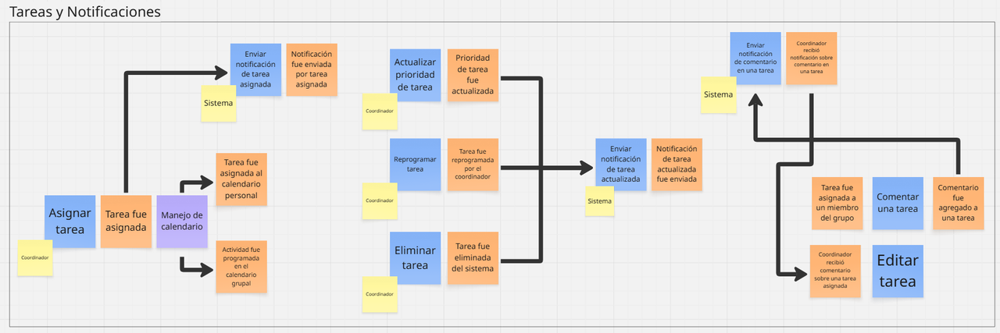](https://postimg.cc/tsHBnXhQ)

**Notificaciones y Solicitudes:** Al momento de marcarse tareas como
completadas o no completadas se envía una notificación al coordinador.
Al asignar reprogramar tareas se enviará notificaciones al usuario
antiguo y al nuevo usuario al que pertenece la tarea. Al
modificar(actualizar, reprogramar o eliminar) tareas se enviará una
notificación a todos los involucrados (coordinadores e integrantes).

[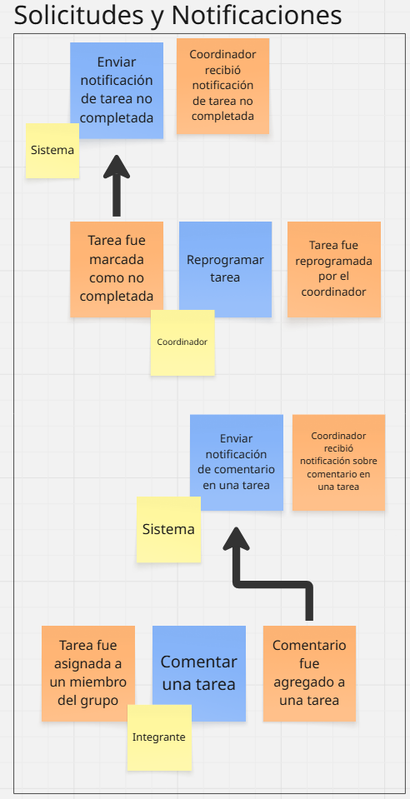](https://postimg.cc/VrTRf1fc)

**Solicitudes y Métricas:** Al validarse si se completó o no una tarea
se crean o modifican las estadísticas de progreso grupal.

[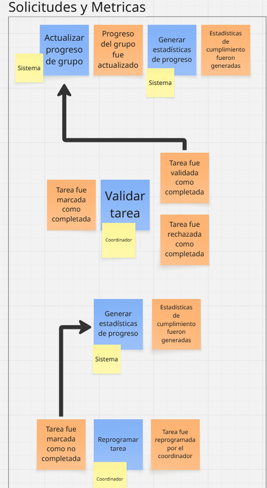](https://postimg.cc/ZWcx96bV)

Finalmente se muestra una captura global de la arquitectura del sistema,
donde se puede ver la interacción entre los distintos componentes y como
se comunican entre ellos.

[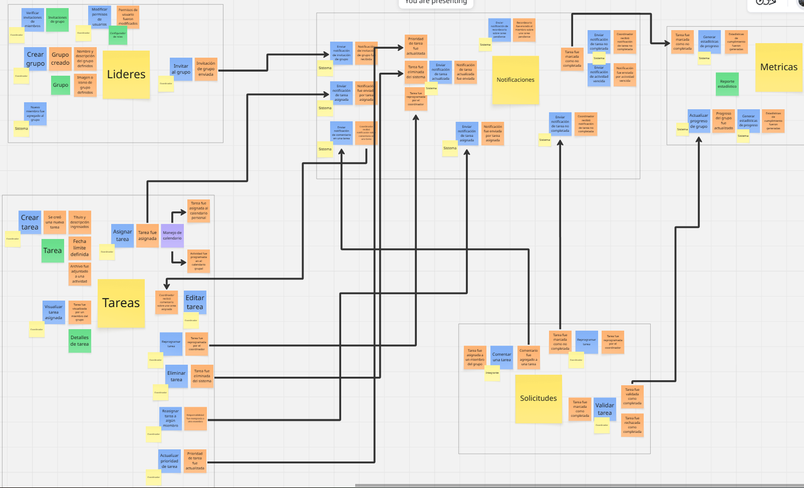](https://postimg.cc/BXRdY9Hk)

Enlace del Miro board sobre el que se trabajo:
<https://miro.com/app/board/uXjVHf1ECEI=/?share_link_id=687998549144>

### 4.2.4. Bounded Context Canvases

En esta sección se desarrolla la descomposición estratégica del dominio
a través de la elaboración de los Bounded Context Canvases, con el
propósito de identificar y delimitar áreas funcionalmente coherentes
dentro del sistema. Dicha práctica constituye una parte esencial del
enfoque de Domain-Driven Design (DDD), dado que permite clarificar los
límites semánticos y técnicos entre las distintas porciones del sistema,
reduciendo la complejidad y favoreciendo la evolución independiente de
cada componente.

El equipo ha definido previamente un conjunto de contextos delimitados
candidatos, ordenados de acuerdo con su importancia funcional y
estratégica. Con base en esta priorización, se procede al diseño
iterativo de los Bounded Context Canvases. Cada canvas incorpora los
siguientes elementos clave:

- **Context Overview Definition:** para comprender el propósito y el
  alcance del contexto.
- **Business Rules Distillation & Ubiquitous Language Capture:** para
  identificar las reglas de negocio fundamentales y establecer un
  lenguaje común entre los actores involucrados y los desarrolladores.
- **Capability Analysis y Capability Layering:** para entender las
  capacidades funcionales que ofrece el contexto y, si resulta
  necesario, organizarlas en capas.
- **Dependencies Capture:** para reconocer las relaciones con otros
  contextos y sus posibles implicaciones.
- **Design Critique:** para revisar y perfeccionar el diseño propuesto
  desde una perspectiva crítica y colaborativa.

**Líderes - Canvas**

[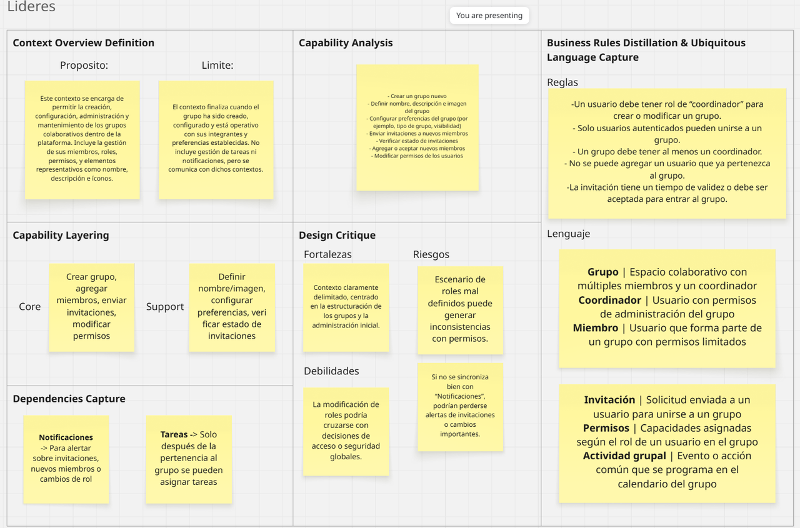](https://postimg.cc/RJ40nJV4)

**Tareas - Canvas**

[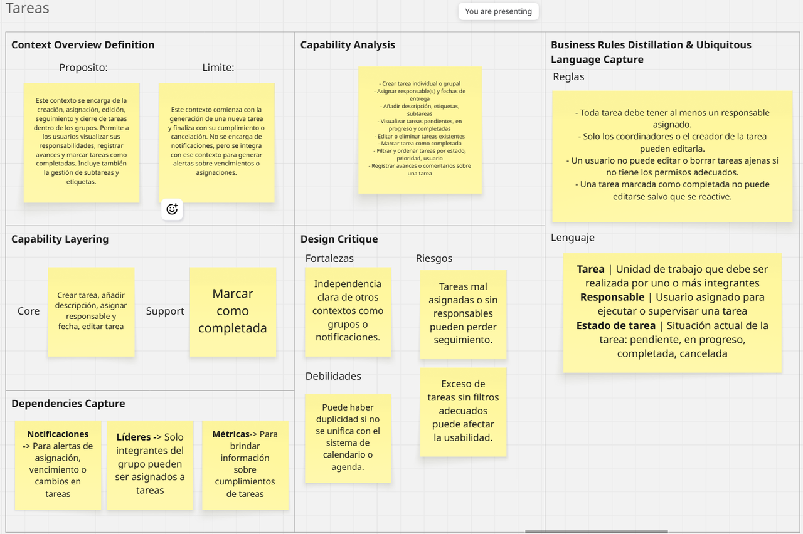](https://postimg.cc/fthdBLRR)

**Solicitudes - Canvas**

[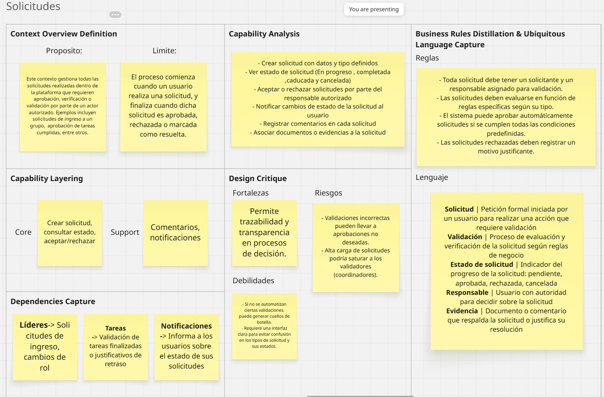](https://postimg.cc/LhDP3mdV)

**Notificaciones - Canvas**

[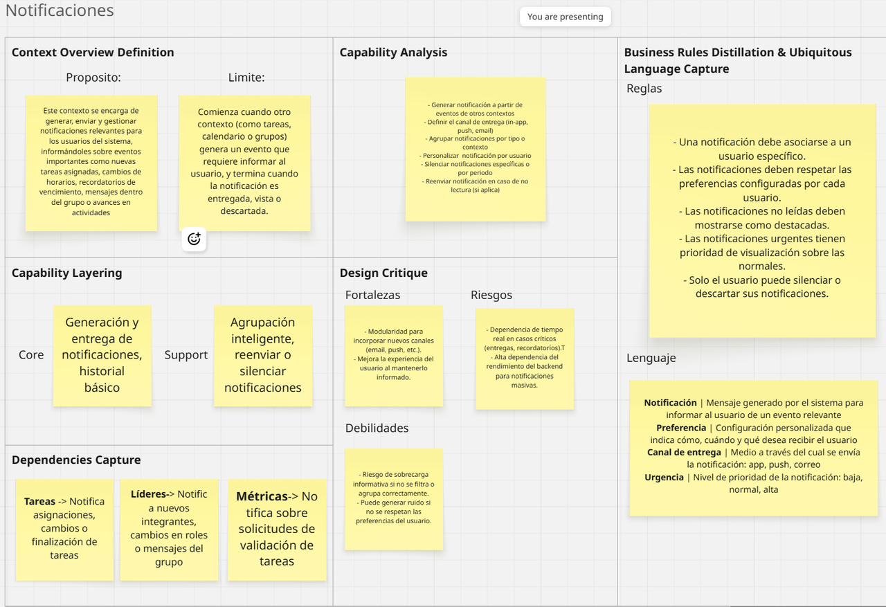](https://postimg.cc/rD0tTWDB)

**Métricas - Canvas**

[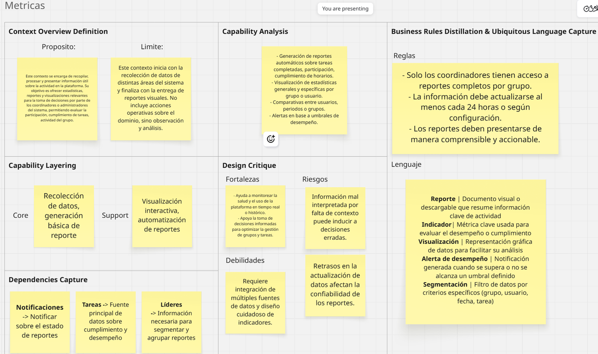](https://postimg.cc/KkFKtH0Z)

### 4.2.5. Context Mapping

El Context Mapping constituye una técnica fundamental dentro del enfoque
estratégico del Domain-Driven Design (DDD), pues permite visualizar y
comprender el modo en que interactúan los distintos contextos
delimitados (Bounded Contexts) en un sistema complejo. Mediante esta
herramienta, se identifican las relaciones, dependencias y límites de
comunicación entre contextos, definiendo con claridad los flujos de
información, los tipos de colaboración (tales como Customer/Supplier,
Conformist, Partnership o Anticorruption Layer) y el empleo de patrones
como Open Host Service.

El propósito del Context Mapping radica en facilitar una arquitectura de
software más modular, mantenible y alineada con el dominio del negocio,
permitiendo que cada contexto evolucione de manera autónoma sin generar
acoplamientos innecesarios. Esta representación también respalda la toma
de decisiones relativas a integraciones, responsabilidades y
coordinación entre equipos.

[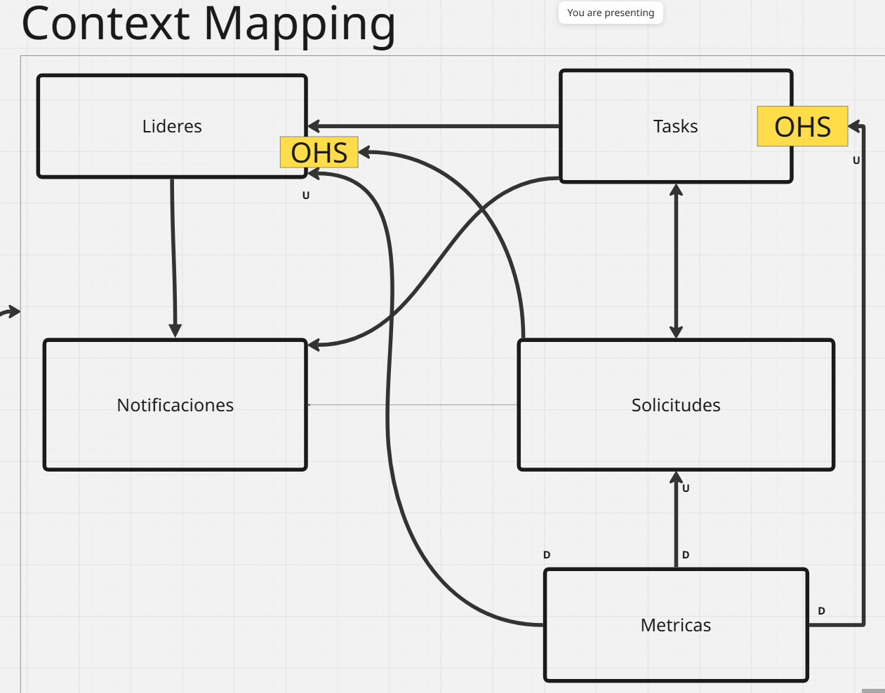](https://postimg.cc/nCMXK7Gj)

| Destino (Downstream) | Origen (Upstream) | Tipo de Relación | ¿OHS? | Comentario |
|----|----|----|----|----|
| Métricas | Líderes | Customer/Supplier | No | Expone información grupal |
| Solicitudes | Líderes | Customer/Supplier | Si | Se nutre de los datos de los integrantres |
| Tareas | Líderes | Customer/Supplier | No | Obtiene información de los integrantes de grupo |
| Tareas | Solicitudes | Partnership | No | Comparte información entre sí de las tareas |
| Métricas | Tareas | Customer/Supplier | Si | Se nutre de la información de las tareas para elaborar reportes |
| Métricas | Solicitudes | Customer/Supplier | No | Obtiene la infomración de actualización de cambios y solicitudes |
| Notificaciones | Líderes, Solicitudes, Tareas | Partnership | No | Emite notificaciones según instrucciones de los demás bounded context |

## 4.3. Software Architecture

La arquitectura del sistema se organiza en tres niveles. En primer
lugar, el Context Diagram define las interacciones externas entre SynHub
—núcleo del sistema—, sus usuarios (Miembro y Líder) y servicios
externos como Cloudinarym, Gemini y Sendgrid. En segundo lugar, el
Container Diagram descompone SynHub en módulos fundamentales (Mobile
App, API REST, PostgreSQL y Landing Page), especificando sus
responsabilidades y los mecanismos de comunicación interna. Finalmente,
el Deployment Diagram detalla el despliegue físico y en la nube de estos
componentes, abarcando servidores, dispositivos móviles y conexiones con
APIs externas. En conjunto, estos diagramas garantizan un diseño
escalable, integrado y adecuadamente estructurado.

### 4.3.1. Software Architecture System Landscape Diagram

El System Landscape diagrama representa el nivel inicial y de mayor
abstracción en el modelo C4, diseñado para ofrecer una visión panorámica
de la infraestructura tecnológica dentro de un contexto organizacional o
de negocio. Este esquema articula la posición de un sistema de software
específico en relación con otros sistemas externos, usuarios finales y
actores institucionales, facilitando la identificación de dependencias,
puntos de integración y límites del ecosistema completo. Su función
principal es comunicar el alcance del proyecto a audiencias técnicas y
no técnicas, estableciendo un marco de referencia que permite comprender
el rol funcional y la interoperabilidad de la solución desarrollada
dentro de un entorno complejo.

[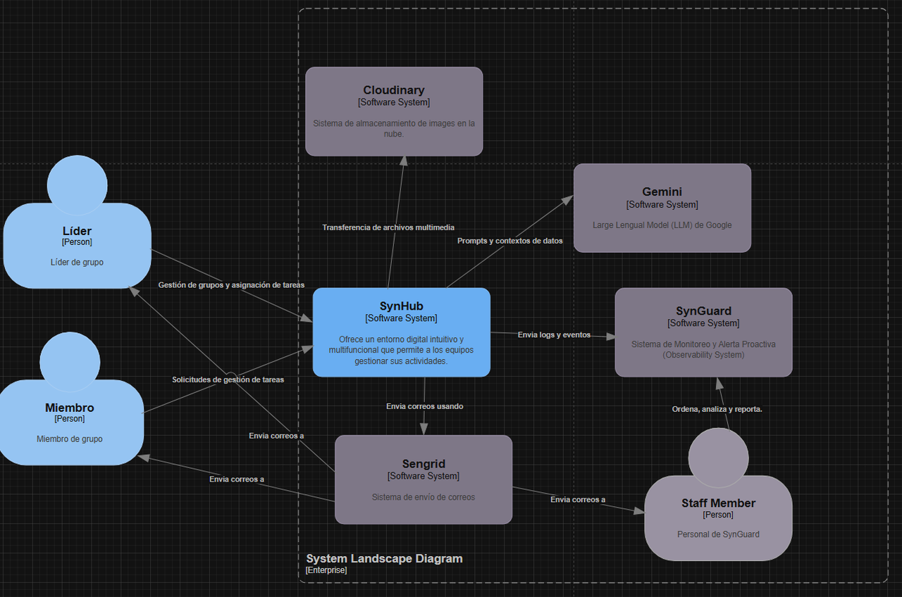](https://postimg.cc/SJs24KDF)

### 4.3.2. Software Architecture Context Level Diagrams

El Context Diagram muestra a SynHub (el sistema central) interactuando
con sus usuarios principales —el Miembro y el Líder— quienes utilizan la
aplicación para gestionar actividades, mientras que SynHub se integra
con Gemini, Cloudinary y Sendgrid. Este diagrama enfatiza las relaciones
externas del sistema, sin detallar componentes internos, destacando cómo
los actores clave (usuarios y servicios externos) se conectan con la
plataforma principal para intercambiar información.

[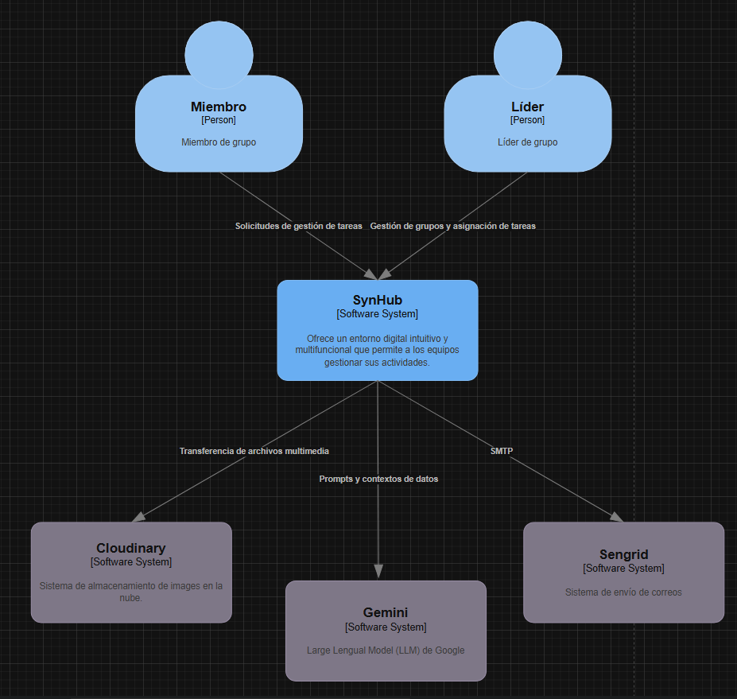](https://postimg.cc/14LptsFg)

### 4.3.3. Software Architecture Container Level Diagrams

El diagrama de contenedores de **SynHub** propone una arquitectura de
microservicios robusta y altamente desacoplada, fundamentada en la
especialización de responsabilidades. En la capa de acceso, el **API
Gateway** unifica la interacción del usuario final, delegando la
localización física de los componentes al **Discovery Server**, lo cual
permite un despliegue dinámico y escalable. La lógica de negocio se
fragmenta en contenedores independientes —tales como IAM, Groups, Tasks,
Requests, Metrics, Cloudinary, Email y AI Service—, algunos con
persistencia de datos propia, garantizando un aislamiento óptimo. La
comunicación síncrona mediante **REST/HTTPS** asegura una respuesta
inmediata en operaciones críticas, mientras que la integración asíncrona
a través del **Broker (RabbitMQ)** mediante el protocolo **AMQP**
permite gestionar eventos de forma eficiente, desacoplando los servicios
y fortaleciendo la resiliencia del sistema ante posibles fallos.
Finalmente, la externalización de servicios complejos como **Gemini**
para procesamiento de lenguaje, **Cloudinary** para gestión multimedia y
**SendGrid** para notificaciones, consolida a SynHub como una plataforma
moderna que aprovecha un ecosistema de servicios especializados para
optimizar la experiencia de gestión de tareas.

[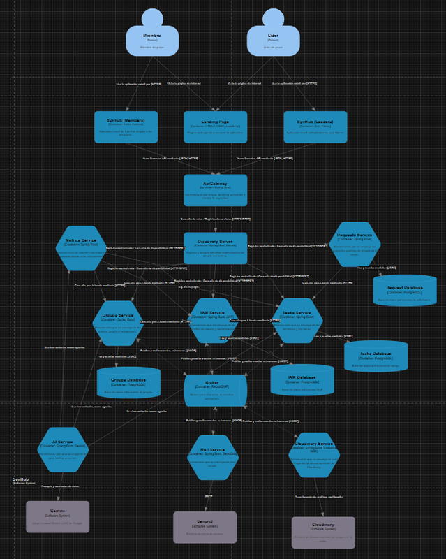](https://postimg.cc/8sP166Rp)

Parte del usuario:

[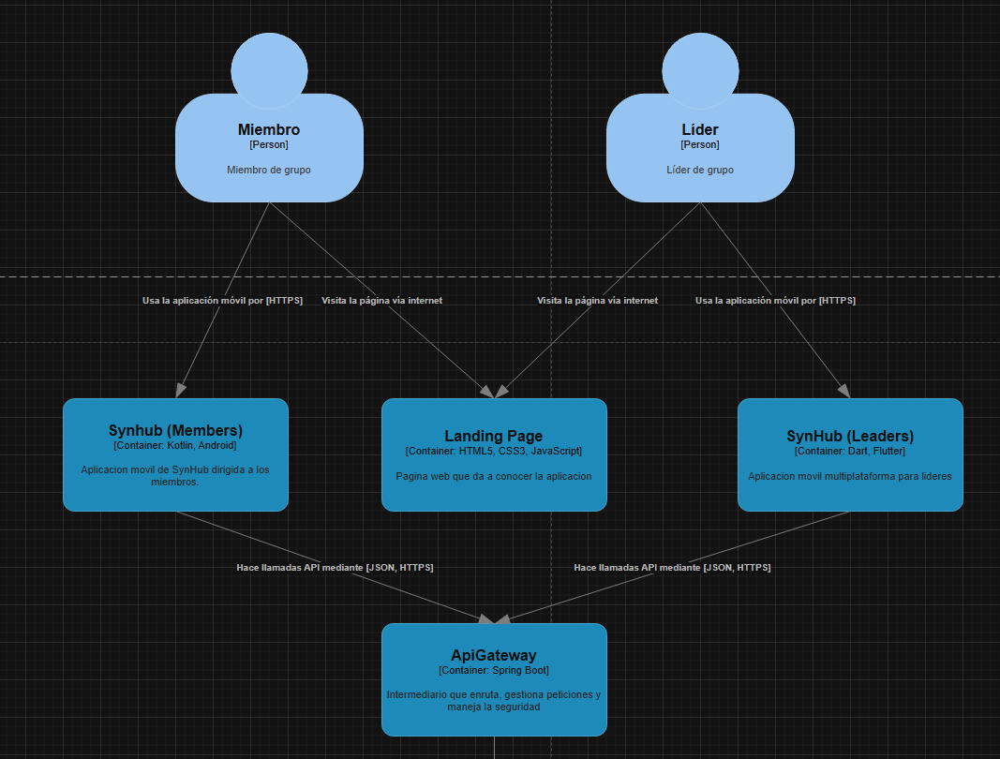](https://postimg.cc/N25qPRDk)

Parte de microservicios principales:

[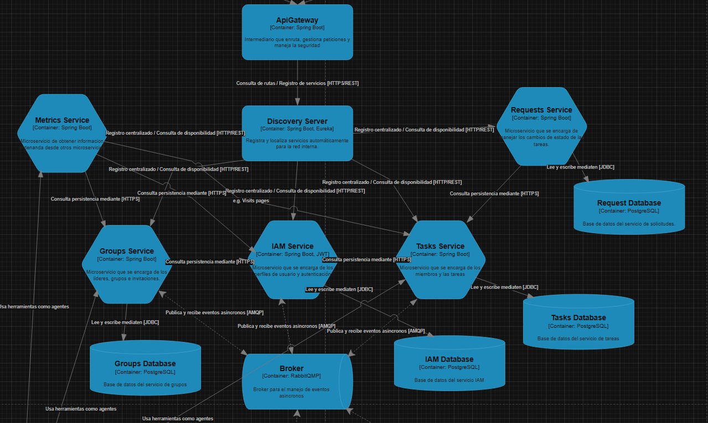](https://postimg.cc/WDb9nTXL)

Parte de servicios externos:

[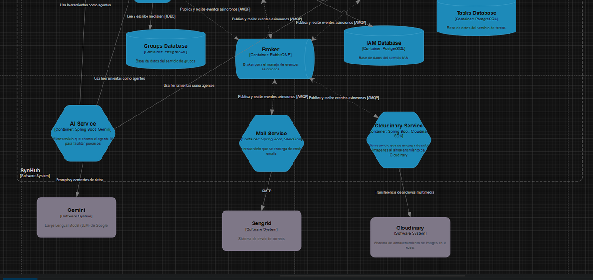](https://postimg.cc/Ln3B0Gqz)

### 4.3.4. Software Architecture Deployment Diagrams

El diagrama de despliegue, integrado en el nivel más físico del modelo
C4 y en el estándar UML, es la representación técnica de la arquitectura
de sistema sobre su infraestructura de ejecución. Su propósito
fundamental es describir cómo los componentes de software (artefactos)
se asignan, configuran y distribuyen en los nodos de hardware o entornos
virtuales (como servidores, contenedores o servicios en la nube).

Este diagrama detalla la topología de la red, las dependencias entre los
componentes de software y su ubicación física o lógica, permitiendo
comprender la escalabilidad, la disponibilidad y la resiliencia del
sistema en el entorno de producción. En esencia, actúa como el puente
definitivo entre el diseño lógico del software y la realidad operativa,
ilustrando el despliegue físico de los servicios, bases de datos y
herramientas de soporte que conforman la solución.

[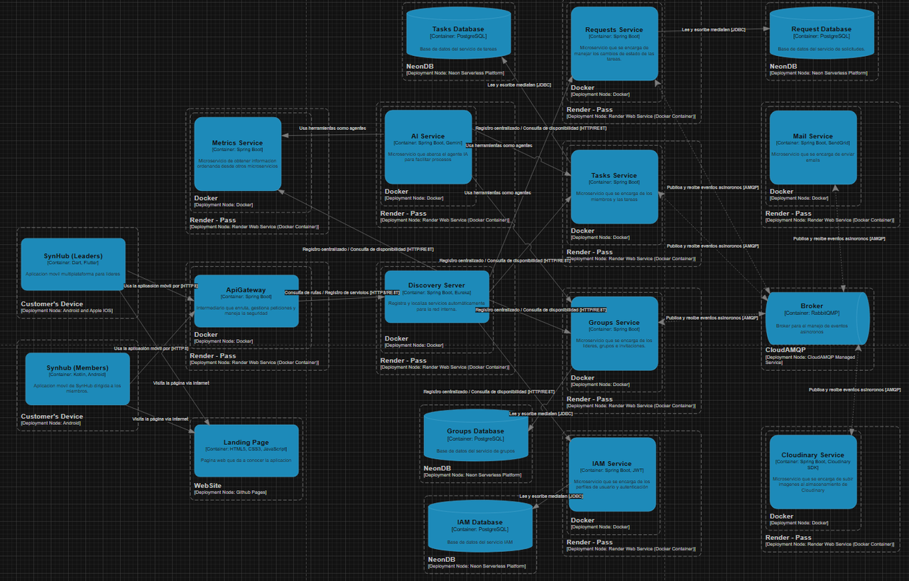](https://postimg.cc/1nJ1Byx4)

Parte de interacción de usuarios:

[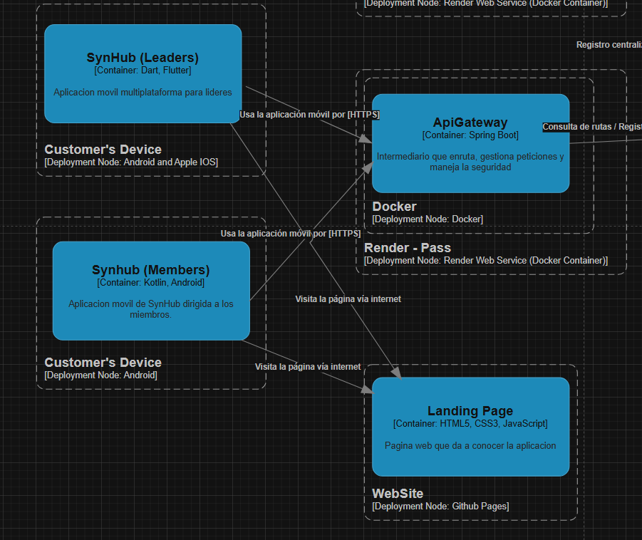](https://postimg.cc/ns2WbT3D)

Parte de microservicios:

[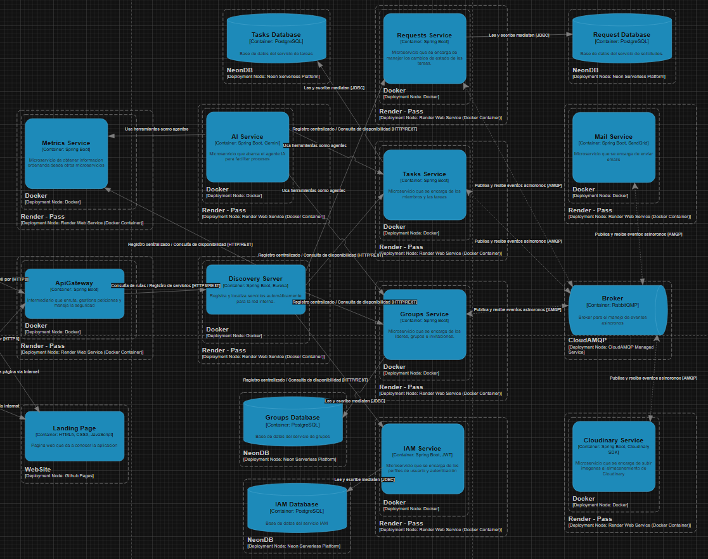](https://postimg.cc/ygJyQTtX)

# 5. Capítulo V: Tactical-Level Software Design

## 5.1. Bounded Context: Iam

### 5.1.1. Domain Layer

La Capa de Dominio del Bounded Context de IAM es el núcleo de la lógica de negocio para la seguridad y gestión de identidades. En esta capa se define el Aggregate Root: User, que actúa como la unidad de consistencia principal, asegurando que las reglas de autenticación y la vinculación con perfiles de negocio (Member/Leader) se cumplan rigurosamente.

<strong style="font-size: 1.2em;">Aggregate Root: `User`</strong>

Descripción: Es el Agregado Raíz que representa la identidad de un usuario. Aunque se implementa técnicamente como una entidad JPA para su persistencia, en el diseño táctico actúa como la raíz que encapsula el estado de seguridad, los datos personales y la relación con los roles y perfiles externos mediante Value Objects.

| Atributo          | Tipo           | Visibilidad | Invariante / Regla de negocio                                                                       |
| :---------------- | :------------- | :---------- | :-------------------------------------------------------------------------------------------------- |
| `id`              | Long           | Private     | Único y obligatorio. Heredado de AuditableAbstractAggregateRoot.                                   |
| `username`        | String         | Private     | No nulo ni vacío. Debe ser único en la base de datos y tener una longitud máxima de 50 caracteres. |
| `name`            | String         | Private     | No nulo. Máximo 50 caracteres. Representa el nombre legal del usuario.                             |
| `surname`         | String         | Private     | No nulo. Máximo 50 caracteres. Representa el apellido legal del usuario.                           |
| `imgUrl`          | String         | Private     | Obligatorio. Debe ser una URL válida con un máximo de 1024 caracteres.                             |
| `email`           | String         | Private     | Único y obligatorio. Debe seguir el formato de correo electrónico estándar. No puede duplicarse.   |
| `password`        | String         | Private     | No nulo. Debe almacenarse mediante un hash seguro. Longitud máxima en BD de 120 caracteres.       |
| `roles`           | Set<Role>      | Private     | Estado consistente. Nunca puede ser nulo; se inicializa como un HashSet vacío. Al persistirse, debe tener al menos un rol asignado. |
| `leaderId`        | LeaderId       | Private     | Opcional. Si está presente, el valor interno debe ser un entero positivo (>0).                     |
| `memberId`        | MemberId       | Private     | Opcional. Si está presente, el valor interno debe ser un entero positivo (>0).                     |

<strong style="font-size: 1em;">Métodos</strong>

| Nombre del Método      | Tipo Retorno | Visibilidad | Descripción / Regla de Negocio                                                                          |
| :--------------------- | :----------- | :---------- | :------------------------------------------------------------------------------------------------------- |
| `User()`               | N/A          | Public      | Constructor por defecto. Inicializa el conjunto de roles como un HashSet vacío.                         |
| `User(username, ...)` | N/A          | Public      | Constructor sobrecargado para la creación de usuarios con datos básicos.                                |
| `addRole(role)`        | User         | Public      | Añade un objeto Role al conjunto de roles del usuario. Retorna la instancia de User.                    |
| `addRoles(roles)`      | User         | Public      | Valida y añade una lista de roles. Utiliza Role.validateRoleSet para asegurar la consistencia.         |

<strong style="font-size: 1.2em;">Entity: `Role`</strong>

Descripción: Define las capacidades o permisos asignados a una identidad.

| Atributo | Tipo           | Visibilidad | Invariante / Regla de negocio                                                          |
| :------- | :------------- | :---------- | :-------------------------------------------------------------------------------------- |
| `id`     | Long           | Private     | Identificador único de la entidad generado por estrategia IDENTITY.                     |
| `name`   | Roles (Enum)   | Private     | Representación del rol como String en la base de datos (ROLE_USER, etc.).              |

<strong style="font-size: 1em;">Métodos</strong>

| Nombre del Método        | Tipo Retorno | Visibilidad      | Descripción / Regla de Negocio                                                         |
| :----------------------- | :----------- | :--------------- | :-------------------------------------------------------------------------------------- |
| `getStringName()`        | String       | Public           | Retorna el nombre del enumerado Roles como una cadena de texto.                         |
| `getDefaultRole()`       | Role         | Public (Static)  | Retorna una nueva instancia de Role con el valor ROLE_USER.                            |
| `toRoleFromName(name)`   | Role         | Public (Static)  | Convierte una cadena de texto al enumerado correspondiente y retorna el Role.           |
| `validateRoleSet(roles)` | List<Role>   | Public (Static)  | Si la lista es nula o vacía, retorna una lista con el rol por defecto (ROLE_USER).     |

<strong style="font-size: 1.2em;">Value Object: `Roles (Enumeration)`</strong>

| Atributo       | Tipo         | Visibilidad | Invariante / Regla de negocio                                                                  |
| :------------- | :----------- | :---------- | :--------------------------------------------------------------------------------------------- |
| `ROLE_USER`    | Enum Value   | N/A         | Rol asignado por defecto a cualquier cuenta creada.                                            |
| `ROLE_LEADER`  | Enum Value   | N/A         | Identifica a un usuario con capacidades de gestión en el sistema.                              |
| `ROLE_MEMBER`  | Enum Value   | N/A         | Identifica a un usuario que participa como colaborador en los flujos de trabajo.               |

### 5.1.2. Interface Layer

La Capa de Interfaz de IAM gestiona la exposición de los servicios de seguridad, autenticación y gestión de usuarios hacia el exterior. Utiliza controladores REST para la comunicación síncrona y recursos (DTOs) para estructurar el intercambio de datos entre el cliente y el servidor.

<strong style="font-size: 1.2em;">Recursos de entrada (Request)</strong>

<strong style="font-size: 1em;">`SignUpResource`</strong>

Propósito: Representa los datos necesarios para registrar un nuevo usuario en la plataforma.

| Campo      | Tipo    | Descripción                           |
| :--------- | :------ | :------------------------------------ |
| `username` | String  | Nombre de usuario único.              |
| `name`     | String  | Nombre del usuario.                   |
| `surname`  | String  | Apellido del usuario.                 |
| `imgUrl`   | String  | URL de la imagen de perfil.           |
| `email`    | String  | Correo electrónico único.             |
| `password` | String  | Contraseña para la cuenta.            |
| `roles`    | List    | Lista de nombres de roles solicitados.|

---

<strong style="font-size: 1em;">`SignInResource`</strong>

Propósito: Contiene las credenciales para la autenticación de un usuario.

| Campo      | Tipo    | Descripción                      |
| :--------- | :------ | :------------------------------- |
| `username` | String  | Nombre de usuario registrado.    |
| `password` | String  | Contraseña asociada a la cuenta. |

---

<strong style="font-size: 1.2em;">Recursos de salida (Response)</strong>

<strong style="font-size: 1em;">`UserResource`</strong>

Propósito: Devuelve la información completa del usuario, incluyendo sus perfiles específicos (Líder o Miembro) según su rol.

| Campo      | Tipo                    | Descripción                      |
| :--------- | :---------------------- | :------------------------------- |
| `id`       | Long                    | Identificador único del usuario. |
| `username` | String                  | Nombre de usuario.               |
| `name`     | String                  | Nombre del usuario.              |
| `surname`  | String                  | Apellido del usuario.            |
| `imgUrl`   | String                  | URL de la imagen de perfil.      |
| `email`    | String                  | Correo electrónico.              |
| `leader`   | UserLeaderResource      | Información detallada de líder.  |
| `member`   | UserMemberResource      | Información detallada de miembro.|
| `roles`    | List<String>            | Lista de roles asignados.        |

---

<strong style="font-size: 1em;">`AuthenticatedUserResource`</strong>

Propósito: Retorna la información básica del usuario junto con el token de acceso tras un inicio de sesión exitoso.

| Campo      | Tipo    | Descripción                      |
| :--------- | :------ | :------------------------------- |
| `id`       | Long    | Identificador único del usuario. |
| `username` | String  | Nombre de usuario.               |
| `token`    | String  | Token de autenticación (JWT).    |

---

<strong style="font-size: 1em;">`RoleResource`</strong>

Propósito: Representa la información de un rol disponible en el sistema.

| Campo | Tipo   | Descripción          |
| :---- | :----- | :------------------- |
| `id`  | Long   | Identificador del rol.|
| `name`| String | Nombre del rol.      |

---

<strong style="font-size: 1.2em;">Resumen de recursos</strong>

| Recurso                    | Tipo     | Dirección | Propósito principal                                |
| :------------------------- | :------- | :-------- | :------------------------------------------------- |
| `SignUpResource`           | Request  | Entrada   | Registrar un nuevo usuario.                        |
| `SignInResource`           | Request  | Entrada   | Autenticar a un usuario existente.                 |
| `UserResource`             | Response | Salida    | Representación detallada de un usuario.            |
| `RoleResource`             | Response | Salida    | Información de roles del sistema.                  |
| `AuthenticatedUserResource`| Response | Salida    | Confirmación de acceso y entrega de token.         |

---

<strong style="font-size: 1.2em;">Controllers</strong>

<strong style="font-size: 1em;">`1. AuthenticationController`</strong>

Propósito: Gestiona los flujos de registro e inicio de sesión.

Dependencias inyectadas:

| Dependencia            | Tipo                  | Propósito                                      |
| :--------------------- | :-------------------- | :--------------------------------------------- |
| `userCommandService`   | UserCommandService    | Procesar comandos de creación y autenticación. |

Endpoints expuestos:

| Método | Endpoint                           | Descripción                                      | Servicio invocado                    |
| :----- | :--------------------------------- | :----------------------------------------------- | :----------------------------------- |
| POST   | `/api/v1/authentication/sign-up`   | Registra un nuevo usuario y crea su perfil según rol. | `userCommandService.handle(SignUpCommand)` |
| POST   | `/api/v1/authentication/sign-in`   | Autentica al usuario y devuelve el token JWT.   | `userCommandService.handle(SignInCommand)` |

<strong style="font-size: 1em;">`2. UsersController`</strong>

Propósito: Permite la consulta de información de usuarios mediante diferentes criterios de búsqueda.

Dependencias inyectadas:

| Dependencia          | Tipo               | Propósito                                      |
| :------------------- | :----------------- | :--------------------------------------------- |
| `userQueryService`   | UserQueryService   | Ejecutar consultas sobre los usuarios registrados. |

Endpoints expuestos:

| Método | Endpoint                          | Descripción                                      | Servicio invocado                          |
| :----- | :-------------------------------- | :----------------------------------------------- | :----------------------------------------- |
| GET    | `/api/v1/users`                  | Obtiene la lista de todos los usuarios.         | `userQueryService.handle(GetAllUsersQuery)` |
| GET    | `/api/v1/users/{userId}`         | Obtiene un usuario específico por su ID.        | `userQueryService.handle(GetUserByIdQuery)` |
| GET    | `/api/v1/users?username={u}`     | Busca un usuario por su nombre de usuario.      | `userQueryService.handle(GetUserByUsernameQuery)` |
| GET    | `/api/v1/users?memberId={id}`    | Busca el usuario asociado a un ID de miembro.   | `userQueryService.handle(GetUserByMemberIdQuery)` |

<strong style="font-size: 1em;">`3. RolesController`</strong>

Propósito: Proporciona acceso a la lista de roles configurados en la aplicación.

Dependencias inyectadas:

| Dependencia            | Tipo                | Propósito                        |
| :--------------------- | :------------------ | :------------------------------- |
| `roleQueryService`     | RoleQueryService    | Consultar los roles existentes.  |

Endpoints expuestos:

| Método | Endpoint          | Descripción                                           | Servicio invocado                      |
| :----- | :---------------- | :---------------------------------------------------- | :------------------------------------- |
| GET    | `/api/v1/roles`   | Lista todos los roles disponibles (USER, LEADER, MEMBER). | `roleQueryService.handle(GetAllRolesQuery)` |

---

### 5.1.3. Application Layer

<strong style="font-size: 1.2em;">Servicios de Aplicación (Command Services)</strong>

<strong style="font-size: 1em;">`1. UserCommandServiceImpl`</strong>

Propósito: Gestionar el ciclo de vida de las credenciales de usuario, el proceso de autenticación segura y la coordinación de la creación de perfiles mediante eventos de integración.

Dependencias inyectadas:

| Dependencia            | Tipo                | Propósito                                                          |
| :--------------------- | :------------------ | :---------------------------------------------------------------- |
| `roleRepository`       | RoleRepository      | Acceder a la persistencia de roles para asignación en el registro. |
| `userRepository`       | UserRepository      | Gestionar la persistencia y búsqueda de los agregados User.        |
| `hashingService`       | HashingService      | Encriptar contraseñas y verificar hashes durante el login.         |
| `tokenService`         | TokenService        | Generar tokens JWT para sesiones autenticadas.                     |
| `leaderPublisher`      | LeaderPublisher     | Publicar eventos de creación de líder hacia RabbitMQ.             |
| `memberPublisher`      | MemberPublisher     | Publicar eventos de creación de miembro hacia RabbitMQ.           |

Comandos manejados:

| Comando                      | Proceso / Regla de Negocio                                                                                      |
| :--------------------------- | :-------------------------------------------------------------------------------------------------------------- |
| `SignUpCommand`              | Valida que el username/email no existan, cifra la contraseña, busca los roles en el repositorio y persiste el nuevo usuario. |
| `SignInCommand`              | Verifica la existencia del usuario y la validez del password; si es exitoso, genera un UserDetails y retorna el usuario con su token. |
| `CreateUserLeaderCommand`    | Dispara el flujo asíncrono para que el microservicio de grupos cree un perfil de líder para el usuario especificado. |
| `CreateUserMemberCommand`    | Dispara el flujo asíncrono para que el microservicio de tareas cree un perfil de miembro para el usuario especificado. |
| `UpdateUserLeaderIdCommand`  | Actualiza de forma atómica el Value Object LeaderId dentro del agregado User una vez confirmada la creación externa. |
| `UpdateUserMemberIdCommand`  | Actualiza de forma atómica el Value Object MemberId dentro del agregado User una vez confirmada la creación externa. |

---

<strong style="font-size: 1em;">`2. RoleCommandServiceImpl`</strong>

Propósito: Garantizar la integridad de los datos maestros de seguridad inicializando los roles del sistema.

Dependencias inyectadas:

| Dependencia       | Tipo              | Propósito                                                 |
| :---------------- | :---------------- | :-------------------------------------------------------- |
| `roleRepository`  | RoleRepository    | Verificar existencia y persistir los roles definidos en el dominio. |

Comandos manejados:

| Comando              | Proceso / Regla de Negocio                                                                  |
| :------------------- | :------------------------------------------------------------------------------------------ |
| `SeedRolesCommand`   | Itera sobre el enumerado Roles y registra en la base de datos aquellos que aún no estén presentes. |

---

<strong style="font-size: 1.2em;">Servicios de Aplicación (Query Services)</strong>

<strong style="font-size: 1em;">`1. UserQueryServiceImpl`</strong>

Propósito: Proveer acceso a la información de usuarios, integrando datos locales con información detallada de perfiles proveniente de otros microservicios.

Dependencias inyectadas:

| Dependencia            | Tipo                  | Propósito                                                            |
| :--------------------- | :-------------------- | :------------------------------------------------------------------ |
| `userRepository`       | UserRepository        | Consultar la información básica y credenciales de los usuarios.      |
| `groupsServiceClient`  | GroupsServiceClient   | Recuperar información del perfil de Líder desde el microservicio de grupos. |
| `tasksServiceClient`   | TasksServiceClient    | Recuperar información del perfil de Miembro desde el microservicio de tareas. |

Consultas manejadas:

| Consulta (Query)       | Descripción                                                                              |
| :--------------------- | :--------------------------------------------------------------------------------------- |
| `GetAllUsersQuery`     | Retorna una lista de todos los usuarios registrados en el sistema.                       |
| `GetUserByIdQuery`     | Obtiene la información de un usuario a partir de su ID único.                            |
| `GetUserByUsernameQuery` | Busca un usuario mediante su nombre de cuenta.                                          |
| `GetUserLeaderByIdQuery` | Combina los datos del usuario local con los detalles del líder obtenidos vía WebClient. |
| `GetUserMemberByIdQuery` | Combina los datos del usuario local con los detalles del miembro obtenidos vía WebClient. |

---

<strong style="font-size: 1em;">`2. RoleQueryServiceImpl`</strong>

Propósito: Facilitar la consulta de los privilegios y roles disponibles.

Dependencias inyectadas:

| Dependencia       | Tipo              | Propósito                             |
| :---------------- | :---------------- | :------------------------------------ |
| `roleRepository`  | RoleRepository    | Acceder a la lista de roles persistidos. |

Consultas manejadas:

| Consulta (Query)    | Descripción                                                     |
| :------------------ | :-------------------------------------------------------------- |
| `GetAllRolesQuery`  | Recupera el catálogo completo de roles del sistema.             |
| `GetRoleByNameQuery`| Obtiene un rol específico filtrando por su nombre técnico.      |

---

### 5.1.4. Infrastructure Layer

<strong style="font-size: 1.2em;">Persistence: Repositories (Spring Data JPA)</strong>

Se utiliza Spring Data JPA con una estrategia de nombrado `SnakeCaseWithPluralizedTable` para mapear los objetos de dominio a una base de datos relacional PostgreSQL.

| Repositorio     | Entidad Relacionada | Descripción                                                                                                                    |
| :-------------- | :------------------ | :----------------------------------------------------------------------------------------------------------------------------- |
| `UserRepository` | User               | Gestiona el almacenamiento de usuarios. Incluye métodos para validación de existencia y búsqueda por username, email y referencias externas (leaderId/memberId). |
| `RoleRepository` | Role               | Almacena y recupera los roles del sistema (USER, LEADER, MEMBER). Permite la inicialización de roles mediante SeedRolesCommand. |

---

<strong style="font-size: 1.2em;">Communication: Outbound Services (Messaging & Clients)</strong>

El microservicio IAM se integra con el resto de la arquitectura SynHub mediante comunicación síncrona (WebClient) y asíncrona (RabbitMQ).

<strong style="font-size: 1em;">`1. Event Publishers (RabbitMQ)`</strong>

| Implementación     | Routing Key                    | Propósito                                                                                                        |
| :----------------- | :----------------------------- | :--------------------------------------------------------------------------------------------------------------- |
| `LeaderPublisher`  | `ROUTING_KEY_LEADER_CREATED`   | Publica eventos en el exchange de IAM para notificar que un nuevo usuario requiere un perfil de Líder.           |
| `MemberPublisher`  | `ROUTING_KEY_MEMBER_CREATED`   | Publica eventos para solicitar la creación de un perfil de Miembro en el contexto de Tareas.                     |

---

<strong style="font-size: 1em;">`2. Web Clients (HTTP Balanced)`</strong>

| Cliente                    | Microservicio Destino | Descripción                                                                                                         |
| :------------------------- | :-------------------- | :------------------------------------------------------------------------------------------------------------------ |
| `GroupsServiceClientImpl`   | groups-service        | Consume el endpoint /api/v1/leader/{id} para enriquecer el recurso de usuario con datos del perfil de líder.       |
| `TasksServiceClientImpl`    | tasks-service         | Consume el endpoint /api/v1/member/{id} para obtener información de membresía y grupos.                            |

---

<strong style="font-size: 1.2em;">Security: Authorization & Token Management</strong>

La seguridad se implementa siguiendo el estándar de Spring Security, utilizando JWT (JSON Web Tokens) para una arquitectura stateless.

| Componente          | Clase / Tecnología                   | Función                                                                                                             |
| :------------------ | :----------------------------------- | :------------------------------------------------------------------------------------------------------------------ |
| Token Service       | `TokenServiceImpl`                   | Gestiona el ciclo de vida de los tokens JWT, incluyendo claims personalizados como roles y user_id, con una validez de 7 días. |
| Auth Filter         | `BearerAuthorizationRequestFilter`  | Filtro de intercepción que valida la presencia de un token en el header Authorization y establece el contexto de seguridad. |
| Hashing Service     | `BCryptHashingService`              | Implementa la interfaz HashingService del dominio para el cifrado irreversible de contraseñas.                      |

---

<strong style="font-size: 1.2em;">Configuration & Environment (Infrastructure Config)</strong>

El microservicio utiliza variables de entorno para una configuración segura y flexible:

- `Base de Datos`: Configurado para PostgreSQL mediante `POSTGRES_URL`, con soporte para el ajuste automático del esquema (`ddl-auto: update`).
- `Seguridad`: El secreto de firma de tokens se gestiona externamente mediante `JWT_SECRET`.
- `RabbitMQConfig`: Centraliza las constantes de ruteo y nombres de cola para asegurar la consistencia en el intercambio de mensajes entre contextos.

---

### 5.1.5. Bounded Context Software Architecture Component Level Diagrams

El diagrama de clases de la capa de dominio de IAM ilustra la estructura lógica y el comportamiento del sistema de identidad. En el centro se encuentra el Agregado Raíz User, que encapsula la identidad del usuario y coordina su relación con la entidad Role y los Value Objects LeaderId y MemberId. Esta estructura garantiza la integridad de los datos de autenticación mientras mantiene una conexión desacoplada con otros contextos mediante eventos de dominio y referencias de identidad externas.

### 5.1.6. Bounded Context Software Architecture Code Level Diagrams

#### 5.1.6.1. Bounded Context Domain Layer Class Diagrams

El diagrama de la capa de dominio de IAM ilustra la lógica central de identidad mediante patrones tácticos de `DDD`. Se destaca el Agregado Raíz `User`, que gestiona el estado del usuario y se vincula con entidades de `Role` para la seguridad. El modelo utiliza `Value Objects` (`LeaderId`, `MemberId`) para referenciar perfiles externos y define `Interfaces` de servicios y repositorios que garantizan la independencia tecnológica. Finalmente, los `Eventos de Dominio` aseguran la sincronización asíncrona con otros contextos tras el registro de usuarios.

[.png)](https://postimg.cc/q6zHHznN)

#### 5.1.6.2. Bounded Context Database Design Diagram

El diseño de persistencia para el microservicio de IAM se basa en un esquema relacional normalizado para la gestión segura de identidades y accesos. El modelo se compone de tres tablas clave: `users`, que almacena las credenciales y referencias externas (`leader_id`, `member_id`); `roles`, que centraliza el catálogo de permisos; y `user_roles`, que actúa como tabla de unión para permitir una asignación flexible de roles de tipo muchos a muchos. Este diseño garantiza la integridad referencial y una alta eficiencia en los procesos de `autenticación` y `autorización`.

[.png)](https://postimg.cc/0M5qZtNR)

### 5.1.1. Domain Layer

La Capa de Dominio del Bounded Context de IAM es el núcleo de la lógica
de negocio para la seguridad y gestión de identidades. En esta capa se
define el Aggregate Root: User, que actúa como la unidad de consistencia
principal, asegurando que las reglas de autenticación y la vinculación
con perfiles de negocio (Member/Leader) se cumplan rigurosamente.

Aggregate Root: `User`

Descripción: Es el Agregado Raíz que representa la identidad de un
usuario. Aunque se implementa técnicamente como una entidad JPA para su
persistencia, en el diseño táctico actúa como la raíz que encapsula el
estado de seguridad, los datos personales y la relación con los roles y
perfiles externos mediante Value Objects.

| Atributo | Tipo | Visibilidad | Invariante / Regla de negocio |
|----|----|----|----|
| `id` | Long | Private | Único y obligatorio. Heredado de AuditableAbstractAggregateRoot. |
| `username` | String | Private | No nulo ni vacío. Debe ser único en la base de datos y tener una longitud máxima de 50 caracteres. |
| `name` | String | Private | No nulo. Máximo 50 caracteres. Representa el nombre legal del usuario. |
| `surname` | String | Private | No nulo. Máximo 50 caracteres. Representa el apellido legal del usuario. |
| `imgUrl` | String | Private | Obligatorio. Debe ser una URL válida con un máximo de 1024 caracteres. |
| `email` | String | Private | Único y obligatorio. Debe seguir el formato de correo electrónico estándar. No puede duplicarse. |
| `password` | String | Private | No nulo. Debe almacenarse mediante un hash seguro. Longitud máxima en BD de 120 caracteres. |
| `roles` | Set | Private | Estado consistente. Nunca puede ser nulo; se inicializa como un HashSet vacío. Al persistirse, debe tener al menos un rol asignado. |
| `leaderId` | LeaderId | Private | Opcional. Si está presente, el valor interno debe ser un entero positivo (\>0). |
| `memberId` | MemberId | Private | Opcional. Si está presente, el valor interno debe ser un entero positivo (\>0). |

Métodos

| Nombre del Método | Tipo Retorno | Visibilidad | Descripción / Regla de Negocio |
|----|----|----|----|
| `User()` | N/A | Public | Constructor por defecto. Inicializa el conjunto de roles como un HashSet vacío. |
| `User(username, ...)` | N/A | Public | Constructor sobrecargado para la creación de usuarios con datos básicos. |
| `addRole(role)` | User | Public | Añade un objeto Role al conjunto de roles del usuario. Retorna la instancia de User. |
| `addRoles(roles)` | User | Public | Valida y añade una lista de roles. Utiliza Role.validateRoleSet para asegurar la consistencia. |

Entity: `Role`

Descripción: Define las capacidades o permisos asignados a una
identidad.

| Atributo | Tipo | Visibilidad | Invariante / Regla de negocio |
|----|----|----|----|
| `id` | Long | Private | Identificador único de la entidad generado por estrategia IDENTITY. |
| `name` | Roles (Enum) | Private | Representación del rol como String en la base de datos (ROLE_USER, etc.). |

Métodos

| Nombre del Método | Tipo Retorno | Visibilidad | Descripción / Regla de Negocio |
|----|----|----|----|
| `getStringName()` | String | Public | Retorna el nombre del enumerado Roles como una cadena de texto. |
| `getDefaultRole()` | Role | Public (Static) | Retorna una nueva instancia de Role con el valor ROLE_USER. |
| `toRoleFromName(name)` | Role | Public (Static) | Convierte una cadena de texto al enumerado correspondiente y retorna el Role. |
| `validateRoleSet(roles)` | List | Public (Static) | Si la lista es nula o vacía, retorna una lista con el rol por defecto (ROLE_USER). |

Value Object: `Roles (Enumeration)`

| Atributo | Tipo | Visibilidad | Invariante / Regla de negocio |
|----|----|----|----|
| `ROLE_USER` | Enum Value | N/A | Rol asignado por defecto a cualquier cuenta creada. |
| `ROLE_LEADER` | Enum Value | N/A | Identifica a un usuario con capacidades de gestión en el sistema. |
| `ROLE_MEMBER` | Enum Value | N/A | Identifica a un usuario que participa como colaborador en los flujos de trabajo. |

### 5.1.2. Interface Layer

La Capa de Interfaz de IAM gestiona la exposición de los servicios de
seguridad, autenticación y gestión de usuarios hacia el exterior.
Utiliza controladores REST para la comunicación síncrona y recursos
(DTOs) para estructurar el intercambio de datos entre el cliente y el
servidor.

Recursos de entrada (Request)

`SignUpResource`

Propósito: Representa los datos necesarios para registrar un nuevo
usuario en la plataforma.

| Campo      | Tipo   | Descripción                            |
|------------|--------|----------------------------------------|
| `username` | String | Nombre de usuario único.               |
| `name`     | String | Nombre del usuario.                    |
| `surname`  | String | Apellido del usuario.                  |
| `imgUrl`   | String | URL de la imagen de perfil.            |
| `email`    | String | Correo electrónico único.              |
| `password` | String | Contraseña para la cuenta.             |
| `roles`    | List   | Lista de nombres de roles solicitados. |

`SignInResource`

Propósito: Contiene las credenciales para la autenticación de un
usuario.

| Campo      | Tipo   | Descripción                      |
|------------|--------|----------------------------------|
| `username` | String | Nombre de usuario registrado.    |
| `password` | String | Contraseña asociada a la cuenta. |

Recursos de salida (Response)

`UserResource`

Propósito: Devuelve la información completa del usuario, incluyendo sus
perfiles específicos (Líder o Miembro) según su rol.

| Campo      | Tipo               | Descripción                       |
|------------|--------------------|-----------------------------------|
| `id`       | Long               | Identificador único del usuario.  |
| `username` | String             | Nombre de usuario.                |
| `name`     | String             | Nombre del usuario.               |
| `surname`  | String             | Apellido del usuario.             |
| `imgUrl`   | String             | URL de la imagen de perfil.       |
| `email`    | String             | Correo electrónico.               |
| `leader`   | UserLeaderResource | Información detallada de líder.   |
| `member`   | UserMemberResource | Información detallada de miembro. |
| `roles`    | List               | Lista de roles asignados.         |

`AuthenticatedUserResource`

Propósito: Retorna la información básica del usuario junto con el token
de acceso tras un inicio de sesión exitoso.

| Campo      | Tipo   | Descripción                      |
|------------|--------|----------------------------------|
| `id`       | Long   | Identificador único del usuario. |
| `username` | String | Nombre de usuario.               |
| `token`    | String | Token de autenticación (JWT).    |

`RoleResource`

Propósito: Representa la información de un rol disponible en el sistema.

| Campo  | Tipo   | Descripción            |
|--------|--------|------------------------|
| `id`   | Long   | Identificador del rol. |
| `name` | String | Nombre del rol.        |

Resumen de recursos

| Recurso | Tipo | Dirección | Propósito principal |
|----|----|----|----|
| `SignUpResource` | Request | Entrada | Registrar un nuevo usuario. |
| `SignInResource` | Request | Entrada | Autenticar a un usuario existente. |
| `UserResource` | Response | Salida | Representación detallada de un usuario. |
| `RoleResource` | Response | Salida | Información de roles del sistema. |
| `AuthenticatedUserResource` | Response | Salida | Confirmación de acceso y entrega de token. |

Controllers

`1. AuthenticationController`

Propósito: Gestiona los flujos de registro e inicio de sesión.

Dependencias inyectadas:

| Dependencia | Tipo | Propósito |
|----|----|----|
| `userCommandService` | UserCommandService | Procesar comandos de creación y autenticación. |

Endpoints expuestos:

| Método | Endpoint | Descripción | Servicio invocado |
|----|----|----|----|
| POST | `/api/v1/authentication/sign-up` | Registra un nuevo usuario y crea su perfil según rol. | `userCommandService.handle(SignUpCommand)` |
| POST | `/api/v1/authentication/sign-in` | Autentica al usuario y devuelve el token JWT. | `userCommandService.handle(SignInCommand)` |

`2. UsersController`

Propósito: Permite la consulta de información de usuarios mediante
diferentes criterios de búsqueda.

Dependencias inyectadas:

| Dependencia | Tipo | Propósito |
|----|----|----|
| `userQueryService` | UserQueryService | Ejecutar consultas sobre los usuarios registrados. |

Endpoints expuestos:

| Método | Endpoint | Descripción | Servicio invocado |
|----|----|----|----|
| GET | `/api/v1/users` | Obtiene la lista de todos los usuarios. | `userQueryService.handle(GetAllUsersQuery)` |
| GET | `/api/v1/users/{userId}` | Obtiene un usuario específico por su ID. | `userQueryService.handle(GetUserByIdQuery)` |
| GET | `/api/v1/users?username={u}` | Busca un usuario por su nombre de usuario. | `userQueryService.handle(GetUserByUsernameQuery)` |
| GET | `/api/v1/users?memberId={id}` | Busca el usuario asociado a un ID de miembro. | `userQueryService.handle(GetUserByMemberIdQuery)` |

`3. RolesController`

Propósito: Proporciona acceso a la lista de roles configurados en la
aplicación.

Dependencias inyectadas:

| Dependencia        | Tipo             | Propósito                       |
|--------------------|------------------|---------------------------------|
| `roleQueryService` | RoleQueryService | Consultar los roles existentes. |

Endpoints expuestos:

| Método | Endpoint | Descripción | Servicio invocado |
|----|----|----|----|
| GET | `/api/v1/roles` | Lista todos los roles disponibles (USER, LEADER, MEMBER). | `roleQueryService.handle(GetAllRolesQuery)` |

### 5.1.3. Application Layer

Servicios de Aplicación (Command Services)

`1. UserCommandServiceImpl`

Propósito: Gestionar el ciclo de vida de las credenciales de usuario, el
proceso de autenticación segura y la coordinación de la creación de
perfiles mediante eventos de integración.

Dependencias inyectadas:

| Dependencia | Tipo | Propósito |
|----|----|----|
| `roleRepository` | RoleRepository | Acceder a la persistencia de roles para asignación en el registro. |
| `userRepository` | UserRepository | Gestionar la persistencia y búsqueda de los agregados User. |
| `hashingService` | HashingService | Encriptar contraseñas y verificar hashes durante el login. |
| `tokenService` | TokenService | Generar tokens JWT para sesiones autenticadas. |
| `leaderPublisher` | LeaderPublisher | Publicar eventos de creación de líder hacia RabbitMQ. |
| `memberPublisher` | MemberPublisher | Publicar eventos de creación de miembro hacia RabbitMQ. |

Comandos manejados:

| Comando | Proceso / Regla de Negocio |
|----|----|
| `SignUpCommand` | Valida que el username/email no existan, cifra la contraseña, busca los roles en el repositorio y persiste el nuevo usuario. |
| `SignInCommand` | Verifica la existencia del usuario y la validez del password; si es exitoso, genera un UserDetails y retorna el usuario con su token. |
| `CreateUserLeaderCommand` | Dispara el flujo asíncrono para que el microservicio de grupos cree un perfil de líder para el usuario especificado. |
| `CreateUserMemberCommand` | Dispara el flujo asíncrono para que el microservicio de tareas cree un perfil de miembro para el usuario especificado. |
| `UpdateUserLeaderIdCommand` | Actualiza de forma atómica el Value Object LeaderId dentro del agregado User una vez confirmada la creación externa. |
| `UpdateUserMemberIdCommand` | Actualiza de forma atómica el Value Object MemberId dentro del agregado User una vez confirmada la creación externa. |

`2. RoleCommandServiceImpl`

Propósito: Garantizar la integridad de los datos maestros de seguridad
inicializando los roles del sistema.

Dependencias inyectadas:

| Dependencia | Tipo | Propósito |
|----|----|----|
| `roleRepository` | RoleRepository | Verificar existencia y persistir los roles definidos en el dominio. |

Comandos manejados:

| Comando | Proceso / Regla de Negocio |
|----|----|
| `SeedRolesCommand` | Itera sobre el enumerado Roles y registra en la base de datos aquellos que aún no estén presentes. |

Servicios de Aplicación (Query Services)

`1. UserQueryServiceImpl`

Propósito: Proveer acceso a la información de usuarios, integrando datos
locales con información detallada de perfiles proveniente de otros
microservicios.

Dependencias inyectadas:

| Dependencia | Tipo | Propósito |
|----|----|----|
| `userRepository` | UserRepository | Consultar la información básica y credenciales de los usuarios. |
| `groupsServiceClient` | GroupsServiceClient | Recuperar información del perfil de Líder desde el microservicio de grupos. |
| `tasksServiceClient` | TasksServiceClient | Recuperar información del perfil de Miembro desde el microservicio de tareas. |

Consultas manejadas:

| Consulta (Query) | Descripción |
|----|----|
| `GetAllUsersQuery` | Retorna una lista de todos los usuarios registrados en el sistema. |
| `GetUserByIdQuery` | Obtiene la información de un usuario a partir de su ID único. |
| `GetUserByUsernameQuery` | Busca un usuario mediante su nombre de cuenta. |
| `GetUserLeaderByIdQuery` | Combina los datos del usuario local con los detalles del líder obtenidos vía WebClient. |
| `GetUserMemberByIdQuery` | Combina los datos del usuario local con los detalles del miembro obtenidos vía WebClient. |

`2. RoleQueryServiceImpl`

Propósito: Facilitar la consulta de los privilegios y roles disponibles.

Dependencias inyectadas:

| Dependencia      | Tipo           | Propósito                                |
|------------------|----------------|------------------------------------------|
| `roleRepository` | RoleRepository | Acceder a la lista de roles persistidos. |

Consultas manejadas:

| Consulta (Query) | Descripción |
|----|----|
| `GetAllRolesQuery` | Recupera el catálogo completo de roles del sistema. |
| `GetRoleByNameQuery` | Obtiene un rol específico filtrando por su nombre técnico. |

### 5.1.4. Infrastructure Layer

Persistence: Repositories (Spring Data JPA)

Se utiliza Spring Data JPA con una estrategia de nombrado
`SnakeCaseWithPluralizedTable` para mapear los objetos de dominio a una
base de datos relacional PostgreSQL.

| Repositorio | Entidad Relacionada | Descripción |
|----|----|----|
| `UserRepository` | User | Gestiona el almacenamiento de usuarios. Incluye métodos para validación de existencia y búsqueda por username, email y referencias externas (leaderId/memberId). |
| `RoleRepository` | Role | Almacena y recupera los roles del sistema (USER, LEADER, MEMBER). Permite la inicialización de roles mediante SeedRolesCommand. |

Communication: Outbound Services (Messaging & Clients)

El microservicio IAM se integra con el resto de la arquitectura SynHub
mediante comunicación síncrona (WebClient) y asíncrona (RabbitMQ).

`1. Event Publishers (RabbitMQ)`

| Implementación | Routing Key | Propósito |
|----|----|----|
| `LeaderPublisher` | `ROUTING_KEY_LEADER_CREATED` | Publica eventos en el exchange de IAM para notificar que un nuevo usuario requiere un perfil de Líder. |
| `MemberPublisher` | `ROUTING_KEY_MEMBER_CREATED` | Publica eventos para solicitar la creación de un perfil de Miembro en el contexto de Tareas. |

`2. Web Clients (HTTP Balanced)`

| Cliente | Microservicio Destino | Descripción |
|----|----|----|
| `GroupsServiceClientImpl` | groups-service | Consume el endpoint /api/v1/leader/{id} para enriquecer el recurso de usuario con datos del perfil de líder. |
| `TasksServiceClientImpl` | tasks-service | Consume el endpoint /api/v1/member/{id} para obtener información de membresía y grupos. |

Security: Authorization & Token Management

La seguridad se implementa siguiendo el estándar de Spring Security,
utilizando JWT (JSON Web Tokens) para una arquitectura stateless.

| Componente | Clase / Tecnología | Función |
|----|----|----|
| Token Service | `TokenServiceImpl` | Gestiona el ciclo de vida de los tokens JWT, incluyendo claims personalizados como roles y user_id, con una validez de 7 días. |
| Auth Filter | `BearerAuthorizationRequestFilter` | Filtro de intercepción que valida la presencia de un token en el header Authorization y establece el contexto de seguridad. |
| Hashing Service | `BCryptHashingService` | Implementa la interfaz HashingService del dominio para el cifrado irreversible de contraseñas. |

Configuration & Environment (Infrastructure Config)

El microservicio utiliza variables de entorno para una configuración
segura y flexible:

- `Base de Datos`: Configurado para PostgreSQL mediante `POSTGRES_URL`,
  con soporte para el ajuste automático del esquema
  (`ddl-auto: update`).
- `Seguridad`: El secreto de firma de tokens se gestiona externamente
  mediante `JWT_SECRET`.
- `RabbitMQConfig`: Centraliza las constantes de ruteo y nombres de cola
  para asegurar la consistencia en el intercambio de mensajes entre
  contextos.

### 5.1.5. Bounded Context Software Architecture Component Level Diagrams

El diagrama de clases de la capa de dominio de IAM ilustra la estructura
lógica y el comportamiento del sistema de identidad. En el centro se
encuentra el Agregado Raíz User, que encapsula la identidad del usuario
y coordina su relación con la entidad Role y los Value Objects LeaderId
y MemberId. Esta estructura garantiza la integridad de los datos de
autenticación mientras mantiene una conexión desacoplada con otros
contextos mediante eventos de dominio y referencias de identidad
externas.

### 5.1.6. Bounded Context Software Architecture Code Level Diagrams

#### 5.1.6.1. Bounded Context Domain Layer Class Diagrams

El diagrama de la capa de dominio de IAM ilustra la lógica central de
identidad mediante patrones tácticos de `DDD`. Se destaca el Agregado
Raíz `User`, que gestiona el estado del usuario y se vincula con
entidades de `Role` para la seguridad. El modelo utiliza `Value Objects`
(`LeaderId`, `MemberId`) para referenciar perfiles externos y define
`Interfaces` de servicios y repositorios que garantizan la independencia
tecnológica. Finalmente, los `Eventos de Dominio` aseguran la
sincronización asíncrona con otros contextos tras el registro de
usuarios.

#### 5.1.6.2. Bounded Context Database Design Diagram

El diseño de persistencia para el microservicio de IAM se basa en un
esquema relacional normalizado para la gestión segura de identidades y
accesos. El modelo se compone de tres tablas clave: `users`, que
almacena las credenciales y referencias externas (`leader_id`,
`member_id`); `roles`, que centraliza el catálogo de permisos; y
`user_roles`, que actúa como tabla de unión para permitir una asignación
flexible de roles de tipo muchos a muchos. Este diseño garantiza la
integridad referencial y una alta eficiencia en los procesos de
`autenticación` y `autorización`.

## 5.2. Bounded Context: Groups

### 5.2.1. Domain Layer

El bounded context **Groups Management** es responsable de la gestión de grupos colaborativos dentro de la plataforma SynHub. Este contexto maneja la creación de grupos, invitaciones a miembros y asignación de líderes.

#### Aggregate Root: `Group`

**Descripción:** Representa un grupo colaborativo dentro de la plataforma. Es el aggregate root principal de este bounded context. Contiene un código único de invitación, un líder, una descripción, una imagen y el conteo actual de miembros.

##### Atributos

| Atributo | Tipo | Visibilidad | Invariante / Regla de negocio |
| :--- | :--- | :--- | :--- |
| `id` | Long | Private | Autogenerado, único |
| `code` | GroupCode | Private | Value Object con validación propia (9 caracteres alfanuméricos). No puede ser nulo. |
| `name` | String | Private | No puede ser nulo. Define el nombre visible del grupo. |
| `description` | String | Private | No puede ser nulo. Texto descriptivo del grupo (formato largo). |
| `imgUrl` | ImgUrl | Private | Value Object. No puede ser nulo ni estar en blanco. |
| `leader` | Leader | Private | Relación OneToOne. Un grupo tiene exactamente un líder. |
| `memberCount` | Integer | Private | No puede ser nulo. Comienza en 0. No puede ser negativo. |

##### Métodos

| Método | Retorno | Visibilidad | Descripción |
| :--- | :--- | :--- | :--- |
| `Group(name, description, imgUrl, leader, code)` | Group | Public | Constructor que crea un nuevo grupo. Inicializa `memberCount = 0`. |
| `updateInformation(UpdateGroupCommand)` | void | Public | Actualiza nombre, descripción o imagen. Solo modifica los campos que vienen en el comando. |
| `increaseMemberCount()` | void | Public | Incrementa en 1 el conteo de miembros. |
| `decreaseMemberCount()` | void | Public | Decrementa en 1 el conteo de miembros. |

##### Invariantes de negocio

- El código del grupo (`code`) debe ser único en todo el sistema.
- `memberCount` nunca puede ser negativo (se controla mediante métodos específicos).
- Al crear un grupo, `memberCount` comienza en 0 (el líder aún no cuenta como miembro hasta que se une explícitamente).

---

#### Aggregate Root: `Invitation`

**Descripción:** Representa una invitación enviada a un usuario para que se una a un grupo. Permite rastrear qué invitaciones están pendientes y a qué grupo pertenecen.

##### Atributos

| Atributo | Tipo | Visibilidad | Invariante / Regla de negocio |
| :--- | :--- | :--- | :--- |
| `id` | Long | Private | Autogenerado, único |
| `memberId` | MemberId | Private | Value Object. Puede ser nulo (invitación pendiente sin usuario asignado). Si existe, debe ser > 0. |
| `group` | Group | Private | Relación ManyToOne. No puede ser nulo. Una invitación siempre pertenece a un grupo existente. |

##### Métodos

| Método | Retorno | Visibilidad | Descripción |
| :--- | :--- | :--- | :--- |
| `Invitation(memberId, group)` | Invitation | Public | Constructor que crea una nueva invitación. |
| `Invitation()` | Invitation | Public | Constructor por defecto (requerido por JPA). |

##### Invariantes de negocio

- Una invitación debe estar asociada a un `Group` válido (no nulo).

---

#### Aggregate Root: `Leader`

**Descripción:** Representa al líder de un grupo. Encapsula métricas de rendimiento como el tiempo promedio de solución de solicitudes y la cantidad de solicitudes resueltas.

##### Atributos

| Atributo | Tipo | Visibilidad | Invariante / Regla de negocio |
| :--- | :--- | :--- | :--- |
| `id` | Long | Private | Autogenerado, único |
| `averageSolutionTime` | Time | Private | Inicializado en 0 (00:00:00). Representa el tiempo promedio en resolver solicitudes. |
| `solvedRequests` | Integer | Private | Inicializado en 0. No puede ser negativo. |

##### Métodos

| Método | Retorno | Visibilidad | Descripción |
| :--- | :--- | :--- | :--- |
| `Leader()` | Leader | Public | Constructor por defecto. Inicializa `averageSolutionTime = new Time(0)` y `solvedRequests = 0`. |

##### Invariantes de negocio

- `solvedRequests` nunca puede ser negativo.
- El líder se asocia a un único grupo mediante la relación `@OneToOne` en el aggregate `Group`.

---

#### Value Object: `GroupCode`

**Descripción:** Código alfanumérico único que identifica a un grupo. Se utiliza para invitaciones y acceso rápido al grupo.

##### Atributos

| Atributo | Tipo | Visibilidad | Invariante |
| :--- | :--- | :--- | :--- |
| `code` | String | Private | Longitud exacta de 9 caracteres. Solo permite dígitos (0-9) y letras mayúsculas (A-Z). |

##### Métodos

| Método | Retorno | Visibilidad | Descripción |
| :--- | :--- | :--- | :--- |
| `GroupCode(code)` | GroupCode | Public | Constructor. Valida formato y longitud. Lanza excepción si no cumple. |
| `random()` | GroupCode | Public static | Factory method. Genera un código aleatorio válido usando `SecureRandom`. |

##### Invariantes

- El código debe tener exactamente 9 caracteres.
- Solo caracteres permitidos: `0123456789ABCDEFGHIJKLMNOPQRSTUVWXYZ`.

---

#### Value Object: `ImgUrl`

**Descripción:** Representa la URL de la imagen asociada a un grupo (avatar, banner, etc.).

##### Atributos

| Atributo | Tipo | Visibilidad | Invariante |
| :--- | :--- | :--- | :--- |
| `imgUrl` | String | Private | No puede ser nulo ni estar en blanco. |

##### Métodos

| Método | Retorno | Visibilidad | Descripción |
| :--- | :--- | :--- | :--- |
| `ImgUrl(imgUrl)` | ImgUrl | Public | Constructor. Valida que la URL no sea nula ni vacía. Lanza excepción si no cumple. |

##### Invariantes

- La URL no puede ser `null`, vacía (`""`) ni contener solo espacios en blanco.

---

#### Value Object: `MemberId`

**Descripción:** Identificador numérico de un miembro dentro del sistema. Se utiliza en invitaciones para referenciar al usuario invitado.

##### Atributos

| Atributo | Tipo | Visibilidad | Invariante |
| :--- | :--- | :--- | :--- |
| `value` | Long | Private | No puede ser nulo. Debe ser mayor a 0. |

##### Métodos

| Método | Retorno | Visibilidad | Descripción |
| :--- | :--- | :--- | :--- |
| `MemberId(value)` | MemberId | Public | Constructor. Valida que `value` no sea nulo ni negativo. Lanza excepción si no cumple. |

##### Invariantes

- `value` no puede ser `null`.
- `value` debe ser mayor a 0.

### 5.2.2. Interface Layer

#### Recursos de entrada (Request)

Estos recursos representan los datos que el cliente envía al servidor para realizar operaciones de escritura.

##### `CreateGroupResource`

**Propósito:** Transporta los datos necesarios para crear un nuevo grupo.

| Campo | Tipo | Descripción |
| :--- | :--- | :--- |
| `name` | String | Nombre del grupo |
| `imgUrl` | String | URL de la imagen del grupo |
| `description` | String | Descripción detallada del grupo |

---

##### `UpdateGroupResource`

**Propósito:** Transporta los datos para actualizar un grupo existente.

| Campo | Tipo | Descripción |
| :--- | :--- | :--- |
| `name` | String | Nuevo nombre del grupo |
| `imgUrl` | String | Nueva URL de la imagen |
| `description` | String | Nueva descripción |

---

#### Recursos de salida (Response)

Estos recursos representan los datos que el servidor devuelve al cliente como respuesta a sus peticiones.

##### `GroupResource`

**Propósito:** Devuelve la información completa de un grupo.

| Campo | Tipo | Descripción |
| :--- | :--- | :--- |
| `id` | Long | Identificador único del grupo |
| `name` | String | Nombre del grupo |
| `imgUrl` | String | URL de la imagen |
| `description` | String | Descripción del grupo |
| `code` | String | Código alfanumérico único (9 caracteres) para invitaciones |
| `memberCount` | Integer | Número actual de miembros en el grupo |

---

##### `LeaderResource`

**Propósito:** Devuelve la información completa de un líder, incluyendo datos personales y métricas de rendimiento.

| Campo | Tipo | Descripción |
| :--- | :--- | :--- |
| `username` | String | Nombre de usuario del líder |
| `name` | String | Nombre del líder |
| `surname` | String | Apellido del líder |
| `imgUrl` | String | URL de la foto de perfil |
| `email` | String | Correo electrónico |
| `averageSolutionTime` | String | Tiempo promedio de solución de solicitudes (formato HH:MM:SS) |
| `solvedRequests` | Integer | Cantidad de solicitudes resueltas |

---

##### `LeaderDetailsResource`

**Propósito:** Devuelve únicamente las métricas de rendimiento de un líder (versión simplificada).

| Campo | Tipo | Descripción |
| :--- | :--- | :--- |
| `id` | Long | Identificador único del líder |
| `averageSolutionTime` | String | Tiempo promedio de solución (formato HH:MM:SS) |
| `solvedRequests` | Integer | Cantidad de solicitudes resueltas |

---

##### `GroupMemberResource`

**Propósito:** Representa la información básica de un miembro dentro de un grupo.

| Campo | Tipo | Descripción |
| :--- | :--- | :--- |
| `id` | Long | Identificador único del miembro |
| `username` | String | Nombre de usuario |
| `name` | String | Nombre |
| `surname` | String | Apellido |
| `imgUrl` | String | URL de la foto de perfil |

---

##### `InvitationMemberResource`

**Propósito:** Información del miembro destinatario de una invitación (versión anidada dentro de `InvitationResource`).

| Campo | Tipo | Descripción |
| :--- | :--- | :--- |
| `id` | Long | Identificador del miembro |
| `username` | String | Nombre de usuario |
| `name` | String | Nombre |
| `surname` | String | Apellido |
| `imgUrl` | String | URL de la foto de perfil |

---

##### `InvitationResource`

**Propósito:** Representa una invitación a un grupo, incluyendo información del miembro invitado y del grupo destino.

| Campo | Tipo | Descripción |
| :--- | :--- | :--- |
| `id` | Long | Identificador único de la invitación |
| `member` | `InvitationMemberResource` | Miembro invitado (puede ser nulo para invitaciones públicas) |
| `group` | `GroupResource` | Grupo al que se invita |

---

#### Resumen de recursos

| Recurso | Tipo | Dirección | Propósito principal |
| :--- | :--- | :--- | :--- |
| `CreateGroupResource` | Request | Entrada | Crear un nuevo grupo |
| `UpdateGroupResource` | Request | Entrada | Actualizar un grupo existente |
| `GroupResource` | Response | Salida | Representación completa de un grupo |
| `LeaderResource` | Response | Salida | Información completa del líder |
| `LeaderDetailsResource` | Response | Salida | Métricas de rendimiento del líder |
| `GroupMemberResource` | Response | Salida | Información básica de un miembro |
| `InvitationResource` | Response | Salida | Invitación con grupo y miembro |
| `InvitationMemberResource` | Response | Salida | Miembro dentro de una invitación |

#### Controllers

##### 1. `GroupController`

**Propósito:** Gestiona operaciones de consulta (queries) relacionadas con grupos. Este controlador solo maneja peticiones de lectura, separando las responsabilidades de escritura (commands) en `LeaderGroupController`.

**Dependencias inyectadas:**

| Dependencia | Tipo | Propósito |
| :--- | :--- | :--- |
| `groupQueryService` | `GroupQueryService` | Servicio de dominio para ejecutar consultas sobre grupos |
| `leaderQueryService` | `LeaderQueryService` | Servicio de dominio para consultar líderes |

**Endpoints expuestos:**

| Método | Endpoint | Descripción | Servicio invocado |
| :--- | :--- | :--- | :--- |
| `GET` | `/api/v1/groups/{groupId}` | Obtiene un grupo por su ID | `groupQueryService.handle(GetGroupByIdQuery)` |
| `GET` | `/api/v1/groups/search?code={code}` | Busca un grupo por su código único | `groupQueryService.handle(GetGroupByCodeQuery)` |
| `GET` | `/api/v1/groups/members` | Obtiene todos los miembros del grupo del líder autenticado | `leaderQueryService.handle(GetLeaderByUsernameQuery)` `groupQueryService.handle(GetGroupByLeaderIdQuery)` |
| `GET` | `/api/v1/groups/tasks` | Obtiene todas las tareas asociadas al grupo del líder autenticado | `leaderQueryService.handle(GetLeaderByUsernameQuery)` `groupQueryService.handle(GetGroupByLeaderIdQuery)` |

---

##### 2. `InvitationController`

**Propósito:** Gestiona operaciones de creación, consulta y cancelación de invitaciones a grupos.

**Dependencias inyectadas:**

| Dependencia | Tipo | Propósito |
| :--- | :--- | :--- |
| `invitationQueryService` | `InvitationQueryService` | Servicio de dominio para ejecutar consultas sobre invitaciones |
| `invitationCommandService` | `InvitationCommandService` | Servicio de dominio para ejecutar comandos sobre invitaciones |
| `leaderQueryService` | `LeaderQueryService` | Servicio de dominio para consultar líderes |
| `groupQueryService` | `GroupQueryService` | Servicio de dominio para consultar grupos |

**Endpoints expuestos:**

| Método | Endpoint | Descripción | Servicio invocado |
| :--- | :--- | :--- | :--- |
| `POST` | `/api/v1/invitations/groups/{groupId}` | Crea una nueva invitación para un grupo | `invitationCommandService.handle(CreateInvitationCommand)` |
| `GET` | `/api/v1/invitations/group` | Obtiene todas las invitaciones del grupo del líder autenticado | `leaderQueryService.handle(GetLeaderByUsernameQuery)` `groupQueryService.handle(GetGroupByLeaderIdQuery)` `invitationQueryService.handle(GetInvitationsByGroupIdQuery)` |
| `DELETE` | `/api/v1/invitations/member` | Cancela la invitación de un miembro autenticado | `invitationQueryService.handle(GetInvitationByMemberIdQuery)` `invitationCommandService.handle(CancelInvitationCommand)` |
| `GET` | `/api/v1/invitations/member` | Obtiene la invitación de un miembro autenticado | `invitationQueryService.handle(GetInvitationByMemberIdQuery)` |

---

##### 3. `LeaderController`

**Propósito:** Gestiona operaciones de consulta (queries) relacionadas con líderes.

**Dependencias inyectadas:**

| Dependencia | Tipo | Propósito |
| :--- | :--- | :--- |
| `leaderQueryService` | `LeaderQueryService` | Servicio de dominio para ejecutar consultas sobre líderes |

**Endpoints expuestos:**

| Método | Endpoint | Descripción | Servicio invocado |
| :--- | :--- | :--- | :--- |
| `GET` | `/api/v1/leader/{leaderId}` | Obtiene las métricas de rendimiento de un líder por su ID | `leaderQueryService.handle(GetLeaderByIdQuery)` |
| `GET` | `/api/v1/leader/details` | Obtiene la información completa del líder autenticado | `leaderQueryService.handle(GetLeaderByUsernameQuery)` |

---

##### 4. `LeaderGroupController`

**Propósito:** Gestiona operaciones de escritura (commands) y consulta relacionadas con grupos, ejecutadas exclusivamente por líderes autenticados.

**Dependencias inyectadas:**

| Dependencia | Tipo | Propósito |
| :--- | :--- | :--- |
| `groupQueryService` | `GroupQueryService` | Servicio de dominio para ejecutar consultas sobre grupos |
| `groupCommandService` | `GroupCommandService` | Servicio de dominio para ejecutar comandos sobre grupos |
| `leaderQueryService` | `LeaderQueryService` | Servicio de dominio para consultar líderes |

**Endpoints expuestos:**

| Método | Endpoint | Descripción | Servicio invocado |
| :--- | :--- | :--- | :--- |
| `POST` | `/api/v1/leader/group` | Crea un nuevo grupo asociado al líder autenticado | `leaderQueryService.handle(GetLeaderByUsernameQuery)` `groupCommandService.handle(CreateGroupCommand)` |
| `PUT` | `/api/v1/leader/group` | Actualiza la información del grupo del líder autenticado | `leaderQueryService.handle(GetLeaderByUsernameQuery)` `groupCommandService.handle(UpdateGroupCommand)` |
| `DELETE` | `/api/v1/leader/group` | Elimina el grupo del líder autenticado | `leaderQueryService.handle(GetLeaderByUsernameQuery)` `groupCommandService.handle(DeleteGroupCommand)` |
| `GET` | `/api/v1/leader/group` | Obtiene el grupo del líder autenticado | `leaderQueryService.handle(GetLeaderByUsernameQuery)` `groupQueryService.handle(GetGroupByLeaderIdQuery)` |
| `DELETE` | `/api/v1/leader/group/members/{memberId}` | Elimina un miembro del grupo del líder autenticado | `leaderQueryService.handle(GetLeaderByUsernameQuery)` `groupCommandService.handle(RemoveMemberFromGroupCommand)` |

---

##### 5. `LeaderInvitationController`

**Propósito:** Gestiona el procesamiento de invitaciones (aceptar o rechazar) por parte de líderes autenticados.

**Dependencias inyectadas:**

| Dependencia | Tipo | Propósito |
| :--- | :--- | :--- |
| `invitationCommandService` | `InvitationCommandService` | Servicio de dominio para ejecutar comandos sobre invitaciones |
| `leaderQueryService` | `LeaderQueryService` | Servicio de dominio para consultar líderes |

**Endpoints expuestos:**

| Método | Endpoint | Descripción | Servicio invocado |
| :--- | :--- | :--- | :--- |
| `PATCH` | `/api/v1/group/invitations/{invitationId}?accept={boolean}` | Acepta o rechaza una invitación (por defecto `false`) | `leaderQueryService.handle(GetLeaderByUsernameQuery)` `invitationCommandService.handle(AcceptInvitationCommand)` o `invitationCommandService.handle(RejectInvitationCommand)` |

---

#### Resumen de Controllers

| Controller | Base Path | Propósito principal |
| :--- | :--- | :--- |
| `GroupController` | `/api/v1/groups` | Consultas públicas de grupos, miembros y tareas |
| `InvitationController` | `/api/v1/invitations` | Gestión completa de invitaciones (CRUD) |
| `LeaderController` | `/api/v1/leader` | Consultas de líderes y sus métricas |
| `LeaderGroupController` | `/api/v1/leader/group` | Gestión de grupos por el líder (escritura y consulta) |
| `LeaderInvitationController` | `/api/v1/group/invitations` | Procesamiento de invitaciones por el líder |

### 5.2.3. Application Layer

#### Command Services

##### 1. `GroupCommandServiceImpl`

**Propósito:** Ejecuta comandos relacionados con la gestión de grupos (crear, actualizar, eliminar, gestionar miembros).

**Dependencias inyectadas:**

| Dependencia | Tipo | Propósito |
| :--- | :--- | :--- |
| `groupRepository` | `GroupRepository` | Repositorio para persistir agregados `Group` |
| `leaderRepository` | `LeaderRepository` | Repositorio para consultar líderes |
| `tasksEventPublisher` | `TasksEventPublisher` | Publicador de eventos hacia el contexto de Tasks |

**Comandos manejados:**

| Comando | Descripción | Servicio invocado |
| :--- | :--- | :--- |
| `CreateGroupCommand` | Crea un nuevo grupo asociado a un líder | Genera `GroupCode` aleatorio único, persiste el grupo |
| `UpdateGroupCommand` | Actualiza información de un grupo existente | Obtiene grupo por líder, ejecuta `updateInformation()` |
| `DeleteGroupCommand` | Elimina un grupo | Valida existencia, elimina de la base de datos |
| `RemoveMemberFromGroupCommand` | Elimina un miembro del grupo | Ejecuta `decreaseMemberCount()`, publica evento `memberRemoved` |
| `LeaveGroupCommand` | Un miembro abandona un grupo | Ejecuta `decreaseMemberCount()` |

---

##### 2. `InvitationCommandServiceImpl`

**Propósito:** Ejecuta comandos relacionados con la gestión de invitaciones a grupos.

**Dependencias inyectadas:**

| Dependencia | Tipo | Propósito |
| :--- | :--- | :--- |
| `invitationRepository` | `InvitationRepository` | Repositorio para persistir invitaciones |
| `groupRepository` | `GroupRepository` | Repositorio para consultar grupos |
| `leaderRepository` | `LeaderRepository` | Repositorio para validar líderes |
| `tasksEventPublisher` | `TasksEventPublisher` | Publicador de eventos hacia el contexto de Tasks |

**Comandos manejados:**

| Comando | Descripción | Servicio invocado |
| :--- | :--- | :--- |
| `CreateInvitationCommand` | Crea una nueva invitación | Valida existencia del grupo y que el miembro no tenga invitación previa |
| `CancelInvitationCommand` | Cancela una invitación existente | Valida que el miembro sea propietario de la invitación |
| `RejectInvitationCommand` | Rechaza una invitación (líder) | Valida que el líder sea dueño del grupo, elimina invitación |
| `AcceptInvitationCommand` | Acepta una invitación (líder) | Valida líder, ejecuta `increaseMemberCount()`, publica evento `invitationAccepted`, elimina invitación |

---

##### 3. `LeaderCommandServiceImpl`

**Propósito:** Ejecuta comandos relacionados con la creación de líderes.

**Dependencias inyectadas:**

| Dependencia | Tipo | Propósito |
| :--- | :--- | :--- |
| `leaderRepository` | `LeaderRepository` | Repositorio para persistir líderes |
| `iamEventPublisher` | `IamEventPublisher` | Publicador de eventos hacia el contexto de IAM |

**Comandos manejados:**

| Comando | Descripción | Servicio invocado |
| :--- | :--- | :--- |
| `CreateLeaderCommand` | Crea un nuevo líder | Persiste el líder, publica evento `leaderCreatedSuccessfully` hacia IAM |

---

#### Query Services

##### 1. `GroupQueryServiceImpl`

**Propósito:** Ejecuta consultas relacionadas con grupos.

**Dependencias inyectadas:**

| Dependencia | Tipo | Propósito |
| :--- | :--- | :--- |
| `groupRepository` | `GroupRepository` | Repositorio para consultar grupos |

**Consultas manejadas:**

| Consulta | Descripción |
| :--- | :--- |
| `GetGroupByIdQuery` | Obtiene un grupo por su ID |
| `GetGroupByCodeQuery` | Busca un grupo por su código único |
| `GetGroupByLeaderIdQuery` | Obtiene el grupo asociado a un líder |
| `GetGroupByMemberIdQuery` | Obtiene el grupo de un miembro (pendiente de implementación) |

---

##### 2. `InvitationQueryServiceImpl`

**Propósito:** Ejecuta consultas relacionadas con invitaciones.

**Dependencias inyectadas:**

| Dependencia | Tipo | Propósito |
| :--- | :--- | :--- |
| `invitationRepository` | `InvitationRepository` | Repositorio para consultar invitaciones |

**Consultas manejadas:**

| Consulta | Descripción |
| :--- | :--- |
| `GetInvitationByMemberIdQuery` | Obtiene la invitación de un miembro específico |
| `GetInvitationsByGroupIdQuery` | Obtiene todas las invitaciones de un grupo |

##### 3. `LeaderQueryServiceImpl`

**Propósito:** Ejecuta consultas relacionadas con líderes, incluyendo integración con el contexto de IAM.

**Dependencias inyectadas:**

| Dependencia | Tipo | Propósito |
| :--- | :--- | :--- |
| `leaderRepository` | `LeaderRepository` | Repositorio para consultar líderes |
| `iamServiceClient` | `IamServiceClient` | Puerto para consultar información de usuarios en IAM |

**Consultas manejadas:**

| Consulta | Descripción |
| :--- | :--- |
| `GetLeaderByIdQuery` | Obtiene un líder por su ID |
| `GetLeaderByUsernameQuery` | Obtiene un líder por su nombre de usuario, validando rol en IAM |

#### Clients / Ports (Interfaces hacia Infraestructura)

Estas interfaces definen los **puertos** que la capa de aplicación utiliza para comunicarse con servicios externos (otros microservicios). Las implementaciones concretas residen en la capa de infraestructura, respetando el principio de inversión de dependencias.

##### 1. `IamServiceClient`

**Propósito:** Puerto para comunicarse con el microservicio de IAM (Identity and Access Management).

**Métodos:**

| Método | Descripción |
| :--- | :--- |
| `fetchUserByUsername(username, authHeader)` | Obtiene un usuario por su nombre de usuario |
| `fetchUserByMemberId(memberId, authHeader)` | Obtiene un usuario por su ID de miembro |

---

##### 2. `TasksServiceClient`

**Propósito:** Puerto para comunicarse con el microservicio de Tasks (gestión de tareas).

**Métodos:**

| Método | Descripción |
| :--- | :--- |
| `fetchMemberByMemberId(memberId)` | Obtiene un miembro por su ID |
| `fetchMemberByUsername(username, authHeader)` | Obtiene un miembro por su nombre de usuario |
| `fetchMembersByGroupId(groupId, authHeader)` | Obtiene todos los miembros de un grupo |
| `fetchTasksByGroupId(groupId, authHeader)` | Obtiene todas las tareas de un grupo |

### 5.2.4. Infrastructure Layer

#### Persistencia (JPA Repositories)

##### 1. `GroupRepository`

**Propósito:** Repositorio JPA para el agregado `Group`.

**Métodos personalizados:**

| Método | Descripción |
| :--- | :--- |
| `findByLeaderId(leaderId)` | Busca el grupo asociado a un líder específico |
| `existsByCode(code)` | Verifica si ya existe un grupo con el código dado |
| `findByCode(code)` | Busca un grupo por su código único |

---

##### 2. `InvitationRepository`

**Propósito:** Repositorio JPA para el agregado `Invitation`.

**Métodos personalizados:**

| Método | Descripción |
| :--- | :--- |
| `findByMemberId(memberId)` | Busca la invitación asociada a un miembro |
| `findByGroup_Id(groupId)` | Lista todas las invitaciones de un grupo |
| `existsByMemberId(memberId)` | Verifica si un miembro ya tiene una invitación activa |

---

##### 3. `LeaderRepository`

**Propósito:** Repositorio JPA para el agregado `Leader`.

**Métodos personalizados:**

| Método | Descripción |
| :--- | :--- |
| `findById(id)` | Busca un líder por su ID |

#### Configuración (Configuration)

Clases de configuración técnicas que definen beans y parámetros de infraestructura.

##### 1. `RabbitMQConfig`

**Propósito:** Configura los exchanges, colas y bindings de RabbitMQ para la comunicación asíncrona entre microservicios.

**Exchanges definidos:**

| Exchange | Propósito |
| :--- | :--- |
| `iam-events-exchange` | Recibe eventos provenientes del contexto de IAM |
| `tasks-events-exchange` | Envía eventos hacia el contexto de Tasks |

##### 2. `WebClientConfig`

**Propósito:** Configura el cliente WebClient con balanceo de carga para comunicación síncrona entre microservicios.

**Beans expuestos:**

| Bean | Tipo | Propósito |
| :--- | :--- | :--- |
| `loadBalancedWebClientBuilder()` | `WebClient.Builder` | Builder de WebClient con `@LoadBalanced` para descubrimiento de servicios |

#### Mensajería (Messaging)

La capa de infraestructura de mensajería maneja la comunicación asíncrona con otros microservicios a través de RabbitMQ. Se divide en dos responsabilidades:

- **Publishers:** Envían eventos desde Groups hacia otros contextos (IAM, Tasks).
- **Listeners (Consumidores):** Reciben eventos desde otros contextos y ejecutan los comandos correspondientes.

##### Publishers

###### 1. `IamEventPublisher`

**Propósito:** Publica eventos desde el contexto de Groups hacia el contexto de IAM a través de RabbitMQ.

**Dependencias inyectadas:**

| Dependencia | Tipo | Propósito |
| :--- | :--- | :--- |
| `rabbitTemplate` | `RabbitTemplate` | Template de RabbitMQ para enviar mensajes |

**Métodos:**

| Método | Evento | Descripción |
| :--- | :--- | :--- |
| `publishLeaderCreatedSuccessfully(userId, leaderId, avgTime, solvedRequests)` | `LeaderCreatedSuccessfullyEvent` | Notifica a IAM que un líder fue creado exitosamente en Groups |

---

###### 2. `TasksEventPublisher`

**Propósito:** Publica eventos desde el contexto de Groups hacia el contexto de Tasks a través de RabbitMQ.

**Dependencias inyectadas:**

| Dependencia | Tipo | Propósito |
| :--- | :--- | :--- |
| `rabbitTemplate` | `RabbitTemplate` | Template de RabbitMQ para enviar mensajes |

**Métodos:**

| Método | Evento | Descripción |
| :--- | :--- | :--- |
| `publishInvitationAccepted(groupId, memberId)` | `AcceptInvitationEvent` | Notifica a Tasks que una invitación fue aceptada y el miembro se unió al grupo |
| `publishMemberRemoved(groupId, memberId)` | `RemoveMemberEvent` | Notifica a Tasks que un miembro fue eliminado del grupo |

---

##### Listeners (Consumidores)

###### 1. `LeaderCreatedEventListener`

**Propósito:** Escucha eventos de creación de líder provenientes del contexto de IAM y crea el líder en el contexto de Groups.

**Dependencias inyectadas:**

| Dependencia | Tipo | Propósito |
| :--- | :--- | :--- |
| `leaderCommandService` | `LeaderCommandService` | Servicio de aplicación para ejecutar comandos de líder |

**Evento esperado:** `LeaderCreatedEvent`

| Acción | Descripción |
| :--- | :--- |
| Al recibir el evento | Extrae `userId` del evento |
| Comando ejecutado | `CreateLeaderCommand` con el `userId` |
| Resultado | El líder es creado en el contexto de Groups |

---

##### 2. `MemberLeftEventListener`

**Propósito:** Escucha eventos de miembros que abandonan un grupo, provenientes del contexto de Tasks, y actualiza el conteo de miembros en Groups.

**Dependencias inyectadas:**

| Dependencia | Tipo | Propósito |
| :--- | :--- | :--- |
| `groupCommandService` | `GroupCommandService` | Servicio de aplicación para ejecutar comandos de grupo |

**Evento esperado:** `MemberLeftEvent`

| Acción | Descripción |
| :--- | :--- |
| Al recibir el evento | Extrae `memberId` y `groupId` del evento |
| Comando ejecutado | `LeaveGroupCommand(memberId, groupId)` |
| Resultado | El contador de miembros del grupo (`memberCount`) se decrementa |

---

#### Resumen de la capa de infraestructura

| Categoría | Componentes | Cantidad |
| :--- | :--- | :--- |
| **JPA Repositories** | `GroupRepository`, `InvitationRepository`, `LeaderRepository` | 3 |
| **Configuración** | `RabbitMQConfig`, `WebClientConfig` | 2 |
| **Messaging (Publishers)** | `IamEventPublisher`, `TasksEventPublisher` | 2 |
| **Messaging (Listeners)** | `LeaderCreatedEventListener`, `MemberLeftEventListener` | 2 |

### 5.2.5. Bounded Context Software Architecture Component Level Diagrams

Se visualiza el diagrama de componentes de manera general:

Se muestra de manera más detallada cada parte del diagrama de componentes:

### 5.2.6. Bounded Context Software Architecture Code Level Diagrams

#### 5.2.6.1. Bounded Context Domain Layer Class Diagrams

Diagrama de clases para GroupController:

Diagrama ded clases para un CommadServiceComponent:

#### 5.2.6.2 Bounded Context Database Design Diagram

Diagrama de bases de datos de Groups

## 5.3. Bounded Context: Tasks

### 5.3.1. Domain Layer

El bounded context Tasks Management es responsable de la gestión de
tareas colaborativas dentro de la plataforma SynHub. Este contexto
maneja la creación de tareas, asignación de responsables, actualización
de estados y seguimiento del tiempo de ejecución de cada tarea.

#### Aggregate Root: `Task`

Descripción: Representa una tarea dentro de la plataforma. Es el
aggregate root principal de este bounded context. Contiene información
sobre el título, descripción, estado, fecha límite, miembro asignado y
métricas relacionadas al progreso de la tarea.

| Atributo | Tipo | Visibilidad | Invariante / Regla de negocio |
|----|----|----|----|
| `id` | Long | Private | Heredado de `AuditableAbstractAggregateRoot`. Autogenerado y único. |
| `title` | String | Private | No puede ser nulo. Representa el título de la tarea. |
| `description` | String | Private | No puede ser nulo. Contiene la descripción detallada de la tarea. |
| `status` | TaskStatus | Private | Enumerado (`IN_PROGRESS`, `COMPLETED`, `ON_HOLD`, `EXPIRED`). Se inicializa en `IN_PROGRESS`. |
| `dueDate` | OffsetDateTime | Private | No puede ser nulo. Representa la fecha límite de la tarea. |
| `member` | Member | Private | Relación ManyToOne. Representa el miembro asignado a la tarea. Puede ser nulo inicialmente. |
| `groupId` | GroupId | Private | Value Object embebido. Representa el grupo al que pertenece la tarea. |
| `timesRearranged` | Integer | Private | No puede ser nulo. Inicia en 0. Cuenta las veces que una tarea vuelve a estado `IN_PROGRESS`. |
| `timePassed` | Long | Private | No puede ser nulo. Inicia en 0. Almacena el tiempo acumulado transcurrido hasta completar la tarea. |

##### Métodos

| Método | Retorno | Visibilidad | Descripción |
|----|----|----|----|
| `Task()` | Task | Public | Constructor por defecto. Inicializa `status = IN_PROGRESS` y `timesRearranged = 0`. |
| `Task(CreateTaskCommand command)` | Task | Public | Constructor que crea una nueva tarea utilizando la información del comando recibido. |
| `updateStatus(UpdateTaskStatusCommand command)` | void | Public | Actualiza el estado de la tarea y registra métricas relacionadas al tiempo y reorganización de la tarea. |
| `updateTask(UpdateTaskCommand command)` | void | Public | Actualiza el título, descripción y fecha límite de la tarea. También actualiza automáticamente el estado según la nueva fecha límite. |

##### Invariantes de negocio

- Toda tarea debe tener un `title`, `description` y `dueDate` válidos.
- El estado inicial de una tarea siempre es `IN_PROGRESS`.
- `timesRearranged` nunca puede ser negativo.
- Cuando una tarea cambia de `IN_PROGRESS` a `COMPLETED`, se calcula y
  almacena el tiempo transcurrido en `timePassed`.
- Si una tarea cambia desde `COMPLETED`, `ON_HOLD` o `EXPIRED` hacia
  `IN_PROGRESS`, se incrementa `timesRearranged`.
- Si la nueva `dueDate` es anterior a la fecha actual, la tarea
  automáticamente cambia su estado a `EXPIRED`.
- Una tarea pertenece únicamente a un grupo mediante `groupId`.
- Una tarea puede estar asignada a un único `Member`.
- `timePassed` debe representar únicamente el tiempo acumulado válido de
  ejecución de la tarea.

#### Aggregate Root: `Member`

Descripción: Representa un miembro perteneciente a un grupo colaborativo
dentro de la plataforma SynHub. Este aggregate root administra la
relación entre los miembros y las tareas asignadas.

| Atributo | Tipo | Visibilidad | Invariante / Regla de negocio |
|----|----|----|----|
| `id` | Long | Private | Heredado de `AuditableAbstractAggregateRoot`. Autogenerado y único. |
| `tasks` | List | Private | Relación OneToMany. Contiene las tareas asignadas al miembro. Puede estar vacía, pero nunca debe contener referencias inválidas. |
| `groupId` | GroupId | Private | Value Object embebido. Representa el grupo al que pertenece el miembro. No puede ser nulo. |

##### Métodos

| Método | Retorno | Visibilidad | Descripción |
|----|----|----|----|
| `Member()` | Member | Public | Constructor por defecto requerido por JPA. |
| `Member(CreateMemberCommand command)` | Member | Public | Constructor que crea un nuevo miembro utilizando la información del comando recibido. |
| `addTask(Task task)` | void | Public | Asigna una tarea al miembro y establece la relación bidireccional con la tarea. |
| `removeTask(Task task)` | void | Public | Elimina una tarea del miembro y rompe la relación bidireccional con la tarea. |
| `clearTasks()` | void | Public | Elimina todas las tareas asignadas al miembro y limpia las referencias bidireccionales existentes. |

##### Invariantes de negocio

- Un miembro puede tener múltiples tareas asignadas.
- Toda tarea asignada a un miembro debe mantener correctamente la
  relación bidireccional con `Task`.
- Al remover una tarea, la referencia al `Member` dentro de `Task` debe
  establecerse en `null`.
- Al ejecutar `clearTasks()`, ninguna tarea debe conservar referencias
  al miembro anterior.
- Un miembro pertenece únicamente a un grupo mediante `groupId`.
- La colección `tasks` no debe contener referencias inválidas o
  duplicadas.

#### Value Object: `GroupId`

**Descripción:** Identificador único que representa el grupo al que
pertenece una entidad dentro del bounded context Tasks Management.

##### Atributos

| Atributo | Tipo | Visibilidad | Invariante                              |
|----------|------|-------------|-----------------------------------------|
| `value`  | Long | Private     | No puede ser nulo y debe ser mayor a 0. |

##### Métodos

| Método | Retorno | Visibilidad | Descripción |
|----|----|----|----|
| `GroupId(value)` | GroupId | Public | Constructor del record. Valida que el identificador no sea nulo ni menor o igual a 0. |

##### Invariantes

- `value` no puede ser nulo.
- `value` debe ser mayor a 0.
- El identificador representa un grupo válido dentro del sistema.

#### Value Object: `TaskStatus`

**Descripción:** Enumeración que representa los posibles estados de una
tarea dentro de la plataforma.

##### Valores

| Valor         | Descripción                                                |
|---------------|------------------------------------------------------------|
| `ON_HOLD`     | La tarea se encuentra temporalmente pausada.               |
| `IN_PROGRESS` | La tarea está actualmente en progreso.                     |
| `COMPLETED`   | La tarea fue completada correctamente.                     |
| `DONE`        | Estado finalizado alternativo definido dentro del sistema. |
| `EXPIRED`     | La tarea excedió su fecha límite.                          |

##### Métodos

| Método | Retorno | Visibilidad | Descripción |
|----|----|----|----|
| `fromString(status)` | TaskStatus | Public static | Convierte un texto en un valor válido del enum ignorando mayúsculas/minúsculas. Lanza excepción si el valor no existe. |

##### Invariantes

- El estado de una tarea solo puede ser uno de los valores definidos en
  `TaskStatus`.
- `fromString(status)` debe recibir un valor válido reconocido por el
  enum.
- No se permiten estados arbitrarios fuera de la enumeración definida.

### 5.3.2. Interface Layer

### Recursos de entrada (Request)

Estos recursos representan los datos que el cliente envía al servidor
para realizar operaciones de escritura dentro del bounded context Tasks
Management.

##### `CreateTaskResource`

**Propósito:** Transporta los datos necesarios para crear una nueva
tarea.

| Campo         | Tipo           | Descripción                       |
|---------------|----------------|-----------------------------------|
| `title`       | String         | Título de la tarea                |
| `description` | String         | Descripción detallada de la tarea |
| `dueDate`     | OffsetDateTime | Fecha límite de la tarea          |

##### `UpdateTaskResource`

**Propósito:** Transporta los datos necesarios para actualizar una tarea
existente y asignar un miembro responsable.

| Campo         | Tipo           | Descripción                        |
|---------------|----------------|------------------------------------|
| `title`       | String         | Nuevo título de la tarea           |
| `description` | String         | Nueva descripción                  |
| `dueDate`     | OffsetDateTime | Nueva fecha límite                 |
| `memberId`    | Long           | Identificador del miembro asignado |

##### `CreateMemberResource`

**Propósito:** Representa la solicitud para crear un nuevo miembro
dentro del contexto de tareas.

| Campo          | Tipo | Descripción                                          |
|----------------|------|------------------------------------------------------|
| *(sin campos)* | —    | Recurso vacío utilizado para inicializar un miembro. |

#### Recursos de salida (Response)

Estos recursos representan los datos que el servidor devuelve al cliente
como respuesta a sus peticiones.

##### `TaskResource`

**Propósito:** Devuelve la información completa de una tarea.

| Campo         | Tipo                 | Descripción                      |
|---------------|----------------------|----------------------------------|
| `id`          | Long                 | Identificador único de la tarea  |
| `title`       | String               | Título de la tarea               |
| `description` | String               | Descripción detallada            |
| `dueDate`     | String               | Fecha límite de la tarea         |
| `createdAt`   | String               | Fecha de creación                |
| `updatedAt`   | String               | Fecha de última actualización    |
| `status`      | String               | Estado actual de la tarea        |
| `member`      | `TaskMemberResource` | Miembro asignado a la tarea      |
| `groupId`     | Long                 | Identificador del grupo asociado |

##### `TaskMemberResource`

**Propósito:** Representa información básica del miembro asignado a una
tarea.

| Campo      | Tipo   | Descripción                |
|------------|--------|----------------------------|
| `id`       | Long   | Identificador del miembro  |
| `name`     | String | Nombre del miembro         |
| `surname`  | String | Apellido del miembro       |
| `urlImage` | String | URL de la imagen de perfil |

##### `MemberResource`

**Propósito:** Devuelve la información completa de un miembro dentro del
sistema de tareas.

| Campo      | Tipo   | Descripción                              |
|------------|--------|------------------------------------------|
| `id`       | Long   | Identificador único del miembro          |
| `username` | String | Nombre de usuario                        |
| `name`     | String | Nombre del miembro                       |
| `surname`  | String | Apellido del miembro                     |
| `imgUrl`   | String | URL de la imagen de perfil               |
| `email`    | String | Correo electrónico                       |
| `groupId`  | Long   | Identificador del grupo al que pertenece |

##### `MemberOnlyResource`

**Propósito:** Representa una versión simplificada de un miembro
mostrando únicamente sus identificadores principales.

| Campo     | Tipo | Descripción                      |
|-----------|------|----------------------------------|
| `id`      | Long | Identificador único del miembro  |
| `groupId` | Long | Identificador del grupo asociado |

##### `ExtendedGroupResource`

**Propósito:** Devuelve información extendida de un grupo junto con la
lista de miembros asociados.

| Campo         | Tipo   | Descripción                               |
|---------------|--------|-------------------------------------------|
| `id`          | Long   | Identificador único del grupo             |
| `name`        | String | Nombre del grupo                          |
| `imgUrl`      | String | URL de la imagen del grupo                |
| `description` | String | Descripción del grupo                     |
| `code`        | String | Código único de invitación                |
| `members`     | List   | Lista de miembros pertenecientes al grupo |

#### Resumen de recursos

| Recurso | Tipo | Dirección | Propósito principal |
|----|----|----|----|
| `CreateTaskResource` | Request | Entrada | Crear una nueva tarea |
| `UpdateTaskResource` | Request | Entrada | Actualizar una tarea existente |
| `CreateMemberResource` | Request | Entrada | Crear un nuevo miembro |
| `TaskResource` | Response | Salida | Representación completa de una tarea |
| `TaskMemberResource` | Response | Salida | Información básica del miembro asignado |
| `MemberResource` | Response | Salida | Información completa de un miembro |
| `MemberOnlyResource` | Response | Salida | Representación simplificada de un miembro |
| `ExtendedGroupResource` | Response | Salida | Información extendida de un grupo con miembros |

#### Controllers

##### 1. `MemberController`

**Propósito:** Gestiona operaciones de consulta relacionadas con
miembros autenticados, grupos asociados y tareas asignadas.

**Dependencias inyectadas:**

| Dependencia | Tipo | Propósito |
|----|----|----|
| `memberQueryService` | `MemberQueryService` | Servicio de dominio para ejecutar consultas sobre miembros |
| `groupsServiceClient` | `GroupsServiceClient` | Cliente externo para obtener información de grupos |
| `taskQueryService` | `TaskQueryService` | Servicio de dominio para consultar tareas |
| `taskCommandService` | `TaskCommandService` | Servicio de dominio para ejecutar comandos sobre tareas |
| `iamServiceClient` | `IamServiceClient` | Cliente externo para obtener información de usuarios desde IAM |

**Endpoints expuestos:**

| Método | Endpoint | Descripción | Servicio invocado |
|----|----|----|----|
| `GET` | `/api/v1/member?groupId={groupId}` | Obtiene todos los miembros de un grupo | `memberQueryService.handle(GetMembersByGroupIdQuery)` |
| `GET` | `/api/v1/member/details` | Obtiene la información del miembro autenticado | `memberQueryService.handle(GetMemberByUsernameQuery)` |
| `GET` | `/api/v1/member/details/{memberId}` | Obtiene la información detallada de un miembro por ID | `memberQueryService.handle(GetMemberInfoByIdQuery)` |
| `GET` | `/api/v1/member/{memberId}` | Obtiene información básica de un miembro | `memberQueryService.handle(GetMemberByIdQuery)` |
| `GET` | `/api/v1/member/group` | Obtiene el grupo asociado al miembro autenticado | `memberQueryService.handle(GetMemberByUsernameQuery)groupsServiceClient.fetchGroupByGroupId()` |
| `GET` | `/api/v1/member/tasks` | Obtiene todas las tareas del miembro autenticado | `memberQueryService.handle(GetMemberByUsernameQuery)taskQueryService.handle(GetAllTasksByMemberId)` |
| `DELETE` | `/api/v1/member/group/leave` | Permite que un miembro abandone su grupo y elimina sus tareas asociadas | `taskCommandService.handle(DeleteTasksByMemberId)` |
| `GET` | `/api/v1/member/tasks/next` | Obtiene la próxima tarea pendiente del miembro autenticado | `memberQueryService.handle(GetMemberByUsernameQuery)taskQueryService.handle(GetAllTasksByMemberId)` |

##### 2. `MemberTaskController`

**Propósito:** Gestiona operaciones relacionadas con tareas asociadas a
miembros específicos.

**Dependencias inyectadas:**

| Dependencia | Tipo | Propósito |
|----|----|----|
| `taskCommandService` | `TaskCommandService` | Servicio de dominio para ejecutar comandos sobre tareas |
| `taskQueryService` | `TaskQueryService` | Servicio de dominio para consultar tareas |
| `iamServiceClient` | `IamServiceClient` | Cliente externo para obtener información de usuarios |

**Endpoints expuestos:**

| Método | Endpoint | Descripción | Servicio invocado |
|----|----|----|----|
| `POST` | `/api/v1/members/{memberId}/tasks` | Crea una nueva tarea asociada a un miembro | `taskCommandService.handle(CreateTaskCommand)` |
| `GET` | `/api/v1/members/{memberId}/tasks` | Obtiene todas las tareas de un miembro | `taskQueryService.handle(GetAllTasksByMemberId)` |
| `GET` | `/api/v1/members/{memberId}/tasks/next` | Obtiene la siguiente tarea pendiente de un miembro | `taskQueryService.handle(GetAllTasksByMemberId)` |

##### 3. `TaskController`

**Propósito:** Gestiona operaciones de consulta, actualización y
eliminación de tareas dentro del sistema.

**Dependencias inyectadas:**

| Dependencia | Tipo | Propósito |
|----|----|----|
| `taskQueryService` | `TaskQueryService` | Servicio de dominio para ejecutar consultas sobre tareas |
| `taskCommandService` | `TaskCommandService` | Servicio de dominio para ejecutar comandos sobre tareas |
| `iamServiceClient` | `IamServiceClient` | Cliente externo para obtener información de usuarios |

**Endpoints expuestos:**

| Método | Endpoint | Descripción | Servicio invocado |
|----|----|----|----|
| `GET` | `/api/v1/tasks/{taskId}` | Obtiene una tarea por su ID | `taskQueryService.handle(GetTaskByIdQuery)` |
| `GET` | `/api/v1/tasks/status/{status}` | Obtiene todas las tareas filtradas por estado | `taskQueryService.handle(GetAllTaskByStatusQuery)` |
| `PUT` | `/api/v1/tasks/{taskId}/status/{status}` | Actualiza el estado de una tarea | `taskCommandService.handle(UpdateTaskStatusCommand)` |
| `PUT` | `/api/v1/tasks/{taskId}` | Actualiza la información de una tarea | `taskCommandService.handle(UpdateTaskCommand)` |
| `DELETE` | `/api/v1/tasks/{taskId}` | Elimina una tarea por ID | `taskCommandService.handle(DeleteTaskCommand)` |
| `GET` | `/api/v1/tasks?groupId={groupId}` | Obtiene todas las tareas asociadas a un grupo | `taskQueryService.handle(GetAllTasksByGroupIdQuery)` |

#### Resumen de Controllers

| Controller | Base Path | Propósito principal |
|----|----|----|
| `MemberController` | `/api/v1/member` | Gestión de miembros autenticados, grupos y tareas asociadas |
| `MemberTaskController` | `/api/v1/members` | Gestión de tareas asociadas a miembros específicos |
| `TaskController` | `/api/v1/tasks` | Gestión completa de tareas (consultas, actualización y eliminación) |

### 5.3.3. Application Layer

#### Command Services

##### 1. `MemberCommandServiceImpl`

**Propósito:** Ejecuta comandos relacionados con la gestión de miembros
y su relación con grupos y tareas.

**Dependencias inyectadas:**

| Dependencia | Tipo | Propósito |
|----|----|----|
| `memberRepository` | `MemberRepository` | Repositorio para persistir agregados `Member` |
| `iamEventPublisher` | `IamEventPublisher` | Publicador de eventos hacia el contexto IAM |
| `taskRepository` | `TaskRepository` | Repositorio para gestionar tareas asociadas a miembros |

**Comandos manejados:**

| Comando | Descripción | Servicio invocado |
|----|----|----|
| `CreateMemberCommand` | Crea un nuevo miembro | Persiste el miembro y publica el evento `publishMemberCreatedSuccessfully` |
| `AddGroupToMemberCommand` | Asocia un grupo a un miembro | Actualiza el `groupId` del miembro |
| `RemoveMemberFromGroupCommand` | Elimina un miembro de un grupo | Elimina sus tareas y rompe la relación con el grupo |
| `DeleteMembersByGroupIdCommand` | Elimina la relación de todos los miembros de un grupo | Elimina tareas y limpia el `groupId` de cada miembro |

##### 2. `TaskCommandServiceImpl`

**Propósito:** Ejecuta comandos relacionados con la creación,
actualización, eliminación y gestión de tareas.

**Dependencias inyectadas:**

| Dependencia | Tipo | Propósito |
|----|----|----|
| `taskRepository` | `TaskRepository` | Repositorio para persistir agregados `Task` |
| `memberRepository` | `MemberRepository` | Repositorio para consultar miembros |
| `groupsServiceClient` | `GroupsServiceClient` | Cliente externo para validar grupos |
| `groupEventsPublisher` | `GroupEventsPublisher` | Publicador de eventos hacia el contexto Groups |

**Comandos manejados:**

| Comando | Descripción | Servicio invocado |
|----|----|----|
| `CreateTaskCommand` | Crea una nueva tarea asociada a un miembro | Valida miembro y grupo, persiste la tarea |
| `UpdateTaskCommand` | Actualiza información y asignación de una tarea | Reasigna tareas entre miembros y ejecuta `updateTask()` |
| `DeleteTaskCommand` | Elimina una tarea | Rompe relación con el miembro y elimina la tarea |
| `UpdateTaskStatusCommand` | Actualiza el estado de una tarea | Ejecuta `updateStatus()` y persiste cambios |
| `DeleteTasksByMemberId` | Elimina todas las tareas de un miembro | Elimina tareas, rompe relación con el grupo y publica evento `publishMemberLeft` |
| `DeleteTasksByGroupIdCommand` | Elimina todas las tareas de un grupo | Elimina tareas y limpia relaciones con miembros |

#### Query Services

##### 1. `MemberQueryServiceImpl`

**Propósito:** Ejecuta consultas relacionadas con miembros e integración
con el contexto IAM.

**Dependencias inyectadas:**

| Dependencia | Tipo | Propósito |
|----|----|----|
| `memberRepository` | `MemberRepository` | Repositorio para consultar miembros |
| `iamServiceClient` | `IamServiceClient` | Cliente externo para consultar usuarios en IAM |

**Consultas manejadas:**

| Consulta | Descripción |
|----|----|
| `GetMemberByIdQuery` | Obtiene un miembro por su ID |
| `GetMemberByUsernameQuery` | Obtiene un miembro por username validando el rol `ROLE_MEMBER` |
| `GetAllMembersQuery` | Obtiene todos los miembros registrados |
| `GetMembersByGroupIdQuery` | Obtiene todos los miembros de un grupo |
| `GetMemberInfoByIdQuery` | Obtiene información detallada de un miembro desde IAM |

##### 2. `TaskQueryServiceImpl`

**Propósito:** Ejecuta consultas relacionadas con tareas.

**Dependencias inyectadas:**

| Dependencia      | Tipo             | Propósito                         |
|------------------|------------------|-----------------------------------|
| `taskRepository` | `TaskRepository` | Repositorio para consultar tareas |

**Consultas manejadas:**

| Consulta | Descripción |
|----|----|
| `GetAllTasksQuery` | Obtiene todas las tareas registradas |
| `GetTaskByIdQuery` | Obtiene una tarea por su ID |
| `GetAllTasksByMemberId` | Obtiene todas las tareas asignadas a un miembro |
| `GetAllTaskByStatusQuery` | Obtiene todas las tareas filtradas por estado |
| `GetAllTasksByGroupIdQuery` | Obtiene todas las tareas asociadas a un grupo |

#### Clients / Ports (Interfaces hacia Infraestructura)

Estas interfaces definen los puertos utilizados por la capa de
aplicación para comunicarse con otros microservicios externos.

##### 1. `IamServiceClient`

**Propósito:** Puerto para comunicarse con el microservicio IAM
(Identity and Access Management).

**Métodos:**

| Método | Descripción |
|----|----|
| `fetchUserByUsername(username, authorizationHeader)` | Obtiene un usuario por username |
| `fetchUserByMemberId(memberId, authorizationHeader)` | Obtiene un usuario por ID de miembro |

##### 2. `GroupsServiceClient`

**Propósito:** Puerto para comunicarse con el microservicio Groups.

**Métodos:**

| Método | Descripción |
|----|----|
| `fetchGroupByGroupId(groupId)` | Obtiene la información de un grupo por su ID |

### 5.3.4. Infrastructure Layer

#### Persistencia (JPA Repositories)

##### 1. `MemberRepository`

**Propósito:** Repositorio JPA para el agregado `Member`.

**Métodos personalizados:**

| Método | Descripción |
|----|----|
| `findMembersByGroupId(groupId)` | Obtiene todos los miembros asociados a un grupo específico |

##### 2. `TaskRepository`

**Propósito:** Repositorio JPA para el agregado `Task`.

**Métodos personalizados:**

| Método | Descripción |
|----|----|
| `findByMember_Id(memberId)` | Obtiene todas las tareas asignadas a un miembro |
| `findByStatus(status)` | Obtiene todas las tareas con un estado específico |
| `findByGroupId(groupId)` | Obtiene todas las tareas pertenecientes a un grupo |
| `findAllByStatusAndDueDateBefore(status, dueDate)` | Obtiene tareas con un estado específico cuya fecha límite ya expiró |
| `deleteAllByMember_Id(memberId)` | Elimina todas las tareas asociadas a un miembro |
| `deleteAllByGroupId(groupId)` | Elimina todas las tareas asociadas a un grupo |

#### Configuración (Configuration)

Clases de configuración técnicas que definen beans y parámetros de
infraestructura.

##### 1. `RabbitMQConfig`

**Propósito:** Configura los exchanges, colas y bindings de RabbitMQ
para la comunicación asíncrona entre microservicios.

**Exchanges definidos:**

| Exchange                | Propósito                                       |
|-------------------------|-------------------------------------------------|
| `iam-events-exchange`   | Recibe eventos provenientes del contexto de IAM |
| `tasks-events-exchange` | Maneja eventos relacionados con grupos y tareas |

**Colas principales definidas:**

| Cola                   | Evento asociado        |
|------------------------|------------------------|
| `tasks.member-created` | `member.created`       |
| `tasks.group-accepted` | `group.accepted`       |
| `tasks.group-deleted`  | `group.deleted`        |
| `tasks.member-left`    | `group.member.left`    |
| `tasks.member-removed` | `group.member.removed` |

##### 2. `WebClientConfig`

**Propósito:** Configura el cliente `WebClient` con balanceo de carga
para comunicación síncrona entre microservicios.

**Beans expuestos:**

| Bean | Tipo | Propósito |
|----|----|----|
| `loadBalancedWebClientBuilder()` | `WebClient.Builder` | Builder de WebClient con `@LoadBalanced` para descubrimiento de servicios |

#### Mensajería (Messaging)

La infraestructura de mensajería permite la comunicación asíncrona entre
el bounded context **Tasks Management** y otros contextos del sistema
mediante RabbitMQ.

Se divide en:

- **Publishers:** Publican eventos hacia otros contextos.
- **Listeners:** Consumen eventos provenientes de otros contextos y
  ejecutan comandos internos.

### Publishers

##### 1. `IamEventPublisher`

**Propósito:** Publica eventos desde el contexto de Tasks hacia el
contexto de IAM.

**Dependencias inyectadas:**

| Dependencia      | Tipo             | Propósito                                |
|------------------|------------------|------------------------------------------|
| `rabbitTemplate` | `RabbitTemplate` | Template para enviar mensajes a RabbitMQ |

**Métodos:**

| Método | Evento | Descripción |
|----|----|----|
| `publishMemberCreatedSuccessfully(userId, memberId)` | `MemberCreatedSuccessfullyEvent` | Notifica a IAM que un miembro fue creado correctamente en Tasks |

##### 2. `GroupEventsPublisher`

**Propósito:** Publica eventos desde el contexto de Tasks hacia el
contexto de Groups.

**Dependencias inyectadas:**

| Dependencia      | Tipo             | Propósito                                |
|------------------|------------------|------------------------------------------|
| `rabbitTemplate` | `RabbitTemplate` | Template para enviar mensajes a RabbitMQ |

**Métodos:**

| Método | Evento | Descripción |
|----|----|----|
| `publishMemberLeft(memberId, groupId)` | `MemberLeftEvent` | Notifica a Groups que un miembro abandonó un grupo |

### Listeners (Consumidores)

##### 1. `MemberCreatedEventListener`

**Propósito:** Escucha eventos de creación de miembros provenientes del
contexto de IAM y crea el agregado `Member` en Tasks.

**Dependencias inyectadas:**

| Dependencia | Tipo | Propósito |
|----|----|----|
| `memberCommandService` | `MemberCommandService` | Ejecuta comandos relacionados con miembros |

**Evento esperado:** `MemberCreatedEvent`

| Acción               | Descripción                       |
|----------------------|-----------------------------------|
| Al recibir el evento | Extrae el `userId` del evento     |
| Comando ejecutado    | `CreateMemberCommand(userId)`     |
| Resultado            | Se crea un nuevo miembro en Tasks |

##### 2. `InvitationAcceptedEventListener`

**Propósito:** Escucha eventos de invitaciones aceptadas provenientes
del contexto de Groups y asocia un grupo a un miembro.

**Dependencias inyectadas:**

| Dependencia | Tipo | Propósito |
|----|----|----|
| `memberCommandService` | `MemberCommandService` | Ejecuta comandos relacionados con miembros |

**Evento esperado:** `InvitationAcceptedEvent`

| Acción               | Descripción                                  |
|----------------------|----------------------------------------------|
| Al recibir el evento | Extrae `groupId` y `memberId`                |
| Comando ejecutado    | `AddGroupToMemberCommand(groupId, memberId)` |
| Resultado            | El miembro queda asociado a un grupo         |

##### 3. `MemberRemovedEventListener`

**Propósito:** Escucha eventos de miembros eliminados de un grupo y
elimina sus tareas asociadas.

**Dependencias inyectadas:**

| Dependencia | Tipo | Propósito |
|----|----|----|
| `memberCommandService` | `MemberCommandServiceImpl` | Ejecuta comandos relacionados con miembros |

**Evento esperado:** `MemberRemovedEvent`

| Acción | Descripción |
|----|----|
| Al recibir el evento | Extrae `groupId` y `memberId` |
| Comando ejecutado | `RemoveMemberFromGroupCommand(groupId, memberId)` |
| Resultado | Se eliminan las tareas del miembro y se rompe la relación con el grupo |

##### 4. `GroupDeletedEventListener`

**Propósito:** Escucha eventos de eliminación de grupos provenientes del
contexto de Groups y elimina toda la información asociada en Tasks.

**Dependencias inyectadas:**

| Dependencia | Tipo | Propósito |
|----|----|----|
| `memberCommandService` | `MemberCommandService` | Ejecuta comandos sobre miembros |
| `taskCommandService` | `TaskCommandService` | Ejecuta comandos sobre tareas |

**Evento esperado:** `GroupDeletedEvent`

| Acción | Descripción |
|----|----|
| Al recibir el evento | Extrae `groupId` |
| Comandos ejecutados | `DeleteTasksByGroupIdCommand` y `DeleteMembersByGroupIdCommand` |
| Resultado | Se eliminan tareas y se desvinculan miembros del grupo eliminado |

#### Resumen de la capa de infraestructura

| Categoría | Componentes | Cantidad |
|----|----|----|
| **JPA Repositories** | `MemberRepository`, `TaskRepository` | 2 |
| **Configuración** | `RabbitMQConfig`, `WebClientConfig` | 2 |
| **Messaging (Publishers)** | `IamEventPublisher`, `GroupEventsPublisher` | 2 |
| **Messaging (Listeners)** | `MemberCreatedEventListener`, `InvitationAcceptedEventListener`, `MemberRemovedEventListener`, `GroupDeletedEventListener` | 4 |

### 5.3.5. Bounded Context Software Architecture Component Level Diagrams

### 5.3.6. Bounded Context Software Architecture Code Level Diagrams

### 5.3.6.1 Bounded Context Domain Layer Class Diagrams

### 5.3.6.2 Bounded Context Database Design Diagram

## 5.4. Bounded Context: Requests

### 5.4.1. Domain Layer

El bounded context Requests se encarga de gestionar las solicitudes asociadas a tareas dentro de la plataforma SynHub. Maneja la creación, consulta, actualización y eliminación de solicitudes, valida tipos y estados, y mantiene la referencia a la tarea como un Value Object embebido para preservar la autonomía del contexto mientras orquesta integraciones con otros servicios (Tasks, Groups).

**Aggregate: Request**

El agregado Request es la raiz que gestiona solicitudes dentro del
sistema, garantizando consistencia de tipo, estado y referencia a la
tarea.

| Atributos | Tipo de dato | Visibilidad | Descripcion |
|----|----|----|----|
| id | Long | Private | Identificador unico de la solicitud (heredado). |
| description | String | Private | Descripcion de la solicitud. |
| requestType | RequestType | Private | Tipo de solicitud. |
| requestStatus | RequestStatus | Private | Estado actual de la solicitud. |
| taskId | TaskId | Private | Identificador de la tarea asociada. |
| createdAt | OffsetDateTime | Private | Fecha de creacion UTC (heredado). |
| updatedAt | OffsetDateTime | Private | Fecha de ultima actualizacion UTC (heredado). |

| Metodos | Tipo de retorno | Visibilidad | Descripcion |
|----|----|----|----|
| Request(CreateRequestCommand) | Constructor | Public | Crea una solicitud a partir de un comando. |
| getRequestType() | String | Public | Devuelve el tipo de solicitud como texto. |
| getRequestStatus() | String | Public | Devuelve el estado de la solicitud como texto. |
| updateRequestStatus(String) | void | Public | Actualiza el estado de la solicitud. |
| getId() | Long | Public | Devuelve el ID de la solicitud (heredado). |
| getTaskId() | TaskId | Public | Devuelve el ID de la tarea asociada. |
| getCreatedAt() | OffsetDateTime | Public | Devuelve la fecha de creacion (heredado). |
| getUpdatedAt() | OffsetDateTime | Public | Devuelve la fecha de actualizacion (heredado). |

**Value Objects**

| Value Object | Descripcion |
|----|----|
| TaskId | Record embebible que representa el ID de tarea. Valida que no sea null ni menor o igual a cero. |
| RequestType | Enumeracion de tipos permitidos: SUBMISSION, MODIFICATION, EXPIRED. Incluye fromString con validacion. |
| RequestStatus | Enumeracion de estados permitidos: PENDING, APPROVED, REJECTED. Incluye fromString con validacion. |

**Commands**

| Command | Descripcion |
|----|----|
| CreateRequestCommand | Crea una solicitud con description, requestType y taskId. |
| UpdateRequestCommand | Actualiza el estado de una solicitud por requestId. |
| DeleteRequestCommand | Elimina una solicitud por requestId. |
| DeleteAllRequestsByTaskIdCommand | Elimina solicitudes por taskId (actualmente pendiente de implementacion). |

**Queries**

| Query                    | Descripcion                                   |
|--------------------------|-----------------------------------------------|
| GetAllRequestsQuery      | Recupera todas las solicitudes.               |
| GetRequestsByTaskIdQuery | Recupera solicitudes de una tarea especifica. |
| GetRequestByIdQuery      | Recupera una solicitud por ID.                |

**Clase: RequestQueryService**

| Titulo | RequestQueryService |
|----|----|
| Descripcion | Interfaz de servicio de consultas para operaciones de lectura de solicitudes. |

**Metodos**

| Metodo | Descripcion |
|----|----|
| handle(GetAllRequestsQuery) | Recupera todas las solicitudes registradas. |
| handle(GetRequestsByTaskIdQuery) | Recupera solicitudes por ID de tarea. |
| handle(GetRequestByIdQuery) | Busca una solicitud por su identificador unico. |

**Clase: RequestCommandService**

| Titulo      | RequestCommandService                                         |
|-------------|---------------------------------------------------------------|
| Descripcion | Interfaz de servicio de comandos para gestion de solicitudes. |

**Metodos**

| Metodo | Descripcion |
|----|----|
| handle(CreateRequestCommand) | Crea una nueva solicitud y devuelve su ID. |
| handle(UpdateRequestCommand) | Actualiza una solicitud existente y devuelve el agregado actualizado. |
| handle(DeleteRequestCommand) | Elimina una solicitud por ID. |
| handle(DeleteAllRequestsByTaskIdCommand) | Elimina todas las solicitudes de una tarea. |

**Excepciones de Dominio**

| Excepcion | Descripcion |
|----|----|
| IllegalArgumentException | Se usa para validaciones de tipo, estado, existencia de request o task, y errores en update/delete. |

### 5.4.2. Interface Layer

La capa de interfaz del contexto Requests expone endpoints REST para
crear, consultar, actualizar y eliminar solicitudes. Tambien expone
endpoints agregados orientados a lider y miembro de grupo, apoyandose en
clientes externos para validaciones y enriquecimiento de respuesta.

**Controlador: RequestController**

Maneja operaciones CRUD de solicitudes ligadas a una tarea.

**Metodos**

| Metodo | Ruta | Descripcion |
|----|----|----|
| createRequest | POST /api/v1/tasks/{taskId}/requests | Crea una solicitud para una tarea, validando miembro y pertenencia. |
| getRequestsByTaskId | GET /api/v1/tasks/{taskId}/requests | Lista solicitudes de una tarea. |
| getRequestById | GET /api/v1/tasks/{taskId}/requests/{requestId} | Recupera una solicitud especifica de la tarea. |
| updateRequestStatus | PUT /api/v1/tasks/{taskId}/requests/{requestId}/status/{status} | Actualiza el estado de una solicitud. |
| deleteRequestById | DELETE /api/v1/tasks/{taskId}/requests/{requestId} | Elimina una solicitud por ID. |

**Controlador: GroupRequestController**

Expone consultas agregadas de solicitudes para lider y miembro,
combinando datos de grupos, tareas y requests.

**Metodos**

| Metodo | Ruta | Descripcion |
|----|----|----|
| getAllRequestsFromGroup | GET /api/v1/leader/group/requests | Obtiene solicitudes de todas las tareas del grupo del lider autenticado. |
| getAllRequestsFromMember | GET /api/v1/member/group/requests | Obtiene solicitudes de todas las tareas del miembro autenticado. |

**Dependencias**

| Dependencia | Descripcion |
|----|----|
| RequestCommandService | Ejecuta comandos de creacion, actualizacion y eliminacion. |
| RequestQueryService | Ejecuta consultas de lectura de solicitudes. |
| TaskServiceClient | Consulta tareas y miembros para validaciones y enriquecimiento. |
| GroupServiceClient | Consulta lider y grupo en endpoints agregados. |
| CreateRequestCommandFromResourceAssembler | Mapea recurso HTTP de creacion a CreateRequestCommand. |
| UpdateRequestCommandFromResourceAssembler | Mapea datos de actualizacion a UpdateRequestCommand. |
| RequestResourceFromEntityAssembler | Convierte entidad Request y detalles de tarea a RequestResource. |
| RequestDetailsResourceFromEntityAssembler | Convierte entidad Request a recurso de detalle. |
| TaskResourceFromEntityAssembler | Convierte recurso externo de tarea a recurso local. |
| TaskMemberResourceFromEntityAssembler | Convierte recurso externo de miembro a recurso local. |

**Recursos**

| Recurso | Descripcion |
|----|----|
| CreateRequestResource | Contiene description y requestType para crear solicitud. |
| RequestResource | Respuesta completa de solicitud con tarea enriquecida. |
| RequestDetailsResource | Respuesta resumida con taskId embebido. |
| TaskResource | Recurso local para datos de tarea remota. |
| TaskMemberResource | Recurso local para datos de miembro de tarea. |

**ACL (Anticorruption Layer)**

| Clase | Descripcion |
|----|----|
| TaskServiceClient | Interfaz ACL para comunicacion con tasks-service. |
| TaskServiceClientImpl | Implementacion ACL basada en WebClient y service discovery. |
| GroupServiceClient | Interfaz ACL para comunicacion con groups-service. |
| GroupServiceClientImpl | Implementacion ACL para obtener lider y grupo remoto. |
| GroupRequestController | Orquesta datos entre contextos para consultas agregadas. |

### 5.4.3. Application Layer

Los servicios internos implementan la orquestacion del contexto
Requests. Validan reglas, llaman a repositorios y coordinan
integraciones con otros microservicios.

**Clase: RequestCommandServiceImpl**

| Titulo | RequestCommandServiceImpl |
|----|----|
| Descripcion | Implementacion del servicio de comandos para crear, actualizar y eliminar solicitudes. |

**Dependencias**

| Dependencia       | Descripcion                                         |
|-------------------|-----------------------------------------------------|
| RequestRepository | Persistencia de solicitudes.                        |
| TaskServiceClient | Verificacion de existencia de tarea en la creacion. |

**Metodos relevantes**

| Metodo | Descripcion |
|----|----|
| handle(CreateRequestCommand) | Valida requestType, verifica task existente y persiste Request. |
| handle(UpdateRequestCommand) | Verifica existencia, actualiza estado y guarda cambios. |
| handle(DeleteRequestCommand) | Verifica existencia y elimina por ID. |
| handle(DeleteAllRequestsByTaskIdCommand) | Pendiente (TODO). |

**Clase: RequestQueryServiceImpl**

| Titulo | RequestQueryServiceImpl |
|----|----|
| Descripcion | Implementacion del servicio de consultas para lecturas de solicitudes. |

**Dependencias**

| Dependencia       | Descripcion                                        |
|-------------------|----------------------------------------------------|
| RequestRepository | Acceso a datos para consultas por ID y por taskId. |

**Clientes de Aplicacion (Integraciones)**

| Clase | Descripcion |
|----|----|
| TaskServiceClient / TaskServiceClientImpl | Obtiene task simple, task detalle, miembro por username/memberId y tareas por grupo/miembro. |
| GroupServiceClient / GroupServiceClientImpl | Obtiene lider por username y grupo por leaderId. |

### 5.4.4. Infrastructure Layer

Esta capa implementa la persistencia JPA y configuraciones tecnicas para
conectividad y documentacion.

**Clase: RequestRepository**

| Titulo | RequestRepository |
|----|----|
| Descripcion | Repositorio Spring Data JPA para operaciones CRUD y consultas por tarea. |

**Metodos**

| Metodo | Descripcion |
|----|----|
| findById(Long) | Recupera una solicitud por ID (heredado de JpaRepository). |
| findAll() | Recupera todas las solicitudes (heredado de JpaRepository). |
| save(Request) | Persiste o actualiza solicitud (heredado de JpaRepository). |
| findByTaskId(TaskId) | Recupera solicitudes por taskId. |
| deleteByTaskId(TaskId) | Elimina solicitudes por taskId. |

**Clase: WebClientConfig**

| Titulo | WebClientConfig |
|----|----|
| Descripcion | Define WebClient.Builder con @LoadBalanced para resolver servicios por nombre en Eureka. |

**Clase: OpenApiConfiguration**

| Titulo | OpenApiConfiguration |
|----|----|
| Descripcion | Configura metadatos de OpenAPI/Swagger para el servicio Requests. |

**Clase: AuditableAbstractAggregateRoot**

| Titulo | AuditableAbstractAggregateRoot |
|----|----|
| Descripcion | Base compartida para agregados con id, createdAt, updatedAt y hooks @PrePersist/@PreUpdate. |

### 5.4.5. Bounded Context Software Architecture Component Level Diagrams

Este diagrama representa como el Bounded Context de Requests gestiona
solicitudes asociadas a tareas. RequestController y
GroupRequestController actuan como puertas de entrada para comandos y
consultas. Ambos delegan en RequestCommandService y RequestQueryService.
A su vez, la capa de aplicacion integra tareas y grupos mediante
clientes ACL (TaskServiceClient y GroupServiceClient). La persistencia
se realiza en base de datos relacional a traves de RequestRepository.

### 5.4.6. Bounded Context Software Architecture Code Level Diagrams

En esta seccion se explican diagramas con mayor detalle de la
implementacion de componentes del bounded context Requests.

### 5.4.7. Bounded Context Domain Layer Class Diagrams

Este diagrama muestra la estructura interna del dominio de Requests,
destacando el aggregate "Request", sus value objects, los commands y
queries que usa para operar, y los servicios de dominio que coordinan
las reglas del contexto.

### 5.4.8. Bounded Context Database Design Diagram

El diseño de este esquema de base de datos refleja una estructura de
tabla única "requests" que encapsula el agregado Request dentro del
bounded context. El atributo "task_id" se persiste como un Value Object
embebible sin restricción de clave foránea, manteniendo autonomía del
contexto y evitando acoplamiento directo con la tabla de tareas en el
servicio remoto. Finalmente, resaltar que las columnas "created_at" y
"updated_at" heredan del patrón "AuditableAbstractAggregateRoot".

## 5.5. Bounded Context: Analítica y Reportes

### 5.5.1. Domain Layer

En el Domain Layer del contexto de **Analítica y Reportes**, los agregados principales son ActivityLog, Report y Metric. Estos representan los componentes clave del sistema de análisis de comportamiento y productividad dentro de grupos colaborativos en la plataforma SynHub.

Los registros de actividad (ActivityLog) permiten capturar eventos relevantes generados por los usuarios durante el uso del sistema (como completar tareas, integrarse a un grupo o modificar horarios). Con base en estos registros, los reportes (Report) se generan para ofrecer métricas de uso, rendimiento y participación. Las métricas (Metric) encapsulan información cuantitativa puntual que puede ser evaluada y comparada a lo largo del tiempo.

#### **Justificación:**

Este enfoque permite encapsular de manera clara los datos recolectados y procesados en estructuras especializadas, garantizando una separación de responsabilidades entre la recolección (logs), el análisis (reportes) y la medición (métricas). Así se facilita el seguimiento de indicadores clave y se apoya la toma de decisiones basada en datos.

#### **Aggregate: ActivityLog**

**Descripción:** Representa un registro de actividad generado por un usuario en el sistema.

<table>
<colgroup>
<col style="width: 18%" />
<col style="width: 24%" />
<col style="width: 18%" />
<col style="width: 38%" />
</colgroup>
<thead>
<tr>
<th><h3 id="atributos-7"><strong>Atributos</strong></h3></th>
<th><h3 id="tipo-de-dato"><strong>Tipo de dato</strong></h3></th>
<th><h3 id="visibilidad"><strong>Visibilidad</strong></h3></th>
<th><h3 id="descripción"><strong>Descripción</strong></h3></th>
</tr>
</thead>
<tbody>
<tr>
<td><h3 id="id">id</h3></td>
<td><h3 id="long">Long</h3></td>
<td><h3 id="private">Private</h3></td>
<td><h3 id="identificador-único-del-log.">Identificador único del
log.</h3></td>
</tr>
<tr>
<td><h3 id="userid">userId</h3></td>
<td><h3 id="long-1">Long</h3></td>
<td><h3 id="private-1">Private</h3></td>
<td><h3 id="id-del-usuario-que-generó-la-actividad.">ID del usuario que
generó la actividad.</h3></td>
</tr>
<tr>
<td><h3 id="actiontype">actionType</h3></td>
<td><h3 id="string">String</h3></td>
<td><h3 id="private-2">Private</h3></td>
<td><h3
id="tipo-de-acción-realizada-ej.-task_completed-group_joined.">Tipo de
acción realizada (ej. "task_completed", "group_joined").</h3></td>
</tr>
<tr>
<td><h3 id="timestamp">timestamp</h3></td>
<td><h3 id="localdatetime">LocalDateTime</h3></td>
<td><h3 id="private-3">Private</h3></td>
<td><h3 id="fecha-y-hora-de-la-acción.">Fecha y hora de la
acción.</h3></td>
</tr>
<tr>
<td><h3 id="metadata">metadata</h3></td>
<td><h3 id="string-1">String</h3></td>
<td><h3 id="private-4">Private</h3></td>
<td><h3
id="información-adicional-contextual-ej.-id-de-tarea-grupo-etc.">Información
adicional contextual (ej. ID de tarea, grupo, etc).</h3></td>
</tr>
</tbody>
</table>

<table>
<colgroup>
<col style="width: 22%" />
<col style="width: 20%" />
<col style="width: 18%" />
<col style="width: 38%" />
</colgroup>
<thead>
<tr>
<th><h3 id="métodos-10"><strong>Métodos</strong></h3></th>
<th><h3 id="tipo-de-retorno"><strong>Tipo de retorno</strong></h3></th>
<th><h3 id="visibilidad-1"><strong>Visibilidad</strong></h3></th>
<th><h3 id="descripción-1"><strong>Descripción</strong></h3></th>
</tr>
</thead>
<tbody>
<tr>
<td><h3 id="createlog">createLog()</h3></td>
<td><h3 id="void">void</h3></td>
<td><h3 id="public">Public</h3></td>
<td><h3 id="crea-un-nuevo-registro-de-actividad.">Crea un nuevo registro
de actividad.</h3></td>
</tr>
<tr>
<td><h3 id="getsummary">getSummary()</h3></td>
<td><h3 id="string-2">String</h3></td>
<td><h3 id="public-1">Public</h3></td>
<td><h3 id="devuelve-un-resumen-legible-del-log.">Devuelve un resumen
legible del log.</h3></td>
</tr>
</tbody>
</table>

#### **Aggregate: Report**

**Descripción:** Representa un informe generado a partir de múltiples registros de actividad.

<table>
<colgroup>
<col style="width: 20%" />
<col style="width: 24%" />
<col style="width: 18%" />
<col style="width: 36%" />
</colgroup>
<thead>
<tr>
<th><h3 id="atributos-8"><strong>Atributos</strong></h3></th>
<th><h3 id="tipo-de-dato-1"><strong>Tipo de dato</strong></h3></th>
<th><h3 id="visibilidad-2"><strong>Visibilidad</strong></h3></th>
<th><h3 id="descripción-2"><strong>Descripción</strong></h3></th>
</tr>
</thead>
<tbody>
<tr>
<td><h3 id="id-1">id</h3></td>
<td><h3 id="long-2">Long</h3></td>
<td><h3 id="private-5">Private</h3></td>
<td><h3 id="identificador-único-del-reporte.">Identificador único del
reporte.</h3></td>
</tr>
<tr>
<td><h3 id="name">name</h3></td>
<td><h3 id="string-3">String</h3></td>
<td><h3 id="private-6">Private</h3></td>
<td><h3 id="nombre-o-título-del-reporte.">Nombre o título del
reporte.</h3></td>
</tr>
<tr>
<td><h3 id="generatedat">generatedAt</h3></td>
<td><h3 id="localdatetime-1">LocalDateTime</h3></td>
<td><h3 id="private-7">Private</h3></td>
<td><h3 id="fecha-y-hora-de-generación-del-reporte.">Fecha y hora de
generación del reporte.</h3></td>
</tr>
<tr>
<td><h3 id="data">data</h3></td>
<td><h3 id="list">List</h3></td>
<td><h3 id="private-8">Private</h3></td>
<td><h3 id="lista-de-métricas-que-componen-el-reporte.">Lista de
métricas que componen el reporte.</h3></td>
</tr>
</tbody>
</table>

<table>
<colgroup>
<col style="width: 30%" />
<col style="width: 18%" />
<col style="width: 18%" />
<col style="width: 31%" />
</colgroup>
<thead>
<tr>
<th><h3 id="métodos-11"><strong>Métodos</strong></h3></th>
<th><h3 id="tipo-de-retorno-1"><strong>Tipo de
retorno</strong></h3></th>
<th><h3 id="visibilidad-3"><strong>Visibilidad</strong></h3></th>
<th><h3 id="descripción-3"><strong>Descripción</strong></h3></th>
</tr>
</thead>
<tbody>
<tr>
<td><h3 id="generatefromlogs">generateFromLogs()</h3></td>
<td><h3 id="void-1">void</h3></td>
<td><h3 id="public-2">Public</h3></td>
<td><h3 id="genera-el-reporte-a-partir-de-logs.">Genera el reporte a
partir de logs.</h3></td>
</tr>
</tbody>
</table>

#### **Value Object: Metric**

**Descripción:** Representa una métrica cuantitativa específica del comportamiento o rendimiento del usuario/grupo.

<table>
<colgroup>
<col style="width: 17%" />
<col style="width: 16%" />
<col style="width: 18%" />
<col style="width: 47%" />
</colgroup>
<thead>
<tr>
<th><h3 id="atributos-9"><strong>Atributos</strong></h3></th>
<th><h3 id="tipo-de-dato-2"><strong>Tipo de dato</strong></h3></th>
<th><h3 id="visibilidad-4"><strong>Visibilidad</strong></h3></th>
<th><h3 id="descripción-4"><strong>Descripción</strong></h3></th>
</tr>
</thead>
<tbody>
<tr>
<td><h3 id="name-1">name</h3></td>
<td><h3 id="string-4">String</h3></td>
<td><h3 id="private-9">Private</h3></td>
<td><h3 id="nombre-de-la-métrica-ej.-tareas-completadas.">Nombre de la
métrica (ej. "Tareas completadas").</h3></td>
</tr>
<tr>
<td><h3 id="value">value</h3></td>
<td><h3 id="double">Double</h3></td>
<td><h3 id="private-10">Private</h3></td>
<td><h3 id="valor-numérico-de-la-métrica.">Valor numérico de la
métrica.</h3></td>
</tr>
<tr>
<td><h3 id="context">context</h3></td>
<td><h3 id="string-5">String</h3></td>
<td><h3 id="private-11">Private</h3></td>
<td><h3
id="contexto-asociado-ej.-id-de-grupo-período-de-tiempo.">Contexto
asociado (ej. ID de grupo, período de tiempo).</h3></td>
</tr>
</tbody>
</table>

<table>
<colgroup>
<col style="width: 18%" />
<col style="width: 20%" />
<col style="width: 18%" />
<col style="width: 42%" />
</colgroup>
<thead>
<tr>
<th><h3 id="métodos-12"><strong>Métodos</strong></h3></th>
<th><h3 id="tipo-de-retorno-2"><strong>Tipo de
retorno</strong></h3></th>
<th><h3 id="visibilidad-5"><strong>Visibilidad</strong></h3></th>
<th><h3 id="descripción-5"><strong>Descripción</strong></h3></th>
</tr>
</thead>
<tbody>
<tr>
<td><h3 id="calculate">calculate()</h3></td>
<td><h3 id="double-1">Double</h3></td>
<td><h3 id="public-3">Public</h3></td>
<td><h3 id="calcula-o-actualiza-el-valor-de-la-métrica.">Calcula o
actualiza el valor de la métrica.</h3></td>
</tr>
<tr>
<td><h3 id="tostring">toString()</h3></td>
<td><h3 id="string-6">String</h3></td>
<td><h3 id="public-4">Public</h3></td>
<td><h3 id="devuelve-la-métrica-en-formato-legible.">Devuelve la métrica
en formato legible.</h3></td>
</tr>
</tbody>
</table>

### **5.5.2. Interface Layer**

El Interface Layer para el contexto de **Analítica y Reportes** está conformado por el ReportController, que expone las operaciones necesarias para que los usuarios puedan visualizar, generar y exportar reportes a partir de los registros de actividad del sistema. Este controlador representa el punto de entrada para las funcionalidades clave relacionadas a métricas de uso y productividad, tanto a nivel individual como grupal.

**Justificación:**

El Interface Layer es fundamental para desacoplar la lógica de presentación de la lógica de negocio. Al utilizar un controlador especializado, se mantiene una separación clara entre las solicitudes de la interfaz de usuario (UI) y las operaciones internas de generación de reportes, cálculos de métricas y exportación de datos. Esto permite una mejor escalabilidad del sistema y facilita el mantenimiento futuro de la plataforma.

#### **Controller: ReportController**

**Descripción:** Controlador para la gestión de reportes y métricas analíticas dentro de la plataforma SynHub.

#### **Atributos**

<table>
<colgroup>
<col style="width: 32%" />
<col style="width: 31%" />
<col style="width: 16%" />
<col style="width: 18%" />
</colgroup>
<thead>
<tr>
<th><h3 id="tipo-de-dato-3"><strong>Tipo de dato</strong></h3></th>
<th><h3 id="nombre"><strong>Nombre</strong></h3></th>
<th><h3 id="visibilidad-6"><strong>Visibilidad</strong></h3></th>
<th><h3 id="descripción-6"><strong>Descripción</strong></h3></th>
</tr>
</thead>
<tbody>
<tr>
<td><h3 id="reportqueryservice">ReportQueryService</h3></td>
<td><h3 id="reportqueryservice-1">reportQueryService</h3></td>
<td><h3 id="private-12">Private</h3></td>
<td><h3 id="servicio-para-consultas-de-reportes-existentes.">Servicio
para consultas de reportes existentes.</h3></td>
</tr>
<tr>
<td><h3 id="reportcommandservice">ReportCommandService</h3></td>
<td><h3 id="reportcommandservice-1">reportCommandService</h3></td>
<td><h3 id="private-13">Private</h3></td>
<td><h3 id="servicio-para-generar-y-exportar-nuevos-reportes.">Servicio
para generar y exportar nuevos reportes.</h3></td>
</tr>
</tbody>
</table>

#### **Métodos**

<table>
<colgroup>
<col style="width: 35%" />
<col style="width: 15%" />
<col style="width: 18%" />
<col style="width: 29%" />
</colgroup>
<thead>
<tr>
<th><h3 id="método"><strong>Método</strong></h3></th>
<th><h3 id="tipo-de-retorno-3"><strong>Tipo de
retorno</strong></h3></th>
<th><h3 id="visibilidad-7"><strong>Visibilidad</strong></h3></th>
<th><h3 id="descripción-7"><strong>Descripción</strong></h3></th>
</tr>
</thead>
<tbody>
<tr>
<td><h3 id="getuserreportsuserid-long">getUserReports(userId:
Long)</h3></td>
<td><h3 id="list-1">List</h3></td>
<td><h3 id="public-5">Public</h3></td>
<td><h3
id="obtiene-todos-los-reportes-generados-por-un-usuario.">Obtiene todos
los reportes generados por un usuario.</h3></td>
</tr>
<tr>
<td><h3 id="generatereportuserid-long">generateReport(userId:
Long)</h3></td>
<td><h3 id="report">Report</h3></td>
<td><h3 id="public-6">Public</h3></td>
<td><h3
id="genera-un-nuevo-reporte-para-el-usuario-en-base-a-su-actividad-reciente.">Genera
un nuevo reporte para el usuario en base a su actividad
reciente.</h3></td>
</tr>
</tbody>
</table>

### **5.5.3. Application Layer**

En el Application Layer del contexto de **Analítica y Reportes**, se definen los servicios encargados de orquestar la lógica de aplicación relacionada con la generación, recuperación y exportación de reportes, así como con el manejo de eventos relevantes del sistema.

El ReportQueryService maneja la lógica de recuperación de reportes y métricas existentes, mientras que el ReportCommandServicegestiona la generación de nuevos reportes a partir de registros de actividad. A su vez, se definen Command Handlers y Event Handlerspara ejecutar operaciones específicas basadas en acciones del usuario o eventos del sistema.

**Justificación:**

Separar los flujos de consultas (queries) y comandos (commands) en servicios especializados permite mantener el sistema modular, coherente y escalable. De esta forma, se asegura que las reglas de negocio para cada operación estén centralizadas y que cualquier modificación futura no afecte otros componentes. Además, esta estructura facilita la incorporación de nuevas funcionalidades analíticas o lógicas de negocio más complejas.

#### **Service: ReportQueryService**

**Descripción:** Servicio para consultar reportes y métricas existentes.

#### **Atributos**

<table>
<colgroup>
<col style="width: 27%" />
<col style="width: 26%" />
<col style="width: 18%" />
<col style="width: 27%" />
</colgroup>
<thead>
<tr>
<th><h3 id="tipo-de-dato-4"><strong>Tipo de dato</strong></h3></th>
<th><h3 id="nombre-1"><strong>Nombre</strong></h3></th>
<th><h3 id="visibilidad-8"><strong>Visibilidad</strong></h3></th>
<th><h3 id="descripción-8"><strong>Descripción</strong></h3></th>
</tr>
</thead>
<tbody>
<tr>
<td><h3 id="reportrepository">ReportRepository</h3></td>
<td><h3 id="reportrepository-1">reportRepository</h3></td>
<td><h3 id="private-14">Private</h3></td>
<td><h3
id="repositorio-que-permite-acceder-a-reportes-almacenados.">Repositorio
que permite acceder a reportes almacenados.</h3></td>
</tr>
</tbody>
</table>

#### **Métodos**

<table>
<colgroup>
<col style="width: 32%" />
<col style="width: 17%" />
<col style="width: 18%" />
<col style="width: 30%" />
</colgroup>
<thead>
<tr>
<th><h3 id="método-1"><strong>Método</strong></h3></th>
<th><h3 id="tipo-de-retorno-4"><strong>Tipo de
retorno</strong></h3></th>
<th><h3 id="visibilidad-9"><strong>Visibilidad</strong></h3></th>
<th><h3 id="descripción-9"><strong>Descripción</strong></h3></th>
</tr>
</thead>
<tbody>
<tr>
<td><h3 id="existsbyidreportid-long">existsById(reportId:
Long)</h3></td>
<td><h3 id="boolean">Boolean</h3></td>
<td><h3 id="public-7">Public</h3></td>
<td><h3 id="verifica-si-un-reporte-existe-por-su-id.">Verifica si un
reporte existe por su ID.</h3></td>
</tr>
<tr>
<td><h3 id="findbyuseriduserid-long">findByUserId(userId:
Long)</h3></td>
<td><h3 id="list-2">List</h3></td>
<td><h3 id="public-8">Public</h3></td>
<td><h3 id="devuelve-los-reportes-asociados-a-un-usuario.">Devuelve los
reportes asociados a un usuario.</h3></td>
</tr>
</tbody>
</table>

#### **Service: ReportCommandService**

**Descripción:** Servicio encargado de generar, construir y exportar reportes desde registros de actividad.

#### **Atributos**

<table>
<colgroup>
<col style="width: 30%" />
<col style="width: 30%" />
<col style="width: 18%" />
<col style="width: 20%" />
</colgroup>
<thead>
<tr>
<th><h3 id="tipo-de-dato-5"><strong>Tipo de dato</strong></h3></th>
<th><h3 id="nombre-2"><strong>Nombre</strong></h3></th>
<th><h3 id="visibilidad-10"><strong>Visibilidad</strong></h3></th>
<th><h3 id="descripción-10"><strong>Descripción</strong></h3></th>
</tr>
</thead>
<tbody>
<tr>
<td><h3 id="activitylogrepository">ActivityLogRepository</h3></td>
<td><h3 id="activitylogrepository-1">activityLogRepository</h3></td>
<td><h3 id="private-15">Private</h3></td>
<td><h3 id="repositorio-de-logs-de-actividad.">Repositorio de logs de
actividad.</h3></td>
</tr>
<tr>
<td><h3 id="reportfactory">ReportFactory</h3></td>
<td><h3 id="reportfactory-1">reportFactory</h3></td>
<td><h3 id="private-16">Private</h3></td>
<td><h3 id="fábrica-para-la-creación-de-nuevos-reportes.">Fábrica para
la creación de nuevos reportes.</h3></td>
</tr>
</tbody>
</table>

#### **Métodos**

<table>
<colgroup>
<col style="width: 35%" />
<col style="width: 15%" />
<col style="width: 18%" />
<col style="width: 29%" />
</colgroup>
<thead>
<tr>
<th><h3 id="método-2"><strong>Método</strong></h3></th>
<th><h3 id="tipo-de-retorno-5"><strong>Tipo de
retorno</strong></h3></th>
<th><h3 id="visibilidad-11"><strong>Visibilidad</strong></h3></th>
<th><h3 id="descripción-11"><strong>Descripción</strong></h3></th>
</tr>
</thead>
<tbody>
<tr>
<td><h3 id="generatereportuserid-long-1">generateReport(userId:
Long)</h3></td>
<td><h3 id="report-1">Report</h3></td>
<td><h3 id="public-9">Public</h3></td>
<td><h3
id="genera-un-reporte-basado-en-las-actividades-recientes-del-usuario.">Genera
un reporte basado en las actividades recientes del usuario.</h3></td>
</tr>
</tbody>
</table>

#### **Command Handlers**

**GenerateReportCommandHandler:** Invocado cuando el usuario solicita la creación de un nuevo reporte. Ejecuta la lógica de ReportCommandService.generateReport().

#### **Event Handlers**

**TaskCompletedEventHandler:** Registra un nuevo ActivityLog cuando se completa una tarea.

**GroupJoinedEventHandler:** Registra actividad cuando un usuario se une a un grupo.

### **5.5.4. Infrastructure Layer**

En el **Infrastructure Layer** del contexto de **Analítica y Reportes**, se encuentran las clases responsables de interactuar con la base de datos y servicios externos necesarios para la persistencia y recuperación de información clave, como los registros de actividad y los reportes generados. Este layer implementa las interfaces definidas en el *Domain Layer* para los repositorios de ActivityLog y Report.

**Justificación:**

El uso de repositorios implementados en esta capa permite desacoplar la lógica de negocio de los detalles técnicos de acceso a datos. De este modo, cualquier cambio en la tecnología de almacenamiento o proveedor de servicios externos (por ejemplo, base de datos SQL vs NoSQL, o cambio de servicio de exportación) no afectará la lógica central del sistema. Esto asegura una arquitectura flexible, mantenible y alineada con principios de separación de responsabilidades.

#### **Repository: ActivityLogRepositoryImpl**

**Descripción:** Repositorio que implementa la persistencia de registros de actividad de los usuarios.

<table>
<colgroup>
<col style="width: 32%" />
<col style="width: 16%" />
<col style="width: 18%" />
<col style="width: 31%" />
</colgroup>
<thead>
<tr>
<th><h3 id="método-3"><strong>Método</strong></h3></th>
<th><h3 id="tipo-de-retorno-6"><strong>Tipo de
retorno</strong></h3></th>
<th><h3 id="visibilidad-12"><strong>Visibilidad</strong></h3></th>
<th><h3 id="descripción-12"><strong>Descripción</strong></h3></th>
</tr>
</thead>
<tbody>
<tr>
<td><h3 id="findbyuseriduserid-long-1">findByUserId(userId:
Long)</h3></td>
<td><h3 id="list-3">List</h3></td>
<td><h3 id="public-10">Public</h3></td>
<td><h3 id="obtiene-los-registros-de-actividad-de-un-usuario.">Obtiene
los registros de actividad de un usuario.</h3></td>
</tr>
<tr>
<td><h3 id="savelog-activitylog">save(log: ActivityLog)</h3></td>
<td><h3 id="void-2">void</h3></td>
<td><h3 id="public-11">Public</h3></td>
<td><h3 id="guarda-un-nuevo-registro-de-actividad.">Guarda un nuevo
registro de actividad.</h3></td>
</tr>
</tbody>
</table>

#### **Repository: ReportRepositoryImpl**

**Descripción:** Repositorio que permite almacenar y recuperar reportes generados por los usuarios.

<table>
<colgroup>
<col style="width: 32%" />
<col style="width: 16%" />
<col style="width: 18%" />
<col style="width: 31%" />
</colgroup>
<thead>
<tr>
<th><h3 id="método-4"><strong>Método</strong></h3></th>
<th><h3 id="tipo-de-retorno-7"><strong>Tipo de
retorno</strong></h3></th>
<th><h3 id="visibilidad-13"><strong>Visibilidad</strong></h3></th>
<th><h3 id="descripción-13"><strong>Descripción</strong></h3></th>
</tr>
</thead>
<tbody>
<tr>
<td><h3 id="findbyidreportid-long">findById(reportId: Long)</h3></td>
<td><h3 id="report-2">Report</h3></td>
<td><h3 id="public-12">Public</h3></td>
<td><h3 id="obtiene-un-reporte-por-su-identificador-único.">Obtiene un
reporte por su identificador único.</h3></td>
</tr>
<tr>
<td><h3 id="findbyuseriduserid-long-2">findByUserId(userId:
Long)</h3></td>
<td><h3 id="list-4">List</h3></td>
<td><h3 id="public-13">Public</h3></td>
<td><h3 id="obtiene-todos-los-reportes-asociados-a-un-usuario.">Obtiene
todos los reportes asociados a un usuario.</h3></td>
</tr>
<tr>
<td><h3 id="savereport-report">save(report: Report)</h3></td>
<td><h3 id="void-3">void</h3></td>
<td><h3 id="public-14">Public</h3></td>
<td><h3 id="guarda-un-nuevo-reporte-en-la-base-de-datos.">Guarda un
nuevo reporte en la base de datos.</h3></td>
</tr>
</tbody>
</table>

### **5.5.5. Bounded Context Software Architecture Component Level Diagrams**

Este diagrama de componentes representa un sistema monolítico que gestiona datos analíticos y reportes dentro de la plataforma SynHub. Una **Single-Page Application (SPA)**, implementada con Angular, interactúa con una **Web API Application** desarrollada en Spring Boot mediante llamadas HTTP (REST).

La SPA realiza peticiones al ReportController para generar, visualizar o exportar reportes. Este controlador delega la lógica correspondiente en dos componentes principales: el ReportQueryService para operaciones de lectura y recuperación de datos analíticos, y el ReportCommandService para la generación y exportación de reportes.

Ambos servicios se comunican con sus respectivos repositorios (ActivityLogRepository y ReportRepository) que abstraen el acceso a la base de datos. Los repositorios utilizan JPA para realizar operaciones de lectura y escritura en una base de datos relacional (MySQL).

### **5.5.6. Bounded Context Software Architecture Code Level Diagrams**

#### **5.5.6.1. Bounded Context Domain Layer Class Diagrams**

El siguiente diagrama de clases representa el bounded context **Analítica y Reportes** y muestra tres agregados principales: ActivityLog, Report y Metric. Además, se incluye el servicio de dominio ReportFactory y las interfaces de repositorio ActivityLogRepository y ReportRepository.

El agregado ActivityLog tiene atributos como id: Long, userId: Long, actionType: String, timestamp: LocalDateTime y metadata: String, y representa una acción significativa realizada por un usuario dentro del sistema. Estos logs son la fuente principal para la generación de reportes.

El agregado Report está compuesto por una lista de métricas (List) y atributos como id: Long, name: String, generatedAt: LocalDateTime, y encapsula los datos procesados derivados de los logs. Posee métodos para generar reportes, así como para exportarlos en distintos formatos.

La clase Metric es un objeto de valor que contiene los atributos name: String, value: Double y context: String. Esta clase representa datos cuantificables incluidos en los reportes, como tareas completadas o participación en reuniones.

El servicio de dominio ReportFactory permite construir instancias del agregado Report a partir de un conjunto de ActivityLog, encapsulando la lógica de transformación. Además, se definen las interfaces ActivityLogRepository y ReportRepository, las cuales abstraen el acceso a los datos persistidos en la base de datos.

Las relaciones representadas en el diagrama incluyen composición entre Report y Metric (un reporte contiene muchas métricas), y asociaciones entre los servicios y sus respectivas entidades o interfaces.

### 5.5.8. Bounded Context Database Design Diagram

## 5.6. Bounded Context: Notifications

### 5.6.1. Domain Layer

El bounded context **Notifications** es responsable del envío de
comunicaciones a los usuarios de la plataforma SynHub. Este contexto
maneja el envío de correos electrónicos para invitaciones,
notificaciones de eventos y alertas del sistema.

#### Aggregate Root: `Notification`

**Descripción:** Representa una notificación o pendiente de enviar a un
usuario. Es el aggregate root de este bounded context. El email real del
usuario se obtiene del IAM Service al momento del envío.

##### Atributos

| Atributo | Tipo | Visibilidad | Descripción |
|----|----|----|----|
| `id` | Long | Private | Autogenerado, único |
| `userId` | Long | Private | ID del usuario destino (referencia a IAM Service) |
| `subject` | String | Private | Asunto del correo |
| `content` | String | Private | Contenido del correo (formato texto) |
| `status` | NotificationStatus | Private | Value Object. Estado: PENDING, SENT, FAILED |
| `eventType` | EventType | Private | Value Object. Tipo de evento que originó la notificación |
| `createdAt` | LocalDateTime | Private | Fecha de creación |
| `sentAt` | LocalDateTime | Private | Fecha de envío (nullable) |
| `retryCount` | Integer | Private | Número de reintentos (default 0) |

##### Métodos

| Método | Retorno | Visibilidad | Descripción |
|----|----|----|----|
| `Notification(userId, subject, content, eventType)` | Notification | Public | Constructor. Inicializa `status = PENDING`, `createdAt = now()`, `retryCount = 0` |
| `markAsSent()` | void | Public | Cambia status a SENT y asigna `sentAt = now()` |
| `markAsFailed()` | void | Public | Cambia status a FAILED |
| `incrementRetryCount()` | void | Public | Incrementa `retryCount` en 1 |
| `canRetry()` | boolean | Public | Retorna true si `retryCount < 3` y `status = FAILED` |

##### Invariantes de negocio

- Una notificación no puede enviarse más de una vez.
- Si `status = SENT`, no se puede modificar el estado.
- El número máximo de reintentos es 3.

#### Entity: `EmailDeliveryLog`

**Descripción:** Registro histórico de cada intento de envío de una
notificación. Permite auditoría y trazabilidad de todos los intentos
(exitosos o fallidos).

##### Atributos

| Atributo | Tipo | Visibilidad | Descripción |
|----|----|----|----|
| `id` | Long | Private | Autogenerado, único |
| `notificationId` | Long | Private | ID de la notificación asociada |
| `attemptNumber` | Integer | Private | Número de intento (1, 2, 3) |
| `status` | NotificationStatus | Private | Estado resultante del intento |
| `errorMessage` | String | Private | Mensaje de error si falló (nullable) |
| `attemptedAt` | LocalDateTime | Private | Fecha y hora del intento |
| `responseTimeMs` | Long | Private | Tiempo de respuesta del servidor de correo (ms) |

##### Métodos

| Método | Retorno | Visibilidad | Descripción |
|----|----|----|----|
| `EmailDeliveryLog(notificationId, attemptNumber, status, errorMessage, responseTimeMs)` | EmailDeliveryLog | Public | Constructor. Registra un intento de envío |
| `wasSuccessful()` | boolean | Public | Retorna true si el intento fue exitoso |

##### Invariantes de negocio

- `attemptNumber` debe estar entre 1 y 3.
- Si `status = SENT`, `errorMessage` debe ser nulo.
- Si `status = FAILED`, `errorMessage` no puede ser nulo.

#### Value Object: `NotificationStatus`

**Descripción:** Estado del ciclo de vida de una notificación.

##### Atributos

| Atributo | Tipo   | Visibilidad | Invariante                                |
|----------|--------|-------------|-------------------------------------------|
| `value`  | String | Private     | Valores permitidos: PENDING, SENT, FAILED |

##### Métodos

| Método | Retorno | Visibilidad | Descripción |
|----|----|----|----|
| `NotificationStatus(value)` | NotificationStatus | Public | Constructor. Valida que el valor sea permitido |
| `getValue()` | String | Public | Retorna el valor |
| `isPending()` | boolean | Public | Retorna true si es PENDING |
| `isSent()` | boolean | Public | Retorna true si es SENT |
| `isFailed()` | boolean | Public | Retorna true si es FAILED |

##### Invariantes de negocio

- El valor debe ser uno de los permitidos: PENDING, SENT, FAILED.
- No puede ser nulo.

#### Value Object: `EventType`

**Descripción:** Tipo de evento que origina la notificación.

##### Atributos

| Atributo | Tipo | Visibilidad | Invariante |
|----|----|----|----|
| `value` | String | Private | Valores permitidos: INVITATION_SENT, MEMBER_JOINED, MEMBER_LEFT, TASK_ASSIGNED, GROUP_CREATED |

##### Métodos

| Método | Retorno | Visibilidad | Descripción |
|----|----|----|----|
| `EventType(value)` | EventType | Public | Constructor. Valida que el valor sea permitido |
| `getValue()` | String | Public | Retorna el valor |
| `isInvitationSent()` | boolean | Public | Retorna true si es INVITATION_SENT |
| `isMemberJoined()` | boolean | Public | Retorna true si es MEMBER_JOINED |
| `isMemberLeft()` | boolean | Public | Retorna true si es MEMBER_LEFT |
| `isTaskAssigned()` | boolean | Public | Retorna true si es TASK_ASSIGNED |
| `isGroupCreated()` | boolean | Public | Retorna true si es GROUP_CREATED |

##### Invariantes de negocio

- El valor debe ser uno de los permitidos.
- No puede ser nulo.

### 5.6.2. Interface Layer

#### Recursos de entrada (Request)

Estos recursos representan los datos que el cliente envía al servidor
para realizar operaciones de escritura.

##### `CreateNotificationResource`

**Propósito:** Transporta los datos necesarios para crear una nueva
notificación a partir de un evento recibido.

| Campo       | Tipo   | Descripción                                |
|-------------|--------|--------------------------------------------|
| `userId`    | Long   | ID del usuario destino                     |
| `subject`   | String | Asunto del correo                          |
| `content`   | String | Contenido del correo (formato texto)       |
| `eventType` | String | Tipo de evento que originó la notificación |

#### Recursos de salida (Response)

Estos recursos representan los datos que el servidor devuelve al cliente
como respuesta a sus peticiones.

##### `NotificationResource`

**Propósito:** Devuelve la información completa de una notificación.

| Campo        | Tipo    | Descripción                                |
|--------------|---------|--------------------------------------------|
| `id`         | Long    | Identificador único de la notificación     |
| `userId`     | Long    | ID del usuario destino                     |
| `subject`    | String  | Asunto del correo                          |
| `content`    | String  | Contenido del correo                       |
| `status`     | String  | Estado actual (PENDING, SENT, FAILED)      |
| `eventType`  | String  | Tipo de evento que originó la notificación |
| `createdAt`  | String  | Fecha de creación (formato ISO)            |
| `sentAt`     | String  | Fecha de envío (formato ISO, nullable)     |
| `retryCount` | Integer | Número de reintentos realizados            |

##### `NotificationSummaryResource`

**Propósito:** Versión resumida de una notificación para listados y
búsquedas rápidas.

| Campo       | Tipo   | Descripción                            |
|-------------|--------|----------------------------------------|
| `id`        | Long   | Identificador único de la notificación |
| `userId`    | Long   | ID del usuario destino                 |
| `subject`   | String | Asunto del correo                      |
| `status`    | String | Estado actual (PENDING, SENT, FAILED)  |
| `eventType` | String | Tipo de evento                         |
| `createdAt` | String | Fecha de creación (formato ISO)        |

##### `EmailDeliveryLogResource`

**Propósito:** Representa un intento de envío de una notificación para
auditoría.

| Campo            | Tipo    | Descripción                            |
|------------------|---------|----------------------------------------|
| `id`             | Long    | Identificador único del log            |
| `notificationId` | Long    | ID de la notificación asociada         |
| `attemptNumber`  | Integer | Número de intento (1, 2, 3)            |
| `status`         | String  | Estado resultante (SENT, FAILED)       |
| `errorMessage`   | String  | Mensaje de error (si falló)            |
| `attemptedAt`    | String  | Fecha y hora del intento (formato ISO) |
| `responseTimeMs` | Long    | Tiempo de respuesta en milisegundos    |

##### `NotificationStatusResource`

**Propósito:** Información simple del estado actual de una notificación.

| Campo            | Tipo    | Descripción                            |
|------------------|---------|----------------------------------------|
| `notificationId` | Long    | ID de la notificación                  |
| `status`         | String  | Estado actual                          |
| `canRetry`       | Boolean | Indica si se puede reintentar el envío |
| `retryCount`     | Integer | Número de reintentos realizados        |

#### Resumen de recursos

| Recurso | Tipo | Dirección | Propósito principal |
|----|----|----|----|
| `CreateNotificationResource` | Request | Entrada | Crear una nueva notificación desde un evento |
| `NotificationResource` | Response | Salida | Representación completa de una notificación |
| `NotificationSummaryResource` | Response | Salida | Versión resumida para listados |
| `EmailDeliveryLogResource` | Response | Salida | Registro de intentos de envío |
| `NotificationStatusResource` | Response | Salida | Estado actual de una notificación |

#### Controllers

##### 1. `NotificationController`

**Propósito:** Gestiona operaciones de consulta y gestión de
notificaciones. Permite obtener el estado de una notificación, listar
notificaciones por usuario y cancelar notificaciones pendientes.

**Dependencias inyectadas:**

| Dependencia | Tipo | Propósito |
|----|----|----|
| `notificationQueryService` | `NotificationQueryService` | Servicio de dominio para ejecutar consultas sobre notificaciones |
| `notificationCommandService` | `NotificationCommandService` | Servicio de dominio para ejecutar comandos sobre notificaciones |

**Endpoints expuestos:**

| Método | Endpoint | Descripción | Servicio invocado |
|----|----|----|----|
| `GET` | `/api/v1/notifications/{notificationId}` | Obtiene una notificación por su ID | `notificationQueryService.handle(GetNotificationByIdQuery)` |
| `GET` | `/api/v1/notifications/users/{userId}` | Lista todas las notificaciones de un usuario | `notificationQueryService.handle(GetNotificationsByUserIdQuery)` |
| `GET` | `/api/v1/notifications/users/{userId}/pending` | Lista notificaciones pendientes de un usuario | `notificationQueryService.handle(GetPendingNotificationsByUserIdQuery)` |
| `GET` | `/api/v1/notifications/{notificationId}/status` | Obtiene el estado actual de una notificación | `notificationQueryService.handle(GetNotificationStatusQuery)` |
| `GET` | `/api/v1/notifications/{notificationId}/logs` | Obtiene todos los intentos de envío de una notificación | `notificationQueryService.handle(GetDeliveryLogsByNotificationIdQuery)` |
| `DELETE` | `/api/v1/notifications/{notificationId}` | Cancela una notificación pendiente (no enviada) | `notificationCommandService.handle(CancelNotificationCommand)` |

##### 2. `NotificationRetryController`

**Propósito:** Gestiona el reintento de notificaciones fallidas. Permite
reintentar manualmente una notificación y consultar la cola de
reintentos pendientes.

**Dependencias inyectadas:**

| Dependencia | Tipo | Propósito |
|----|----|----|
| `notificationCommandService` | `NotificationCommandService` | Servicio de dominio para ejecutar comandos de reintento |
| `notificationQueryService` | `NotificationQueryService` | Servicio de dominio para consultar notificaciones fallidas |

**Endpoints expuestos:**

| Método | Endpoint | Descripción | Servicio invocado |
|----|----|----|----|
| `POST` | `/api/v1/notifications/{notificationId}/retry` | Reintenta el envío de una notificación fallida | `notificationCommandService.handle(RetryNotificationCommand)` |
| `GET` | `/api/v1/notifications/failed` | Lista todas las notificaciones fallidas pendientes de reintento | `notificationQueryService.handle(GetFailedNotificationsQuery)` |
| `POST` | `/api/v1/notifications/failed/retry-all` | Reintenta todas las notificaciones fallidas pendientes | `notificationCommandService.handle(RetryAllFailedNotificationsCommand)` |

#### Resumen de Controllers

| Controller | Base Path | Propósito principal |
|----|----|----|
| `NotificationController` | `/api/v1/notifications` | Consulta y gestión de notificaciones (obtener, listar por usuario, cancelar pendientes, ver logs) |
| `NotificationRetryController` | `/api/v1/notifications` | Reintento de notificaciones fallidas (reintentar individual, listar fallidas, reintentar todas) |

### 5.6.3. Application Layer

#### Command Services

##### 1. `NotificationCommandServiceImpl`

**Propósito:** Ejecuta comandos relacionados con la gestión de
notificaciones (crear, cancelar, reintentar, marcar como
enviadas/fallidas).

**Dependencias inyectadas:**

| Dependencia | Tipo | Propósito |
|----|----|----|
| `notificationRepository` | `NotificationRepository` | Repositorio para persistir agregados `Notification` |
| `emailDeliveryLogRepository` | `EmailDeliveryLogRepository` | Repositorio para registrar intentos de envío |
| `notificationDeliveryService` | `NotificationDeliveryService` | Servicio de infraestructura para enviar correos vía SendGrid SMTP |
| `iamServiceClient` | `IamServiceClient` | Cliente HTTP para obtener el email del usuario desde IAM Service |

**Comandos manejados:**

| Comando | Descripción | Servicio invocado |
|----|----|----|
| `CreateNotificationCommand` | Crea una nueva notificación en estado PENDING | Crea `Notification` con userId, subject, content, eventType y la persiste |
| `CancelNotificationCommand` | Cancela una notificación pendiente | Verifica que `status = PENDING`, cambia estado a FAILED o elimina según política |
| `RetryNotificationCommand` | Reintenta el envío de una notificación fallida | Verifica `canRetry()`, incrementa retryCount, delega en `NotificationDeliveryServi``ce` |
| `MarkNotificationAsSentCommand` | Marca una notificación como enviada exitosamente | Ejecuta `markAsSent()`, persiste cambio, crea `EmailDeliveryLog` |
| `MarkNotificationAsFailedCommand` | Marca una notificación como fallida | Ejecuta `markAsFailed()`, persiste cambio, crea `EmailDeliveryLog` |
| `RetryAllFailedNotificationsCommand` | Reintenta todas las notificaciones fallidas pendientes | Obtiene notificaciones con `status = FAILED` y `canRetry() = true`, ejecuta reintento por cada una |

##### 2. `NotificationDeliveryService` (Infrastructure Service expuesto vía Application Layer)

**Propósito:** Encapsula la lógica de envío real de correos electrónicos
a través de SendGrid SMTP, incluyendo la obtención del email del
destinatario desde IAM Service.

**Dependencias inyectadas:**

| Dependencia | Tipo | Propósito |
|----|----|----|
| `sendGridClient` | `SendGridClient` | Cliente SMTP de SendGrid para enviar correos |

**Métodos principales:**

| Método | Descripción |
|----|----|
| `send()` | Obtiene la notificación, consulta el email en IAM Service, envía vía SendGrid, registra log y actualiza estado |

#### Query Services

##### 1. `NotificationQueryServiceImpl`

**Propósito:** Ejecuta consultas relacionadas con notificaciones para
recuperar información sin modificar el estado.

**Dependencias inyectadas:**

| Dependencia | Tipo | Propósito |
|----|----|----|
| `notificationRepository` | `NotificationRepository` | Repositorio para consultar notificaciones |
| `emailDeliveryLogRepository` | `EmailDeliveryLogRepository` | Repositorio para consultar logs de envío |

**Consultas manejadas:**

| Consulta | Descripción | Retorno |
|----|----|----|
| `GetNotificationByIdQuery` | Obtiene una notificación por su ID | `Optional<Notification>` |
| `GetNotificationsByUserIdQuery` | Lista todas las notificaciones de un usuario | `List<Notification>` |
| `GetPendingNotificationsByUserIdQuery` | Lista notificaciones pendientes de un usuario | `List<Notification>` |
| `GetNotificationStatusQuery` | Obtiene el estado actual de una notificación | `NotificationStatus` con metadatos |
| `GetDeliveryLogsByNotificationIdQuery` | Obtiene todos los intentos de envío de una notificación | `List<EmailDeliveryLog>` |
| `GetFailedNotificationsQuery` | Lista notificaciones fallidas pendientes de reintento | `List<Notification>` |

#### Resumen de servicios de aplicación

| Servicio | Tipo | Propósito principal |
|----|----|----|
| `NotificationCommandServiceImpl` | Command Service | Crear, cancelar, reintentar y actualizar estado de notificaciones |
| `NotificationDeliveryService` | Infrastructure Service | Envío real de correos vía SendGrid con obtención de email desde IAM |
| `NotificationQueryServiceImpl` | Query Service | Consultas de lectura sobre notificaciones y logs |

### 5.6.4. Infrastructure Layer

#### Persistencia (JPA Repositories)

##### 1. `NotificationRepository`

**Propósito:** Repositorio JPA para el agregado `Notification`.

**Métodos personalizados:**

| Método | Descripción |
|----|----|
| `findByUserId(userId)` | Busca todas las notificaciones de un usuario específico |
| `findByUserIdAndStatus(userId, status)` | Busca notificaciones de un usuario por estado (PENDING, SENT, FAILED) |
| `findByStatus(status)` | Busca todas las notificaciones con un estado específico |
| `findByStatusAndRetryCountLessThan(status, maxRetries)` | Busca notificaciones fallidas que aún pueden reintentarse |
| `findPendingNotificationsBefore(date)` | Busca notificaciones pendientes creadas antes de una fecha (para schedulers) |

##### 2. `EmailDeliveryLogRepository`

**Propósito:** Repositorio JPA para la entidad `EmailDeliveryLog`.

**Métodos personalizados:**

| Método | Descripción |
|----|----|
| `findByNotificationId(notificationId)` | Busca todos los intentos de envío asociados a una notificación |
| `findByNotificationIdOrderByAttemptNumberAsc(notificationId)` | Busca los intentos ordenados por número de intento |
| `countByNotificationId(notificationId)` | Cuenta cuántos intentos tiene una notificación |

#### Configuración (Configuration)

Clases de configuración técnicas que definen beans y parámetros de
infraestructura.

##### 1. `SendGridConfig`

**Propósito:** Configura el cliente de SendGrid para el envío de correos
electrónicos vía SMTP.

**Beans expuestos:**

| Bean | Tipo | Propósito |
|----|----|----|
| `sendGridClient()` | `SendGrid` | Cliente de SendGrid configurado con API Key desde variables de entorno |
| `mailSender()` | `JavaMailSender` | MailSender de Spring para envío SMTP (alternativa a SendGrid directo) |

**Propiedades configuradas:**

| Propiedad             | Descripción                                |
|-----------------------|--------------------------------------------|
| `sendgrid.api-key`    | API Key de SendGrid (desde secrets)        |
| `sendgrid.from-email` | Email remitente (ej: <noreply@synhub.com>) |
| `sendgrid.from-name`  | Nombre del remitente (ej: SynHub)          |

##### 2. `WebClientConfig`

**Propósito:** Configura el cliente WebClient con balanceo de carga para
comunicación síncrona con IAM Service.

**Beans expuestos:**

| Bean | Tipo | Propósito |
|----|----|----|
| `loadBalancedWebClientBuilder()` | `WebClient.Builder` | Builder de WebClient con `@LoadBalanced` para descubrimiento de servicios |
| `iamServiceWebClient()` | `WebClient` | WebClient específico para IAM Service con timeout configurado |

##### 3. `SchedulerConfig`

**Propósito:** Configura el scheduler para el procesamiento programado
de notificaciones pendientes.

**Propiedades configuradas:**

| Propiedad | Valor | Descripción |
|----|----|----|
| `notifications.batch-size` | 100 | Número máximo de notificaciones a procesar por lote |
| `notifications.scheduler.cron` | `0 */5 * * * *` | Ejecutar cada 5 minutos |
| `notifications.retry-delay-ms` | 5000 | Retraso entre reintentos (5 segundos) |

**Beans expuestos:**

| Bean | Tipo | Propósito |
|----|----|----|
| `notificationProcessingScheduler()` | `TaskScheduler` | Scheduler para enviar notificaciones pendientes automáticamente |
| `failedNotificationRetryScheduler()` | `TaskScheduler` | Scheduler para reintentar notificaciones fallidas |

#### Clientes HTTP (HTTP Clients)

##### 1. `IamServiceClient`

**Propósito:** Cliente HTTP para comunicarse con IAM Service y obtener
información de usuarios (email, nombre, etc.).

**Dependencias inyectadas:**

| Dependencia | Tipo        | Propósito                             |
|-------------|-------------|---------------------------------------|
| `webClient` | `WebClient` | WebClient balanceado para IAM Service |

**Métodos:**

| Método | Endpoint | Descripción |
|----|----|----|
| `getUserEmail(userId, authHeader)` | `GET /api/v1/users/{userId}/email` | Obtiene el email de un usuario por su ID |
| `getUserInfo(userId, authHeader)` | `GET /api/v1/users/{userId}` | Obtiene información completa del usuario (nombre, email, etc.) |
| `userExists(userId, authHeader)` | `HEAD /api/v1/users/{userId}` | Verifica si un usuario existe |

#### Mensajería (Messaging)

La capa de infraestructura de mensajería maneja la comunicación
asíncrona con otros microservicios a través de RabbitMQ. Para
Notifications, el flujo es **entrante**: recibe eventos de otros
contextos para crear notificaciones.

##### Listeners (Consumidores)

###### 1. `MemberJoinedEventListener`

**Propósito:** Escucha eventos de miembros que se unen a un grupo
(provenientes de Groups Service) y crea una notificación de bienvenida.

**Dependencias inyectadas:**

| Dependencia | Tipo | Propósito |
|----|----|----|
| `notificationCommandService` | `NotificationCommandService` | Servicio de aplicación para crear notificaciones |

**Evento esperado:** `MemberJoinedEvent`

| Campo del evento | Descripción                 |
|------------------|-----------------------------|
| `userId`         | ID del miembro que se unió  |
| `groupId`        | ID del grupo al que se unió |
| `groupName`      | Nombre del grupo            |
| `joinedAt`       | Fecha de unión              |

| Acción | Descripción |
|----|----|
| Al recibir el evento | Extrae `userId`, `groupName` del evento |
| Comando ejecutado | `CreateNotificationCommand` con `eventType = MEMBER_JOINED` |
| Contenido generado | "Bienvenido al grupo {groupName}" |

###### 2. `MemberLeftEventListener`

**Propósito:** Escucha eventos de miembros que abandonan un grupo
(provenientes de Groups Service) y crea una notificación de salida.

**Dependencias inyectadas:**

| Dependencia | Tipo | Propósito |
|----|----|----|
| `notificationCommandService` | `NotificationCommandService` | Servicio de aplicación para crear notificaciones |

**Evento esperado:** `MemberLeftEvent`

| Campo del evento | Descripción                 |
|------------------|-----------------------------|
| `userId`         | ID del miembro que abandonó |
| `groupId`        | ID del grupo que abandonó   |
| `groupName`      | Nombre del grupo            |
| `leftAt`         | Fecha de salida             |

| Acción | Descripción |
|----|----|
| Al recibir el evento | Extrae `userId`, `groupName` del evento |
| Comando ejecutado | `CreateNotificationCommand` con `eventType = MEMBER_LEFT` |
| Contenido generado | "Has salido del grupo {groupName}" |

###### 3. `InvitationSentEventListener`

**Propósito:** Escucha eventos de invitaciones enviadas (provenientes de
Groups Service) y crea una notificación de invitación.

**Dependencias inyectadas:**

| Dependencia | Tipo | Propósito |
|----|----|----|
| `notificationCommandService` | `NotificationCommandService` | Servicio de aplicación para crear notificaciones |

**Evento esperado:** `InvitationSentEvent`

| Campo del evento | Descripción                         |
|------------------|-------------------------------------|
| `invitedUserId`  | ID del usuario invitado             |
| `groupId`        | ID del grupo al que fue invitado    |
| `groupName`      | Nombre del grupo                    |
| `inviterName`    | Nombre de quien envió la invitación |

| Acción | Descripción |
|----|----|
| Al recibir el evento | Extrae `invitedUserId`, `groupName`, `inviterName` |
| Comando ejecutado | `CreateNotificationCommand` con `eventType = INVITATION_SENT` |
| Contenido generado | "{inviterName} te ha invitado al grupo {groupName}" |

###### 4. `TaskAssignedEventListener`

**Propósito:** Escucha eventos de tareas asignadas (provenientes de
Tasks Service) y crea una notificación de asignación.

**Dependencias inyectadas:**

| Dependencia | Tipo | Propósito |
|----|----|----|
| `notificationCommandService` | `NotificationCommandService` | Servicio de aplicación para crear notificaciones |

**Evento esperado:** `TaskAssignedEvent`

| Campo del evento | Descripción                        |
|------------------|------------------------------------|
| `userId`         | ID del usuario asignado a la tarea |
| `taskId`         | ID de la tarea                     |
| `taskTitle`      | Título de la tarea                 |
| `groupId`        | ID del grupo                       |
| `assignedBy`     | Nombre de quien asignó la tarea    |

| Acción | Descripción |
|----|----|
| Al recibir el evento | Extrae `userId`, `taskTitle`, `assignedBy` |
| Comando ejecutado | `CreateNotificationCommand` con `eventType = TASK_ASSIGNED` |
| Contenido generado | "{assignedBy} te ha asignado la tarea: {taskTitle}" |

###### 5. `GroupCreatedEventListener`

**Propósito:** Escucha eventos de grupos creados (provenientes de Groups
Service) y crea una notificación de confirmación para el líder.

**Dependencias inyectadas:**

| Dependencia | Tipo | Propósito |
|----|----|----|
| `notificationCommandService` | `NotificationCommandService` | Servicio de aplicación para crear notificaciones |

**Evento esperado:** `GroupCreatedEvent`

| Campo del evento | Descripción                    |
|------------------|--------------------------------|
| `leaderId`       | ID del líder que creó el grupo |
| `groupId`        | ID del grupo creado            |
| `groupName`      | Nombre del grupo               |
| `groupCode`      | Código único del grupo         |

| Acción | Descripción |
|----|----|
| Al recibir el evento | Extrae `leaderId`, `groupName`, `groupCode` |
| Comando ejecutado | `CreateNotificationCommand` con `eventType = GROUP_CREATED` |
| Contenido generado | "Tu grupo {groupName} ha sido creado. Código de invitación: {groupCode}" |

#### Resumen de la capa de infraestructura

| Categoría | Componentes | Cantidad |
|----|----|----|
| **JPA Repositories** | `NotificationRepository`, `EmailDeliveryLogRepository` | 2 |
| **Configuración** | `SendGridConfig`, `WebClientConfig`, `SchedulerConfig` | 3 |
| **HTTP Clients** | `IamServiceClient` | 1 |
| **Messaging (Listeners)** | `MemberJoinedEventListener`, `MemberLeftEventListener`, `InvitationSentEventListener`, `TaskAssignedEventListener`, `GroupCreatedEventListener` | 5 |

### 5.6.5. Bounded Context Software Architecture Component Level Diagrams

Vista general del diagrama de componentes:

Vistas parciales del diagrama de componentes:

### 5.6.6. Bounded Context Software Architecture Code Level Diagrams

#### 5.6.6.1. Bounded Context Domain Layer Class Diagrams

Diagrama de clases de Command Component:

Diagrama de clases de Event Manager Component:

#### 5.6.6.2. Bounded Context Database Design Diagram

# Capítulo VI: Solution UX Design

## 6.1. Style Guidelines

Este marco de diseño establece la identidad visual de SynHub, garantizando que cada interacción sea intuitiva y coherente en todas sus plataformas. Al estandarizar el uso de colores, tipografías y recursos gráficos, no solo buscamos una estética moderna, sino construir un entorno digital accesible que genere confianza y facilite la navegación. Nuestra prioridad es que el diseño actúe como un motor de eficiencia; cada detalle visual está pensado para simplificar la colaboración y reflejar un sistema tecnológico sólido y centrado plenamente en las necesidades del usuario.

### 6.1.1. General Style Guidelines

<strong style="font-size: 1.2em;">Colores</strong>
La identidad cromática de SynHub ha sido seleccionada para proyectar orden, confianza y eficiencia. Utilizamos una combinación de tonos primarios que refuerzan la solidez profesional de la herramienta, mientras que la paleta secundaria se reserva para la gestión de estados (validaciones), fondos de interfaz y legibilidad tipográfica, garantizando un entorno visualmente descansado.

[.png)](https://postimg.cc/ftR6YJ81)

<strong style="font-size: 1.2em;">Tipografía</strong>
Se ha adoptado Lato como fuente principal debido a su naturaleza sans-serif de alta legibilidad. Sus proporciones equilibradas y líneas geométricas limpias son ideales para interfaces digitales modernas, permitiendo que el usuario procese la información rápidamente y sin distracciones, manteniendo la coherencia estética en todo el ecosistema de la plataforma.

[.png)](https://postimg.cc/hzZNscwL)

<strong style="font-size: 1.2em;">Simplicidad y Claridad</strong>
El diseño de SynHub se rige por el minimalismo funcional, eliminando cualquier ruido visual que interfiera con la gestión de tareas. Nos enfocamos en los siguientes pilares:

• **Interfaz Depurada**: Exposición exclusiva de elementos esenciales para guiar al usuario hacia la acción principal.

• **Gestión del Espacio**: Uso estratégico de áreas en blanco para prevenir la sobrecarga cognitiva y dar "aire" al contenido.

• **Flujos Optimizados**: Procesos directos que reducen la cantidad de pasos para completar una operación.

• **Estructura Visual**: Jerarquización clara mediante el uso de tamaños y contrastes para destacar la información crítica.

• **Iconografía Intuitiva**: Símbolos universales que facilitan la comprensión inmediata sin depender excesivamente del texto.

• **Comunicación Directa**: Lenguaje sencillo y sin tecnicismos innecesarios para una experiencia de usuario fluida.

• **Diseño Curvado**: Uso de bordes y transiciones redondeadas para crear una experiencia visual más suave, moderna y accesible, facilitando el flujo visual natural del usuario.

### 6.1.2. Web, Mobile & Devices Style Guidelines

Esta sección define las normativas de diseño para asegurar que la transición entre la navegación web y el uso de la aplicación móvil sea fluida y coherente. Nos enfocamos en adaptar la interfaz a las capacidades de cada dispositivo sin perder la identidad de SynHub.

**Web (Landing Page)**

El diseño web se centra en la claridad informativa y la conversión:

- Sistema de Rejilla: Rejilla de 12 columnas con márgenes laterales de 120px
- Componentes Interactivos: Botones con bordes redondeados de 8px
- Efectos Visuales: Elevación (shadows) que reaccionan al cursor (hover)
- Navegación: Fija en la parte superior para acceso rápido a las secciones

**Mobile (Native App)**

La interfaz móvil prioriza la ergonomía y la rapidez de acción:

- Adaptabilidad: Diseño de una sola columna respetando áreas seguras (safe areas)
- Zona de Contacto: Botones y controles con mínimo 44x44 dp para precisión táctil
- Navegación Intuitiva: Ubicada en la parte inferior (Bottom Nav) para uso con pulgar
- Interacción Natural: Integración de gestos como deslizamientos (swipes)

**Consistencia de Interacción**

Unificación en ambas plataformas:

- Biblioteca de Iconos: Iconos lineales compartidos
- Estética Unificada: Esquinas redondeadas en todos los contenedores
- Identidad Visual: Percepción de SynHub como herramienta moderna y consistente
- Experiencia Omnichannel: Coherencia independiente del dispositivo de acceso

Este marco de diseño establece la identidad visual de SynHub,
garantizando que cada interacción sea intuitiva y coherente en todas sus
plataformas. Al estandarizar el uso de colores, tipografías y recursos
gráficos, no solo buscamos una estética moderna, sino construir un
entorno digital accesible que genere confianza y facilite la navegación.
Nuestra prioridad es que el diseño actúe como un motor de eficiencia;
cada detalle visual está pensado para simplificar la colaboración y
reflejar un sistema tecnológico sólido y centrado plenamente en las
necesidades del usuario.

### 6.1.1. General Style Guidelines

Colores La identidad cromática de SynHub ha sido seleccionada para
proyectar orden, confianza y eficiencia. Utilizamos una combinación de
tonos primarios que refuerzan la solidez profesional de la herramienta,
mientras que la paleta secundaria se reserva para la gestión de estados
(validaciones), fondos de interfaz y legibilidad tipográfica,
garantizando un entorno visualmente descansado.

Tipografía Se ha adoptado Lato como fuente principal debido a su
naturaleza sans-serif de alta legibilidad. Sus proporciones equilibradas
y líneas geométricas limpias son ideales para interfaces digitales
modernas, permitiendo que el usuario procese la información rápidamente
y sin distracciones, manteniendo la coherencia estética en todo el
ecosistema de la plataforma.

Simplicidad y Claridad El diseño de SynHub se rige por el minimalismo
funcional, eliminando cualquier ruido visual que interfiera con la
gestión de tareas. Nos enfocamos en los siguientes pilares:

• **Interfaz Depurada**: Exposición exclusiva de elementos esenciales
para guiar al usuario hacia la acción principal.

• **Gestión del Espacio**: Uso estratégico de áreas en blanco para
prevenir la sobrecarga cognitiva y dar "aire" al contenido.

• **Flujos Optimizados**: Procesos directos que reducen la cantidad de
pasos para completar una operación.

• **Estructura Visual**: Jerarquización clara mediante el uso de tamaños
y contrastes para destacar la información crítica.

• **Iconografía Intuitiva**: Símbolos universales que facilitan la
comprensión inmediata sin depender excesivamente del texto.

• **Comunicación Directa**: Lenguaje sencillo y sin tecnicismos
innecesarios para una experiencia de usuario fluida.

• **Diseño Curvado**: Uso de bordes y transiciones redondeadas para
crear una experiencia visual más suave, moderna y accesible, facilitando
el flujo visual natural del usuario.

### 6.1.2. Web, Mobile & Devices Style Guidelines

Esta sección define las normativas de diseño para asegurar que la
transición entre la navegación web y el uso de la aplicación móvil sea
fluida y coherente. Nos enfocamos en adaptar la interfaz a las
capacidades de cada dispositivo sin perder la identidad de SynHub.

**Web (Landing Page)**

El diseño web se centra en la claridad informativa y la conversión:

- Sistema de Rejilla: Rejilla de 12 columnas con márgenes laterales de
  120px
- Componentes Interactivos: Botones con bordes redondeados de 8px
- Efectos Visuales: Elevación (shadows) que reaccionan al cursor (hover)
- Navegación: Fija en la parte superior para acceso rápido a las
  secciones

**Mobile (Native App)**

La interfaz móvil prioriza la ergonomía y la rapidez de acción:

- Adaptabilidad: Diseño de una sola columna respetando áreas seguras
  (safe areas)
- Zona de Contacto: Botones y controles con mínimo 44x44 dp para
  precisión táctil
- Navegación Intuitiva: Ubicada en la parte inferior (Bottom Nav) para
  uso con pulgar
- Interacción Natural: Integración de gestos como deslizamientos
  (swipes)

**Consistencia de Interacción**

Unificación en ambas plataformas:

- Biblioteca de Iconos: Iconos lineales compartidos
- Estética Unificada: Esquinas redondeadas en todos los contenedores
- Identidad Visual: Percepción de SynHub como herramienta moderna y
  consistente
- Experiencia Omnichannel: Coherencia independiente del dispositivo de
  acceso

## 6.2. Information Architecture

Es un aspecto fundamental en el diseño de experiencias digitales, ya que
define cómo se organizará y presentará la información en las plataformas
web y móvil. En esta sección, el equipo establece las decisiones clave
que guiarán la estructura de los productos, asegurando que los usuarios
y visitantes puedan navegar de manera intuitiva y encontrar la
información o funcionalidad que necesitan de manera rápida y eficiente.

### 6.2.1. Labeling Systems

El sistema de etiquetado se enfoca en definir cómo se presentarán los
datos y opciones dentro de la aplicación, utilizando un lenguaje claro,
simple y directo. El objetivo es que las etiquetas sean inmediatamente
comprensibles para los usuarios, minimizando la carga cognitiva y
evitando confusión o ambigüedad. La propuesta designada para synhub es
la siguiente:

| Sección                      | Etiqueta Propuesta |
|------------------------------|--------------------|
| Asignación de Tareas         | "Tareas"           |
| Gestión de Horarios          | "Calendario"       |
| Estadísticas de Cumplimiento | "Estadísticas"     |
| Recordatorios                | "Recordatorios"    |
| Perfil de Usuario            | "Mi Perfil"        |
| Configuración                | "Configuración"    |
| Grupos                       | "Mis Grupos"       |
| Actividad Reciente           | "Actividad"        |

### 6.2.2. Searching Systems

Estas decisiones están diseñadas para evitar que los usuarios se sientan
abrumados por grandes volúmenes de información, facilitando una
navegación eficiente y una búsqueda precisa. A continuación, se detallan
las opciones de búsqueda y los filtros disponibles, así como la
presentación de los datos después de la búsqueda.

**Barra de secciones:** Dentro de la landing page, se implementará una
barra de búsqueda que permitirá a los usuarios buscar información
específica dentro de las secciones disponibles. Esta barra estará
ubicada en la parte superior de la página y será fácilmente accesible.

**Menú desplegable:** En la aplicación móvil, se incluirá un menú
desplegable que permitirá a los usuarios filtrar la información según
diferentes categorías. Este menú estará disponible en la parte superior
izquierda de la pantalla.

**Descripción de tareas:** En la sección de tareas al dar click a alguna
tarea, se abrirá una ventana emergente que mostrará la descripción de la
tarea seleccionada. Esta ventana incluirá información adicional como el
estado de la tarea, la fecha de vencimiento y los miembros asignados.

**Tareas de usuario:** En la sección de grupos al hacer click sobre un
integrante del grupo se podrán visualizar todas las tareas asignadas a
ese usuario. Esta funcionalidad permitirá a los líderes y miembros del
grupo ver rápidamente las responsabilidades de cada integrante.

**Tareas:** En el módulo de tareas se visualizará una lista de todas las
tareas asignadas al integrante que se encuentre en esa sección, al hacer
click sobre ellas se mostrará la descripción de la tarea, el estado de
la misma y la fecha de vencimiento. Esta funcionalidad permitirá a los
usuarios tener un acceso rápido a la información relevante sobre sus
tareas.

**Solicitudes (integrantes de grupo):** En la sección de solicitudes se
visualizará una lista de todas las solicitudes realizadas por el
usuario, al hacer click sobre ellas se mostrará la descripción de la
solicitud y el estado de la misma. Esta funcionalidad permitirá a los
usuarios tener un acceso rápido a la información relevante sobre sus
solicitudes.

**Solicitudes (líderes de grupo):** En la sección de solicitudes se
visualizará una lista de todas las solicitudes realizadas por los
integrantes del grupo, al hacer click sobre ellas se mostrará la
descripción de la solicitud y el estado de la misma. Esta funcionalidad
permitirá a los líderes tener un acceso rápido a la información
relevante sobre las solicitudes de sus integrantes. Además, podrá
filtrar las solicitudes por el tipo de solicitud (reprogramación,
validación o incumplimiento).

### 6.2.3. SEO Tags and Meta Tags

Esta sección define cómo se implementarán las etiquetas de optimización
para motores de búsqueda en el sitio web y cómo se optimizará la
presencia de SynHub en tiendas de aplicaciones móviles. El objetivo es
mejorar la visibilidad de SynHub, atraer tráfico orgánico, y asegurar
que tanto usuarios como motores de búsqueda entiendan de inmediato el
propósito de la plataforma.

**Para Landing Page Web:**

- Title: SynHub - Organiza tu hogar y equipos de manera fácil
- Meta Description: Plataforma colaborativa para gestionar tareas,
  horarios y responsabilidades en hogares, oficinas y comunidades.
  Organiza tu vida diaria de forma sencilla y eficiente con SynHub.
- Meta Keywords: organización de tareas, gestión familiar, calendario
  colaborativo, app de tareas, productividad en grupo
- Meta Author: Collabrium

**Para Mobile App (App Store / Play Store):**

- App Title: SynHub: Organización de Tareas y Calendarios
- App Keywords: tareas, calendario, hogar, productividad, recordatorios,
  familia, equipo, organización
- App Subtitle: Planifica tu día, organiza tu hogar y tu equipo
  fácilmente.
- App Description: SynHub te ayuda a gestionar tareas, compartir
  calendarios, asignar responsabilidades y mantener a todos organizados,
  ya sea en casa o en el trabajo. ¡Simplifica tu vida diaria con una
  plataforma intuitiva y accesible!

### 6.2.4. Navigation Systems

La estructura de navegación y las opciones disponibles en nuestro
producto digital están diseñadas para proporcionar una experiencia de
usuario intuitiva y eficiente. A continuación se muestra un resumen de
las secciones y elementos clave:

**Landing Page** Barra de navegación con secciones:

- About Us
- Mision y Vision
- Features
- Collabrium Team

**Mobile App** Mediante el uso de un menú lateral, los usuarios podrán
acceder a las siguientes secciones:

- Tareas
- Calendario
- Estadísticas
- Recordatorios
- Mi Perfil
- Configuración
- Mis Grupos

## 6.3. Landing Page UI Design

### 6.3.1. Landing Page Wireframe

Los wireframes de la landing page de Synhub definen la estructura clave
y la distribución de elementos, garantizando una presentación clara y
atractiva para el usuario. Estos esquemas visuales aseguran que la
información esencial se comunique de manera eficiente, optimizando la
experiencia desde el primer contacto.

[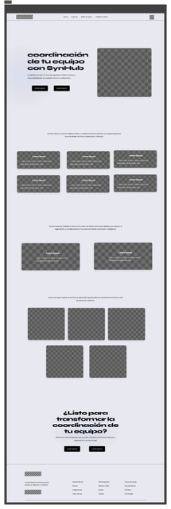](https://ibb.co/Kjc6CsQs)

### 6.3.2. Landing Page Mock-up

En esta sección se muestran los mock-ups de la landing page de Synhub,
donde se aplican los principios de diseño, la arquitectura de
información y el Design System para crear una experiencia visual
coherente y efectiva. Cada diseño refleja la identidad de la marca y
optimiza la conversión desde el primer impacto visual.

[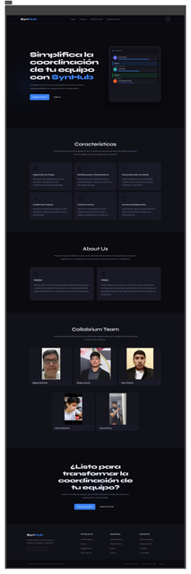](https://ibb.co/wZDTW1CF)

## 6.4. Applications UX/UI Design

### 6.4.1. Applications Wireframes

 Los wireframes de Synhub representan la estructura y disposición de las pantallas clave, mostrando la ubicación de los elementos de la interfaz de usuario y la navegación. Estos esquemas visuales proporcionan una guía clara para el diseño final, asegurando que la experiencia del usuario sea intuitiva y eficiente.

[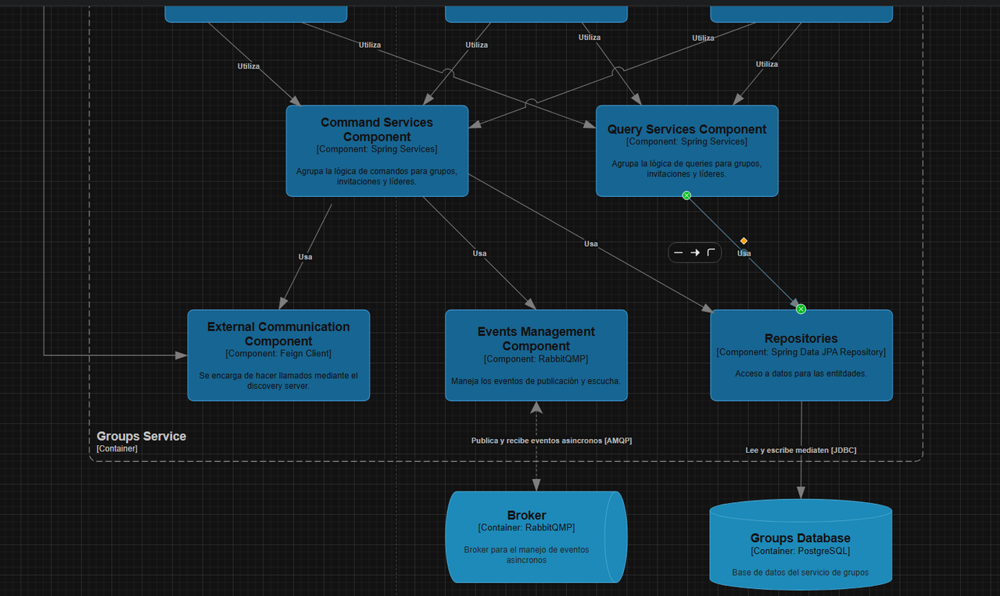](https://github.com/NRG-4/synhub-report/blob/main/images/chapter-5/wireframe-1.png)

[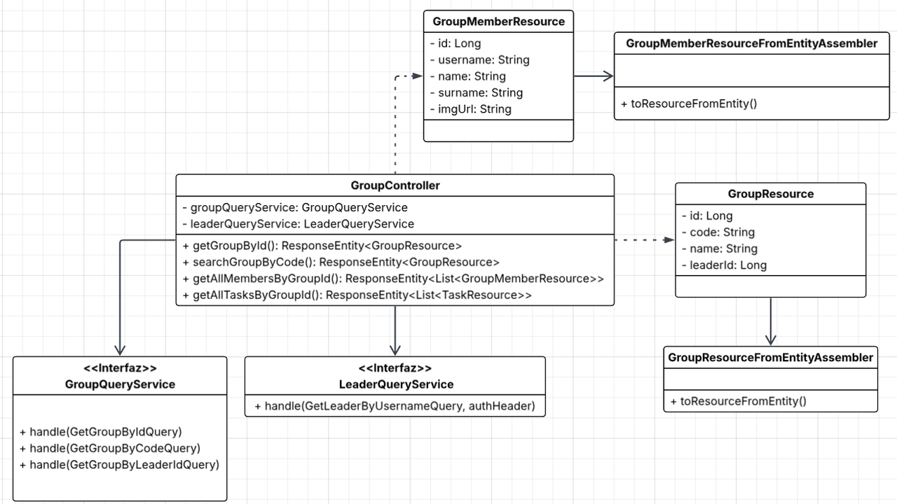](https://github.com/NRG-4/synhub-report/blob/main/images/chapter-5/wireframe-2.png)

[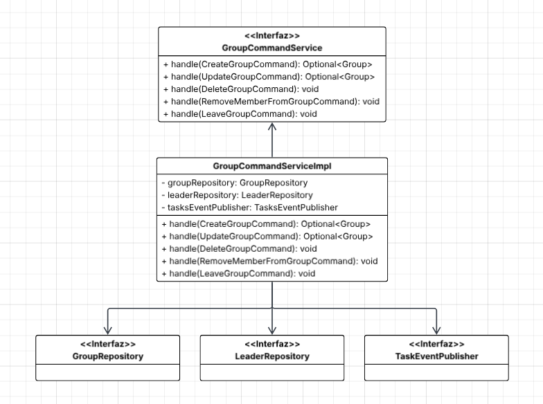](https://github.com/NRG-4/synhub-report/blob/main/images/chapter-5/wireframe-3.png)

[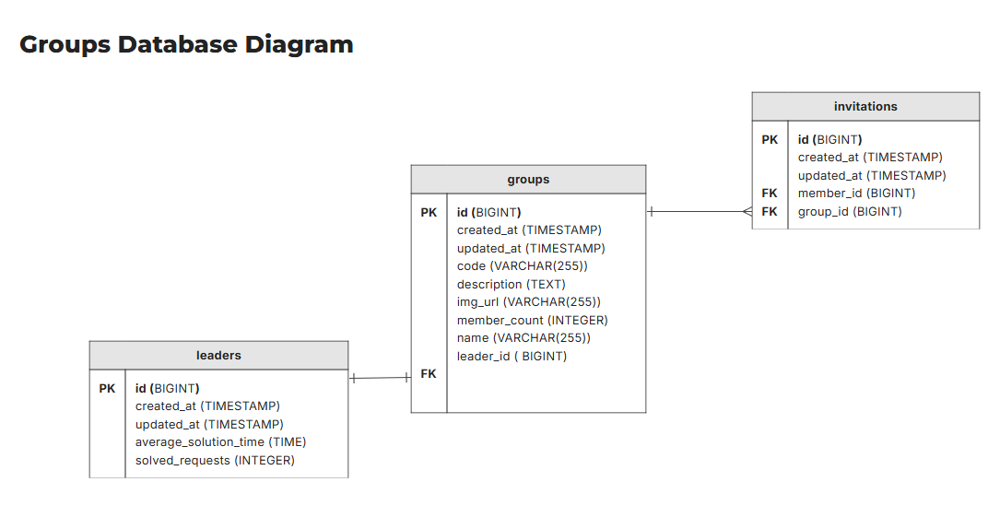](https://github.com/NRG-4/synhub-report/blob/main/images/chapter-5/wireframe-4.png)

[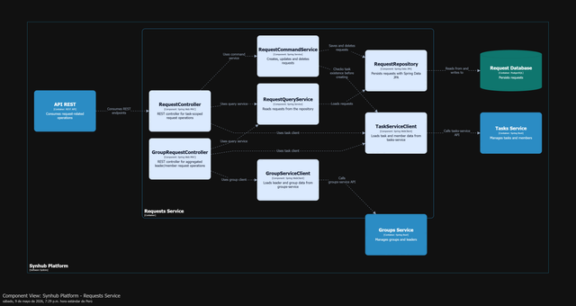](https://github.com/NRG-4/synhub-report/blob/main/images/chapter-5/wireframe-5.png)

[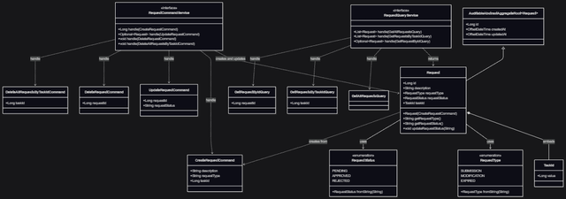](https://github.com/NRG-4/synhub-report/blob/main/images/chapter-5/wireframe-6.png)

[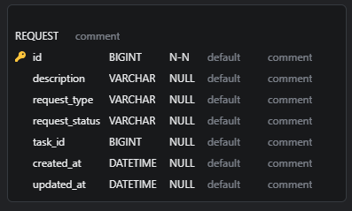](https://github.com/NRG-4/synhub-report/blob/main/images/chapter-5/wireframe-7.png)

[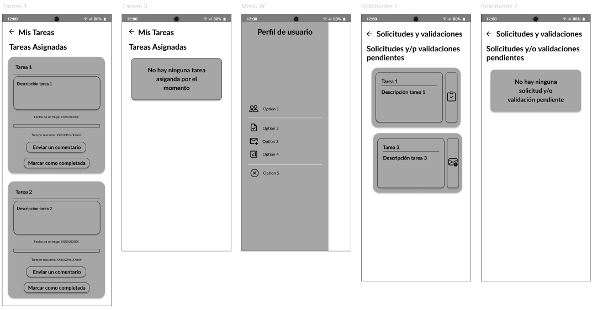](https://github.com/NRG-4/synhub-report/blob/main/images/chapter-5/wireframe-8.png)

[](https://github.com/NRG-4/synhub-report/blob/main/images/chapter-5/wireframe-9.png)

### 6.4.2. Applications Wireflow Diagrams

Los wireflow diagrams de Synhub representan la secuencia de interacciones y pantallas que los usuarios experimentarán al navegar por la aplicación.

**Creación de grupo:** Este wireflow corresponde a cuando un lider de equipo buscar crear un nuevo grupo.

[](https://github.com/NRG-4/synhub-report/blob/main/images/chapter-5/wireflow-1.png)

**Invitación de integrante:** Este wireflow corresponde a cuando un lider de equipo busca invitar a un nuevo integrante al grupo.

[](https://github.com/NRG-4/synhub-report/blob/main/images/chapter-5/wireflow-2-1.png)

[](https://github.com/NRG-4/synhub-report/blob/main/images/chapter-5/wireflow-2-2.png)

**Asignación de tarea:** Este wireflow corresponde a cuando un lider de equipo busca asignar una nueva tarea a un integrante del grupo.

[](https://github.com/NRG-4/synhub-report/blob/main/images/chapter-5/wireflow-3.png)

**Edición de tarea:** este wireflow corresponde a cuando un lider de equipo busca editar una tarea ya existente.

[](https://github.com/NRG-4/synhub-report/blob/main/images/chapter-5/wireflow-4.png)

**Eliminación de tarea:** Este wireflow corresponde a cuando un lider de equipo busca eliminar una tarea ya existente.

[](https://github.com/NRG-4/synhub-report/blob/main/images/chapter-5/wireflow-5.png)

**Ver la información de una tarea:** Este wireflow corresponde a cuando un lider de equipo busca ver la información de una tarea ya existente.

[](https://github.com/NRG-4/synhub-report/blob/main/images/chapter-5/wireflow-6.png)

**Revisar una solicitud o validación:** Este wireflow corresponde a cuando un lider de equipo busca revisar una solicitud o validación ya existente.

[](https://github.com/NRG-4/synhub-report/blob/main/images/chapter-5/wireflow-7.png)

**Unirse a un grupo:** Este wireflow corresponde a cuando un miembro busca unirse a un grupo.

[](https://github.com/NRG-4/synhub-report/blob/main/images/chapter-5/wireflow-8.png)

**Enviar un comentario a una tarea:** Este wireflow corresponde a cuando un miembro busca sus tareas asignadas y envia un comentario a la tarea respectiva.

[](https://github.com/NRG-4/synhub-report/blob/main/images/chapter-5/wireflow-9.png)

**Visualizar solicitud o validacion pendiente:** Este wireflow corresponde a cuando un miembro busca sus solicitudes o validaciones pendientes.

[](https://github.com/NRG-4/synhub-report/blob/main/images/chapter-5/wireflow-10.png)

**Ver metricas de desempeño:** Este wireflow corresponde a cuando un miembro busca visualizar su desempeño mediante una metrica.

[](https://github.com/NRG-4/synhub-report/blob/main/images/chapter-5/wireflow-11.png)

### 6.4.3. Applications Mock-ups

En esta sección se presentan y explican los Mock-ups de la aplicación. Se evidencia la aplicación de los principios y elementos de diseño, el diseño inclusivo, la arquitectura de información y el Design System establecido en el desarrollo de los wireframes. Cada mock-up ilustra cómo se implementan estos conceptos en la interfaz de usuario.

### 6.4.4. Applications User Flow Diagrams

**Creación de grupo:** Este userflow corresponde a cuando un lider de equipo buscar crear un nuevo grupo. Task flow: 🟥 Happy Path, 🟨 Error Path, 🟦 User Goal

**Invitación de integrante:** Este userflow corresponde a cuando un lider de equipo busca invitar a un nuevo integrante al grupo. Task flow: 🟥 Happy Path, 🟨 Error Path, 🟦 User Goal

**Asignación de tarea:** Este userflow corresponde a cuando un lider de equipo busca asignar una nueva tarea a un integrante del grupo. Task flow: 🟥 Happy Path, 🟨 Error Path, 🟦 User Goal

**Edición de tarea:** Este userflow corresponde a cuando un lider de equipo busca editar una tarea ya existente. Task flow: 🟥 Happy Path, 🟨 Error Path, 🟦 User Goal

**Eliminación de tarea:** Este userflow corresponde a cuando un lider de equipo busca eliminar una tarea ya existente. Task flow: 🟥 Happy Path, 🟨 Error Path, 🟦 User Goal

**Ver la información de una tarea:** Este userflow corresponde a cuando un lider de equipo busca ver la información de una tarea ya existente. Task flow: 🟥 Happy Path, 🟨 Error Path, 🟦 User Goal

**Revisar una solicitud o validación:** Este userflow corresponde a cuando un lider de equipo busca revisar una solicitud o validación ya existente. Task flow: 🟥 Happy Path, 🟨 Error Path, 🟦 User Goal

**Unirse a un grupo:** Este wireflow corresponde a cuando un miembro busca unirse a un grupo. Task flow: 🟥 Happy Path, 🟨 Error Path, 🟦 User Goal

**Enviar un comentario a una tarea:** Este wireflow corresponde a cuando un miembro busca sus tareas asignadas y envia un comentario a la tarea respectiva. Task flow: 🟥 Happy Path, 🟨 Error Path, 🟦 User Goal

**Visualizar solicitud o validacion pendiente:** Este wireflow corresponde a cuando un miembro busca sus solicitudes o validaciones pendientes. Task flow: 🟥 Happy Path, 🟨 Error Path, 🟦 User Goal

**Ver metricas de desempeño:** Este wireflow corresponde a cuando un miembro busca visualizar su desempeño mediante una metrica. Task flow: 🟥 Happy Path, 🟨 Error Path, 🟦 User Goal

## 6.5. Applications Prototyping

Para este apartado comenzamos con la creación de grupos, donde el líder establece un nuevo espacio de trabajo, seguido de la invitación de integrantes para conformar el equipo. Una vez formado el grupo, el líder puede asignar tareas específicas a cada miembro, con la capacidad de editar los detalles de estas tareas si es necesario o eliminarlas cuando ya no sean relevantes. Además, el líder puede consultar la información detallada de cualquier tarea para hacer seguimiento, y revisar solicitudes o validaciones presentadas por los miembros del equipo, lo que le permite aprobar, rechazar o dar retroalimentación sobre el trabajo realizado. Estos flujos cubren el ciclo completo de gestión, desde la organización del equipo hasta la supervisión y validación de las actividades asignadas.

# Capítulo VII: Product Implementation, Validation & Deployment

## 7.1. Software Configuration Management

En este ítem se definirán todas las reglas y procesos que hemos seguido en el proyecto al momento de crear y desplegar Synhub. El objetivo de estas reglas y procesos es garantizar la integridad y consistencia del software, desde el inicio hasta el despliegue y mantenimiento.

### 7.1.1. Software Development Environment Configuration

**Project Management**

Para la organización del proyecto requerimos de un sistema de de asignación de tareas, palataformas y puntos de reunión y un repositorio dónde trabajaremos en conjunto cada avance del proyecto. A continuación se menciona los nombres de los productos y el propósito de uso en el proyecto:

- Centro de organización de trabajo: Github
- Planificación de tareas: Trello
- Reuniones con el equipo: Discord
- Coordinación grupal: WhatsApp

**Requirements Management**

Utilizamos Trello para designar las tareas y actividades de cada integrante del grupo en caso de revisión o cambios.

| Herramienta | Descripción                                                                                        | Enlace             |
| ----------- | --------------------------------------------------------------------------------------------------- | ------------------ |
| Trello      | Para designar las tareas y actividades de cada integrante del grupo en caso de revisión o cambios. | https://trello.com |

**Product UX/UI Design**

Para el diseño de los wireframes y mockups, además de la realización del prototipo de la mobile application, utilizamos Figma.

| Herramienta | Descripción                                                                                    | Enlace                 |
| ----------- | ----------------------------------------------------------------------------------------------- | ---------------------- |
| Figma       | Para el diseño de los wireframe y mockups, además de la realización del prototipo de Web App | https://www.figma.com/ |

**Software Development**

Empleamos Android y Jetpack Compose para la creación de la mobile application, y Spring Boot para la creación de la API REST. Para el desarrollo de la landing page utilizamos NextJS, Shadcn y Tailwind CSS.

| Herramienta     | Descripción                                                                   | Enlace                                 |
| --------------- | ------------------------------------------------------------------------------ | -------------------------------------- |
| Android         | Lenguaje de programación utilizado para la creación de la mobile application | https://developer.android.com/         |
| Jetpack Compose | Framework utilizado para la creación de la mobile application                 | https://developer.android.com/compose  |
| Spring Boot     | Framework utilizado para la creación de la API REST                           | https://spring.io/projects/spring-boot |
| NextJS          | Framework utilizado para la creación de la landing page                       | https://nextjs.org/                    |
| Shadcn          | Framework utilizado para la creación de la landing page                       | https://ui.shadcn.com/                 |
| Tailwind CSS    | Framework utilizado para la creación de la landing page                       | https://tailwindcss.com/               |

**Software Deployment**

Se empleó los siguientes software para desplegar los servicios del proyecto. Base de datos: Neontech, API y Landing Page: Render, Mobile Application: Android Studio.

| Herramienta    | Descripción                                                     | Enlace                               |
| -------------- | ---------------------------------------------------------------- | ------------------------------------ |
| Neontech       | Base de datos utilizada para el proyecto                         | https://neon.tech/                   |
| Render         | API y Landing Page utilizada para el proyecto                    | https://render.com/                  |
| Android Studio | Herramienta utilizada para la creación de la mobile application | https://developer.android.com/studio |

**Software Documentation**

Para la documentación del software utilizamos Markdown, y para el trabajo colaborativo Github.

| Herramienta | Descripción                                                      | Enlace                          |
| ----------- | ----------------------------------------------------------------- | ------------------------------- |
| Markdown    | Lenguaje de marcado utilizado para la documentación del proyecto | https://www.markdownguide.org/  |
| Github      | Para gestionar la documentación del proyecto                     | https://github.com/Collabrium-Software-Emergentes/Report |

### 7.1.2. Source Code Management

Para la gestión del código fuente, utilizamos los siguientes repositorios:

| Producto           | Repositorio       | Enlace                                     |
| ------------------ | ----------------- | ------------------------------------------ |
| Backend            | Synhub-Microservices-Old | https://github.com/Collabrium-Software-Emergentes/Synhub-Microservices-Old    |
| Landing Page       | Landing-Page    | https://github.com/Collabrium-Software-Emergentes/Landing-Page    |
| Api Gateway       | Api-Gateway    | https://github.com/Collabrium-Software-Emergentes/Api-Gateway    |
| Discovery Server       | Discovery-Server    | https://github.com/Collabrium-Software-Emergentes/Discovery-Server    |
| Iam     | Iam-Microservice    | https://github.com/Collabrium-Software-Emergentes/Iam-Microservice    |
| Groups       | Groups-Microservice    | https://github.com/Collabrium-Software-Emergentes/Groups-Microservice    |
| Tasks       | Tasks-Microservice    | https://github.com/Collabrium-Software-Emergentes/Tasks-Microservice    |
| Requests      | Requests-Microservice    | https://github.com/Collabrium-Software-Emergentes/Requests-Microservice    |
| Metrics     | Metrics-Microservice    | https://github.com/Collabrium-Software-Emergentes/Metrics-Microservice    |
| Members Frontend     | Synhub-for-Members    | https://github.com/Collabrium-Software-Emergentes/Synhub-for-Members    |
| Leaders Frontend     | Synhub-for-Leaders   | https://github.com/Collabrium-Software-Emergentes/Synhub-for-Leaders   |

**Flujo de trabajo GitFlow**

Usaremos el flujo de trabajo planteado por Vincent Driessen en "A successful Git branching model" con los siguientes parámetros:

- Una rama de producción.
- Una rama de pruebas.
- Una rama en la que se solucionen los bugs rapidamente y vuelvan a producción.
- Ramas de features a implementar.
- Cada cambio en producción debe establecerse como una nueva versión.
- Para este proyecto en concreto consideramos que los cambios en la rama de producción y de pruebas deben tener autorización de un compa­ñero de equipo.

Teniendo en cuenta la información anterior nos inclinamos por este tipo de organización en los branches:

- **Main branch:** Esta rama esta destinada a la producción de la aplicación, cada cambio deberá tener autorización de un compañero de equipo para evitar cambios sin verificar.
- **Hotfix branch:** En esta rama se incluirán todas las versiones que poseen errores identificados y que con cada arreglo de este se despliegue otra vez a Main Branch además de implementarla en lo que será Develop Branch.
- **Develop branch:** Esta rama está destinada a las constantes implementaciones en caliente de los features,
- **Features branch:** Cada feature poseerá su respectiva rama, una vez que se encuentre correctamente implementada será fusionada con Develop branch.

Con cada deployment de la aplicación debe establecerse como una nueva versión. Nomenclatura de numeración de las versiones:

- **Major changes:** Cuando el código o versión nueva del proyecto a implementar presenta cambios significativos con la versión anterior, estos cambios llegan a ser incompatibles con la versión anterior. Esto se evidenciará en el numero de la versión ej: versión 1.0.0 -> versión 2.0.0.
- **Minor changes:** Cuando el código o versión nueva del proyecto a implementar presenta cambios con respecto a alguna característica, ya sea añadir o modificar, de la versión anterior; estos cambios no llegan a ser incompatibles con la versión anterior. Esto se evidenciará en el numero de la versión ej: versión 1.1.0 -> versión 1.2.0.
- **Patch:** Cuando se solucionan bugs menores. Esto se evidenciará en el numero de la versión ej: versión 1.1.3 -> versión 1.1.4.

Sufijos asignados a las versiones:

- **alpha:** versión no estable con características básicas o no funcionales, ejemplo : versión 1.0.0 -alpha.
- **beta:** versión no apta para la publicación, aún así ya presenta características funcionales en el estado base, ejemplo versión 1.0.0 –beta.
- **rc:** versión apta para la publicación y uso de los usuarios, es candidata para publicar, ejemplo versión 1.0.0 -rc.

### 7.1.3. Source Code Style Guide & Conventions

Usaremos buenas prácticas en cuanto al código de manera que sea coherente y sostenible.

**Android (Kotlin/Java)**

- **Nomenclatura:**
  - Clases: PascalCase.
  - Funciones y variables: camelCase.
  - Constantes: UPPER_SNAKE_CASE.
- **Estructura:**
  - Separar lógica de UI (ViewModel, UseCase).

**Jetpack Compose**

- **Componenetes:**
  - Nombres de funciones PascalCase (ej: ButtonSubmit()).
  - Estado (remember, mutableStateOf) manejado en ViewModel.
- **Recomposición:**
  - Evitar cálculos pesados dentro de @Composable.
  - Usar Modifier para estilos reutilizables.

**Spring Boot**

- **Estructura:**
  - Paquetes por capa (controller, service, repository, model).
  - Interfaces para servicios (UserService → UserServiceImpl).
- **Convenciones:**
  - Clases en PascalCase.
  - Métodos en camelCase (getUserById()).

**Next.js**

- **Rutas:**
  - Usar snake_case o kebab-case en nombres de archivos (/pages/user/profile.js).
  - API routes en /pages/api/.
- **Estilos:**
  - CSS Modules (styles.module.css).
  - Evitar estilos globales innecesarios.

**Shadcn/ui**

- **Componentes:**
  - Extender estilos base, no sobrescribir CSS nativo.
  - Usar clsx o tailwind-merge para combinar clases.
- **Theming:**
  - Variables CSS en :root para personalización.
  - Evitar estilos inline.

**Tailwind CSS**

- **Clases:**
  - Ordenar clases: Layout > Flex/Grid > Spacing > Typography > Colors > Effects.
  - Evitar @apply en CSS (usar clases directamente en HTML).
- **Responsive:**
  - Usar prefixes (md:, lg:).

**General:**

- **Código:**
  - Comentarios en inglés.
  - Commits semánticos (feat:, fix:, docs:).
- **Performance:**
  - Lazy loading (imágenes, componentes).

### 7.1.4. Software Deployment Configuration

En esta sección se detallan las consideraciones y pasos necesarios para el despliegue de los productos de Synhub.

**Landing Page**

**Consideraciones antes del despliegue:**

- Es recomendable ejecutar npm run build localmente para asegurarse de que la aplicación web no contenga errores, ya sea por paquetes externos o problemas en la declaración de los componentes.

**Requerimientos para realizar del despliegue:**

- Repositorio de desarrollo de la landing page en github
- Repositorio de github con estado de visualización público

**Pasos realizados para desplegar nuestra Landing Page:**

1. Ingresar al sitio web de GitHub.
2. Iniciar sesión en la cuenta de GitHub.
3. Ir al repositorio donde se encuentra el código de la Landing Page.
4. Hacer clic en la pestaña **Settings** (Configuración).
5. En el menú lateral izquierdo, seleccionar **Pages** (sección "Code and automation").
6. En la sección **Branch**, elegir la rama que contiene los archivos a desplegar (ej: `main`).
7. Seleccionar la carpeta raíz (`/ (root)`) o la carpeta `/docs` (si los archivos estáticos están allí).
8. Hacer clic en **Save**.
9. Esperar unos minutos hasta que GitHub genere la URL pública (generalmente `https://<tu-usuario>.github.io/<nombre-repositorio>/`).
10. Acceder a la URL pública generada para verificar que la Landing Page funcione correctamente.

**Mobile Application**

**Consideraciones antes del despliegue:**

- Se necesita tener el API desplegado en un servidor al que se pueda acceder de manera externa.

**Requerimientos para realizar del despliegue:**

- Repositorio de desarrollo del API en github
- Dispositivo móvil Android en el que se pueda instalar la aplicación

**Pasos realizados para desplegar nuestra Mobile Application:**

1. Activar el modo desarrollador en el dispositivo móvil.
2. Activar la depuración por USB en el dispositivo móvil.
3. Conectar el dispositivo móvil a la computadora.
4. Abrir Android Studio y seleccionar el proyecto de la aplicación.
5. Seleccionar el dispositivo móvil en la lista de dispositivos disponibles.
6. Hacer clic en el botón de "Run" (Ejecutar) en Android Studio.
7. Esperar a que la aplicación se compile y se instale en el dispositivo móvil.
8. Abrir la aplicación en el dispositivo móvil y verificar que funcione correctamente.

**Backend**

**Consideraciones antes del despliegue:**

- Se necesita tener la base de datos desplegada en un servidor al que se pueda acceder de manera externa.

**Requerimientos para realizar del despliegue:**

- Repositorio de desarrollo del backend en github
- Repositorio de github con estado de visualización público

**Pasos realizados para desplegar nuestra API:**

1. Extraer el pipeline de la base de datos de Neontech y cargarla al código del API.
2. Crear un archivo Dockerfile para el despliegue del API.
3. Crear un proyecto en Render de tipo Web Service.
4. Importar el repositorio del API al proyecto de Render.
5. Desplegar el API en Render.

## 7.2. Solution Implementation

### 7.2.1 Sprint 1

#### 7.2.1.1. Sprint Planning 1

<table>
  <tr>
    <td colspan="1"><strong>Sprint #</strong></td>
    <td colspan="1">1</td>
  </tr>
  <tr>
    <td colspan="2"><strong>Sprint Planning Background</strong></td>
  </tr>
  <tr>
    <td colspan="1"><strong>Date</strong></td>
    <td colspan="1">2026-02-06</td>
  </tr>
  <tr>
    <td colspan="1"><strong>Time</strong></td>
    <td colspan="1">12:00 PM</td>
  </tr>
  <tr>
    <td colspan="1"><strong>Location</strong></td>
    <td colspan="1">Discord</td>
  </tr>
  <tr>
    <td colspan="1"><strong>Prepared by</strong></td>
    <td colspan="1">Miguel Gomez</td>
  </tr>
  <tr>
    <td colspan="1"><strong>Attendees (to planning meeting)</strong></td>
    <td colspan="1">Diego Acuña, Miguel Gomez, Max Paitan, Jhon Guerrero, Josue Paiva</td>
  </tr>
  <tr>
    <td colspan="1"><strong>Sprint n – 1 Review Summary</strong></td>
    <td colspan="1">Se realizó la landing page implementada con next.js, el front del mobile en android y el backend en spring boot JAVA</td>
  </tr>
  <tr>
    <td colspan="1"><strong>Sprint n – 1 Retrospective Summary</strong></td>
    <td colspan="1">Mejorar la comunicacion de artefacos relacionados a mas de un miembro.</td>
  </tr>
  <tr>
    <td colspan="2"><strong>Sprint Goal & User Stories</strong></td>
  </tr>
  <tr>
    <td colspan="1"><strong>Sprint 1 Goal</strong></td>
    <td colspan="1">Nuestro enfoque está en consolidar los elementos fundamentales de SynHub mediante la corrección de artefactos anteriores, el diseño de la aplicación, y la entrega de los primeros prototipos funcionales de la landing page, el backend y la aplicación móvil.  Creemos que esto proporcionará claridad, alineamiento técnico y usabilidad inicial para los primeros usuarios, permitiendo que tanto los coordinadores familiares como los miembros del hogar comiencen a interactuar con una primera versión significativa de la plataforma.  Esto se confirmará cuando la landing page esté en línea, la app móvil muestre los primeros flujos de interfaz, el backend proporcione endpoints básicos de la API, y las correcciones a los artefactos previos estén documentadas y validadas por el equipo.</td>
  </tr>
  <tr>
    <td colspan="1"><strong>Sprint 1 Velocity</strong></td>
    <td colspan="1">Para este sprint nuestro equipo puende aceptar hasta 240 story points</td>
  </tr>
  <tr>
    <td colspan="1"><strong>Sum of Story Points</strong></td>
    <td colspan="1">La suma de story point atendidos es de 210+ story point.</td>
  </tr>
</table>

#### 7.2.1.2. Sprint Backlog 1

<table>
  <tr>
    <td colspan="1"><strong>Sprint #</strong></td>
    <td colspan="7"><strong>Sprint 1</strong></td>
  </tr>
  <tr>
    <td colspan="2"><strong>User Story</strong></td>
    <td colspan="6"><strong>Work-Item/task</strong></td>
  </tr>
  <tr>
    <td colspan="1"><strong>Id</strong></td>
    <td colspan="1"><strong>Title</strong></td>
    <td colspan="1"><strong>Id</strong></td>
    <td colspan="1"><strong>Title</strong></td>
    <td colspan="1"><strong>Description</strong></td>
    <td colspan="1"><strong>Estimation(Hrs)</strong></td>
    <td colspan="1"><strong>Assigned To</strong></td>
    <td colspan="1"><strong>Status</strong></td>
  </tr>
  <!-- US-001 -->
  <tr>
    <td colspan="1">US-001</td>
    <td colspan="1">Creación de grupo</td>
    <td colspan="1">T-001</td>
    <td colspan="1">Interfaz visual de creación</td>
    <td colspan="1">Generar un código para el grupo.</td>
    <td colspan="1">1</td>
    <td colspan="1">Miguel Gomez</td>
    <td colspan="1">Done</td>
  </tr>
   <!-- US-002 -->
  <tr>
    <td colspan="1">US-002</td>
    <td colspan="1">Envío de invitaciones</td>
    <td colspan="1">T-002</td>
    <td colspan="1">Registrar código de grupo</td>
    <td colspan="1">Al crear un grupo, se debe crear un código para ser utilizado en la unión de miembros al grupo.</td>
    <td colspan="1">0.5</td>
    <td colspan="1">Miguel Gomez</td>
    <td colspan="1">Done</td>
  </tr>
  <!-- US-003  -->
  <tr>
    <td colspan="1" rowspan="2">US-003</td>
    <td colspan="1" rowspan="2">Eliminación de grupo</td>
    <td colspan="1">T-003</td>
    <td colspan="1">Eliminar datos de grupo.</td>
    <td colspan="1">Antes de eliminar grupo, debe eliminar la información vinculada al grupo.</td>
    <td colspan="1">1</td>
    <td colspan="1">Miguel Gomez</td>
    <td colspan="1">Done</td>
  </tr>
  <tr>
    <td colspan="1">T-004</td>
    <td colspan="1">Eliminar grupo.</td>
    <td colspan="1">Al no tener información, permitir la eliminación de grupo.</td>
    <td colspan="1">0.5</td>
    <td colspan="1">Miguel Gomez</td>
    <td colspan="1">Done</td>
  </tr>
  <!-- TS-001: Gestión de grupos (CRUD) -->
  <tr>
    <td colspan="1" rowspan="6">TS-001</td>
    <td colspan="1" rowspan="6">Gestión de grupos (CRUD)</td>
    <td colspan="1">T-005</td>
    <td colspan="1">Crear endpoint POST CreateGroup</td>
    <td colspan="1">POST /leader/group - Crear un nuevo grupo como líder</td>
    <td colspan="1">1.5</td>
    <td colspan="1">Miguel Gomez</td>
    <td colspan="1">Done</td>
  </tr>
  <tr>
    <td colspan="1">T-006</td>
    <td colspan="1">Crear endpoint PUT UpdateGroup</td>
    <td colspan="1">PUT /leader/group - Actualizar grupo existente</td>
    <td colspan="1">1.5</td>
    <td colspan="1">Miguel Gomez</td>
    <td colspan="1">Done</td>
  </tr>
  <tr>
    <td colspan="1">T-007</td>
    <td colspan="1">Crear endpoint GET GetGroupById</td>
    <td colspan="1">GET /groups/{groupId} - Obtener grupo por ID</td>
    <td colspan="1">1</td>
    <td colspan="1">Miguel Gomez</td>
    <td colspan="1">Done</td>
  </tr>
  <tr>
    <td colspan="1">T-008</td>
    <td colspan="1">Crear endpoint GET GetGroupByCode</td>
    <td colspan="1">GET /groups/search?code={code} - Buscar grupo por código</td>
    <td colspan="1">1</td>
    <td colspan="1">Miguel Gomez</td>
    <td colspan="1">Done</td>
  </tr>
  <tr>
    <td colspan="1">T-009</td>
    <td colspan="1">Crear endpoint DELETE DeleteGroup</td>
    <td colspan="1">DELETE /leader/group - Eliminar grupo</td>
    <td colspan="1">1</td>
    <td colspan="1">Miguel Gomez</td>
    <td colspan="1">Done</td>
  </tr>
  <tr>
    <td colspan="1">T-010</td>
    <td colspan="1">Implementar validaciones de grupo</td>
    <td colspan="1">Validar campos obligatorios, formato de datos y reglas de negocio para grupos</td>
    <td colspan="1">2</td>
    <td colspan="1">Miguel Gomez</td>
    <td colspan="1">Done</td>
  </tr>
  <!-- TS-002: Gestión de miembros en grupos -->
  <tr>
    <td colspan="1" rowspan="5">TS-002</td>
    <td colspan="1" rowspan="5">Gestión de miembros en grupos</td>
    <td colspan="1">T-011</td>
    <td colspan="1">Crear endpoint GET GetMembersOfMyGroup</td>
    <td colspan="1">GET /groups/members - Listar miembros del grupo autenticado</td>
    <td colspan="1">1</td>
    <td colspan="1">Miguel Gomez</td>
    <td colspan="1">Done</td>
  </tr>
  <tr>
    <td colspan="1">T-012</td>
    <td colspan="1">Crear endpoint DELETE RemoveMemberFromGroup</td>
    <td colspan="1">DELETE /leader/group/members/{memberId} - Eliminar miembro del grupo</td>
    <td colspan="1">1.5</td>
    <td colspan="1">Miguel Gomez</td>
    <td colspan="1">Done</td>
  </tr>
  <tr>
    <td colspan="1">T-013</td>
    <td colspan="1">Crear endpoint GET GetGroupByLeaderId</td>
    <td colspan="1">GET /groups?leaderId={leaderId} - Obtener grupos de un líder</td>
    <td colspan="1">1</td>
    <td colspan="1">Miguel Gomez</td>
    <td colspan="1">Done</td>
  </tr>
  <tr>
    <td colspan="1">T-014</td>
    <td colspan="1">Validar existencia de miembros</td>
    <td colspan="1">Verificar que el usuario exista antes de operaciones con miembros</td>
    <td colspan="1">1</td>
    <td colspan="1">Miguel Gomez</td>
    <td colspan="1">Done</td>
  </tr>
  <tr>
    <td colspan="1">T-015</td>
    <td colspan="1">Validar permisos de líder</td>
    <td colspan="1">Validar que solo el líder del grupo pueda realizar acciones de eliminación de miembros</td>
    <td colspan="1">1</td>
    <td colspan="1">Miguel Gomez</td>
    <td colspan="1">Done</td>
  </tr>
   <!-- TS-003: Gestión de solicitudes de unión -->
  <tr>
    <td colspan="1" rowspan="5">TS-003</td>
    <td colspan="1" rowspan="5">Gestión de solicitudes de unión</td>
    <td colspan="1">T-016</td>
    <td colspan="1">Crear endpoint POST CreateInvitation</td>
    <td colspan="1">POST /invitations/groups/{groupId} - Crear invitación para unirse a grupo</td>
    <td colspan="1">1.5</td>
    <td colspan="1">Miguel Gomez</td>
    <td colspan="1">Done</td>
  </tr>
  <tr>
    <td colspan="1">T-017</td>
    <td colspan="1">Crear endpoint GET GetAllInvitationsOfMyGroup</td>
    <td colspan="1">GET /invitations/group - Listar invitaciones del grupo autenticado</td>
    <td colspan="1">1</td>
    <td colspan="1">Miguel Gomez</td>
    <td colspan="1">Done</td>
  </tr>
  <tr>
    <td colspan="1">T-018</td>
    <td colspan="1">Crear endpoint GET GetMyInvitation</td>
    <td colspan="1">GET /invitations/member - Obtener invitaciones del miembro autenticado</td>
    <td colspan="1">1</td>
    <td colspan="1">Miguel Gomez</td>
    <td colspan="1">Done</td>
  </tr>
  <tr>
    <td colspan="1">T-019</td>
    <td colspan="1">Validar invitaciones duplicadas</td>
    <td colspan="1">Implementar lógica para evitar invitaciones duplicadas a un mismo grupo</td>
    <td colspan="1">1.5</td>
    <td colspan="1">Miguel Gomez</td>
    <td colspan="1">Done</td>
  </tr>
  <tr>
    <td colspan="1">T-020</td>
    <td colspan="1">Validar existencia de grupo y usuario</td>
    <td colspan="1">Verificar que el grupo y usuario existan al crear invitación</td>
    <td colspan="1">1</td>
    <td colspan="1">Miguel Gomez</td>
    <td colspan="1">Done</td>
  </tr>
  <!-- TS-004: Procesamiento de solicitudes -->
  <tr>
    <td colspan="1" rowspan="5">TS-004</td>
    <td colspan="1" rowspan="5">Procesamiento de solicitudes</td>
    <td colspan="1">T-021</td>
    <td colspan="1">Crear endpoint PATCH ProcessInvitationByLeaderAuthenticated</td>
    <td colspan="1">PATCH /group/invitations/{invitationId}?accept={boolean} - Procesar invitación por líder</td>
    <td colspan="1">1.5</td>
    <td colspan="1">Miguel Gomez</td>
    <td colspan="1">Done</td>
  </tr>
  <tr>
    <td colspan="1">T-022</td>
    <td colspan="1">Crear endpoint DELETE DeleteInvitationByMemberAuthenticated</td>
    <td colspan="1">DELETE /invitations/member - Eliminar invitación del miembro autenticado</td>
    <td colspan="1">1</td>
    <td colspan="1">Miguel Gomez</td>
    <td colspan="1">Done</td>
  </tr>
  <tr>
    <td colspan="1">T-023</td>
    <td colspan="1">Validar permisos de procesamiento</td>
    <td colspan="1">Asegurar que solo el líder pueda procesar invitaciones y cambiar su estado</td>
    <td colspan="1">1.5</td>
    <td colspan="1">Miguel Gomez</td>
    <td colspan="1">Done</td>
  </tr>
  <tr>
    <td colspan="1">T-024</td>
    <td colspan="1">Agregar miembro al grupo tras aceptación</td>
    <td colspan="1">Al aceptar una invitación, agregar automáticamente el miembro al grupo</td>
    <td colspan="1">2</td>
    <td colspan="1">Miguel Gomez</td>
    <td colspan="1">Done</td>
  </tr>
  <tr>
    <td colspan="1">T-025</td>
    <td colspan="1">Notificar cambio de estado</td>
    <td colspan="1">Implementar notificaciones cuando se acepte/rechace una invitación</td>
    <td colspan="1">2</td>
    <td colspan="1">Miguel Gomez</td>
    <td colspan="1">Pending</td>
  </tr>
   <!-- TS-020: Microservice Groups -->
  <tr>
    <td colspan="1" rowspan="6">TS-020</td>
    <td colspan="1" rowspan="6">Microservice Groups</td>
    <td colspan="1">T-026</td>
    <td colspan="1">Configurar microservicio Groups</td>
    <td colspan="1">Configurar estructura base del microservicio Groups con Spring Boot</td>
    <td colspan="1">2</td>
    <td colspan="1">Miguel Gomez</td>
    <td colspan="1">Done</td>
  </tr>
  <tr>
    <td colspan="1">T-027</td>
    <td colspan="1">Implementar endpoints de líder</td>
    <td colspan="1">GET GetLeaderById y GET GetLeaderDetailsByAuthentication</td>
    <td colspan="1">1.5</td>
    <td colspan="1">Miguel Gomez</td>
    <td colspan="1">Done</td>
  </tr>
  <tr>
    <td colspan="1">T-028</td>
    <td colspan="1">Implementar endpoints de grupo</td>
    <td colspan="1">GET GetGroupByAuthentication y GET GetTasksOfMyGroup</td>
    <td colspan="1">1.5</td>
    <td colspan="1">Miguel Gomez</td>
    <td colspan="1">Done</td>
  </tr>
  <tr>
    <td colspan="1">T-029</td>
    <td colspan="1">Configurar base de datos</td>
    <td colspan="1">Configurar conexión y modelos de base de datos para el microservicio</td>
    <td colspan="1">1.5</td>
    <td colspan="1">Miguel Gomez</td>
    <td colspan="1">Done</td>
  </tr>
  <tr>
    <td colspan="1">T-030</td>
    <td colspan="1">Implementar manejo de errores</td>
    <td colspan="1">Implementar respuestas de error consistentes en el microservicio</td>
    <td colspan="1">1</td>
    <td colspan="1">Miguel Gomez</td>
    <td colspan="1">Done</td>
  </tr>
  <tr>
    <td colspan="1">T-031</td>
    <td colspan="1">Documentación Swagger</td>
    <td colspan="1">Documentar API del microservicio con Swagger/OpenAPI</td>
    <td colspan="1">1</td>
    <td colspan="1">Miguel Gomez</td>
    <td colspan="1">Done</td>
  </tr>
    <tr>
  <td colspan="1" rowspan="10">TS-019</td>
  <td colspan="1" rowspan="10">Microservice Requests</td>
  <td colspan="1">T-032</td>
  <td colspan="1">Crear updateRequestStatus</td>
  <td colspan="1">Crear endpoint de requests PUT /api/v1/requests/{requestId}/status</td>
  <td colspan="1">1</td>
  <td colspan="1">Max Paitan</td>
  <td colspan="1">Done</td>
  </tr>
  <tr>
    <td colspan="1">T-033</td>
    <td colspan="1">Crear createRequest</td>
    <td colspan="1">Crear endpoint de requests POST /api/v1/requests</td>
    <td colspan="1">1</td>
    <td colspan="1">Max Paitan</td>
    <td colspan="1">Done</td>
  </tr>
  <tr>
    <td colspan="1">T-034</td>
    <td colspan="1">Crear getRequestById</td>
    <td colspan="1">Crear endpoint de requests GET /api/v1/requests/{requestId}</td>
    <td colspan="1">0.5</td>
    <td colspan="1">Max Paitan</td>
    <td colspan="1">Done</td>
  </tr>
  <tr>
    <td colspan="1">T-035</td>
    <td colspan="1">Crear deleteRequest</td>
    <td colspan="1">Crear endpoint de requests DELETE /api/v1/group/{groupId}/requests/{requestId}</td>
    <td colspan="1">1</td>
    <td colspan="1">Max Paitan</td>
    <td colspan="1">Done</td>
  </tr>
  <tr>
    <td colspan="1">T-036</td>
    <td colspan="1">Crear acceptRequest</td>
    <td colspan="1">Crear endpoint de requests PATCH /api/v1/group/{groupId}/requests/{requestId}/{status}</td>
    <td colspan="1">1</td>
    <td colspan="1">Max Paitan</td>
    <td colspan="1">Done</td>
  </tr>
  <tr>
    <td colspan="1">T-037</td>
    <td colspan="1">Crear deleteAcceptedRequest</td>
    <td colspan="1">Crear endpoint de requests DELETE /api/v1/group/{groupId}/requests/{requestId}</td>
    <td colspan="1">0.5</td>
    <td colspan="1">Max Paitan</td>
    <td colspan="1">Done</td>
  </tr>
  <tr>
    <td colspan="1">T-038</td>
    <td colspan="1">Crear deleteCompletedTaskRequest</td>
    <td colspan="1">Crear endpoint de requests DELETE /api/v1/group/{groupId}/requests/{requestId}</td>
    <td colspan="1">0.5</td>
    <td colspan="1">Max Paitan</td>
    <td colspan="1">Done</td>
  </tr>
  <tr>
    <td colspan="1">T-039</td>
    <td colspan="1">Crear deleteRejectedTaskRequest</td>
    <td colspan="1">Crear endpoint de requests DELETE /api/v1/group/{groupId}/requests/{requestId}</td>
    <td colspan="1">0.5</td>
    <td colspan="1">Max Paitan</td>
    <td colspan="1">Done</td>
  </tr>
  <tr>
    <td colspan="1">T-040</td>
    <td colspan="1">Crear deleteExpiredTaskRequest</td>
    <td colspan="1">Crear endpoint de requests DELETE /api/v1/group/{groupId}/requests/{requestId}</td>
    <td colspan="1">0.5</td>
    <td colspan="1">Max Paitan</td>
    <td colspan="1">Done</td>
  </tr>
  <tr>
    <td colspan="1">T-041</td>
    <td colspan="1">Implementar RequestService</td>
    <td colspan="1">Implementar servicio para gestionar solicitudes de tareas completadas o cambios.</td>
    <td colspan="1">2</td>
    <td colspan="1">Max Paitan</td>
    <td colspan="1">Done</td>
  </tr>
  <!-- TS016 — Microservice IAM -->
  <tr>
    <td colspan="1" rowspan="4">TS-016</td>
    <td colspan="1" rowspan="4">Microservice IAM</td>
    <td colspan="1">T-042</td>
    <td colspan="1">Configurar microservicio IAM</td>
    <td colspan="1">Configurar estructura base del microservicio IAM con Spring Boot</td>
    <td colspan="1">1</td>
    <td colspan="1">Diego Acuña</td>
    <td colspan="1">Done</td>
  </tr>
  <tr>
    <td colspan="1">T-043</td>
    <td colspan="1">Configurar base de datos</td>
    <td colspan="1">Configurar conexión y modelos de BD para el microservicio</td>
    <td colspan="1">1</td>
    <td colspan="1">Diego Acuña</td>
    <td colspan="1">Done</td>
  </tr>
  <tr>
    <td colspan="1">T-044</td>
    <td colspan="1">Implementar manejo de errores</td>
    <td colspan="1">Implementar respuestas de error consistentes en el microservicio</td>
    <td colspan="1">1</td>
    <td colspan="1">Diego Acuña</td>
    <td colspan="1">Done</td>
  </tr>
  <tr>
    <td colspan="1">T-045</td>
    <td colspan="1">Documentación Swagger</td>
    <td colspan="1">Documentar API del microservicio con Swagger/OpenAPI</td>
    <td colspan="1">1</td>
    <td colspan="1">Diego Acuña</td>
    <td colspan="1">Done</td>
  </tr>
  <!-- TS013 — Autenticación (Login) -->
  <tr>
    <td colspan="1" rowspan="3">TS-013</td>
    <td colspan="1" rowspan="3">Autenticación (Login)</td>
    <td colspan="1">T-046</td>
    <td colspan="1">Crear endpoint POST Sign-Up</td>
    <td colspan="1">POST /Iam/ApiVersion/authentication/sign-up — Registro de nuevo usuario con roles</td>
    <td colspan="1">1.5</td>
    <td colspan="1">Diego Acuña</td>
    <td colspan="1">Done</td>
  </tr>
  <tr>
    <td colspan="1">T-047</td>
    <td colspan="1">Crear endpoint POST Sign-In</td>
    <td colspan="1">POST /Iam/ApiVersion/authentication/sign-in — Inicio de sesión con JWT</td>
    <td colspan="1">1.5</td>
    <td colspan="1">Diego Acuña</td>
    <td colspan="1">Done</td>
  </tr>
  <tr>
    <td colspan="1">T-048</td>
    <td colspan="1">Implementar JWT con roles</td>
    <td colspan="1">Generar token JWT que incluya roles y tiempo de expiración</td>
    <td colspan="1">2</td>
    <td colspan="1">Diego Acuña</td>
    <td colspan="1">Done</td>
  </tr>
  <!-- TS014 — Gestión de usuarios -->
  <tr>
    <td colspan="1" rowspan="4">TS-014</td>
    <td colspan="1" rowspan="4">Gestión de usuarios</td>
    <td colspan="1">T-049</td>
    <td colspan="1">Crear endpoint GET GetRoles</td>
    <td colspan="1">GET /Iam/ApiVersion/roles — Listar roles disponibles del sistema</td>
    <td colspan="1">0.5</td>
    <td colspan="1">Diego Acuña</td>
    <td colspan="1">Done</td>
  </tr>
  <tr>
    <td colspan="1">T-050</td>
    <td colspan="1">Crear endpoint GET GetUserByMemberId</td>
    <td colspan="1">GET /Iam/ApiVersion/users?memberId={memberId} — Buscar usuario por memberId</td>
    <td colspan="1">1</td>
    <td colspan="1">Diego Acuña</td>
    <td colspan="1">Done</td>
  </tr>
  <tr>
    <td colspan="1">T-051</td>
    <td colspan="1">Crear endpoint GET GetUserById</td>
    <td colspan="1">GET /Iam/ApiVersion/users/{userId} — Obtener usuario por ID</td>
    <td colspan="1">1</td>
    <td colspan="1">Diego Acuña</td>
    <td colspan="1">Done</td>
  </tr>
  <tr>
    <td colspan="1">T-052</td>
    <td colspan="1">Crear endpoint GET GetUserOnlyById</td>
    <td colspan="1">GET /Iam/ApiVersion/users/{userId}/domain-profile — Perfil de dominio del usuario</td>
    <td colspan="1">1</td>
    <td colspan="1">Diego Acuña</td>
    <td colspan="1">Done</td>
  </tr>
  <!-- TS021 — Microservice Analytics y Reports -->
  <tr>
    <td colspan="1" rowspan="3">TS-021</td>
    <td colspan="1" rowspan="3">Microservice Analytics</td>
    <td colspan="1">T-053</td>
    <td colspan="1">Crear getUserUnreadNotifications</td>
    <td colspan="1">Crear endpoint de Notifications GET /api/notifications/user/{userId}/unread</td>
    <td colspan="1">2.5</td>
    <td colspan="1">Jhon Guerrero</td>
    <td colspan="1">Done</td>
  </tr>
  <tr>
    <td colspan="1">T-054</td>
    <td colspan="1">Crear generateReport</td>
    <td colspan="1">Crear endpoint de Analytics POST /api/reports/generate/{userId}</td>
    <td colspan="1">2.5</td>
    <td colspan="1">Jhon Guerrero</td>
    <td colspan="1">Done</td>
  </tr>
  <tr>
    <td colspan="1">T-055</td>
    <td colspan="1">Crear getUserReports</td>
    <td colspan="1">Crear endpoint de Analytics GET /api/reports/user/{userId}</td>
    <td colspan="1">2.5</td>
    <td colspan="1">Jhon Guerrero</td>
    <td colspan="1">Done</td>
  </tr>
</table>

#### 7.2.1.3. Development Evidence for Sprint Review.

En esta sección se presentan los commits realizados en el repositorio de landing,backend y frontend durante el sprint 1.

**Commits realizados en el repositorio de la Landing Page durante el sprint 1:**

| Repository | Branch | Commit Id | Commit Message | Commit Message Body | Committed on (Date) |
| --- | --- | --- | --- | --- | --- |
| Landing-Page | main | 28bfccc55d8d7e9f4075b6d945df204b51f9797c | feat: add the landing page files |  | 2026-05-09 |

**Commits realizados en los repositorios del Frontend durante el sprint 1:**

| Repository | Branch | Commit Id | Commit Message | Commit Message Body | Committed on (Date) |
| --- | --- | --- | --- | --- | --- |
| Synhub-for-Leaders | main | dada750f44d48dfacae12b82fddf3915b3919d81 | feat(tasks): implement task creation and task list views | Implemented the Compose screens for creating a new task and listing the tasks assigned within a group, giving Leaders the primary interface to manage their team's workload. | 2026-06-16 |
| Synhub-for-Leaders | main | a39237800029c345cbbe823e623a88b2c08cb221 | feat(requests): add GroupRequestList, ValidationView, and EditRequestTask screens | Implemented GroupRequestList, ValidationView, and EditRequestTask, the screens that let a Leader review pending task-completion requests from members, validate or reject them, and edit task details before resolving a request. | 2026-06-16 |
| Synhub-for-Leaders | main | cb394464ea26b248a79cd8da855e24ee7474d327 | feat(invitations): add invitations screen with accept and reject actions | Implemented the Invitations screen, displaying pending join requests and allowing the Leader to accept or reject them directly from the UI. | 2026-06-16 |
| Synhub-for-Leaders | main | 2492fc26a0b8a09f7fce500d2f8c768c3da3a7ce | feat(groups): add group creation and management views | Implemented the Compose screens for creating a new group and managing an existing one, including editing group details and viewing the member list. | 2026-06-16 |
| Synhub-for-Leaders | main | 43c0dae81c1681fcee61859c656bfac568c6e2e4 | feat(analytics): add analytics dashboard view with metrics and charts | Implemented the Analytics Dashboard screen, rendering task distribution, completion time, and rescheduling charts so Leaders can visualize their group's productivity metrics at a glance. | 2026-06-16 |
| Synhub-for-Leaders | main | 7caa6536e75a32c8e6da3bbee699f06e31f1b4e2 | feat(shared): implement login, register, and home dashboard views | Implemented the Login, Register, and Home Dashboard Composable screens, providing the entry point of the application and the first authenticated view a Leader sees after signing in. | 2026-06-16 |
| Synhub-for-Leaders | main | a9dfafe5bd25659afcf01eaf28e0db43f0a50a40 | feat(shared): implement Retrofit client and core authentication web services | Configured the Retrofit HTTP client to consume the IAM and Groups REST APIs, and implemented the core authentication web service interfaces for sign-up and sign-in, establishing the networking foundation consumed by all feature modules. | 2026-06-16 |
| Synhub-for-Leaders | main | bcfd04fc2acc0ae0660533ad14a9d56c660940eb | chore: initialize SynHub base project structure and configuration | Bootstrapped the Synhub-for-Leaders Android project with Gradle, Kotlin, and Jetpack Compose, establishing the base module structure, build configuration, and project-level dependencies. | 2026-06-16 |
| Synhub-for-Members | main | add06c657b265ecc0ec031e21e1f292cb4dd37b1 | feat(tasks): implement API service and task management UI | Implemented the Tasks API service together with the task management screens, giving Members a Flutter UI to view their assigned tasks and update progress, backed by calls to the Tasks microservice. | 2026-06-16 |
| Synhub-for-Members | main | a4ded631c49ea3ceda5c8d1a795e68d773b82f24 | feat(statistics): implement API service and dashboard screen | Implemented the Statistics API service and the member dashboard screen, rendering the productivity metrics returned by the Metrics microservice so Members can review their own completion history and workload. | 2026-06-16 |
| Synhub-for-Members | main | 33183fcd1beee23aab8b0f7b5f8956c3c323ea85 | feat(shared): implement authentication flow and home dashboard UI | Implemented the sign-up/sign-in screens and the Home dashboard UI, providing the entry point of the Member app and the first authenticated view after a successful login. | 2026-06-16 |
| Synhub-for-Members | main | ea65779c027b6b41108149d39e647d9e4fd80129 | feat(requests): add screens for creating task comments and listing user requests | Implemented the screens that let a Member add a comment to a task and view the list of requests they have submitted, completing the Member-facing UI for the Requests module. | 2026-06-16 |
| Synhub-for-Members | main | 818773884d15df30f8a7fd963787bca2ff4c5a61 | feat(group): add screens for team overview and group code searching | Implemented the team overview screen, showing the group's members and leader, and the screen that lets a Member search for a group using its invitation code. | 2026-06-16 |
| Synhub-for-Members | main | 0f8e859d5eff6f1955b6415a1f5bf9b9657b8519 | feat(main): setup application bootstrapping, theme, and global blocs | Wired the application entry point, registering the global BLoC providers (Auth, Member, Group, Request) and the app-wide theme, so every screen shares a single consistent state management and styling setup. | 2026-06-16 |
| Synhub-for-Members | main | 7946987755c4a6f0d86282c3c7e1434d742abf54 | feat(shared): implement ApiClient and authentication data models | Implemented the shared ApiClient used to call the SynHub backend, along with the authentication data models (user, token, credentials), establishing the networking foundation consumed by every feature module. | 2026-06-16 |
| Synhub-for-Members | main | 7c7555ee8f50a1054b0d52ea15dc98620095aa50 | chore: setup initial Flutter project environment and lockfile | Initialized the Synhub-for-Members Flutter project, configuring the pubspec.yaml dependencies and lockfile required to start cross-platform development. | 2026-06-16 |

**Commits realizados en los repositorios del Backend durante el sprint 1:**

| Repository | Branch | Commit Id | Commit Message | Commit Message Body | Committed on (Date) |
| --- | --- | --- | --- | --- | --- |
| Groups-Microservice | master | db9fcf979708f45ad6ee0105b1ab1168cc5e0a6e | feat(groups): add LeaderController and LeaderGroupController for leader and group API management | Introduced `LeaderController` for handling leader details by ID and `LeaderGroupController` for managing group operations, including creating, updating, retrieving, and deleting groups, as well as managing group members. | 2026-06-08 |
| Groups-Microservice | master | d63200902c3905b13e3616707c91e044619216d5 | feat(groups): add REST controllers for leader and invitation management | Added `InvitationDetailsController` for managing invitation creation and retrieval, and `LeaderDetailsController` for handling leader details, group members, and tasks. Expanded functionality for group-related API endpoints. | 2026-06-08 |
| Groups-Microservice | master | a5e6e6c5fdbe5945c667061bfe71a17ac175b8e6 | feat(groups): implement GroupCommandServiceImpl for group command handling | Added `GroupCommandServiceImpl` to provide business logic for group creation, updating, deletion, and membership management, enhancing command handling and group management functionality. | 2026-06-08 |
| Groups-Microservice | master | b26931786f92733dc4b10b12eba9e46342cb5f48 | feat(groups): add InvitationDetailsQueryService and LeaderDetailsQueryService | Implemented `InvitationDetailsQueryService` and `LeaderDetailsQueryService` to handle query operations for invitations and leaders, enhancing query handling and group management functionality. | 2026-06-08 |
| Groups-Microservice | master | 44de9a3288a8748c7cb8a4eeaf93fcf39bd7c491 | feat(groups): implement InvitationCommandServiceImpl and LeaderCommandServiceImpl | Added `InvitationCommandServiceImpl` and `LeaderCommandServiceImpl` to handle invitation and leader-related commands respectively, enhancing domain services and group management functionality. | 2026-06-08 |
| Groups-Microservice | master | e383bfb18a1df69132a8c736f11502daf673af70 | feat(groups): add Invitation aggregate for invitation management | Introduced `Invitation` aggregate to manage invitation creation and validation logic, including associations with `MemberId` and `Group`. Added checks for null member ID and group during initialization, improving clarity and error handling in group management. | 2026-06-08 |
| Groups-Microservice | master | 3e48740621c6f27f4f87c87550e502f4fa523424 | feat(groups): add Group aggregate with validation and update logic | Introduced `Group` aggregate to represent group-level domain logic and state. Added validation for creation, member operations, and updates, as well as utility methods for group checks like membership and leadership. | 2026-06-08 |
| Requests-Microservice | master | 50d5dd335cdfb955492192c207be735ce3568b72 | feat(requests): added request controller, request details controller and group request details controller | -- | 2026-06-14 |
| Requests-Microservice | master | 2a13d00a1e5ebdcabb956abfa8fabf48b4fc9f28 | feat(requests): add request aggregate | -- | 2026-06-14 |
| Requests-Microservice | master | 88370c0970fdf628329a35203ec3bc0643918b6f | feat(requests): add request commands | -- | 2026-06-14 |
| Requests-Microservice | master | 617926b26e69ad4fab0d9a9550e504724b1d3a32 | feat(requests): add request queries | -- | 2026-06-14 |
| Requests-Microservice | master | 5a025b06aa8ea24628cd2b4981d12592c02c3ff8 | feat(requests): add request repository | -- | 2026-06-14 |
| Requests-Microservice | master | 15cf8ac85d8efb463f6e2051b28e7c3a7b7ecf8c | feat(requests): add GroupOnlyResource and GroupsFeignClient | -- | 2026-06-14 |
| Requests-Microservice | master | 765e79a2faebaf377d830ba0395e79baa41bf9d3 | feat(requests): add TaskMemberResource and TaskResource | -- | 2026-06-14 |
| Iam-Microservice | master | 1b9d9bc6f7f608b5c1b4fb1ea26ddc349f52ca9a | feat(iam): implement user management REST controllers | Added AuthenticationController, UsersController, and RolesController to expose the IAM public API, routing sign-up, sign-in, user lookup, and role listing requests to their corresponding command and query services. | 2026-06-16 |
| Iam-Microservice | master | 9e708f61c9145ae8256aa0b693259a8f1b298c09 | feat(iam): implement jpa repositories and jwt bearer token service | Implemented UserRepository and RoleRepository with Spring Data JPA for persisting the User aggregate and Role entity, and added TokenServiceImpl to generate and validate JWT access tokens with role and user_id claims. | 2026-06-16 |
| Iam-Microservice | master | 3acbcf03ee9da69e58c3e40f3cc209d567eb7cc7 | feat(iam): implement bcrypt hashing service and rabbitmq event publisher | Added BCryptHashingService implementing the domain's HashingService interface for irreversible password encryption, and introduced LeaderPublisher/MemberPublisher to emit creation events to RabbitMQ after a successful sign-up. | 2026-06-16 |
| Iam-Microservice | master | 318b7874135923670348eba880f736acc51b4d49 | feat(iam): implement jwt authorization filter and security pipeline components | Implemented BearerAuthorizationRequestFilter to intercept incoming requests, validate the JWT from the Authorization header, and populate the Spring Security context, completing the stateless authorization pipeline. | 2026-06-16 |
| Iam-Microservice | master | 0427fe438e53a9a32fecd652834b521c48b2182a | feat(iam): implement spring security configuration and user details models | Configured Spring Security to disable session-based authentication and register the JWT filter chain, and added the UserDetails adapter models required to authenticate against the User aggregate's credentials. | 2026-06-16 |
| Iam-Microservice | master | 2b8c783b6b75ab3cc93ceb6b1974c2271161a1bf | feat(iam): implement application query services and user details DTO | Implemented UserQueryServiceImpl and RoleQueryServiceImpl to handle GetAllUsersQuery, GetUserByIdQuery, GetUserByUsernameQuery, and GetAllRolesQuery, combining local data with profile details from Groups and Tasks. | 2026-06-16 |
| Iam-Microservice | master | 3d6e040d485faa62f7bde451cfd6c1773df0f63d | feat(iam): implement application command services and startup event handlers | Implemented UserCommandServiceImpl to handle SignUpCommand and SignInCommand, and RoleCommandServiceImpl to handle SeedRolesCommand on startup, auto-initializing the ROLE_USER, ROLE_LEADER, and ROLE_MEMBER catalog. | 2026-06-16 |
| Iam-Microservice | master | 64e64cda6d363e78b0838ddb5612bf7b20dd4e40 | feat(iam): implement User aggregate root and Role domain entity | Implemented the User Aggregate Root encapsulating username, credentials, personal data, and role assignments, along with the Role entity, forming the core of the IAM Domain Layer. | 2026-06-16 |
| Iam-Microservice | master | 1c64d98a775afcceed2f55a7707ac0add1eb0afa | feat(iam): introduce authentication domain value objects for roles and identifiers | Introduced the Roles enumeration (ROLE_USER, ROLE_LEADER, ROLE_MEMBER) and the LeaderId/MemberId value objects, used by the User aggregate to reference external Leader and Member profiles without breaking bounded-context isolation. | 2026-06-16 |
| Iam-Microservice | master | f4094708f7623c2efe5ee4a8e3f1f90f236aea22 | feat(iam): implement OpenFeign clients for groups and tasks services | Added GroupsServiceClientImpl and TasksServiceClientImpl as OpenFeign clients to synchronously fetch leader and member profile details, enabling UserQueryServiceImpl to return enriched user information. | 2026-06-16 |
| Metrics-Microservice | master | 013dfdf | feat: fixed getByLeaderId to getByGroupId | - | 2026-06-16 |
| Metrics-Microservice | master | a98ce2a | feat: added create task endpoint | - | 2026-06-16  |
| Metrics-Microservice | master | acdb033 | feat: added get all tasks by member id | - | 2026-06-16  |
| Metrics-Microservice | master | 5edbe4a | feat: added get last next task by member id | - | 2026-06-16  |
| Metrics-Microservice | master | b8b6057 | feat: added get tasks by id and get tasks by status | - | 2026-06-16  |
| Metrics-Microservice | master | 42a0507 | feat: added update tasks | - | 2026-06-16  |
| Metrics-Microservice | master | 942b192 | feat: added endpoints | - | 2026-06-16  |
| Metrics-Microservice | master | e7294b7 | feat: added delete task and get next task by authenticated | - | 2026-06-16  |
| Metrics-Microservice | master | 21d816f | feat: added get tasks of group by leader authenticated | - | 2026-06-16  |
| Metrics-Microservice | master | 3c0babf | feat: update pom.xml with new dependencies and Spring Cloud version. | - | 2026-06-16  |
| Metrics-Microservice | master | d164af8 | feat: add auditing support with abstract models and OpenAPI configuration. | - | 2026-06-16 |
| Metrics-Microservice | master | 8579c4f | feat: configure application properties for PostgreSQL and RabbitMQ. | - | 2026-06-16  |
| Metrics-Microservice | master | 31b6cee | feat(requests): enable JPA auditing and scheduling in the application. | - | 2026-06-16  |
| Metrics-Microservice | master | 7db7e80 | feat(requests): implement request management commands and queries. | - | 2026-06-16  |
| Metrics-Microservice | master | 149c275 | feat(requests): integrate task service client and enhance request handling. | - | 22/11 |
| Metrics-Microservice | master | 2786226 | feat(requests): add method to fetch all tasks by group ID in request's TaskServiceClient. | - | 2026-06-16  |

#### 7.2.1.4.	Testing Suite Evidence for Sprint Review

Para la parte de Testing se realizaron pruebas unitarias de los servicios de cada microservicio. Se utilizó el patrón AAA para mantener un estandar entre los miembros.

**Iam:** En este microservicio se realizaron pruebas unitarias, las cuales se enfocaron en probar la lógica de negocio de los servicios de autenticación y gestión de usuarios, incluyendo la creación de usuarios, generación de tokens JWT, y validación de credenciales.

**Groups:** Esta imagen muestra la evidencia de las 25 pruebas unitarias realizadas para esta entrega. Al ser un proyecto SpringBoot con maven se utilizó el comando `mvn test` para ejecutar las pruebas:

**Request:** Acá tenemos la evidencia de las 12 pruebas unitarias realizadas para esta entrega, relacionados con requests:

**Tasks Bounded Context**

Para el microservicio de Tasks se ejecutaron 4 pruebas unitarias, la primera es un setUp para el resto de pruebas la cual crea una tarea simple, la segunda es la Creacion de Tarea y verifica que
se crea un registro de manera correcta, la tercera prueba el cambio de estado de la tarea, es decir pasar de completado a en progreso por ejemplo, y la ultima prueba la actulizacion de un registro y si se guarda de manera correcta

#### 7.2.1.5.	Execution Evidence for Sprint Review

En esta sección se presentan las evidencias de la ejecución de la aplicación para el sprint 1.

**Landing Page:**

**Frontend Members:**

**Frontend Leaders:**

**Api Gateway:**

En el caso del apigateway no hay una interfaz interactiva y lo mejor que se puede mostrar es el endpoint de actuator que se encarga de mostrar el estado de la aplicación. Además, se agrega la documentación hecha en APIDOG, un software que permite hacer llamados http como Postman pero con un plan mucho más permisivo.

**Discovery Server:**

**Broker (RabbitAMQP):**

**Backend Iam:**

**Backend Groups:**

**Backend Tasks:**

**Backend Requests:**

**Backend Metrics:**

#### 7.2.1.6.	Services Documentation Evidence for Sprint Review

Esta tabla presenta la documentación de los servicios implementados como evidencia para la revisión del sprint. Detalla los endpoints disponibles, sus métodos HTTP, descripciones breves de su funcionalidad y los parámetros requeridos, organizados por categorías como *Groups*, *Members*, *Tasks* y *Member Tasks*.

##### **Iam:**

| Tag | Verbo | Endpoint | Summary | Description | OperationId | Params | Req Body |
|-----|-------|----------|---------|--------------|-------------|--------|----------|
| **Iam** | POST | `/authentication/sign-up` | Sign up | Register a new user account with the provided personal data, credentials, and role | `signUp` | none | si |
| **Iam** | POST | `/authentication/sign-in` | Sign in | Authenticate a user with their username and password and return an access token | `signIn` | none | si |
| **Iam** | GET | `/roles` | Get roles | Retrieve the list of all roles available in the system | `getRoles` | none | no |
| **Iam** | GET | `/users` | Get user by member id | Retrieve the user associated with a specific member id | `getUserByMemberId` | memberId (query) | no |
| **Iam** | GET | `/users/{userId}` | Get user by id | Retrieve detailed information about a specific user by their ID | `getUserById` | userId | no |
| **Iam** | GET | `/users/{userId}/domain-profile` | Get user only by id | Retrieve only the domain profile information of a specific user by their ID | `getUserOnlyById` | userId | no |

##### **Groups:**

| Tag | Verbo | Endpoint | Summary | Description | OperationId | Params | Req. Body |
| --- | --- | --- | --- | --- | --- | --- | --- |
| **Groups** | GET | `/leader/{leaderId}` | Get leader by id | Retrieve detailed information about a specific leader by their ID | `getLeaderById` | leaderId | no |
| **Groups** | GET | `/leader/details` | Get leader details by authentication | Retrieve details of the currently authenticated leader | `getLeaderDetailsByAuthentication` | none | no |
| **Groups** | POST | `/leader/group` | Create group | Create a new group as a leader | `createGroup` | none | si |
| **Groups** | PUT | `/leader/group` | Update group | Update an existing group as a leader | `updateGroup` | none | si |
| **Groups** | GET | `/leader/group` | Get group by authentication | Retrieve the group of the currently authenticated leader | `getGroupByAuthentication` | none | no |
| **Groups** | DELETE | `/leader/group` | Delete group | Delete the group of the currently authenticated leader | `deleteGroup` | none | no |
| **Groups** | GET | `/groups/search` | Get group by code | Search for a group by its unique invitation code | `getGroupByCode` | code (query) | no |
| **Groups** | POST | `/invitations/groups/{groupId}` | Create invitation | Create a new invitation for a user to join a group | `createInvitation` | groupId | no |
| **Groups** | GET | `/invitations/group` | Get all invitations of my group | Retrieve all invitations for the group of the authenticated leader | `getAllInvitationsOfMyGroup` | none | no |
| **Groups** | GET | `/invitations/member` | Get my invitation | Retrieve invitations of the authenticated member | `getMyInvitation` | none | no |
| **Groups** | DELETE | `/invitations/member` | Delete invitation by member authenticated | Delete an invitation by the authenticated member | `deleteInvitationByMemberAuthenticated` | none | no |
| **Groups** | PATCH | `/group/invitations/{invitationId}` | Process invitation by leader authenticated | Process an invitation (accept or reject) by the authenticated leader | `processInvitationByLeaderAuthenticated` | invitationId, accept (query) | no |
| **Groups** | GET | `/groups/{groupId}` | Get group by id | Retrieve detailed information about a specific group by its ID | `getGroupById` | groupId | no |
| **Groups** | GET | `/groups` | Get group by leader id | Retrieve groups associated with a specific leader | `getGroupByLeaderId` | leaderId (query) | no |
| **Groups** | GET | `/groups/members` | Get members of my group | Retrieve all members of the group of the authenticated leader | `getMembersOfMyGroup` | none | no |
| **Groups** | GET | `/groups/tasks` | Get tasks of my group | Retrieve all tasks associated with the group of the authenticated leader | `getTasksOfMyGroup` | none | no |
| **Groups** | DELETE | `/leader/group/members/{memberId}` | Remove member from group | Remove a specific member from the group by the authenticated leader | `removeMemberFromGroup` | memberId | no |

##### **Tasks:**

| Tag | Verbo | Endpoint | Summary | Description | OperationId | Params | Req. Body |
| --- | --- | --- | --- | --- | --- | --- | --- |
| **Tasks** | GET | `/member` | Get members by group | Retrieve all members associated with a specific group | `getMembersByGroupId` | groupId (query) | no |
| **Tasks** | GET | `/member/details` | Get member details by authentication | Retrieve detailed information about the currently authenticated member | `getMemberDetailsByAuthentication` | none | no |
| **Tasks** | GET | `/member/details/{memberId}` | Get member details by id | Retrieve detailed information about a specific member by their ID | `getMemberDetailsById` | memberId | no |
| **Tasks** | GET | `/member/{memberId}` | Get member by id | Retrieve basic information about a specific member | `getMemberById` | memberId | no |
| **Tasks** | GET | `/member/group` | Get group by member authentication | Retrieve the group associated with the authenticated member | `getGroupByMemberAuthentication` | none | no |
| **Tasks** | GET | `/member/tasks` | Get tasks of authenticated member | Retrieve all tasks assigned to the authenticated member | `getTasksByMemberAuthentication` | none | no |
| **Tasks** | DELETE | `/member/group/leave` | Leave group | Allow the authenticated member to leave their current group | `leaveGroup` | none | no |
| **Tasks** | GET | `/member/tasks/next` | Get next task of authenticated member | Retrieve the next pending task of the authenticated member | `getNextTaskByMemberAuthentication` | none | no |
| **Tasks** | POST | `/members/{memberId}/tasks` | Create task | Create a new task for a specific member | `createTask` | memberId | yes |
| **Tasks** | GET | `/members/{memberId}/tasks` | Get tasks by member id | Retrieve all tasks assigned to a specific member | `getTasksByMemberId` | memberId | no |
| **Tasks** | GET | `/members/{memberId}/tasks/next` | Get next task by member id | Retrieve the next pending task of a specific member | `getNextTaskByMemberId` | memberId | no |

##### **Requests:**

| Tag | Verbo | Endpoint | Summary | Description | OperationId | Params | Req. Body |
| --- | --- | --- | --- | --- | --- | --- | --- |
| **Request Details** | POST | `/api/v1/tasks/{taskId}/requests` | Create a new request | Create a new request | `createRequest` | taskId | si |
| **Request Details** | GET | `/api/v1/tasks/{taskId}/requests` | Get requests from a task | Get a list of requests from a task id | `getRequestsByTaskId` | taskId | no |
| **Request Details** | GET | `/api/v1/tasks/{taskId}/requests/{requestId}` | Get a request by id | Get a request by id | `getRequestById` | taskId, requestId | no |
| **Request** | PUT | `/api/v1/tasks/{taskId}/requests/{requestId}/status/{status}` | Update a request status | Update the status of a request | `updateRequestStatus` | taskId, requestId, status | no |
| **Request** | DELETE | `/api/v1/tasks/{taskId}/requests/{requestId}` | Delete a request by id | Delete a request by id | `deleteRequestById` | taskId, requestId | no |
| **Group Requests** | GET | `/api/v1/member/group/requests` | Get all requests from member | Get all requests from member | `getAllRequestsFromMember` | no | no |
| **Group Requests** | GET | `/api/v1/leader/group/requests` | Get all requests from a group | Get all requests from a group | `getAllRequestsFromGroup` | no | no |

##### **Metrics:**

| Tag | Verbo | Endpoint | Summary | Description | OperationId | Params | Req. Body |
| --- | --- | --- | --- | --- | --- | --- | --- |
| **Notifications** | POST | `/api/notifications/send` | Send notification | Create and send a new notification to a user | `sendNotification` | no | si |
| **Notifications** | POST | `/api/notifications/mark-as-read/{notificationId}` | Mark notification as read | Update the read status of a specific notification | `markAsRead` | notificationId | no |
| **Notifications** | GET | `/api/notifications/user/{userId}` | Get user notifications | Retrieve all notifications for a specific user | `getUserNotifications` | userId | no |
| **Notifications** | GET | `/api/notifications/user/{userId}/unread` | Get user unread notifications | Retrieve all unread notifications for a specific user | `getUserUnreadNotifications` | userId | no |
| **Analytics** | POST | `/api/reports/generate/{userId}` | Generate report | Create a new analytics report for a specific user | `generateReport` | userId | no |
| **Analytics** | GET | `/api/reports/user/{userId}` | Get user reports | Retrieve all generated reports for a specific user | `getUserReports` | userId | no |

#### 7.2.1.7.	Software Deployment Evidence for Sprint Review

Para hacer el deployment de la landing page se utilizó GitHub Pages, una plataforma que permite alojar sitios web estáticos de forma gratuita directamente desde un repositorio de GitHub.

**Enlace de la landing page:** [`https://collabrium-software-emergentes.github.io/Landing-Page/`](https://collabrium-software-emergentes.github.io/Landing-Page/)

##### Pasos realizados:

1. **Preparar el repositorio en GitHub**
   - Crear un repositorio en GitHub con el nombre deseado (público o privado con GitHub Pages habilitado)
   - Subir los archivos de la landing page (HTML, CSS, JS, assets) al repositorio
   - Asegurarse de que el archivo principal se llame `index.html`

2. **Acceder a la configuración del repositorio**
   - Ingresar al sitio web de GitHub
   - Iniciar sesión con la cuenta correspondiente
   - Navegar al repositorio de la landing page
   - Hacer clic en la pestaña **Settings**

3. **Configurar GitHub Pages**
   - En el menú lateral izquierdo, seleccionar **Pages** (dentro de la sección "Code and automation")
   - En la sección **Branch**, seleccionar la rama que contiene los archivos (generalmente `main` o `master`)
   - Seleccionar la carpeta raíz (`/ (root)`) o la carpeta `/docs` según corresponda
   - Hacer clic en **Save**

4. **Esperar el despliegue**
   - GitHub automáticamente comenzará a construir y desplegar el sitio
   - El proceso puede tomar entre 1 y 3 minutos

5. **Verificar el despliegue**
   - Una vez completado, se generará una URL pública con el formato `https://<usuario>.github.io/<repositorio>/`
   - Acceder a la URL para verificar que la landing page funcione correctamente

   

Para hacer el deployment de los microservicios se utilizó Render, una plataforma que permite alojar Web Services de forma gratuita directamente desde un repositorio de GitHub.

**Enlace del Discovery-Server:** [`https://discovery-server-1wsw.onrender.com`](https://discovery-server-1wsw.onrender.com)

**Enlace del Api-Gateway:** [`https://api-gateway-pag1.onrender.com`](https://api-gateway-pag1.onrender.com)

**Enlace del Iam-Microservice:** [`https://iam-microservice-1.onrender.com`](https://iam-microservice-1.onrender.com)

**Enlace del Groups-Microservice:** [`https://groups-microservice-1.onrender.com`](https://groups-microservice-1.onrender.com)

**Enlace del Requests-Microservicer:** [`https://requests-microservice-zxvc.onrender.com`](https://requests-microservice-zxvc.onrender.com)

##### Pasos realizados:

1. **Preparar el repositorio en GitHub**

   * Crear o utilizar un repositorio que contenga el código fuente del microservicio.
   * Asegurarse de que el proyecto incluya los archivos de configuración necesarios para su ejecución (por ejemplo, `pom.xml` en proyectos Maven o `build.gradle` en proyectos Gradle).
   * Confirmar que el repositorio esté actualizado con la última versión del código que se desea desplegar.

2. **Acceder a Render**

   * Ingresar al sitio web de Render: `https://render.com`.
   * Iniciar sesión con la cuenta correspondiente.
   * En el Dashboard, hacer clic en la opción **New** y seleccionar **Web Service**.

3. **Conectar el repositorio de GitHub**

   * Seleccionar GitHub como proveedor de código fuente.
   * Autorizar el acceso de Render a los repositorios disponibles (si aún no se ha realizado).
   * Seleccionar el repositorio que contiene el microservicio a desplegar.
   * Hacer clic en **Connect** para vincular el proyecto con Render.

4. **Configurar el Web Service**

   * Definir un nombre para el servicio dentro de Render.
   * Seleccionar la rama del repositorio que se utilizará para el despliegue (generalmente `main`).
   * Elegir el entorno de ejecución correspondiente (por ejemplo, Docker).
   * Configurar el comando de compilación (*Build Command*) y el comando de inicio (*Start Command*) según los requisitos del proyecto.
   * Agregar las variables de entorno necesarias, como credenciales, puertos o configuraciones específicas de cada microservicio.

5. **Realizar el despliegue**

   * Hacer clic en el botón **Create Web Service**.
   * Render iniciará automáticamente el proceso de construcción del proyecto y su posterior despliegue.
   * Esperar a que el estado del servicio cambie a **Live**, indicando que la aplicación está disponible en línea.

6. **Verificar el funcionamiento del microservicio**

   * Acceder a la URL pública generada por Render.
   * Comprobar que el microservicio responde correctamente a las solicitudes HTTP.
   * Revisar la sección **Logs** en Render en caso de detectar errores durante el inicio o la ejecución del servicio.

> **Nota:** El mismo procedimiento fue aplicado para el despliegue del Discovery Server, Api Gateway, IAM Microservice, Groups Microservice y Requests Microservice, configurando individualmente cada uno como un Web Service independiente dentro de la plataforma Render.

#### 7.2.1.8.	Team Collaboration Insights during Sprint

**Api-Gateway:**

**Discovery-Server:**

**Iam:**

**Groups:**

**Tasks:**

**Requests:**

**Metrics:**

**Synhub-Members:**

**Synhub-Leaders:**

## 7.3.	Validation Interviews

### 7.3.1.	Diseño de Entrevistas

#### Objetivo de la Entrevista

Validar la usabilidad y efectividad de la landing page y la aplicación para cada uno de los segmentos de usuarios, asegurando que los flujos de usuario (user flows) sean intuitivos y satisfactorios.

#### Elementos de Validación

- **Landing Page**: Los usuarios interactuarán con la landing page para evaluar la claridad del mensaje, las llamadas a la acción (CTA), la navegación y el diseño.
- **Aplicación para líderes**: Se guiará a los usuarios a través de flujos principales, como la creación de grupos, aceptar las solicitudes de unión, creación y edición de tareas, vista de métricas de desarrollo, manejo de solicitudes y validaciones, visualización de miembros junto a la creación e inicio de sesión de usuarios.
- **Aplicación para miembros**: Se guiará a los usuarios a través de flujos principales, como la unión a grupos, la visualización de sus tareas, las solicitudes o validaciones que tiene pendiente y la visualización de sus estadísticas de desempeño.

#### User Flows a Validar

- **Landing Page**:

  - Sección de Características: Listado de las características que SynHub ofrece con respecto a la aplicación.
  - Sección About Us y Team: Misión y Visión en SynHub, y el listado del equipo de desarrolladores.
- **Aplicación Móvil para Líderes**:

  - Creación de Grupos: Facilidad para registrar un grupo en la aplicación, proporcionando un código generado para la invitación a miembros.
  - Gestión de Tareas: Visualizar, crear, modificar y eliminar tareas pertenecientes al grupo.
  - Generación de Reportes: Generar reportes y visualizar la distribución de tareas en el equipo.
  - Solicitudes y validaciones: Capacidad de gestionar y validar solicitudes respecto a tareas enviadas por los miembros.
- **Aplicación Móvil para Miembros**:

  - Unión y Visualización del Grupo: Facilidad para enviar solicitud e unirse a un grupo y ver sus integrantes.
  - Listado de Tareas: Facilidad para gestionar tareas asignadas.
  - Visualización de Solicitudes: Visualizar el estado de las solicitudes enviadas.
  - Desempeño del Miembro: Visualizar el reporte generado a partir del desempeño del miembro.

#### Formato de Registro de la Entrevista

**Landing Page**

- ¿Qué fue lo primero que pensaste o sentiste al ver la landing page?
- ¿Podrías describir con tus propias palabras qué ofrece esta plataforma?
- ¿Te quedó claro el propósito de la plataforma con solo ver el título o el eslogan principal? ¿Qué mensaje te transmite?
- ¿Qué botones o enlaces llamaron más tu atención? ¿Te quedó claro qué sucedería al hacer clic en ellos?
- ¿Te pareció fácil moverte por la página? ¿Encontraste rápidamente la información que te interesaba?
- ¿Hubo algo que no supiste dónde buscar o que no encontraste?
- ¿Hay alguna sección que eliminarías o que no te aporta valor?
- ¿Qué opinas del diseño general (colores, tipografía, imágenes, distribución)? ¿Te parece profesional y atractivo?
- ¿Cuánto tiempo te tomó entender de qué trata la plataforma? ¿Te sentiste abrumado con la información o fue clara y concisa?
- ¿Qué mejorarías en la landing page para que sea más clara, atractiva o útil para nuevos usuarios?

**Segmento Líderes**

- ¿Cómo fue tu experiencia al crear una cuenta e iniciar sesión como líder? ¿Qué tan claro te resultó este proceso?
- ¿Pudiste crear un grupo sin complicaciones? ¿Hay algo en el proceso que te pareció confuso o innecesario?
- ¿Cómo fue tu experiencia al revisar y aceptar solicitudes de miembros que querían unirse a tu grupo?
- ¿La interfaz te facilita diferenciar entre solicitudes pendientes, aceptadas o rechazadas?
- ¿Qué tan sencillo te resultó crear una tarea y asignarla a un miembro?
- ¿Pudiste editar una tarea sin dificultad? ¿Hubo algo que te hubiera gustado hacer pero no encontraste cómo?
- ¿Te fue fácil identificar qué solicitudes o validaciones requerían tu atención? ¿Cómo fue el flujo para gestionarlas?
- ¿Cómo calificarías la experiencia de visualizar a los miembros de tu grupo? ¿Qué información te resultó útil o faltante?
- ¿Entendiste fácilmente las métricas que se te presentaron sobre el desempeño del grupo y de los miembros?
- ¿Qué tan clara te pareció la estructura de la app? ¿Pudiste moverte fácilmente entre las secciones de grupo, tareas, métricas, miembros, etc.?
- ¿Crees que esta aplicación realmente te facilita liderar y coordinar a tu equipo? ¿Qué funciones destacarías como más útiles?

**Segmento Miembros**

- ¿Cómo fue tu experiencia al registrarte e iniciar sesión en la aplicación? ¿Hubo algo que te confunde o te tomará más tiempo de lo esperado?
- ¿Lograste unirte a un grupo sin ayuda? ¿Qué tan claro te resultó el proceso y los pasos necesarios?
- ¿Pudiste encontrar tus tareas fácilmente? ¿Cómo calificarías la claridad de la información mostrada en cada tarea?
- ¿Entiendes el significado de los diferentes estados o etiquetas de las tareas (por hacer, en progreso, completado, etc.)? ¿Hay algo que cambiarías para mejorar la comprensión?
- ¿Te fue claro cuando tenías una solicitud o validación pendiente? ¿Qué tan fácil fue gestionarlas?
- ¿Cómo fue tu experiencia al ver tus métricas de desempeño? ¿La información que se presenta te resulta útil o motivadora?
- ¿Qué tan fácil te pareció moverse entre secciones dentro de la app? ¿En algún momento te sentiste perdido?
- ¿Consideras que los textos, iconos y botones son claros y comprensibles? ¿Cambiarías algo en el diseño para hacerlo más intuitivo?
- ¿Crees que usarías esta aplicación regularmente como miembro de un grupo? ¿Qué aspectos te animan o desmotivan?

### 7.3.2.	Registro de Entrevistas

Todas las entrevistas se encuentran en el siguiente enlace: https://upcedupe-my.sharepoint.com/:v:/g/personal/u202220294_upc_edu_pe/IQAu0TXsQucRQrgDyImBfKZyAW5ROGp8Eqr6CobslwPgtW4?e=O2eD30&nav=eyJyZWZlcnJhbEluZm8iOnsicmVmZXJyYWxBcHAiOiJTdHJlYW1XZWJBcHAiLCJyZWZlcnJhbFZpZXciOiJTaGFyZURpYWxvZy1MaW5rIiwicmVmZXJyYWxBcHBQbGF0Zm9ybSI6IldlYiIsInJlZmVycmFsTW9kZSI6InZpZXcifX0%3D

A continuación se presentan los detalles clave de las entrevistas realizadas a los líderes. 

| **Entrevista 1: Coordinadores o Líderes de Grupo** | |
|-----|------|
| Nombre de Entrevistado                             | Diego Alonso Quispe Flores  |
| Edad   | 24     |
| Profesión | Local Team Leader   |
| Distrito  | Villa el Salvador |
| Duración de la Entrevista  | 15:46  |
| Minuto de inicio | 00:00   |
| **Análisis de la Entrevista**| |
| Creación de Grupos  | Nos comenta que la creacion de grupos fue bastante sencilla e intuitiva. |
| Gestión de Tareas | Es bastante sencillo la creacion de tareas preferiria que hubiera una leyenda que explique los colores de cada estado de la tarea. |
| Generación de Reportes                             | Argumento que era la parte mas llamativa,ya que le permite mantenerse actualizado a como va el desempeño del grupo.                |
| Solicitudes y Validaciones                         | Menciona que esta bien distribuido pero añadiria el color de la solicitud o validacion de fondo para que sea mas clara la idea.    |
| Navegación General                                 | Considera que la navegacion es un poco extensa para un nuevo usuario pero tiene una curva de aprendizaje corta o sencilla.         |

### 7.3.3.	Evaluaciones según heurísticas

En esta sección se presentan las evaluaciones de usabilidad de la landing page y la aplicación mobile de servicios de coordinacion y administracion de grupos, basadas en heurísticas y principios de diseño.

**UX Heuristics & Principles Evaluation** **Usability – Inclusive Design – Information Architecture**

**Información del Proyecto**

* **Carrera:** Ingeniería de Software
* **Curso:** Arquitectura de Software Emergentes
* **Auditor:** Collabrium
* **Cliente:** Collabrium
* **Site o App a Evaluar:** SynHub

**Tareas a Evaluar** El alcance de esta evaluación incluye la revisión de la usabilidad de las siguientes tareas:

**Para el Segmento Lider:**

1. **Gestión y Navegación del Grupo**: Evaluar la facilidad con la que el líder puede visualizar, navegar y gestionar la información general de su grupo.
2. **Gestión de Solicitudes y Validaciones**: Evaluar la claridad y eficacia del flujo para aceptar o rechazar solicitudes de unión, tareas o validaciones.
3. **Supervisión de Tareas del Grupo**: Evaluar si el líder puede entender con rapidez el estado de las tareas, reasignar o modificarlas fácilmente.
4. **Acceso y Visualización de Reportes/Estadísticas**: Evaluar qué tan útil y comprensible es la información sobre desempeño del grupo para la toma de decisiones.

**Para el Segmento Miembro:**

1. **Unión e Identificación del Grupo**: Evaluar qué tan claro es el proceso para unirse a un grupo y visualizar correctamente los detalles del grupo.
2. **Visualización y Gestión de Tareas**: Evaluar si las tareas son comprensibles, están bien organizadas y si los colores e iconos ayudan a la interpretación.
3. **Gestión y Revisión de Solicitudes**: Evaluar si el miembro comprende la diferencia entre tareas asignadas y solicitudes dentro del grupo.
4. **Visualización de su Desempeño Individual**: Evaluar si el miembro puede visualizar claramente su rendimiento y entender cómo está siendo evaluado.

**Escala de Severidad** Los errores serán puntuados tomando en cuenta la siguiente escala de severidad:

<table  cellspacing="0" cellpadding="8">
  <thead>
    <tr>
      <th>Nivel</th>
      <th>Descripción</th>
    </tr>
  </thead>
  <tbody>
    <tr>
      <td>1</td>
      <td>Problema superficial: puede ser fácilmente superado por el usuario o ocurre con muy poca frecuencia. No necesita ser arreglado a no ser que exista disponibilidad de tiempo.</td>
    </tr>
    <tr>
      <td>2</td>
      <td>Problema menor: puede ocurrir con más frecuencia o es más difícil de superar para el usuario. Debería tener una prioridad baja para resolverse en la próxima versión.</td>
    </tr>
    <tr>
      <td>3</td>
      <td>Problema mayor: ocurre frecuentemente o los usuarios no son capaces de resolverlo. Debería tener alta prioridad para corregirse.</td>
    </tr>
    <tr>
      <td>4</td>
      <td>Problema muy grave: error que impide al usuario continuar utilizando la herramienta. Debe corregirse antes del lanzamiento.</td>
    </tr>
  </tbody>
</table>

**Tabla Resumen** La tabla de resumen muestra los problemas identificados, su nivel de severidad y el principio heurístico o diseño violado.

<table cellspacing="0" cellpadding="8">
  <thead>
    <tr>
      <th>#</th>
      <th>Problema</th>
      <th>Escala de severidad</th>
      <th>Heurística/Principio violado</th>
      <th>Tarea evaluada</th>
    </tr>
  </thead>
  <tbody>
    <tr>
      <td>1</td>
      <td>Colores de estado de tareas sin leyenda explicativa</td>
      <td>2</td>
      <td>Consistencia y estándares</td>
      <td>Gestión de Tareas</td>
    </tr>
    <tr>
      <td>2</td>
      <td>Navegación extensa al inicio para nuevos usuarios</td>
      <td>2</td>
      <td>Minimización de carga cognitiva</td>
      <td>Navegación General</td>
    </tr>
    <tr>
      <td>3</td>
      <td>Falta de diferenciación visual entre tareas y solicitudes</td>
      <td>3</td>
      <td>Reconocer mejor que recordar</td>
      <td>Visualización de Solicitudes</td>
    </tr>
    <tr>
      <td>4</td>
      <td>Colores de solicitudes similares a otras secciones</td>
      <td>2</td>
      <td>Diseño estético y minimalista</td>
      <td>Listado de Tareas</td>
    </tr>
    <tr>
      <td>5</td>
      <td>Falta de indicación clara para identificar el código del grupo</td>
      <td>2</td>
      <td>Ayuda y documentación</td>
      <td>Unión y Visualización del Grupo</td>
    </tr>
    <tr>
      <td>6</td>
      <td>Variables de desempeño percibidas como incompletas</td>
      <td>2</td>
      <td>Visibilidad del estado del sistema</td>
      <td>Visualización de Desempeño del Miembro</td>
    </tr>
    <tr>
      <td>7</td>
      <td>Fondo de validaciones no resalta lo suficiente</td>
      <td>2</td>
      <td>Consistencia y estándares</td>
      <td>Solicitudes y Validaciones</td>
    </tr>
  </tbody>
</table>

**Descripción de Problemas**

**Problema #1: Colores de estado de tareas sin leyenda explicativa**
Tarea Evaluada: Gestión de Tareas
Recomendación: Incluir una leyenda visible que explique el significado de cada color usado en el estado de las tareas. Esto permitirá a los usuarios interpretar rápidamente el estado de avance sin ambigüedades.

**Problema #2: Navegación extensa al inicio para nuevos usuarios**
Tarea Evaluada: Navegación General
Recomendación: Simplificar el flujo de navegación para nuevos usuarios con una guía inicial o tour interactivo. Además, se pueden incorporar accesos directos para tareas comunes.

**Problema #3: Falta de diferenciación visual entre tareas y solicitudes**
Tarea Evaluada: Visualización de Solicitudes
Recomendación: Utilizar elementos visuales distintivos como íconos, colores o bordes para separar claramente las tareas de las solicitudes y evitar confusiones.

**Problema #4: Colores de solicitudes similares a otras secciones**
Tarea Evaluada: Listado de Tareas
Recomendación: Cambiar la paleta de colores para evitar redundancias visuales entre secciones. Cada tipo de información debe tener un estilo visual único y consistente.

**Problema #5: Falta de indicación clara para identificar el código del grupo**
Tarea Evaluada: Unión y Visualización del Grupo
Recomendación: Agregar un subtítulo o etiqueta junto al código del grupo que diga explícitamente "Código de Grupo" para que no haya ambigüedad sobre su función.

**Problema #6: Variables de desempeño percibidas como incompletas**
Tarea Evaluada: Visualización de Desempeño del Miembro
Recomendación: Incluir variables adicionales para enriquecer el reporte de desempeño, como tiempo de entrega, frecuencia de participación o aportes clave.

**Problema #7: Fondo de validaciones no resalta lo suficiente**
Tarea Evaluada: Solicitudes y Validaciones
Recomendación: Utilizar un fondo de color más destacado o efectos visuales (como sombreado o bordes) para resaltar mejor las validaciones y facilitar su identificación inmediata.

### 7.4.	Video About-the-Product

| Sección| Descripción|
|------------------|----------------|
| **Resumen del video**              | El video presenta una introducción a la aplicación SynHub, destacando sus principales características y beneficios para la gestión de grupos. Se enfoca en cómo la app facilita la organización, asignación de tareas y seguimiento del desempeño para líderes. Se muestran ejemplos prácticos de uso, enfatizando la usabilidad y el diseño intuitivo de la interfaz. |
| **Cuadro de video Representativo** |   |
| **Url de video**                   | https://upcedupe-my.sharepoint.com/:v:/g/personal/u202220294_upc_edu_pe/IQCXm12r-HHzTquQsGH5Y8-uAbgpSvF7n3bmx8tjAkoe2F0?e=axEV9k&nav=eyJyZWZlcnJhbEluZm8iOnsicmVmZXJyYWxBcHAiOiJTdHJlYW1XZWJBcHAiLCJyZWZlcnJhbFZpZXciOiJTaGFyZURpYWxvZy1MaW5rIiwicmVmZXJyYWxBcHBQbGF0Zm9ybSI6IldlYiIsInJlZmVycmFsTW9kZSI6InZpZXcifX0%3D |

## Conclusiones

### TB1:

- Se logró definir claramente el perfil de la startup y la problemática
  a resolver, estableciendo una propuesta de solución alineada a las
  necesidades del usuario.

- Se aplicaron herramientas de Lean UX que permitieron validar
  supuestos, identificar segmentos objetivo y estructurar una solución
  centrada en el usuario.

- Se realizó un adecuado levantamiento y análisis de requerimientos
  mediante entrevistas, permitiendo comprender las necesidades reales y
  comportamientos de los usuarios.

- Se definieron y organizaron los requerimientos del sistema a través de
  historias de usuario y backlog, asegurando coherencia y trazabilidad
  en el desarrollo del proyecto.

- Se diseñó la arquitectura del software a nivel estratégico,
  considerando atributos de calidad, restricciones y decisiones de
  diseño orientadas a una solución escalable y eficiente.

### TB2:

- Se logró definir un primer avance al desarrollo de la aplicación mediante wireframes.

- Se evidencia un desglose de la insfrastructura de nuestra aplicación mediante bounded contexts detallados.

### TB3:

- Se logró desarrollar e implementar una arquitectura basada en microservicios, integrando siete servicios independientes que permiten una mayor escalabilidad, mantenibilidad y separación de responsabilidades dentro del sistema.

- Se completó el desarrollo de las dos aplicaciones móviles y la landing page, proporcionando interfaces accesibles y alineadas a los requerimientos funcionales y necesidades identificadas de los usuarios.

- Se realizó el despliegue y validación de los componentes del sistema en entornos de producción, utilizando servicios como Render y GitHub Pages, garantizando la disponibilidad, comunicación e integración correcta entre los microservicios y las aplicaciones cliente.

Anexo:

- GitHub: <https://github.com/Collabrium-Software-Emergentes>

- Canvas: <https://canva.link/qvdo2sy5j3oymb7>

- Report - Performance:
  <https://docs.google.com/document/d/18V974bb9GybqhA7cpCk94X6QIRLjTvi7B1Cv5N9ZJnw/edit?usp=sharing>

- Miro (DDD):
  <https://miro.com/app/board/uXjVHf1ECEI=/?share_link_id=812951195114>

- Diagram.net (C4):
  <https://drive.google.com/file/d/1jl_4TdoMJSv2vXRpoh0_K3uaoTB0I73m/view?usp=sharing>

- TB1 - Vídeo Grupal:
  <https://upcedupe-my.sharepoint.com/:v:/g/personal/u202220294_upc_edu_pe/IQB_b05rwjo5QaGLdPw1yLh1AXde_eUvygY6fsJVKK0_R8g?e=9bOPov&nav=eyJyZWZlcnJhbEluZm8iOnsicmVmZXJyYWxBcHAiOiJTdHJlYW1XZWJBcHAiLCJyZWZlcnJhbFZpZXciOiJTaGFyZURpYWxvZy1MaW5rIiwicmVmZXJyYWxBcHBQbGF0Zm9ybSI6IldlYiIsInJlZmVycmFsTW9kZSI6InZpZXcifX0%3D>

- TB2 - About the Product:
  <https://upcedupe-my.sharepoint.com/:v:/g/personal/u202220294_upc_edu_pe/IQCXm12r-HHzTquQsGH5Y8-uAbgpSvF7n3bmx8tjAkoe2F0?e=axEV9k&nav=eyJyZWZlcnJhbEluZm8iOnsicmVmZXJyYWxBcHAiOiJTdHJlYW1XZWJBcHAiLCJyZWZlcnJhbFZpZXciOiJTaGFyZURpYWxvZy1MaW5rIiwicmVmZXJyYWxBcHBQbGF0Zm9ybSI6IldlYiIsInJlZmVycmFsTW9kZSI6InZpZXcifX0%3D>

- TB2 - Video Grupal:

  https://upcedupe-my.sharepoint.com/:v:/g/personal/u202220294_upc_edu_pe/IQB4u0FTa25qRo_pLTwwKuB4Abb6XO_uGWUrC9keAjIz2zM?e=QtgY8n&nav=eyJyZWZlcnJhbEluZm8iOnsicmVmZXJyYWxBcHAiOiJTdHJlYW1XZWJBcHAiLCJyZWZlcnJhbFZpZXciOiJTaGFyZURpYWxvZy1MaW5rIiwicmVmZXJyYWxBcHBQbGF0Zm9ybSI6IldlYiIsInJlZmVycmFsTW9kZSI6InZpZXcifX0%3D

- TB2 - About The Team:

  https://upcedupe-my.sharepoint.com/:v:/g/personal/u202220294_upc_edu_pe/IQAXwgoQCXRDSbec0QKmjKW-AasC3aphM8Fsc2Sdk8MPMxk?e=dB6GDS&nav=eyJyZWZlcnJhbEluZm8iOnsicmVmZXJyYWxBcHAiOiJTdHJlYW1XZWJBcHAiLCJyZWZlcnJhbFZpZXciOiJTaGFyZURpYWxvZy1MaW5rIiwicmVmZXJyYWxBcHBQbGF0Zm9ybSI6IldlYiIsInJlZmVycmFsTW9kZSI6InZpZXcifX0%3D

Bibliografía:

- 5W2H Explained: The Framework for Clear Problem Definition. (2025, 6
  junio). Mete Kilic.
  <https://metekilic.com/2025/04/08/5w2h-explained-the-framework-for-clear-problem-definition/>

- A Simple Introduction to Lean UX. (2025, 25 septiembre). The
  Interaction Design Foundation.
  <https://www.interaction-design.org/literature/article/a-simple-introduction-to-lean-ux>

- Drivers arquitectónicos \| Genially. (2022, 19 octubre). Genially.
  <https://view.genially.com/634f74940d7fc70018ed2a69/presentation-drivers-arquitectonicos>

- Gutiérrez, J. (2024, 3 diciembre). Patrones de Arquitectura: Guía de
  inicio. DEV Community.
  <https://dev.to/goaqidev/patrones-de-arquitectura-guia-de-inicio-53ha>

- Microservices. (s. f.). Amazon Web Services, Inc.
  <https://aws.amazon.com/microservices/>

- Reference \| Cucumber. (2025).
  <https://cucumber.io/docs/gherkin/reference/>
