

  

# Universidad Peruana de Ciencias Aplicadas

### **Curso:** Arquitectura de Software Emergentes
### **NRC:** 
### **Profesor:** Marino Humberto Jara Palacios
### **Ingeniería de Software**

## Informe de Trabajo Final

### **Nombre del Startup:** Collabrium
### **Nombre del producto:** SynHub

---

## Integrantes

| Nombres                       | Código     |
|-------------------------------|------------|
| Acuña Tomas, Diego Rolin      | u202221436 |
| Gomez Hurtado, Miguel Angel   | u202220294 |
| Guerrero Vasquez, Jhon Danny  | U202116246 |
| Paitan Pumacahua, Max Anthony | U201314454 |
| Paiva Quispe, Josue Gonzalo   | U202119095 |

---

*Abril 2026*

## Registro de Versiones del Informe

| Versión | Fecha | Autor | Descripción de modificación |
| ------- | ----- | ----- | --------------------------- |
| 0.1 | 2026-04-14 | Miguel Gomez | Creación de la primera versión del documento |
| 1.0 | 2026-04-21 | Miguel Gomez   Diego Acuña   Jhon Guerrero   Max Paitan   Josue Paiva | - Capítulo 1   - Capítulo 2   - Capítulo 3   - Capítulo 4 |
| 2.0 | 2026-04-21 | Miguel Gomez   Diego Acuña   Jhon Guerrero   Max Paitan   Josue Paiva | - Capítulo 5   - Capítulo 6 hasta 6.4   |

## Project Report Collaboration Insights

### TB1:

### TB2:

## Contenido

- [Universidad Peruana de Ciencias Aplicadas](#universidad-peruana-de-ciencias-aplicadas)
    - [**Curso:** Arquitectura de Software Emergentes](#curso-arquitectura-de-software-emergentes)
    - [**NRC:**](#nrc)
    - [**Profesor:** Marino Humberto Jara Palacios](#profesor-marino-humberto-jara-palacios)
    - [**Ingeniería de Software**](#ingeniería-de-software)
  - [Informe de Trabajo Final](#informe-de-trabajo-final)
    - [**Nombre del Startup:** Collabrium](#nombre-del-startup-collabrium)
    - [**Nombre del producto:** SynHub](#nombre-del-producto-synhub)
  - [Integrantes](#integrantes)
  - [Registro de Versiones del Informe](#registro-de-versiones-del-informe)
  - [Project Report Collaboration Insights](#project-report-collaboration-insights)
    - [TB1:](#tb1)
    - [TB2:](#tb2)
  - [Contenido](#contenido)
  - [Student Outcome](#student-outcome)
- [**Capítulo I: Introducción**](#capítulo-i-introducción)
  - [**1.1. Startup Profile**](#11-startup-profile)
    - [1.1.1. Descripción de la Startup](#111-descripción-de-la-startup)
  - [**1.2. Solution Profile**](#12-solution-profile)
    - [1.2.1 Nombre del producto](#121-nombre-del-producto)
    - [1.2.2 Antecedentes y problemática](#122-antecedentes-y-problemática)
    - [1.2.3. Lean UX Process](#123-lean-ux-process)
      - [1.2.3.1. Lean UX Problem Statements](#1231-lean-ux-problem-statements)
      - [1.2.3.2. Lean UX Assumptions](#1232-lean-ux-assumptions)
      - [1.2.3.3. Lean UX Hypothesis](#1233-lean-ux-hypothesis)
      - [1.2.3.4. Lean UX Canvas](#1234-lean-ux-canvas)
  - [**1.3. Segmento objetivo**](#13-segmento-objetivo)
- [2. Capítulo II: Requirements Elicitation \& Analysis](#2-capítulo-ii-requirements-elicitation--analysis)
  - [2.1. Competidores](#21-competidores)
    - [2.1.1. Análisis competitivo](#211-análisis-competitivo)
    - [2.1.2. Estrategias y tácticas frente a competidores](#212-estrategias-y-tácticas-frente-a-competidores)
  - [2.2. Entrevistas](#22-entrevistas)
    - [2.2.1. Diseño de entrevistas](#221-diseño-de-entrevistas)
    - [2.2.2. Registro de entrevistas](#222-registro-de-entrevistas)
    - [2.2.3. Análisis de entrevistas](#223-análisis-de-entrevistas)
  - [2.3. Needfinding](#23-needfinding)
    - [2.3.1. User Personas](#231-user-personas)
      - [A. User Persona: Coordinador de equipos](#a-user-persona-coordinador-de-equipos)
      - [B. User Persona: Miembro de equipo](#b-user-persona-miembro-de-equipo)
    - [2.3.2. User Task Matrix](#232-user-task-matrix)
      - [A. Segmento 1: Coordinadores o Líderes de Grupo](#a-segmento-1-coordinadores-o-líderes-de-grupo)
      - [B. Segmento 2: Miembros del Equipo o Grupo](#b-segmento-2-miembros-del-equipo-o-grupo)
    - [2.3.3. Empathy Mapping](#233-empathy-mapping)
      - [A. Empathy Map: Coordinador de equipos](#a-empathy-map-coordinador-de-equipos)
      - [B. Empathy Map: Miembro de equipo](#b-empathy-map-miembro-de-equipo)
    - [2.3.4. As-is Scenario Mapping](#234-as-is-scenario-mapping)
      - [A. As-is Segmento 1: Coordinador de equipos](#a-as-is-segmento-1-coordinador-de-equipos)
      - [B. As-is Segmento 2: Miembro de equipo](#b-as-is-segmento-2-miembro-de-equipo)
  - [2.4. Ubiquitous Language](#24-ubiquitous-language)
- [3. Capítulo III: Requirements Specification](#3-capítulo-iii-requirements-specification)
  - [3.1. To-Be Scenario Mapping](#31-to-be-scenario-mapping)
  - [3.2. User Stories](#32-user-stories)
  - [3.3. Impact Mapping](#33-impact-mapping)
  - [3.4. Product Backlog](#34-product-backlog)
- [4. Capítulo IV: Strategic-Level Software Design](#4-capítulo-iv-strategic-level-software-design)
  - [4.1. Strategic-Level Attribute-Driven Design](#41-strategic-level-attribute-driven-design)
    - [4.1.1. Design Purpose](#411-design-purpose)
  - [Enfoque Arquitectónico](#enfoque-arquitectónico)
    - [4.1.2. Attribute-Driven Design Inputs](#412-attribute-driven-design-inputs)
      - [4.1.2.1. Primary Functionality (Primary User Stories)](#4121-primary-functionality-primary-user-stories)
      - [4.1.2.2. Quality attribute Scenarios](#4122-quality-attribute-scenarios)
      - [4.1.2.3. Constraints](#4123-constraints)
    - [4.1.3. Architectural Drivers Backlog](#413-architectural-drivers-backlog)
    - [4.1.4. Architectural Design Decisions](#414-architectural-design-decisions)
    - [4.1.5. Quality Attribute Scenario Refinements](#415-quality-attribute-scenario-refinements)
  - [4.2. Strategic-Level Domain-Driven Design](#42-strategic-level-domain-driven-design)
    - [4.2.1. EventStorming](#421-eventstorming)
    - [4.2.2. Candidate Context Discovery](#422-candidate-context-discovery)
    - [4.2.3. Domain Message Flows Modeling](#423-domain-message-flows-modeling)
    - [4.2.4. Bounded Context Canvases](#424-bounded-context-canvases)
    - [4.2.5. Context Mapping](#425-context-mapping)
  - [4.3. Software Architecture](#43-software-architecture)
    - [4.3.1. Software Architecture System Landscape Diagram](#431-software-architecture-system-landscape-diagram)
    - [4.3.2. Software Architecture Context Level Diagrams](#432-software-architecture-context-level-diagrams)
    - [4.3.3. Software Architecture Container Level Diagrams](#433-software-architecture-container-level-diagrams)
    - [4.3.4. Software Architecture Deployment Diagrams](#434-software-architecture-deployment-diagrams)
- [5. Capítulo V: Tactical-Level Software Design](#5-capítulo-v-tactical-level-software-design)
  - [5.1. Bounded Context: Iam](#51-bounded-context-iam)
    - [5.1.1. Domain Layer](#511-domain-layer)
    - [5.1.2. Interface Layer](#512-interface-layer)
    - [5.1.3. Application Layer](#513-application-layer)
    - [5.1.4. Infrastructure Layer](#514-infrastructure-layer)
    - [5.1.5. Bounded Context Software Architecture Component Level Diagrams](#515-bounded-context-software-architecture-component-level-diagrams)
    - [5.1.6. Bounded Context Software Architecture Code Level Diagrams](#516-bounded-context-software-architecture-code-level-diagrams)
      - [5.1.6.1. Bounded Context Domain Layer Class Diagrams](#5161-bounded-context-domain-layer-class-diagrams)
      - [5.1.6.2. Bounded Context Database Design Diagram](#5162-bounded-context-database-design-diagram)
  - [5.2. Bounded Context: Groups](#52-bounded-context-groups)
    - [5.2.1. Domain Layer](#521-domain-layer)
    - [5.2.2. Interface Layer](#522-interface-layer)
    - [5.2.3. Application Layer](#523-application-layer)
    - [5.2.4. Infrastructure Layer](#524-infrastructure-layer)
    - [5.2.5. Bounded Context Software Architecture Component Level Diagrams](#525-bounded-context-software-architecture-component-level-diagrams)
    - [5.2.6. Bounded Context Software Architecture Code Level Diagrams](#526-bounded-context-software-architecture-code-level-diagrams)
      - [5.2.6.1 Bounded Context Domain Layer Class Diagrams](#5261-bounded-context-domain-layer-class-diagrams)
      - [5.2.6.2 Bounded Context Database Design Diagram](#5262-bounded-context-database-design-diagram)
  - [5.3. Bounded Context: Tasks](#53-bounded-context-tasks)
    - [5.3.1. Domain Layer](#531-domain-layer)
      - [Aggregate Root: `Task`](#aggregate-root-task)
        - [Métodos](#métodos)
        - [Invariantes de negocio](#invariantes-de-negocio)
      - [Aggregate Root: `Member`](#aggregate-root-member)
        - [Métodos](#métodos-1)
        - [Invariantes de negocio](#invariantes-de-negocio-1)
      - [Value Object: `GroupId`](#value-object-groupid)
        - [Atributos](#atributos)
        - [Métodos](#métodos-2)
        - [Invariantes](#invariantes)
      - [Value Object: `TaskStatus`](#value-object-taskstatus)
        - [Valores](#valores)
        - [Métodos](#métodos-3)
        - [Invariantes](#invariantes-1)
    - [5.3.2. Interface Layer](#532-interface-layer)
    - [Recursos de entrada (Request)](#recursos-de-entrada-request)
        - [`CreateTaskResource`](#createtaskresource)
        - [`UpdateTaskResource`](#updatetaskresource)
        - [`CreateMemberResource`](#creatememberresource)
      - [Recursos de salida (Response)](#recursos-de-salida-response)
        - [`TaskResource`](#taskresource)
        - [`TaskMemberResource`](#taskmemberresource)
        - [`MemberResource`](#memberresource)
        - [`MemberOnlyResource`](#memberonlyresource)
        - [`ExtendedGroupResource`](#extendedgroupresource)
      - [Resumen de recursos](#resumen-de-recursos)
      - [Controllers](#controllers)
        - [1. `MemberController`](#1-membercontroller)
        - [2. `MemberTaskController`](#2-membertaskcontroller)
        - [3. `TaskController`](#3-taskcontroller)
      - [Resumen de Controllers](#resumen-de-controllers)
    - [5.3.3. Application Layer](#533-application-layer)
      - [Command Services](#command-services)
        - [1. `MemberCommandServiceImpl`](#1-membercommandserviceimpl)
        - [2. `TaskCommandServiceImpl`](#2-taskcommandserviceimpl)
      - [Query Services](#query-services)
        - [1. `MemberQueryServiceImpl`](#1-memberqueryserviceimpl)
        - [2. `TaskQueryServiceImpl`](#2-taskqueryserviceimpl)
      - [Clients / Ports (Interfaces hacia Infraestructura)](#clients--ports-interfaces-hacia-infraestructura)
        - [1. `IamServiceClient`](#1-iamserviceclient)
        - [2. `GroupsServiceClient`](#2-groupsserviceclient)
    - [5.3.4. Infrastructure Layer](#534-infrastructure-layer)
      - [Persistencia (JPA Repositories)](#persistencia-jpa-repositories)
        - [1. `MemberRepository`](#1-memberrepository)
        - [2. `TaskRepository`](#2-taskrepository)
      - [Configuración (Configuration)](#configuración-configuration)
        - [1. `RabbitMQConfig`](#1-rabbitmqconfig)
        - [2. `WebClientConfig`](#2-webclientconfig)
      - [Mensajería (Messaging)](#mensajería-messaging)
    - [Publishers](#publishers)
        - [1. `IamEventPublisher`](#1-iameventpublisher)
        - [2. `GroupEventsPublisher`](#2-groupeventspublisher)
    - [Listeners (Consumidores)](#listeners-consumidores)
        - [1. `MemberCreatedEventListener`](#1-membercreatedeventlistener)
        - [2. `InvitationAcceptedEventListener`](#2-invitationacceptedeventlistener)
        - [3. `MemberRemovedEventListener`](#3-memberremovedeventlistener)
        - [4. `GroupDeletedEventListener`](#4-groupdeletedeventlistener)
      - [Resumen de la capa de infraestructura](#resumen-de-la-capa-de-infraestructura)
    - [5.3.5. Bounded Context Software Architecture Component Level Diagrams](#535-bounded-context-software-architecture-component-level-diagrams)
    - [5.3.6. Bounded Context Software Architecture Code Level Diagrams](#536-bounded-context-software-architecture-code-level-diagrams)
    - [5.3.6.1 Bounded Context Domain Layer Class Diagrams](#5361-bounded-context-domain-layer-class-diagrams)
    - [5.3.6.2 Bounded Context Database Design Diagram](#5362-bounded-context-database-design-diagram)
  - [5.4. Bounded Context: Requests](#54-bounded-context-requests)
    - [5.4.1. Domain Layer](#541-domain-layer)
    - [5.4.2. Interface Layer](#542-interface-layer)
    - [5.4.3. Application Layer](#543-application-layer)
    - [5.4.4. Infrastructure Layer](#544-infrastructure-layer)
    - [5.4.5. Bounded Context Software Architecture Component Level Diagrams](#545-bounded-context-software-architecture-component-level-diagrams)
    - [5.4.6. Bounded Context Software Architecture Code Level Diagrams](#546-bounded-context-software-architecture-code-level-diagrams)
    - [5.4.7. Bounded Context Domain Layer Class Diagrams](#547-bounded-context-domain-layer-class-diagrams)
    - [5.4.8. Bounded Context Database Design Diagram](#548-bounded-context-database-design-diagram)
  - [5.5. Bounded Context: Metrics](#55-bounded-context-metrics)
    - [5.5.1. Domain Layer](#551-domain-layer)
    - [5.5.2. Interface Layer](#552-interface-layer)
    - [5.5.3. Application Layer](#553-application-layer)
    - [5.5.4. Infrastructure Layer](#554-infrastructure-layer)
    - [5.5.5. Bounded Context Software Architecture Component Level Diagrams](#555-bounded-context-software-architecture-component-level-diagrams)
    - [5.5.6. Bounded Context Software Architecture Code Level Diagrams](#556-bounded-context-software-architecture-code-level-diagrams)
    - [5.5.7. Bounded Context Domain Layer Class Diagrams](#557-bounded-context-domain-layer-class-diagrams)
    - [5.5.8. Bounded Context Database Design Diagram](#558-bounded-context-database-design-diagram)
  - [5.6. Bounded Context: Notifications](#56-bounded-context-notifications)
    - [5.6.1. Domain Layer](#561-domain-layer)
    - [5.6.2. Interface Layer](#562-interface-layer)
    - [5.6.3. Application Layer](#563-application-layer)
    - [5.6.4. Infrastructure Layer](#564-infrastructure-layer)
    - [5.6.5. Bounded Context Software Architecture Component Level Diagrams](#565-bounded-context-software-architecture-component-level-diagrams)
    - [5.6.6. Bounded Context Software Architecture Code Level Diagrams](#566-bounded-context-software-architecture-code-level-diagrams)
      - [5.6.6.1. Bounded Context Domain Layer Class Diagrams](#5661-bounded-context-domain-layer-class-diagrams)
      - [5.6.6.2. Bounded Context Database Design Diagram](#5662-bounded-context-database-design-diagram)
- [6. Capítulo VI: Solution UX Design](#6-capítulo-vi-solution-ux-design)
  - [6.1. Style Guidelines](#61-style-guidelines)
    - [6.1.1. General Style Guidelines](#611-general-style-guidelines)
    - [6.1.2. Web, Mobile \& Devices Style Guidelines](#612-web-mobile--devices-style-guidelines)
  - [6.2. Information Architecture](#62-information-architecture)
    - [6.2.1. Labeling Systems](#621-labeling-systems)
    - [6.2.2. Searching Systems](#622-searching-systems)
    - [6.2.3. SEO Tags and Meta Tags](#623-seo-tags-and-meta-tags)
    - [6.2.4. Navigation Systems](#624-navigation-systems)
  - [6.3. Landing Page UI Design](#63-landing-page-ui-design)
    - [6.3.1. Landing Page Wireframe](#631-landing-page-wireframe)
    - [6.3.2. Landing Page Mock-up](#632-landing-page-mock-up)
  - [6.4. Applications UX/UI Design](#64-applications-uxui-design)
    - [6.4.1. Applications Wireframes](#641-applications-wireframes)
    - [6.4.2. Applications Wireflow Diagrams](#642-applications-wireflow-diagrams)
  - [Conclusiones](#conclusiones)
    - [TB1:](#tb1-1)
    - [TB2:](#tb2-1)

## Student Outcome

El curso contribuye al cumplimiento del Student Outcome ABET:

**ABET – EAC - Student Outcome 3**

**Criterio:** *Capacidad de comunicarse efectivamente con un rango de audiencias.*

En el siguiente cuadro se describe las acciones realizadas y enunciados de conclusiones
por parte del grupo, que permiten sustentar el haber alcanzado el logro del ABET –
EAC - Student Outcome 3.

<table>
  <thead>
    <tr>
      <th style="text-align: left;">Criterio específico</th>
      <th style="text-align: left;">Acciones realizadas</th>
      <th style="text-align: left;">Conclusiones</th>
    </tr>
  </thead>
  <tbody>
    <tr>
      <td>1. Comunica oralmente sus ideas y/o resultados con objetividad a público de diferentes especialidades y niveles jerarquicos, en el marco del desarrollo de un proyecto en ingeniería.</td>
      <td>
        <strong>Gomez Hurtado, Miguel Angel</strong>
          <em>TB1</em>  
        Expliqué al profesor y a mis compañeros el avance del proyecto, describiendo objetivos, resultados y conclusiones de manera clara. Además, aclare dudas en cuanto a conceptos de cada capítulo en este entrega y los formato de envíos de la misma. 
          <em>TP</em>  
        Realizé consultas al profesor sobre los avances parciales del proyecto antes de la presente entrega. Le hice presente la distribución de bounded contexts y recibi su retroalimentación respecto al enfoque de las tecnologías emergentes del proyecto.
          
        <strong>Paiva Quispe, Josue Gonzalo</strong>
          <em>TB1</em>  
        Mantuve comunicación activa con mis compañeros para el planteamiento del asistente de IA y su impacto en las US del producto. 
          <em>TP</em>  
          
        <strong>Guerrero Vasquez, Jhon Danny</strong>
          <em>TB1</em>  
        Aporte en la organización y ejecución de las actividades del equipo, asegurando que el trabajo avanzara de manera ordenada y estructurada. Esta participación permitió que las tareas se desarrollaran con claridad y consistencia, facilitando la coordinación y el progreso del proyecto frente a diferentes públicos y niveles jerárquicos. 
          <em>TP</em>  
          
        <strong>Paitan Pumacahua, Max Anthony</strong>
          <em>TB1</em>  
        Mantuve comunicación activa con mis compañeros de grupo, coordinando el avance y la división del trabajo. Además, participé activamente brindando mis puntos de vista, mis dudas y recomendaciones en el trabajo, específicamente en la sección de competidores y entrevistas. 
          <em>TP</em>  
          
        <strong>Acuña Tomas, Diego Rolin</strong>
          <em>TB1</em>  
        Para asegurar una comunicación clara y directa, nos pusimos de acuerdo y realizamos una reunión virtual en la que explicamos de qué trata el trabajo, cuáles son los objetivos de la startup y las características del producto. Además, si alguien tenía alguna duda, podíamos resolverla fácilmente. También realizamos reuniones presenciales al final de cada clase para reforzar la coordinación del equipo. 
          <em>TP</em>
          
      </td>
      <td>
        <strong>TB1</strong> 
        Se evidenció la capacidad del grupo para comunicar oralmente ideas y resultados con claridad, objetividad y seguridad durante la creación del trabajo. La comunicación para pulir mediante softwares emergentes una solución ya sólida permitió la finalización de un primer avance. 
          <strong>TP</strong>  
        En esta entrega presentamos una mejora al momento de p´resentar los entregables parciales para medir los avances de cada participante. Se presentó un modelo de ejemplo para que se guiarán y que el entendimiento del formato del reporte sea lo más uniforme posible.
      </td>
    </tr>
    <tr>
      <td>2. Comunica en forma escrita ideas y/o resultados con objetividad a público de diferentes especialidades y niveles jerarquicos, en el marco del desarrollo de un proyecto en ingeniería.</td>
      <td>
        <strong>Gomez Hurtado, Miguel Angel</strong>
          <em>TB1</em>  
        Realize el análisis DDD del capítulo 4. Esto abarca desde el EventStorming hasta el Context Mapping. Además, diseñe la infraestructura de nuestro proyecto en los diferentes tipos de diagramas del mismo capítulo. Por último, registre mis entrevistas y documente los resultados del proyyecto. 
          <em>TP</em>  
        Realize la descomposicion de dos bounded context, siendo Notification y Groups. Los desglose enfocandome en patrones de diseño como Clean Architecture y CQRS. 
          
        <strong>Paiva Quispe, Josue Gonzalo</strong>
          <em>TB1</em>  
        Desarrollé la épica nueva de agente de IA, además de sus US y TS respectivas. Elaboré impact mapping y To-be scenario mapping. 
          <em>TP</em>  
          
        <strong>Guerrero Vasquez, Jhon Danny</strong>
          <em>TB1</em>  
        En el desarrollo del proyecto, mi aporte se centró en la elaboración del Capítulo I, donde comuniqué de manera escrita y objetiva las ideas y resultados iniciales. Presenté el perfil de la startup y del producto, describí la problemática y los antecedentes, y estructuré el proceso Lean UX con sus supuestos e hipótesis, asegurando que la información se transmitiera con claridad y coherencia. Esta participación permitió que los avances se documentaran de forma organizada y comprensible para públicos de diferentes especialidades y niveles jerárquicos, facilitando la coordinación y el entendimiento del proyecto en su etapa inicial. 
          <em>TP</em>  
          
        <strong>Paitan Pumacahua, Max Anthony</strong>
          <em>TB1</em>  
        Realicé la primera parte del capítulo 2, el análisis de competidores, las preguntas de las entrevistas. Además, colaboré en la realización del Architectural Design Decisions, Quality Attribute Scenario Refinements, Architectural Drivers Backlog y los Constraints. 
          <em>TP</em>  
          
        <strong>Acuña Tomas, Diego Rolin</strong>
          <em>TB1</em>  
        Realicé el Needfinding junto al análisis de los User Persona 
          <em>TP</em>
          
      </td>
      <td>
        <strong>TB1</strong> 
        Se evidenció la capacidad del grupo para comunicar por escrito ideas y resultados mediante una presentación estructurada, clara y técnicamente adecuada. Se realizaron de manera debido la documentación delos capítulos 1, 2, 3 y 4 para la culminación del primer avance. 
          <strong>TP</strong>  
        Se completo de manera satisfactoria los capitulos 5 y el capitulo 6 hasta el punto 6.4. El formato de compartio a lo largo de la estructura del capitulo 5 con los bounded context.
      </td>
    </tr>
  </tbody>
</table>

---
# **Capítulo I: Introducción** 

## **1.1. Startup Profile** 

### 1.1.1. Descripción de la Startup

Collabrium es una startup tecnológica que nace con el
propósito de mejorar la forma en que las personas trabajan y colaboran
en equipo. A través de su plataforma principal, SynHub, busca ofrecer un
espacio digital accesible e intuitivo que ayude a los grupos académicos,
laborales o comunitarios a organizar sus actividades, repartir
responsabilidades de manera justa y mantener una comunicación clara y
constante.

Collabrium entiende que detrás de cada proyecto hay
personas con diferentes ritmos, talentos y necesidades. Por ello, su
propuesta no se limita a gestionar tareas, sino que promueve un entorno
de corresponsabilidad y equilibrio, donde cada integrante pueda aportar
de forma activa, sentirse escuchado y crecer junto a su equipo.

**Visión:** Ser un referente global en la creación de
soluciones digitales que fortalezcan la organización, la comunicación y
el bienestar dentro de los equipos, contribuyendo a construir
comunidades más colaborativas, equilibradas y humanas.

**Misión:** Desarrollar herramientas innovadoras y
accesibles que acompañen a las personas en sus dinámicas de trabajo en
equipo, facilitando la coordinación, la distribución justa de
responsabilidades y el diálogo constante. Collabrium busca que cada
grupo, sin importar su contexto, logre trabajar de forma más organizada,
eficiente y en armonía.

  
1.1.2. Perfiles de integrantes del equipo

<table>
<colgroup>
<col style="width: 35%" />
<col style="width: 64%" />
</colgroup>
<thead>
<tr>
<th>Integrante</th>
<th>Descripción:</th>
</tr>
<tr>
<th style="text-align: center;"></th>
<th style="text-align: left;">
Jhon Danny Guerrero Vasquez -
U202116246

>Soy ingeniero de software especializado en backend con Java y
frameworks como Spring. Me enfoco en crear microservicios escalables y
eficientes, aplicando programación reactiva con Spring WebFlux. Tengo
experiencia en diseño de APIs RESTful y optimización de bases de datos
como MySQL y PostgreSQL. Además, implementó pruebas unitarias y sigo
metodologías Agile para garantizar la calidad del código. Estoy
comprometido con la integración continua en los aportes de cada
integrante de mi equipo.
</th>
</tr>
<tr>
<th></th>
<th style="text-align: left;">
Acuña Tomas, Diego Rolin -
U202221436

Soy estudiante de Ingeniería de Software en la UPC, actualmente
cursando el octavo ciclo. Durante mi formación académica he adquirido
sólidos conocimientos en múltiples lenguajes de programación y
frameworks, desarrollando competencias especializadas en frontend,
backend y bases de datos. Me interesa especialmente contribuir a
proyectos de código abierto, como Angular, Spring y otras herramientas
modernas. Me considero una persona curiosa y proactiva, con una visión
optimista del futuro tecnológico.
</th>
</tr>
<tr>
<th style="text-align: center;">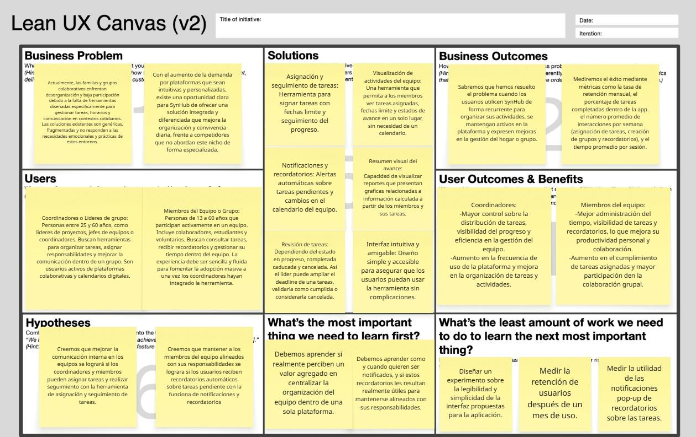</th>
<th style="text-align: left;">
Paitan Pumacahua, Max Anthony -
U201314454

Soy Max Anthony y tengo 29 años. Estoy retomando Ingeniería de
Software como segunda carrera, ya que siempre tuvo ello como objetivo;
en la actualidad, me encuentro cursando el noveno ciclo. Entre mis
habilidades están: Ágil capacidad de análisis -tanto individual como
también en colectivo-, empático en un contexto determinado -tomando
decisiones de manera sensata-, y puedo ser tanto gestor como un
participante activo dentro de un grupo de trabajo.
</th>
</tr>
<tr>
<th></th>
<th style="text-align: left;">
Josue Gonzalo Paiva Quispe -
U202119095

Soy estudiante de Ingeniería de Software, me encuentro cursando
el 8vo ciclo y realizando prácticas pre profesionales como fullstack
junior web developer
</th>
</tr>
<tr>
<th></th>
<th style="text-align: left;">
Miguel Angel Gomez Hurtado - U202220294

Tengo 24 años y estoy estudiando la carrera de Ingeniería Informática. Me encuentro en mi octavo ciclo en la UPC Sede San Miguel. Soy una persona académica y siempre estoy abierto al diálogo. Me apasiona mi carrera y siempre estoy dispuesto a aprender sobre este curso para brindar a mis futuros usuarios un buen producto acorde a sus necesidades.
</th></th>
</tr>
</thead>
<tbody>
</tbody>
</table>

## **1.2. Solution Profile**

### 1.2.1 Nombre del producto

El producto principal de Collabrium lleva por nombre
SynHub. El término surge de la combinación de dos ideas clave: “Syn”,
inspirado en “sincronizar” y “sinergia”, y “Hub”, entendido como un
centro o punto de encuentro.

Este nombre refleja la esencia del producto: ser un
espacio digital donde los equipos pueden sincronizar esfuerzos,
centralizar la organización y generar sinergias que fortalezcan la
colaboración.

### 1.2.2 Antecedentes y problemática

What

- ¿Cuál es el problema?

El problema radica en la baja adopción de soluciones
diseñadas para la organización colaborativa. A pesar de la
disponibilidad de diversas herramientas digitales, muchas personas y
grupos siguen recurriendo a métodos improvisados o poco eficientes para
coordinar actividades, lo que genera distribución desigual de tareas,
falta de seguimiento, comunicación fragmentada y pérdida de
productividad.

- ¿Cuál es la relación con la persona en
  cuestión?

La relación es ofrecer a los miembros de equipos o
grupos una herramienta accesible y centrada en sus necesidades reales,
que facilite una organización más clara, una distribución de tareas
efectiva y una comunicación más fluida, promoviendo así su uso y
adopción en el día a día.

When

- ¿Cuándo sucede el problema?

El problema surge cuando los equipos y grupos deben
coordinar actividades, repartir responsabilidades o mantener una
comunicación constante para alcanzar objetivos comunes.

- ¿Cuándo utiliza el cliente el producto?

El cliente utiliza SynHub cuando necesita organizar,
coordinar o participar en actividades grupales de manera eficiente, ya
sea al inicio de un proyecto, durante la planificación de tareas o en el
seguimiento de responsabilidades.

Where

- ¿Dónde está el cliente cuando usa el
  producto?

El cliente utiliza SynHub desde cualquier lugar con
acceso a Internet, ya sea en su hogar, en la oficina, en el aula o
incluso mientras se traslada, dependiendo de la plataforma que
utilice.

- ¿Dónde surge el problema?

El problema surge dentro de los propios entornos
donde se desarrollan actividades grupales, como oficinas, instituciones
educativas, organizaciones comunitarias o espacios colaborativos, en los
que la coordinación efectiva es clave para lograr objetivos
comunes.

Who

- ¿Quienes se ven involucrados en el problema?

Se ven involucrados tanto los organizadores o
coordinadores de equipos (como líderes de proyecto, docentes, jefes de
área o representantes comunitarios) miembros de equipos de trabajo (como
estudiantes, colaboradores, voluntarios o participantes) que enfrentan
dificultades para organizarse, distribuir responsabilidades y
comunicarse eficazmente. Why

- ¿Cuáles son las causas del problema?

Las causas del problema radican en la falta de
adopción de soluciones para la organización de equipos. Esto se debe, en
gran parte, a la resistencia al cambio, la baja percepción de valor
inmediato y la falta de hábitos digitales consolidados en ciertos
grupos. Aunque existen herramientas disponibles, muchas personas
prefieren métodos tradicionales como chats informales, hojas de cálculo
o notas físicas, ya que perciben las apps como innecesarias, complicadas
o poco integradas a su rutina diaria. Además, la escasa promoción
interna o el desconocimiento de las funcionalidades clave también
limitan su uso efectivo.

How

- ¿En qué condiciones los clientes usan nuestro
  producto?

Los clientes usan SynHub cuando forman parte de
equipos o grupos que necesitan coordinar actividades de manera
organizada y colaborativa, especialmente en contextos donde hay
múltiples tareas, horarios variables y responsabilidades
compartidas.

How Much

- ¿Cuál es la magnitud del problema?

La magnitud del problema de desorganización y
comunicación ineficaz en equipos es considerable. Según el State of
Teams Report de Atlassian (2021), solo el 17% de los equipos se
consideran "saludables", mientras que el 54% son parcialmente saludables
y el 29% directamente insalubres (p. 12). Además, el 57% de los
participantes admitió que sus equipos no operan con la eficiencia
necesaria, lo que genera retrasos y afecta la productividad (Atlassian,
2021, p. 18). Esto se agrava por la falta de conexión interpersonal: el
56% de los miembros reportó sentirse poco vinculado con sus compañeros,
y el 37% mencionó que no puede expresar ideas libremente por falta de
seguridad psicológica (Atlassian, 2021, p. 24).

### 1.2.3. Lean UX Process

#### 1.2.3.1. Lean UX Problem Statements

En el entorno actual, tanto en contextos familiares
como laborales y comunitarios, los grupos enfrentan grandes desafíos
para coordinar tareas y mantener una comunicación fluida y estructurada
entre sus miembros. Aunque existen herramientas digitales como
aplicaciones de mensajería o tableros de tareas, muchas de estas
soluciones son fragmentadas, poco integradas o carecen de una lógica
colaborativa adaptada al trabajo en equipo cotidiano.

Esta falta de soluciones centralizadas y
personalizables genera desorganización, distribución desigual de
responsabilidades, olvidos, retrasos y fricciones entre los integrantes
de un grupo. Ya sea en un entorno familiar, una oficina, un equipo de
voluntariado o un pequeño negocio, la necesidad de una herramienta
unificada que facilite la colaboración, la planificación y el
seguimiento de actividades es cada vez más evidente.

SynHub nace como una plataforma digital diseñada para
cubrir esta brecha: una solución integral para la gestión de grupos que
permite distribuir tareas, visualizar reportes, recibir recordatorios y
mejorar la eficiencia del trabajo en conjunto.

#### 1.2.3.2. Lean UX Assumptions

User Assumptions (Suposiciones de Usuario)

- ¿Quién es el usuario?: El usuario es alguien que
  busca una solución para organizar las tareas en un equipo y mejorar la
  comunicación entre los miembros.

- ¿Dónde encaja nuestro producto en su trabajo o
  vida?: Nuestro producto encaja en actividades grupales donde el
  usuario es partícipe junto a otros miembros, facilitando la gestión de
  tareas y responsabilidades dentro del equipo.

- ¿Qué problemas resuelve nuestro producto?: Nuestro
  producto resuelve problemas de desorganización y falta de comunicación
  dentro del equipo.

- ¿Cuándo y cómo se usa nuestro producto?: Nuestro
  producto se usa cuando hay necesidad de organización en actividades
  grupales, especialmente en momentos de planificación, seguimiento de
  tareas y coordinación entre miembros del equipo.

- ¿Qué características son importantes?: Las
  características importantes incluyen la asignación de tareas, el
  seguimiento del avance del equipo, la visualización de horarios del
  equipo, la comunicación estructurada y la posibilidad de adaptar la
  herramienta a diferentes dinámicas de grupo.

- ¿Cómo debe verse y comportarse nuestro producto?:
  Nuestro producto debe tener una interfaz intuitiva y amigable, que
  permita a los usuarios navegar fácilmente entre las distintas
  funcionalidades.

Business Assumptions (Suposiciones de Negocio)

- Necesidades y problemas: Creemos que los equipos de
  trabajo tienen la necesidad de organizar sus tareas de manera
  eficiente y mejorar la comunicación entre sus miembros.

- Plataforma: Estas necesidades se pueden resolver a
  través de una aplicación que ofrezca herramientas para la gestión de
  tareas y la comunicación, proporcionando una experiencia fluida y
  accesible.

- Segmentación: Los usuarios de la aplicación serán
  coordinadores de equipos e integrantes de esos equipos que buscan una
  forma accesible de organizar sus responsabilidades.

- Comportamientos: El valor principal que un usuario
  quiere obtener de nuestro servicio es la facilidad de uso y la mejora
  en la organización y comunicación dentro del equipo.

- Beneficios: Los usuarios obtendrán beneficios como
  una mejor organización personal, mayor claridad sobre sus
  responsabilidades dentro del equipo, y una sensación de logro al
  completar tareas.

- Captación de clientes: Adquiriremos la mayoría de
  nuestros usuarios a través de campañas de marketing digital y
  recomendaciones de usuarios actuales en el ámbito laboral y
  educativo.

- Modelo de ingresos: Generaremos ingresos a través
  de la clasificación de la aplicación como uno de pago.

- Competencia: Nuestra principal competencia en el
  mercado serán aplicaciones similares que ofrecen funciones de
  organización y gestión de tareas.

- Ventaja competitiva: Superaremos a la competencia
  gracias a nuestro enfoque en la personalización, la facilidad de uso y
  la integración de funciones específicas para la gestión de
  equipos.

#### 1.2.3.3. Lean UX Hypothesis

Hypothesis Statement 01:

- Creemos que el producto encaja en actividades
  grupales donde el usuario es partícipe junto a otros miembros,
  facilitando la gestión de tareas y responsabilidades dentro del
  equipo.

- Sabremos que estamos en lo correcto cuando veamos
  comentarios positivos sobre la facilidad de uso y la integración del
  producto en la dinámica de equipo.

Hypothesis Statement 02:

- Creemos que el producto resuelve problemas de
  desorganización y falta de comunicación dentro del equipo.

- Sabremos que estamos en lo correcto cuando los
  usuarios reporten una mejora en la organización y coordinación de su
  equipo mediante encuestas o reseñas.

Hypothesis Statement 03:

- Creemos que el producto se usa cuando hay necesidad
  de organización en actividades grupales, especialmente en momentos de
  planificación, seguimiento de tareas y coordinación.

- Sabremos que estamos en lo correcto cuando veamos
  un aumento en la frecuencia de uso de la aplicación.

Hypothesis Statement 04:

- Creemos que las características importantes
  incluyen la asignación de tareas, la visualización de horarios del
  equipo, conocer la disponibilidad de los miembros y la posibilidad de
  personalizar roles y permisos.

- Sabremos que estamos en lo correcto cuando veamos
  comentarios positivos de los usuarios sobre estas características y un
  aumento en la satisfacción del usuario.

Hypothesis Statement 05:

- Creemos que los equipos de trabajo tienen la
  necesidad de organizar sus tareas de manera eficiente y mejorar la
  comunicación entre sus miembros.

- Sabremos que estamos en lo correcto cuando veamos
  un aumento en la adopción del producto por parte de equipos y
  comentarios positivos sobre su utilidad.

Hypothesis Statement 06:

- Creemos que los usuarios serán coordinadores de
  equipos e integrantes que buscan una forma accesible de organizar sus
  responsabilidades.

- Sabremos que estamos en lo correcto cuando la
  mayoría de los registros y perfiles de usuario coincidan con estos
  perfiles y necesidades.

#### 1.2.3.4. Lean UX Canvas

## **1.3. Segmento objetivo** 

Segmento Objetivo \#1: Coordinadores o Líderes de
Grupo

Este grupo incluye a personas que asumen la
responsabilidad de organizar y gestionar las actividades dentro de un
equipo o grupo. Pueden ser líderes de proyectos, responsables de
logística en voluntariados, administradores de espacios compartidos,
docentes coordinadores o encargados de comunidades (vecinales,
académicas o laborales). Estas personas buscan una herramienta que les
permita distribuir tareas, planificar actividades, hacer seguimiento del
cumplimiento y facilitar la comunicación interna. Características
clave:

- Edad: 25 a 60 años

  - Género: Ambos

  - Contexto: Trabajo en equipo (laboral, educativo,
    comunitario o institucional)

  - Ocupación: Líderes de proyectos, jefes de equipo,
    coordinadores, docentes, voluntarios, emprendedores

  - Uso de tecnología: Usuarios activos de
    plataformas colaborativas y herramientas de gestión de tareas (como
    Trello, Notion, Slack, etc.)

  - Necesidades: Distribuir responsabilidades,
    establecer fechas límite, tener visibilidad del progreso del equipo,
    mejorar la coordinación y reducir fricciones en la organización
    diaria.

Segmento Objetivo \#2: Miembros del Equipo o
Grupo

Corresponde a las personas que forman parte activa de
un grupo con tareas y roles específicos, pero que no necesariamente
tienen funciones administrativas. Incluye desde colaboradores de un
proyecto, estudiantes de un curso, miembros de una comunidad, hasta
empleados de una pequeña empresa. Este grupo busca mantenerse al tanto
de sus responsabilidades, recibir recordatorios, y colaborar de forma
clara y organizada con los demás. Características clave:

- Edad: 13 a 60 años

  - Género: Ambos

  - Contexto: Participación activa en un grupo
    organizado (laboral, educativo, social, comunitario, voluntariado,
    etc.)

  - Ocupación: Colaboradores, estudiantes,
    asistentes, voluntarios, trabajadores, participantes de redes de
    apoyo

  - Uso de tecnología: Habitualmente usan apps
    móviles, redes sociales, herramientas de trabajo remoto o
    colaboración básica

  - Necesidades: Consultar tareas, recibir
    recordatorios, gestionar su tiempo dentro del equipo, proponer
    cambios o ajustes, y mantenerse alineados con los objetivos
    grupales.

---

# 2. Capítulo II: Requirements Elicitation & Analysis

## 2.1. Competidores

En esta sección se expone un estudio de los principales actores que compiten con nuestra startup, enfocándonos en aquellos que cuentan con modelos digitales similares o que, aunque no sean idénticos, ofrecen soluciones que coinciden en parte con la propuesta de SynHome. Se consideran tanto competidores directos, ubicados en el mismo segmento, como indirectos, que abarcan aspectos relacionados con la organización de actividades, planificación y coordinación colaborativa.

---

**1. Asana**

**Descripción:**

Asana es una plataforma orientada a la gestión de proyectos que permite a los equipos estructurar tareas, asignar responsables y monitorear el avance de sus proyectos. Dispone de diversas visualizaciones, como listas y tableros Kanban, lo que facilita su adaptación a distintas dinámicas de trabajo.

**Características principales:**

* **Proyectos y tareas** estructurados en listas y tableros tipo Kanban.
* **Subtareas y relaciones de dependencia** para organizar procesos de trabajo.
* **Colaboración**: asignación de responsabilidades, comentarios y archivos.
* **Alertas y recordatorios** mediante correo electrónico y la aplicación.
* **Monitoreo e informes** del progreso (gráficos y porcentajes).
* **Integraciones** con herramientas como Slack, Google Drive y Microsoft Teams.
* **Aplicación móvil** intuitiva que permite gestionar tareas y colaborar.

---

**2. FamilyWall**

**Descripción:**

FamilyWall es una solución digital orientada al entorno familiar que reúne múltiples funcionalidades en una sola plataforma. Su diseño amigable y visual la hace adecuada para familias con integrantes de distintas edades.

**Principales características:**

* **Listas colaborativas** de tareas y compras.
* **Geolocalización en tiempo real**, útil para ubicar a los miembros de la familia.
* **Sistema de mensajería** privada y grupal.
* **Espacio compartido multimedia** para fotos y videos familiares.

---

**3. ClickUp**

**Descripción:**

ClickUp es una herramienta integral que combina funcionalidades de gestión de tareas, documentación, metas y más. Se destaca por su alto nivel de personalización y su capacidad de adaptarse a diversos flujos de trabajo.

**Características principales:**

* **Estructura jerárquica adaptable**: espacios, carpetas, listas y tareas.
* **Diversas vistas**: lista, tablero, cronograma y carga de trabajo.
* **Registro de tiempo** incorporado.
* **Documentación interna**, notas y wikis colaborativos.
* **Automatizaciones configurables**.
* **Comentarios con menciones** y edición colaborativa.
* **Plantillas reutilizables** para proyectos y tareas.
* **Aplicación móvil** completa, aunque puede resultar compleja para nuevos usuarios.

---

### 2.1.1. Análisis competitivo

<table> 
  <tr>
    <th colspan="6"> Competitive Analysis Landscape </th>
  </tr>
  <tr>
    <td colspan="2" rowspan="2">¿Por qué llevar acabo este análisis? </td>
    <td colspan="4"> Pregunta </td>
  </tr>
  <tr>
    <td colspan="4"> Este análisis se realiza para comprender el entorno competitivo, identificar a los actores del mercado, tomar decisiones estratégicas de desarrollo y construir una propuesta de valor sólida. </td>
  </tr>
  <tr>
    <td colspan="2"> Productos </td>
    <td style="text-align: center;"> 
SynHub
  </td>
    <td style="text-align: center;"> 
Asana
  </td>
    <td style="text-align: center;"> 
FamilyWall
  </td>
    <td style="text-align: center;"> 
ClickUp
  </td>
  </tr>
  <tr>
    <td rowspan="2">Perfil</td>
    <td>Overview</td>
    <td>SynHub es una solución digital colaborativa creada para apoyar la organización y gestión de actividades en distintos tipos de grupos, ya sean académicos, laborales o sociales.</td>
    <td>Herramienta enfocada en la gestión de proyectos y tareas que facilita la organización, el seguimiento y la planificación mediante diferentes vistas como listas y tableros Kanban.</td>
    <td>FamilyWall es una plataforma orientada a la organización familiar, que permite coordinar tareas, comunicaciones y contenido multimedia en un solo entorno.</td>
    <td>ClickUp es una solución integral que reúne herramientas para la gestión de tareas, documentos y objetivos, destacando por su alto nivel de personalización.</td>
  </tr>
  <tr>
    <td>Ventaja competitiva ¿Qué valor ofrece a los clientes? </td>
    <td>Fomenta la corresponsabilidad mediante funciones como seguimiento de tareas, validación de cumplimiento y reportes visuales con gráficos.</td>
    <td>Destaca por su facilidad de uso e interfaz intuitiva, permitiendo una rápida adopción por parte de los equipos. Sus múltiples integraciones amplían su funcionalidad.</td>
    <td>Contribuye a mejorar la comunicación familiar mediante chats y actualizaciones compartidas.</td>
    <td>Su alto grado de personalización y la integración de múltiples funciones en una sola plataforma resultan atractivos para equipos que buscan centralizar herramientas.</td>
  </tr>
  <tr>
    <td rowspan="2">Perfil de Marketing</td>
    <td>Mercado Objetivo</td>
    <td>Equipos académicos y universitarios, así como grupos que requieren herramientas flexibles, accesibles y fáciles de usar.</td>
    <td>Organizaciones de cualquier tamaño que buscan optimizar la gestión de proyectos, desde startups hasta grandes empresas.</td>
    <td>Familias que necesitan una plataforma unificada para organizar actividades y compartir información.</td>
    <td>Empresas y equipos que requieren soluciones completas y altamente personalizables para gestionar sus proyectos.</td>
  </tr>
  <tr>
    <td>Estrategias de Marketing</td>
    <td>Modelo freemium: ofrecer una versión gratuita funcional y motivar la transición a planes premium con características adicionales.</td>
    <td>Uso de contenido educativo como guías y webinars para atraer usuarios, junto con una versión gratuita que incentiva la conversión a planes pagos.</td>
    <td>Implementación de pruebas gratuitas para impulsar la adopción de la plataforma.</td>
    <td>Enfoque en destacar su versatilidad mediante contenido educativo, testimonios y comparaciones con otras herramientas.</td>
  </tr>
  <tr>
    <td rowspan="3">Perfil de Producto</td>
    <td>Productos & Servicios</td>
    <td>Gestión de tareas compartidas y organización de responsabilidades dentro del hogar o equipo.</td>
    <td>Gestión de proyectos con vistas personalizadas, integraciones con herramientas externas y seguimiento del progreso.</td>
    <td>Funciones de listas, mensajería y compartición de contenido multimedia.</td>
    <td>Gestión de tareas y proyectos con múltiples vistas, documentación colaborativa, control de tiempo y automatizaciones.</td>
  </tr>
  <tr>
    <td>Precios & Costos</td>
    <td>Plan gratuito y plan premium con un costo de $6.99 por usuario al mes.</td>
    <td>Versión gratuita con funciones básicas y planes premium: $13.49 mensual o $10.99 mensual en plan anual.</td>
    <td>Plan premium de $4.99 mensual o $29.99 anual con funcionalidades adicionales.</td>
    <td>Versión gratuita y plan Unlimited: $9 mensual o $10.99 mensual en plan anual.</td>
  </tr>
  <tr>
    <td>Canales de distribución</td>
    <td>Aplicaciones móviles disponibles en Android e iOS.</td>
    <td>Acceso mediante web y aplicaciones móviles en iOS y Android.</td>
    <td>Disponible en App Store y Google Play.</td>
    <td>Disponible tanto en web como en aplicaciones móviles.</td>
  </tr>
  <tr>
    <td rowspan="5">Análisis SWOT</td>
  </tr>
  <tr>
    <td>Fortalezas</td>
    <td>Adaptabilidad a diferentes contextos y tipos de equipos.</td>
    <td>Interfaz sencilla e intuitiva.</td>
    <td>Amplio conjunto de funciones para la gestión familiar.</td>
    <td>Gran flexibilidad y capacidad de personalización.</td>
  </tr>
  <tr>
    <td>Debilidades</td>
    <td>Falta de posicionamiento y reconocimiento en el mercado.</td>
    <td>Restricciones en la personalización de procesos complejos.</td>
    <td>Limitaciones importantes en la versión gratuita.</td>
    <td>Complejidad inicial debido a la cantidad de funcionalidades.</td>
  </tr>
  <tr>
    <td>Oportunidades</td>
    <td>Ingresar a nichos poco atendidos por soluciones complejas.</td>
    <td>Expansión hacia mercados emergentes.</td>
    <td>Crecimiento en el ámbito educativo.</td>
    <td>Desarrollo en sectores que requieren soluciones específicas.</td>
  </tr>
  <tr>
    <td>Amenazas</td>
    <td>Competidores grandes podrían ofrecer versiones más económicas.</td>
    <td>Incremento de la competencia en herramientas de gestión.</td>
    <td>Limitaciones en integraciones con otras plataformas.</td>
    <td>Competencia con herramientas más especializadas y simples.</td>
  </tr>
</table>

### 2.1.2. Estrategias y tácticas frente a competidores

**1. Estrategia de Diferenciación por Simplicidad y Usabilidad**

**Objetivo:** Posicionar a SynHub como la alternativa más sencilla, intuitiva y accesible para todo tipo de grupos.

**Tácticas:**

* Crear una **interfaz clara y visual**, fácil de navegar incluso para usuarios sin experiencia.
* Implementar un **onboarding ágil** (menos de 2 minutos para empezar).
* Incluir **tutoriales interactivos** y ayuda contextual dentro de la plataforma.
* Destacar frente a Asana y ClickUp con el mensaje: *“No necesitas ser experto para organizarte”*.

**2. Estrategia de Enfoque en Nichos Desatendidos**

**Objetivo:** Dirigirse a segmentos como estudiantes, voluntarios y comunidades.

**Tácticas:**

* Diseñar funcionalidades específicas para grupos no empresariales.
* Expandirse hacia **equipos híbridos** que combinan familia, trabajo y estudio.

**3. Estrategia de Humanización y Cercanía de Marca**

**Objetivo:** Generar confianza mediante una comunicación cercana y una experiencia positiva.

**Tácticas:**

* Brindar **soporte rápido y empático**.
* Utilizar un **lenguaje simple y humano**, evitando tecnicismos.
* Posicionarse como una plataforma cercana, a diferencia del enfoque corporativo de otros competidores.

**4. Estrategia de Precio Accesible y Transparente**

**Objetivo:** Captar usuarios que buscan soluciones completas a bajo costo.

**Tácticas:**

* Ofrecer un **plan gratuito funcional** y un **premium accesible**.
* Aplicar descuentos para sectores educativos y organizaciones sin fines de lucro.
* Incluir funcionalidades clave sin obligar a cambiar de plan constantemente.

---

## 2.2. Entrevistas

En esta sección se plantea el diseño, registro y análisis de entrevistas dirigidas a los segmentos objetivo.

### 2.2.1. Diseño de entrevistas

**1. Entrevista para el Coordinador o Líder de Grupo**

* Preguntas principales:

1.¿Podrías contarme un poco sobre ti? (edad, ocupación, lugar de residencia, estado civil)

2.¿A qué tipo de grupo o equipos perteneces o lideras actualmente?

3.¿Cuál es tu rol dentro de ese grupo?

* -Preguntas complementarias:

4.¿Con qué frecuencia se reúnen o interactúan?

5.Cuántas personas conforman el grupo o equipo que lideras?

6.¿Qué herramientas o plataformas digitales utilizas para coordinar al equipo?

7.¿Sueles tener problemas con la puntualidad, comunicación o cumplimiento?

8.¿Qué dispositivos usas más frecuentemente para organizarte (móvil, laptop, tablet)?

9.¿Usas redes sociales, apps colaborativas o agendas digitales?

10.¿Qué valoras más en una herramienta para organizar a tu equipo?

**2. Entrevista para el Miembro del Equipo o Grupo**

* Preguntas principales:

1.¿Podrías contarme un poco sobre ti? (edad, ocupación, lugar de residencia, estado civil)

2.¿A qué tipo de grupo o equipo perteneces actualmente?

3.¿Cuál es tu rol dentro del grupo? (por ejemplo: participante, colaborador, voluntario)

* Preguntas complementarias:

4.¿Qué tipo de tareas realizas habitualmente?

5.¿Qué herramientas o plataformas digitales utilizas para conocer tus actividades en el equipo?

6.¿Cómo te enteras de tus responsabilidades dentro del grupo?

7.¿Qué cosas te molestan o dificultan al trabajar en grupo?

8.¿Qué tipo de apps o plataformas te gustan más? (Ej: fáciles de usar, visuales, rápidas)

9.¿Usas más el celular o la computadora para tus tareas diarias?

10.¿Qué tipo de apps o plataformas te gustan más? (Ej: fáciles de usar, visuales, rápidas)

### 2.2.2. Registro de entrevistas

En esta sección se recopilan y resumen las ideas y hallazgos más relevantes obtenidos de las entrevistas realizadas tanto a coordinadores como a miembros de grupo. La información completa, incluidas las grabaciones de cada entrevista, está disponible en los siguientes enlaces:

<table cellpadding="8" cellspacing="0">
  <tbody>
    <tr>
      <td>Entrevista 1</td>
      <td>  </td>
    </tr>
    <tr>
      <td>Nombre Entrevistado</td>
      <td>Melany Paitan</td>
    </tr>
    <tr>
      <td>Edad</td>
      <td>22</td>
    </tr>
    <tr>
      <td>Distrito</td>
      <td>Lima Cercado</td>
    </tr>
    <tr>
      <td>Ocupacion</td>
      <td>Estudiante</td>
    </tr>
    <tr>
      <td>Duración Entrevista</td>
      <td>03:15 </td>
    </tr>
    <tr>
      <td>Minuto de Inicio</td>
      <td>00:00 - 02:40</td>
    </tr>
  </tbody>
</table>

<table cellpadding="8" cellspacing="0">
  <tbody>
    <tr>
      <td>Entrevista 2</td>
      <td>  </td>
    </tr>
    <tr>
      <td>Nombre Entrevistado</td>
      <td>Xavier Hager</td>
    </tr>
    <tr>
      <td>Edad</td>
      <td>23</td>
    </tr>
    <tr>
      <td>Distrito</td>
      <td>Santiago de Surco</td>
    </tr>
    <tr>
      <td>Ocupacion</td>
      <td>Estudiante</td>
    </tr>
    <tr>
      <td>Duración Entrevista</td>
      <td>03:27</td>
    </tr>
    <tr>
      <td>Minuto de Inicio</td>
      <td>00:00 - 03:27</td>
    </tr>
  </tbody>
</table>

<table cellpadding="8" cellspacing="0">
  <tbody>
    <tr>
      <td>Entrevista 3</td>
      <td>  </td>
    </tr>
    <tr>
      <td>Nombre Entrevistado</td>
      <td>Andrés Coca</td>
    </tr>
    <tr>
      <td>Edad</td>
      <td>20</td>
    </tr>
    <tr>
      <td>Distrito</td>
      <td>Lima Metropolitana</td>
    </tr>
    <tr>
      <td>Ocupacion</td>
      <td>Estudiante</td>
    </tr>
    <tr>
      <td>Duración Entrevista</td>
      <td>06:10 </td>
    </tr>
    <tr>
      <td>Minuto de Inicio</td>
      <td>00:00 - 06:10</td>
    </tr>
  </tbody>
</table>

<table cellpadding="8" cellspacing="0">
  <tbody>
    <tr>
      <td>Entrevista 4</td>
      <td>  </td>
    </tr>
    <tr>
      <td>Nombre Entrevistado</td>
      <td>Diego Alonso Quispe Flores</td>
    </tr>
    <tr>
      <td>Edad</td>
      <td>24</td>
    </tr>
    <tr>
      <td>Distrito</td>
      <td>Villa el Salvador</td>
    </tr>
    <tr>
      <td>Ocupacion</td>
      <td>Líder de equipo</td>
    </tr>
    <tr>
      <td>Duración Entrevista</td>
      <td>08:09 </td>
    </tr>
    <tr>
      <td>Minuto de Inicio</td>
      <td>00:00 - 08:09</td>
    </tr>
  </tbody>
</table>

<table cellpadding="8" cellspacing="0">
  <tbody>
    <tr>
      <td>Entrevista 5</td>
      <td>  </td>
    </tr>
    <tr>
      <td>Nombre Entrevistado</td>
      <td>Fabio De la Cruz</td>
    </tr>
    <tr>
      <td>Edad</td>
      <td>54</td>
    </tr>
    <tr>
      <td>Distrito</td>
      <td>Villa el Salvador</td>
    </tr>
    <tr>
      <td>Ocupacion</td>
      <td>Líder de equipo</td>
    </tr>
    <tr>
      <td>Duración Entrevista</td>
      <td>03:17 </td>
    </tr>
    <tr>
      <td>Minuto de Inicio</td>
      <td>00:00 - 03:17</td>
    </tr>
  </tbody>
</table>

<table cellpadding="8" cellspacing="0">
  <tbody>
    <tr>
      <td>Entrevista 6</td>
      <td>  </td>
    </tr>
    <tr>
      <td>Nombre Entrevistado</td>
      <td>Briggite Herrera Aguirre</td>
    </tr>
    <tr>
      <td>Edad</td>
      <td>22</td>
    </tr>
    <tr>
      <td>Distrito</td>
      <td>Los Olivos</td>
    </tr>
    <tr>
      <td>Ocupacion</td>
      <td>Líder de equipo</td>
    </tr>
    <tr>
      <td>Duración Entrevista</td>
      <td>04:34 </td>
    </tr>
    <tr>
      <td>Minuto de Inicio</td>
      <td>00:00 - 04:34</td>
    </tr>
  </tbody>
</table>

### 2.2.3. Análisis de entrevistas

En esta sección se recopilan y resumen las ideas y hallazgos más relevantes obtenidos de las entrevistas realizadas tanto a coordinadores como a miembros de grupo. La información completa, incluidas las grabaciones de cada entrevista, está disponible en el siguiente enlace:

URL: https://1drv.ms/v/c/9fed6c4f629930aa/IQA_ZEu7K2-7RrQH7CcVA6CFAYyE1I6TyF9RFQiOzFxuHDg?e=McVfoR

**Segmento Objetivo 1: Coordinadores o Líderes de Grupo**

* **Demografía:** La edad promedio de los coordinadores entrevistados es de 25 años, con todos los participantes trabajando en campos relacionados con la tecnología. Esto indica un perfil demográfico juvenil en roles de liderazgo dentro de entornos tecnológicos.
* **Tamaño del equipo:** Los coordinadores gestionan equipos de tamaños variados, habiendo un líder que supervisa un equipo de seis miembros. Esto sugiere una preferencia por equipos de tamaño pequeño a mediano para una gestión efectiva.
* **Frecuencia de comunicación:** Todos los coordinadores reportaron participar en reuniones o interacciones diarias, lo que destaca un enfoque estructurado de comunicación que fomenta la alineación del equipo. Esta comunicación constante es crucial para el éxito del proyecto.
* **Frecuencia de comunicación:** Todos los coordinadores reportaron participar en reuniones o interacciones diarias, lo que destaca un enfoque estructurado de comunicación que fomenta la alineación del equipo. Esta comunicación constante es crucial para el éxito del proyecto.

**Segmento Objetivo 2: Miembros del Equipo o Grupo**

* **Preferencias de comunicación:** El 67 % de los miembros del equipo prefiere una combinación de comunicación presencial y digital, con un fuerte énfasis en interacciones en tiempo real para la resolución de problemas. Esto refleja la necesidad de flexibilidad en los métodos de comunicación.
* **Estrategias de compromiso:** El 67 % de los miembros del equipo mencionó el uso de materiales creativos, como infografías y presentaciones, para mejorar el compromiso y la comprensión dentro del equipo. Esto sugiere que se valoran los métodos de comunicación innovadores.
* **Herramientas de gestión de tareas:** Todos los miembros del equipo informaron utilizar herramientas que les permiten seguir sus tareas de forma visual, lo que indica una preferencia universal por ayudas visuales para monitorear el progreso y mantener la motivación.

## 2.3. Needfinding

### 2.3.1. User Personas

#### A. User Persona: Coordinador de equipos

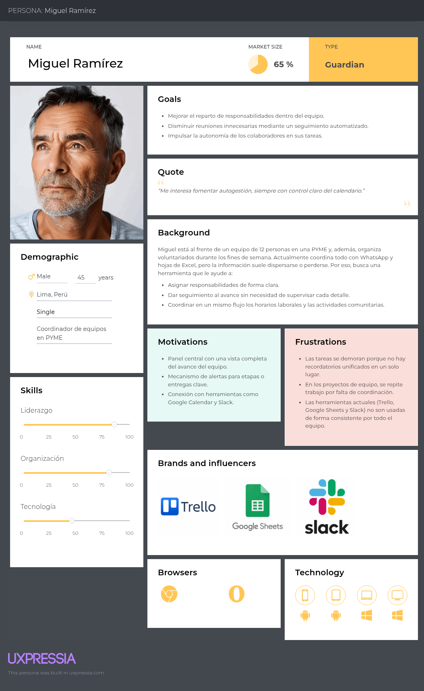

#### B. User Persona: Miembro de equipo

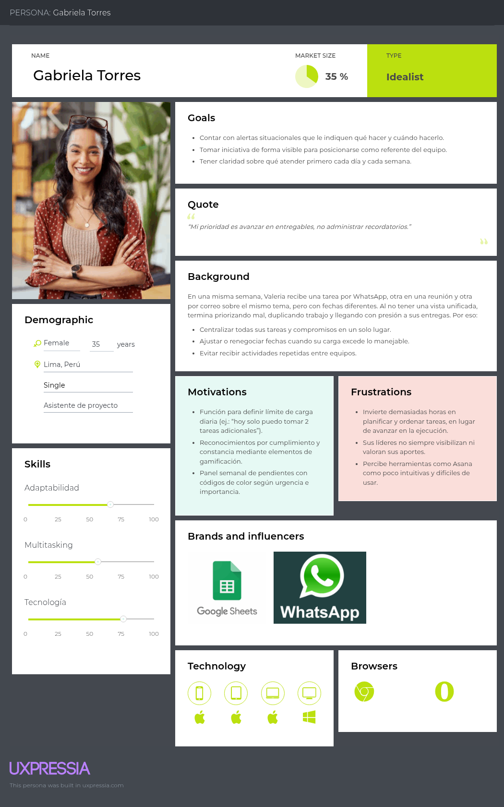

### 2.3.2. User Task Matrix

#### A. Segmento 1: Coordinadores o Líderes de Grupo

| Tarea | Frecuencia | Severidad |
|-------|-----------|-----------|
| Seleccionar integrantes del equipo y definir objetivo común | Alta | Media |
| Establecer grupos de trabajo y programar horarios | Baja | Alta |
| Organizar reuniones a través de diferentes canales de comunicación | Media | Media |
| Distribuir y asignar responsabilidades entre los miembros | Alta | Alta |
| Monitorear el progreso y actualizar estado de avances | Alta | Alta |
| Compilar y centralizar información de todos los participantes | Alta | Alta |
| Analizar resultados finales e identificar áreas de mejora | Media | Baja |

#### B. Segmento 2: Miembros del Equipo o Grupo

| Tarea | Frecuencia | Severidad |
|-------|-----------|-----------|
| Comprender los objetivos y el alcance del proyecto asignado | Baja | Media |
| Revisar y cumplir con los horarios y pautas establecidas | Alta | Alta |
| Participar activamente en reuniones de coordinación y seguimiento | Media | Alta |
| Ejecutar las tareas designadas conforme al cronograma establecido | Alta | Alta |
| Informar regularmente al líder sobre el progreso de sus actividades | Alta | Alta |
| Compartir resultados, hallazgos y documentación con el equipo | Media | Media |
| Proporcionar retroalimentación para identificar mejoras continuas | Baja | Media |

### 2.3.3. Empathy Mapping

En esta sección se muestra el **mapa de empatía**, una herramienta clave para 
entender con mayor profundidad lo que nuestros usuarios piensan, sienten 
y necesitan. Gracias a este análisis, podemos detectar oportunidades concretas 
para mejorar su experiencia.

#### A. Empathy Map: Coordinador de equipos

#### B. Empathy Map: Miembro de equipo

### 2.3.4. As-is Scenario Mapping

En esta sección se estructuran los escenarios actuales (As-Is) 
diferenciados por cada segmento objetivo, detallando para cada 
fase las actividades concretas que realizan, sus reflexiones 
internas y sus estados emocionales durante el proceso.

#### A. As-is Segmento 1: Coordinador de equipos

<table>
<tr style="background-color: #4472C4; color: white;">
  <th>Fases</th>
  <th>Configuración Inicial</th>
  <th>Asignación de Responsabilidades</th>
  <th>Monitoreo Continuo</th>
  <th>Cierre y Evaluación</th>
</tr>
<tr>
  <td><strong>Doing (Acciones)</strong></td>
  <td>Utiliza herramientas básicas como WhatsApp, Excel o documentos físicos para seleccionar miembros del equipo e intentar organizar tareas iniciales. Coordina reuniones a través de múltiples canales de comunicación.</td>
  <td>Distribuye tareas de forma manual y proporciona cronogramas. Debe recordar constantemente a los miembros sus responsabilidades y seguir el estado de cada tarea asignada.</td>
  <td>Consulta individualmente a cada miembro sobre avances. Realiza ajustes en cronogramas sobre la marcha. Gestiona conversaciones dispersas en múltiples plataformas.</td>
  <td>Recopila información fragmentada de diferentes fuentes para evaluar resultados. Intenta extraer lecciones aprendidas sin métricas claras de desempeño.</td>
</tr>
<tr>
  <td><strong>Thinking (Pensamientos)</strong></td>
  <td>"¿Cómo logro que todos entiendan sus roles?" "Espero poder coordinar de manera efectiva."</td>
  <td>"¿Entenderán realmente lo que se espera?" "¿Cuándo debo hacer seguimiento?"</td>
  <td>"¿Todos están realmente cumpliendo?" "¿Vamos en la dirección correcta?" "El desorden de información es un problema."</td>
  <td>"¿Tengo todos los datos necesarios?" "¿Resultó bien o mal?" "¿Qué puedo mejorar para próximas veces?"</td>
</tr>
<tr>
  <td><strong>Feeling (Sentimientos)</strong></td>
  <td>😟 Preocupación por la falta de respuesta inicial. 😰 Ansiedad por la carga de trabajo.</td>
  <td>😤 Desorganización por múltiples responsabilidades. ⚠️ Presión por cumplir con todos.</td>
  <td>😊 Satisfacción por el seguimiento constante. 😕 Inseguridad sobre si todo va bien. ⚡ Estrés por resultados variables.</td>
  <td>😞 Desilusión por resultados inconsistentes. 😤 Frustración por no tener métricas claras.</td>
</tr>
</table>

#### B. As-is Segmento 2: Miembro de equipo

<table>
<tr style="background-color: #70AD47; color: white;">
  <th>Fases</th>
  <th>Recepción de Tareas</th>
  <th>Gestión del Tiempo</th>
  <th>Participación y Comunicación</th>
  <th>Cierre y Aprendizaje</th>
</tr>
<tr>
  <td><strong>Doing (Acciones)</strong></td>
  <td>Recibe tareas a través de múltiples canales (WhatsApp, correos, mensajería verbal). No dispone de un horario unificado ni claridad sobre plazos comunes para todos los miembros del equipo.</td>
  <td>Batalla constante por recordar cronogramas, fechas de entrega y compromisos. Gestiona recordatorios personales sin sincronización con el equipo.</td>
  <td>Comunica su progreso mediante mensajes informales o cuando le preguntan. Espera confirmación sobre si está cumpliendo adecuadamente. Se cuestiona si debería informar más frecuentemente.</td>
  <td>Entrega las tareas completadas de forma aislada. No recibe retroalimentación clara ni sabe si cumplió con las expectativas.</td>
</tr>
<tr>
  <td><strong>Thinking (Pensamientos)</strong></td>
  <td>"¿Hasta cuándo tengo para hacer esto?" "¿Dónde estaba la información?" "¿Quién más debería saberlo?"</td>
  <td>"No tengo claro cuántas tareas tengo pendientes." "Ojalá no me olvide de esto." "¿De verdad es para hoy?"</td>
  <td>"¿Quién está en esta tarea conmigo?" "¿No quiero parecer que no hago nada." "Espero que alguien me ayude a aclarar."</td>
  <td>"¿Resultó bien lo que hice?" "¿Valió la pena el esfuerzo?" "¿Debería haber hecho algo diferente?"</td>
</tr>
<tr>
  <td><strong>Feeling (Sentimientos)</strong></td>
  <td>😕 Confundido por información dispersa. 😞 Poco motivado al inicio.</td>
  <td>😐 Inseguro sobre cronogramas. 😰 Ansioso por olvidar fechas.</td>
  <td>😐 Inseguro sobre su contribución. 😔 Culpable por no comunicar más. 😐 Preocupado por no cumplir.</td>
  <td>😕 Desconectado de los resultados. 😞 Desmotivado para repetir la experiencia.</td>
</tr>
</table>

## 2.4. Ubiquitous Language

A continuación se presenta el glosario de términos y conceptos del dominio de negocio de SynHub. Este lenguaje 
ubiquo es compartido por todos los miembros del equipo y stakeholders para garantizar una comunicación clara 
y sin ambigüedad.

| Término | Definición |
|---------|-----------|
| **Group (Grupo)** | Unidad de colaboración formada por un conjunto de personas con un objetivo común. Los grupos pueden tener naturaleza académica, laboral o comunitaria. Cada grupo tiene un ciclo de vida propio que incluye su creación, actividad y eventual eliminación o archivo. |
| **Leader (Líder)** | Integrante del grupo que asume la responsabilidad de organizar las actividades, crear y asignar tareas, gestionar invitaciones y validar el trabajo de los demás miembros. El líder tiene permisos extendidos dentro del grupo. |
| **Member (Miembro)** | Persona que pertenece a un grupo y tiene tareas o responsabilidades asignadas. Puede consultar sus tareas, actualizar su estado, enviar solicitudes y recibir notificaciones, pero no tiene permisos administrativos sobre el grupo. |
| **Task (Tarea)** | Unidad de trabajo que el líder crea y asigna a uno o más miembros del grupo. Toda tarea tiene un responsable, una descripción y una fecha límite, y atraviesa distintos estados a lo largo de su ciclo de vida. |
| **Task Status (Estado de Tarea)** | Condición actual en la que se encuentra una tarea dentro de su ciclo de vida. Los estados posibles son: En progreso, En revisión, Completada, Vencida y Cancelada. |
| **Assignment (Asignación)** | Acción mediante la cual el líder vincula una tarea a un miembro específico del grupo, estableciendo quién es el responsable de su ejecución y la fecha límite correspondiente. |
| **Due Date (Fecha Límite)** | Fecha y hora máxima establecida para que un miembro complete una tarea. Pasada esta fecha sin completarse, la tarea pasa automáticamente al estado Vencida. |
| **Invitation (Invitación)** | Solicitud formal enviada por un líder a un usuario para que se una a su grupo. El usuario recibe una notificación y puede aceptar o rechazar la invitación. |
| **Approval Request (Solicitud de Aprobación)** | Petición que realiza un miembro al marcar una tarea como completada, para que el líder la revise y valide. Mientras aguarda revisión, la tarea entra en estado En revisión. |
| **Extension Request (Solicitud de Extensión de Plazo)** | Petición formal de un miembro al líder para ampliar la fecha límite de una tarea, acompañada de un motivo justificado. El líder puede aceptarla o rechazarla. |
| **Validation (Validación)** | Acción mediante la cual el líder aprueba o rechaza una tarea enviada para revisión. Si se aprueba, la tarea queda definitivamente Completada; si se rechaza, regresa a En progreso con comentarios de feedback. |
| **Notification (Notificación)** | Aviso automático generado por el sistema ante eventos relevantes del dominio, como asignaciones de tareas, vencimientos de plazos, resultados de validaciones o cambios de estado. Puede entregarse dentro de la aplicación (in-app) o por correo electrónico. |
| **Productivity Dashboard (Panel de Productividad)** | Vista visual que consolida métricas de desempeño individual y grupal, permitiendo al líder conocer la carga de trabajo por miembro, la distribución de estados de tareas y el cumplimiento general del grupo. |
| **Productivity Metrics (Métricas de Productividad)** | Indicadores cuantitativos del desempeño de los miembros y del grupo en conjunto. Incluyen: número de tareas completadas, tasa de aprobación en primera revisión, tareas vencidas y solicitudes de extensión realizadas. |
| **Validation History (Histórico de Validaciones)** | Registro cronológico de todas las aprobaciones y rechazos realizados por el líder sobre las tareas del grupo. Permite identificar patrones de calidad y seguimiento individual por miembro. |
| **Workload Balance (Equilibrio de Carga)** | Distribución equitativa de tareas entre los miembros de un grupo, de modo que ningún integrante concentre una cantidad desproporcionada de responsabilidades. Es un valor central en la propuesta de SynHub. |
| **Co-responsibility (Corresponsabilidad)** | Principio que implica que todos los integrantes de un grupo comparten activamente el compromiso de cumplir con sus responsabilidades para el logro de los objetivos comunes. |
| **Group Lifecycle (Ciclo de Vida del Grupo)** | Conjunto de etapas por las que atraviesa un grupo desde su creación hasta su eliminación o archivo. Incluye: creación, incorporación de miembros, asignación de tareas, seguimiento, y cierre o archivo. |

---

# 3. Capítulo III: Requirements Specification

## 3.1. To-Be Scenario Mapping

**Segmento objetivo: Líderes de equipos de trabajo**

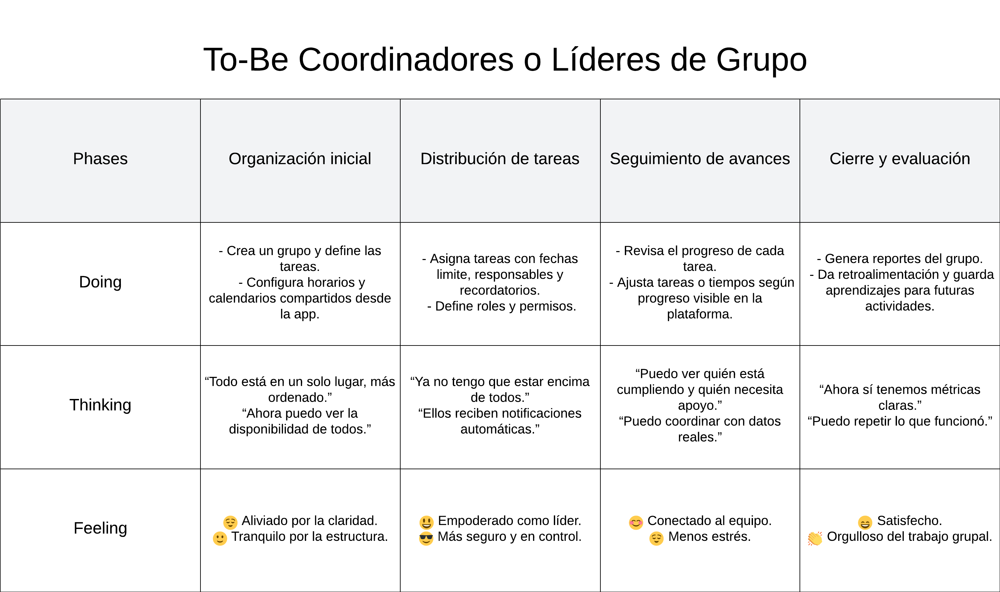

**Segmento Objetivo: Miembros de equipos de trabajo**

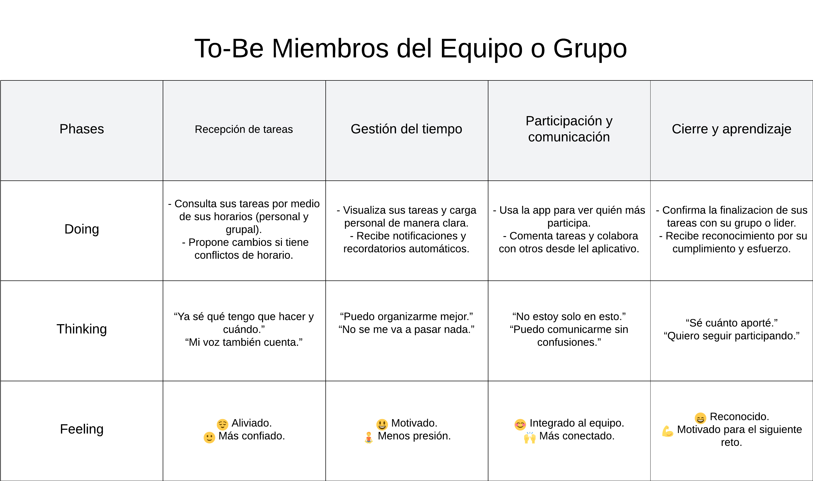

## 3.2. User Stories

**Epics**

Además de las épicas referentes a la funcionalidad principal de Synhub, se añadió una séptima épica referente a la integración 
de un agente inteligente de asistencia basado en IA, que analiza datos del sistema parra generar recomendaciones y apoyo personalizado.

| Epic ID | Título                           | Descripción                                                                                                                                                                               |
|---------|----------------------------------|-------------------------------------------------------------------------------------------------------------------------------------------------------------------------------------------|
| EP-001  | Gestión de Grupos                | Creación, configuración y administración de grupos colaborativos e invitaciones. Cubre todo el ciclo de vida del grupo.                                                                   |
| EP-002  | Gestión de Tareas                | Creación, asignación (con responsables y fechas) y seguimiento de estados (En progreso, completada, caducada y cancelada).                                                                |
| EP-003  | Notificaciones Inteligentes      | Sistema centralizado de notificaciones (in-app/email) para eventos críticos, con gestión de preferencias, agrupamiento y recordatorios automáticos.                                       |
| EP-004  | Analítica y Reportes             | Generación automatizada de dashboards y métricas de productividad (individual/grupal).                                                                                                    |
| EP-005  | Solicitudes y Validaciones       | Flujo completo para solicitudes de procesamiento de tareas con estados, comentarios y notificaciones asociadas.                                                                           |
| EP-006  | Gestión de Usuarios              | Registro, inicio de sesión, edición de perfil y gestión de credenciales. Incluye autenticación y recuperación de acceso.                                                                  |
| EP-007  | Agente Inteligente de Asistencia | Integración de un agente basado en IA que analiza datos del sistema para generar recomendaciones, detectar riesgos y asistir a los usuarios en la gestión de tareas y toma de decisiones. |

**User Stories**

Con base en las épicas definidas se formularon las siguientes historias de usuario, incluyendo nuevas historias relacionadas con el agente inteligente de asistencia:

| ID     | Título                                        | Descripción                                                                                                                   | Criterios de Aceptación                                                                                                                                                                                                                                                                                                                                               | Epic   |
|--------|-----------------------------------------------|-------------------------------------------------------------------------------------------------------------------------------|-----------------------------------------------------------------------------------------------------------------------------------------------------------------------------------------------------------------------------------------------------------------------------------------------------------------------------------------------------------------------|--------|
| US-001 | Creación de grupo                             | Como líder, quiero crear grupos para organizar el trabajo de mi equipo.                                                       | Escenario 1: Creación básica: Given que soy líder, When completo nombre y descripción, Then el grupo se crea conmigo como único miembro. Escenario 2: Imagen de grupo: Given que subo una imagen, When guardo los cambios, Then aparece como identificación visual del grupo.                                                                                         | EP-001 |
| US-002 | Envío de invitaciones                         | Como líder, quiero invitar miembros a mi grupo para conformar el equipo.                                                      | Escenario 1: Invitación válida: Given que selecciono usuarios, When envío invitaciones, Then los usuarios reciben notificación. Escenario 2: Invitación a miembro existente: Given que el usuario ya está en el grupo, When intento invitarlo, Then el sistema muestra error "Usuario ya pertenece al grupo".                                                         | EP-001 |
| US-003 | Eliminación de grupo                          | Como líder, quiero eliminar grupos inactivos para mantener la organización.                                                   | Escenario 1: Confirmación requerida: Given que selecciono eliminar grupo, When confirmo la acción, Then todos los datos asociados se archivan. Escenario 2: Grupo con tareas activas: Given que hay tareas pendientes, When intento eliminar, Then el sistema pide reasignar tareas primero.                                                                          | EP-001 |
| US-004 | Creación de tareas                            | Como líder, quiero crear tareas para asignar trabajo a los miembros.                                                          | Escenario 1: Tarea básica: Given que completo título y descripción, When guardo la tarea, Then aparece en el listado con estado "En progreso". Escenario 2: Tarea sin responsable: Given que creo tarea sin asignar, When intento guardar, Then el sistema muestra error "Se requiere responsable".                                                                   | EP-002 |
| US-005 | Asignación de tareas                          | Como líder, quiero asignar tareas a miembros específicos para distribuir el trabajo.                                          | Escenario 1: Asignación individual: Given que selecciono un miembro, When asigno la tarea, Then recibe notificación y aparece en su listado. Escenario 2: Reasignación: Given que la tarea está asignada, When cambio el responsable, Then ambos miembros reciben notificación.                                                                                       | EP-002 |
| US-006 | Eliminación de tareas                         | Como líder, quiero eliminar tareas incorrectas o duplicadas.                                                                  | Escenario 1: Eliminación estándar: Given que selecciono una tarea, When la elimino, Then desaparece del listado principal. Escenario 2: Tarea completada: Given que la tarea está marcada como completada, When intento eliminarla, Then el sistema requiere confirmación adicional.                                                                                  | EP-002 |
| US-007 | Actualización de estado                       | Como miembro, quiero actualizar el estado de mis tareas para reflejar mi progreso.                                            | Escenario 1: Marcar como completada: Given que finalizo una tarea, When cambio el estado, Then el líder recibe notificación. Escenario 2: Cancelación: Given que una tarea ya no es necesaria, When la marco como cancelada, Then se registra con motivo opcional.                                                                                                    | EP-002 |
| US-008 | Reprogramación de tareas                      | Como líder, quiero cambiar fechas límite cuando surgen imprevistos.                                                           | Escenario 1: Cambio de fecha: Given que selecciono una tarea, When modifico la fecha límite, Then el responsable recibe notificación. Escenario 2: Histórico de cambios: Given que reprogramo una tarea, When consulto su historial, Then muestra fechas anteriores y justificación.                                                                                  | EP-002 |
| US-009 | Notificaciones multicanal                     | Como miembro, quiero recibir notificaciones tanto en la plataforma como por email para estar informado.                       | Escenario 1: Notificación in-app: Given que ocurre un evento relevante, When el sistema genera notificación, Then aparece un badge en el icono de campana. Escenario 2: Notificación por email: Given que ocurre un evento importante y no estoy activo, When pasan 24h sin iniciar sesión, Then recibo resumen por email.                                            | EP-003 |
| US-010 | Gráfico de distribución de tareas             | Como líder, quiero ver un gráfico pastel con la distribución de tareas por miembro para balancear cargas.                     | Escenario 1: Visualización básica: Given que accedo al dashboard, When selecciono "Distribución", Then muestra porcentajes por miembro. Escenario 2: Filtro por periodo: Given que elijo un rango de fechas, When aplico el filtro, Then el gráfico se actualiza.                                                                                                     | EP-004 |
| US-011 | Gráfico de estados de tareas                  | Como líder, quiero ver un gráfico de barras con el estado de todas las tareas del grupo.                                      | Escenario 1: Datos actualizados: Given que hay tareas en diferentes estados, When visualizo el reporte, Then muestra cantidades por estado. Escenario 2: Exportación: Given que el gráfico está cargado, When hago clic en "Exportar", Then descarga imagen PNG.                                                                                                      | EP-004 |
| US-012 | Reporte de reprogramaciones                   | Como líder, quiero ver un gráfico de líneas con la cantidad de tareas reprogramadas por semana.                               | Escenario 1: Tendencia temporal: Given que selecciono último trimestre, When genero el reporte, Then muestra línea con picos por semana. Escenario 2: Detalle por motivo: Given que hay reprogramaciones, When paso el cursor sobre un punto, Then muestra motivos frecuentes.                                                                                        | EP-004 |
| US-013 | Reporte de productividad individual           | Como líder, quiero evaluar el desempeño de cada miembro a través de métricas claras.                                          | Escenario 1: Datos básicos: Given que selecciono un miembro, When genero su reporte, Then muestra: tareas completadas/tiempo promedio. Escenario 2: Comparativa: Given que veo dos reportes, When los comparo, Then resalta diferencias significativas.                                                                                                               | EP-004 |
| US-014 | Solicitud de aprobación de tarea              | Como miembro, quiero enviar tareas completadas para validación del líder.                                                     | Escenario 1: Envío estándar: Given que marco tarea como completada, When envío a validación, Then cambia a estado "En revisión". Escenario 2: Documentación adjunta: Given que agrego evidencia, When envío la solicitud, Then el líder ve los archivos asociados.                                                                                                    | EP-005 |
| US-015 | Validación de tareas                          | Como líder, quiero aprobar o rechazar tareas completadas para asegurar calidad.                                               | Escenario 1: Aprobación: Given que la tarea cumple estándares, When la apruebo, Then se marca como definitivamente completada. Escenario 2: Rechazo con comentarios: Given que encuentro deficiencias, When rechazo con feedback, Then la tarea vuelve a "En progreso".                                                                                               | EP-005 |
| US-016 | Solicitud de extensión de plazo               | Como miembro, quiero pedir más tiempo para una tarea cuando surgen impedimentos.                                              | Escenario 1: Solicitud básica: Given que selecciono una tarea, When pido extensión con motivo, Then el líder recibe notificación. Escenario 2: Aprobación: Given que el líder acepta, When actualiza la fecha, Then el sistema registra el cambio.                                                                                                                    | EP-005 |
| US-017 | Histórico de validaciones                     | Como líder, quiero ver el historial de aprobaciones/rechazos para identificar patrones.                                       | Escenario 1: Filtro por miembro: Given que selecciono un colaborador, When consulto su historial, Then muestra tasa de aprobación. Escenario 2: Detalle por tarea: Given que veo una entrada, When hago clic, Then muestra comentarios del validador.                                                                                                                 | EP-005 |
| US-018 | Notificaciones de cambio de estado            | Como miembro, quiero recibir alertas cuando mis solicitudes cambian de estado.                                                | Escenario 1: Aprobación recibida: Given que mi solicitud es aprobada, When el líder toma acción, Then recibo notificación con detalles. Escenario 2: Rechazo: Given que mi solicitud es rechazada, When hay comentarios, Then los incluye en la notificación.                                                                                                         | EP-005 |
| US-019 | Visualización de miembros del grupo           | Como líder, quiero ver la lista de miembros de mi grupo para gestionar la colaboración.                                       | Escenario 1: Lista de miembros: Given que accedo a la sección de miembros, When visualizo la lista, Then se muestran los nombres y roles de cada miembro. Escenario 2: Detalles del miembro: Given que selecciono un miembro, When hago clic en su nombre, Then se muestran sus tareas asignadas y estado actual.                                                     | EP-001 |
| US-020 | Edición de información del grupo              | Como líder, quiero editar la información de mi grupo para mantenerla actualizada.                                             | Escenario 1: Actualización de nombre: Given que accedo a la configuración del grupo, When modifico el nombre y guardo los cambios, Then el nuevo nombre se refleja en todas las vistas. Escenario 2: Cambio de descripción: Given que edito la descripción del grupo, When guardo los cambios, Then la nueva descripción se muestra en la página principal del grupo. | EP-001 |
| US-021 | Visualización de tareas asignadas             | Como miembro, quiero ver las tareas que me han sido asignadas para gestionar mi trabajo.                                      | Escenario 1: Lista de tareas: Given que accedo a mi panel de tareas, When visualizo la lista, Then se muestran todas las tareas asignadas con su estado actual. Escenario 2: Detalle de tarea: Given que selecciono una tarea, When hago clic en ella, Then se muestran los detalles completos de la tarea.                                                           | EP-002 |
| US-022 | Comentario en tareas                          | Como miembro, quiero comentar en las tareas para comunicarme con el líder sobre el progreso.                                  | Escenario 1: Añadir comentario: Given que accedo a una tarea asignada, When escribo un comentario y lo envío, Then el comentario aparece en el hilo de la tarea. Escenario 2: Notificación al líder: Given que envío un comentario, When el líder accede a la tarea, Then ve el nuevo comentario destacado.                                                           | EP-002 |
| US-023 | Configuración de preferencias de notificación | Como usuario, quiero configurar mis preferencias de notificación para recibir solo las alertas relevantes.                    | Escenario 1: Selección de tipos de notificación: Given que accedo a la configuración de notificaciones, When selecciono los tipos de eventos que deseo recibir, Then solo recibo notificaciones de esos eventos. Escenario 2: Desactivación de notificaciones: Given que desactivo todas las notificaciones, When ocurre un evento, Then no recibo ninguna alerta.    | EP-003 |
| US-024 | Resumen semanal de actividad                  | Como miembro, quiero recibir un resumen semanal de mi actividad para revisar mi desempeño.                                    | Escenario 1: Generación del resumen: Given que ha transcurrido una semana, When se genera el resumen, Then recibo un informe con mis tareas completadas y pendientes. Escenario 2: Acceso al resumen: Given que recibo el resumen, When accedo al enlace proporcionado, Then puedo ver el detalle completo en la plataforma.                                          | EP-003 |
| US-025 | Visualización de carga de trabajo por miembro | Como líder, quiero ver la carga de trabajo de cada miembro para equilibrar las asignaciones.                                  | Escenario 1: Gráfico de barras: Given que accedo al panel de analítica, When selecciono "Carga de trabajo", Then se muestra un gráfico de barras con el número de tareas por miembro. Escenario 2: Identificación de sobrecarga: Given que un miembro tiene más tareas que otros, When visualizo el gráfico, Then se resalta su barra.                                | EP-004 |
| US-026 | Reporte de cumplimiento de plazos             | Como líder, quiero ver un reporte de cumplimiento de plazos para evaluar la eficiencia del equipo.                            | Escenario 1: Generación del reporte: Given que accedo a la sección de reportes, When selecciono "Cumplimiento de plazos", Then se muestra un informe con el porcentaje de tareas completadas a tiempo. Escenario 2: Filtro por periodo: Given que elijo un rango de fechas, When aplico el filtro, Then el reporte se actualiza.                                      | EP-004 |
| US-027 | Revisión de comentarios en tareas             | Como líder, quiero revisar los comentarios en las tareas para proporcionar retroalimentación oportuna.                        | Escenario 1: Acceso a comentarios: Given que accedo a una tarea, When visualizo la sección de comentarios, Then puedo leer todos los mensajes. Escenario 2: Responder a comentarios: Given que leo un comentario, When escribo una respuesta y la envío, Then el miembro recibe una notificación.                                                                     | EP-005 |
| US-028 | Confirmación antes de eliminar una tarea      | Como líder, quiero recibir una confirmación antes de eliminar una tarea para evitar borrados accidentales.                    | Escenario 1: Confirmación requerida: Given que selecciono eliminar una tarea, When hago clic en eliminar, Then se muestra un mensaje de confirmación. Escenario 2: Cancelación: Given que aparece el mensaje, When elijo "Cancelar", Then la tarea no se elimina.                                                                                                     | EP-005 |
| US-029 | Recomendación de asignación de tareas         | Como líder, quiero que el sistema sugiera automáticamente a qué miembro asignar una tarea para optimizar la carga de trabajo. | Escenario 1: Sugerencia automática: Given que creo una tarea, When solicito recomendación, Then el sistema sugiere un miembro basado en carga y desempeño. Escenario 2: Sin datos suficientes: Given que no hay historial suficiente, When solicito recomendación, Then el sistema indica que no puede generar sugerencia.                                            | EP-007 |
| US-030 | Generación automática de resúmenes            | Como miembro, quiero que el sistema genere resúmenes automáticos de mi actividad para ahorrar tiempo.                         | Escenario 1: Resumen generado: Given que hay actividad semanal, When solicito resumen, Then el sistema genera un resumen claro de tareas. Escenario 2: Sin actividad: Given que no hay actividad, When solicito resumen, Then indica que no hay datos suficientes.                                                                                                    | EP-007 |
| US-031 | Priorización inteligente de tareas            | Como miembro, quiero que el sistema ordene mis tareas automáticamente según prioridad para trabajar de forma más eficiente.   | Escenario 1: Priorización automática: Given múltiples tareas, When accedo a mi lista, Then se ordenan por urgencia e importancia. Escenario 2: Actualización dinámica: Given cambios en tareas, When se actualiza el estado, Then la prioridad se recalcula.                                                                                                          | EP-007 |
| US-032 | Detección de sobrecarga de trabajo            | Como líder, quiero que el sistema detecte miembros sobrecargados para redistribuir tareas.                                    | Escenario 1: Sobrecarga detectada: Given un miembro con muchas tareas, When el sistema analiza carga, Then lo marca como sobrecargado. Escenario 2: Balance adecuado: Given carga equilibrada, When el sistema analiza, Then no genera alerta.                                                                                                                        | EP-007 |
| US-033 | Recomendación de reprogramación               | Como líder, quiero que el sistema sugiera nuevas fechas cuando detecta retrasos para mejorar la planificación.                | Escenario 1: Recomendación de nueva fecha: Given una tarea en riesgo, When el sistema analiza, Then sugiere nueva fecha límite. Escenario 2: Sin necesidad: Given tarea en tiempo, When analiza, Then no sugiere cambios.                                                                                                                                             | EP-007 |
| TS-001 | Gestión de grupos (CRUD)                      | Como developer, quiero gestionar grupos para crear, actualizar, consultar y eliminar equipos.                                 | Escenario 1: CRUD exitoso → operaciones GET/POST/PATCH/DELETE responden correctamente (200/201). Escenario 2: Error → IDs inválidos retornan 404 o 400.                                                                                                                                                                                                               | EP-001 |
| TS-002 | Gestión de miembros en grupos                 | Como developer, quiero agregar, listar y obtener miembros de grupos.                                                          | Escenario 1: Miembro agregado → POST exitoso (200). Escenario 2: Miembro inexistente → error 404.                                                                                                                                                                                                                                                                     | EP-001 |
| TS-003 | Gestión de solicitudes de unión               | Como developer, quiero manejar solicitudes para unirse a grupos.                                                              | Escenario 1: Crear solicitud → POST exitoso (200). Escenario 2: Duplicada → error 409.                                                                                                                                                                                                                                                                                | EP-001 |
| TS-004 | Procesamiento de solicitudes                  | Como developer, quiero aceptar, rechazar o eliminar solicitudes.                                                              | Escenario 1: Cambio de estado → PATCH cambia estado (200). Escenario 2: Eliminación → DELETE elimina correctamente (204).                                                                                                                                                                                                                                             | EP-001 |
| TS-005 | Gestión de tareas (CRUD)                      | Como developer, quiero crear, actualizar, obtener y eliminar tareas.                                                          | Escenario 1: CRUD exitoso → operaciones correctas (200/201). Escenario 2: Error → datos inválidos retornan 400/404.                                                                                                                                                                                                                                                   | EP-002 |
| TS-006 | Asignación y consulta de tareas               | Como developer, quiero asignar tareas y consultarlas por miembro o grupo.                                                     | Escenario 1: Consulta válida → devuelve lista de tareas (200). Escenario 2: Sin tareas → array vacío.                                                                                                                                                                                                                                                                 | EP-002 |
| TS-007 | Gestión de estados de tareas                  | Como developer, quiero actualizar estados de tareas (pendiente, completada, rechazada, vencida).                              | Escenario 1: Cambio válido → estado actualizado (200). Escenario 2: Estado inválido → error 400.                                                                                                                                                                                                                                                                      | EP-002 |
| TS-008 | Comentarios en tareas                         | Como developer, quiero permitir comentarios en tareas para colaboración.                                                      | Escenario 1: Comentario creado → POST exitoso (201). Escenario 2: Tarea inexistente → error 404.                                                                                                                                                                                                                                                                      | EP-002 |
| TS-009 | Validaciones automáticas de tareas            | Como developer, quiero automatizar validaciones de tareas vencidas.                                                           | Escenario 1: Tareas vencidas → estado cambia automáticamente. Escenario 2: Sin cambios → respuesta 204.                                                                                                                                                                                                                                                               | EP-002 |
| TS-010 | Gestión de notificaciones                     | Como developer, quiero enviar y consultar notificaciones.                                                                     | Escenario 1: Notificación enviada → POST exitoso (200). Escenario 2: Consulta → lista de notificaciones (200).                                                                                                                                                                                                                                                        | EP-003 |
| TS-011 | Gestión de estado de notificaciones           | Como developer, quiero marcar notificaciones como leídas.                                                                     | Escenario 1: Actualización → cambia estado (200). Escenario 2: Ya leída → mensaje informativo.                                                                                                                                                                                                                                                                        | EP-003 |
| TS-012 | Generación de reportes                        | Como developer, quiero generar y consultar reportes de métricas.                                                              | Escenario 1: Generación → POST exitoso (200). Escenario 2: Sin datos → respuesta válida con contenido vacío.                                                                                                                                                                                                                                                          | EP-004 |
| TS-013 | Autenticación (Login)                         | Como developer, quiero autenticar usuarios mediante JWT.                                                                      | Escenario 1: Login exitoso → token generado (200). Escenario 2: Error → credenciales inválidas (401).                                                                                                                                                                                                                                                                 | EP-006 |
| TS-014 | Gestión de usuarios                           | Como developer, quiero crear, editar y obtener usuarios.                                                                      | Escenario 1: CRUD usuario → operaciones exitosas (200/201). Escenario 2: Usuario no encontrado → 404.                                                                                                                                                                                                                                                                 | EP-006 |
| TS-015 | Cambio de contraseña                          | Como developer, quiero permitir actualizar contraseña de usuarios.                                                            | Escenario 1: Cambio válido → éxito (200). Escenario 2: Datos inválidos → error 400.                                                                                                                                                                                                                                                                                   | EP-006 |
| TS-016 | Microservice IAM                              | Como developer, quiero gestionar autenticación centralizada.                                                                  | Escenario 1: Generación de JWT → incluye roles y expiración.                                                                                                                                                                                                                                                                                                          | EP-006 |
| TS-017 | Microservice Tasks                            | Como developer, quiero gestionar tareas de forma desacoplada.                                                                 | Escenario 1: Crear tarea → estado inicial "pendiente".                                                                                                                                                                                                                                                                                                                | EP-002 |
| TS-018 | Microservice Metrics                          | Como developer, quiero generar métricas de tareas.                                                                            | Escenario 1: Consulta → devuelve resumen de tareas.                                                                                                                                                                                                                                                                                                                   | EP-004 |
| TS-019 | Microservice Requests                         | Como developer, quiero gestionar solicitudes del sistema.                                                                     | Escenario 1: Crear solicitud → estado "abierta".                                                                                                                                                                                                                                                                                                                      | EP-005 |
| TS-020 | Microservice Groups                           | Como developer, quiero gestionar grupos desde un servicio independiente.                                                      | Escenario 1: Crear grupo → valida usuarios y responde (201).                                                                                                                                                                                                                                                                                                          | EP-001 |
| TS-021 | Generación automática de resúmenes con IA     | Como developer, quiero generar resúmenes automáticos de actividad usando IA.                                                  | Escenario 1: Resumen generado → Given actividad existente, When se solicita resumen, Then devuelve texto resumido (200). Escenario 2: Sin actividad → Then devuelve mensaje "sin datos".                                                                                                                                                                              | EP-007 |
| TS-022 | Algoritmo de priorización de tareas           | Como developer, quiero ordenar tareas automáticamente según prioridad.                                                        | Escenario 1: Priorización válida → Given múltiples tareas, When se ejecuta el algoritmo, Then devuelve lista ordenada. Escenario 2: Datos incompletos → Then mantiene orden original.                                                                                                                                                                                 | EP-007 |
| TS-023 | Detección de sobrecarga de usuarios           | Como developer, quiero detectar usuarios con exceso de tareas asignadas.                                                      | Escenario 1: Sobrecarga detectada → Given tareas asignadas, When se analiza carga, Then marca usuario como sobrecargado. Escenario 2: Carga balanceada → Then no genera alerta.                                                                                                                                                                                       | EP-007 |
| TS-024 | Motor de recomendaciones de reprogramación    | Como developer, quiero sugerir nuevas fechas para tareas en riesgo.                                                           | Escenario 1: Recomendación generada → Given tarea con retraso, When se analiza, Then sugiere nueva fecha. Escenario 2: Tarea en tiempo → Then no sugiere cambios.                                                                                                                                                                                                     | EP-007 |
| TS-025 | Integración con modelo de IA externo          | Como developer, quiero integrar un servicio de IA (API) para procesar datos.                                                  | Escenario 1: Integración exitosa → Given request válido, When se envía a la API, Then devuelve respuesta procesada (200). Escenario 2: Error de API → Then maneja fallback o error controlado.                                                                                                                                                                        | EP-007 |
| TS-026 | Servicio de análisis de métricas para IA      | Como developer, quiero consumir datos de métricas para alimentar el agente inteligente.                                       | Escenario 1: Datos disponibles → Given métricas existentes, When se consultan, Then se devuelven correctamente (200). Escenario 2: Sin datos → Then devuelve estructura vacía.                                                                                                                                                                                        | EP-007 |

## 3.3. Impact Mapping

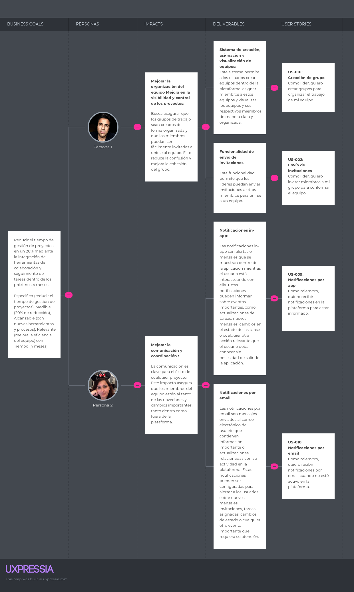

## 3.4. Product Backlog

A continuación se presenta el backlog de producto con las historias de usuario y tareas técnicas priorizadas para el desarrollo de Synhub

| Prioridad | Story ID | Título                                     | Descripción                                                                                   | SP |
|-----------|----------|--------------------------------------------|-----------------------------------------------------------------------------------------------|----|
| 1         | US-001   | Creación de grupo                          | Como líder, quiero crear grupos para organizar el trabajo de mi equipo.                       | 5  |
| 1         | US-004   | Creación de tareas                         | Como líder, quiero crear tareas para asignar trabajo a los miembros.                          | 5  |
| 1         | US-005   | Asignación de tareas                       | Como líder, quiero asignar tareas a miembros específicos para distribuir el trabajo.          | 5  |
| 1         | TS-001   | Gestión de grupos (CRUD)                   | Como developer, quiero gestionar grupos para crear, actualizar, consultar y eliminar equipos. | 5  |
| 1         | TS-005   | Gestión de tareas (CRUD)                   | Como developer, quiero crear, actualizar, obtener y eliminar tareas.                          | 5  |
| 1         | TS-013   | Autenticación (Login)                      | Como developer, quiero autenticar usuarios mediante JWT.                                      | 5  |
| 1         | TS-020   | Microservice Groups                        | Como developer, quiero gestionar grupos desde un servicio independiente.                      | 3  |
| 1         | TS-017   | Microservice Tasks                         | Como developer, quiero gestionar tareas de forma desacoplada.                                 | 3  |
| 2         | US-002   | Envío de invitaciones                      | Como líder, quiero invitar miembros a mi grupo para conformar el equipo.                      | 5  |
| 2         | US-007   | Actualización de estado                    | Como miembro, quiero actualizar el estado de mis tareas para reflejar mi progreso.            | 3  |
| 2         | US-021   | Visualización de tareas asignadas          | Como miembro, quiero ver las tareas que me han sido asignadas para gestionar mi trabajo.      | 3  |
| 2         | US-019   | Visualización de miembros del grupo        | Como líder, quiero ver la lista de miembros de mi grupo para gestionar la colaboración.       | 3  |
| 2         | TS-002   | Gestión de miembros en grupos              | Como developer, quiero agregar, listar y obtener miembros de grupos.                          | 3  |
| 2         | TS-006   | Asignación y consulta de tareas            | Como developer, quiero asignar tareas y consultarlas por miembro o grupo.                     | 3  |
| 2         | TS-007   | Gestión de estados de tareas               | Como developer, quiero actualizar estados de tareas.                                          | 3  |
| 2         | TS-014   | Gestión de usuarios                        | Como developer, quiero crear, editar y obtener usuarios.                                      | 3  |
| 3         | US-008   | Reprogramación de tareas                   | Como líder, quiero cambiar fechas límite cuando surgen imprevistos.                           | 2  |
| 3         | US-022   | Comentario en tareas                       | Como miembro, quiero comentar en las tareas para comunicarme con el líder.                    | 2  |
| 3         | US-009   | Notificaciones multicanal                  | Como miembro, quiero recibir notificaciones tanto en la plataforma como por email.            | 3  |
| 3         | TS-003   | Gestión de solicitudes de unión            | Como developer, quiero manejar solicitudes para unirse a grupos.                              | 3  |
| 3         | TS-004   | Procesamiento de solicitudes               | Como developer, quiero aceptar, rechazar o eliminar solicitudes.                              | 3  |
| 3         | TS-010   | Gestión de notificaciones                  | Como developer, quiero enviar y consultar notificaciones.                                     | 3  |
| 3         | TS-011   | Gestión de estado de notificaciones        | Como developer, quiero marcar notificaciones como leídas.                                     | 2  |
| 3         | TS-019   | Microservice Requests                      | Como developer, quiero gestionar solicitudes del sistema.                                     | 3  |
| 4         | US-010   | Gráfico de distribución de tareas          | Como líder, quiero ver un gráfico pastel con la distribución de tareas.                       | 3  |
| 4         | US-011   | Gráfico de estados de tareas               | Como líder, quiero ver un gráfico de barras con el estado de tareas.                          | 3  |
| 4         | US-012   | Reporte de reprogramaciones                | Como líder, quiero ver un gráfico de líneas de tareas reprogramadas.                          | 2  |
| 4         | US-013   | Reporte de productividad individual        | Como líder, quiero evaluar el desempeño de cada miembro.                                      | 2  |
| 4         | US-025   | Visualización de carga de trabajo          | Como líder, quiero ver la carga de trabajo por miembro.                                       | 1  |
| 4         | US-026   | Reporte de cumplimiento de plazos          | Como líder, quiero evaluar la eficiencia del equipo.                                          | 1  |
| 4         | TS-012   | Generación de reportes                     | Como developer, quiero generar y consultar reportes de métricas.                              | 5  |
| 4         | TS-018   | Microservice Metrics                       | Como developer, quiero generar métricas de tareas.                                            | 3  |
| 5         | US-014   | Solicitud de aprobación de tarea           | Como miembro, quiero enviar tareas completadas para validación.                               | 3  |
| 5         | US-015   | Validación de tareas                       | Como líder, quiero aprobar o rechazar tareas completadas.                                     | 3  |
| 5         | US-016   | Solicitud de extensión de plazo            | Como miembro, quiero pedir más tiempo para una tarea.                                         | 2  |
| 5         | US-017   | Histórico de validaciones                  | Como líder, quiero ver historial de aprobaciones.                                             | 2  |
| 5         | US-018   | Notificaciones de cambio de estado         | Como miembro, quiero recibir alertas de cambios.                                              | 2  |
| 6         | TS-015   | Cambio de contraseña                       | Como developer, quiero permitir actualizar contraseña.                                        | 2  |
| 6         | TS-016   | Microservice IAM                           | Como developer, quiero gestionar autenticación centralizada.                                  | 3  |
| 7         | US-029   | Recomendación de asignación de tareas      | Como líder, quiero que el sistema sugiera asignaciones.                                       | 5  |
| 7         | US-030   | Generación automática de resúmenes         | Como miembro, quiero resúmenes automáticos.                                                   | 3  |
| 7         | US-031   | Priorización inteligente de tareas         | Como miembro, quiero que el sistema ordene tareas automáticamente.                            | 3  |
| 7         | US-032   | Detección de sobrecarga de trabajo         | Como líder, quiero detectar miembros sobrecargados.                                           | 3  |
| 7         | US-033   | Recomendación de reprogramación            | Como líder, quiero sugerencias de nuevas fechas.                                              | 3  |
| 7         | TS-021   | Generación automática de resúmenes con IA  | Como developer, quiero generar resúmenes con IA.                                              | 5  |
| 7         | TS-022   | Algoritmo de priorización de tareas        | Como developer, quiero ordenar tareas automáticamente.                                        | 3  |
| 7         | TS-023   | Detección de sobrecarga de usuarios        | Como developer, quiero detectar usuarios sobrecargados.                                       | 3  |
| 7         | TS-024   | Motor de recomendaciones de reprogramación | Como developer, quiero sugerir nuevas fechas.                                                 | 3  |
| 7         | TS-025   | Integración con modelo de IA externo       | Como developer, quiero integrar un servicio de IA.                                            | 5  |
| 7         | TS-026   | Servicio de análisis de métricas para IA   | Como developer, quiero consumir métricas para IA.                                             | 3  |

# 4. Capítulo IV: Strategic-Level Software Design

## 4.1. Strategic-Level Attribute-Driven Design

### 4.1.1. Design Purpose

El propósito del diseño de la aplicación es proporcionar una plataforma integral para la gestión de grupos, miembros, tareas, notificaciones, reportes y procesos de validación, asegurando una experiencia de usuario consistente y funcional para ambos segmentos.

La aplicación tiene como objetivo principal facilitar la colaboración, la asignación de responsabilidades y el seguimiento de avances en equipos de trabajo, ofreciendo funcionalidades que van desde la organización de grupos y distribución de tareas, hasta la generación de métricas y reportes.

## Enfoque Arquitectónico

Desde el punto de vista arquitectónico, el diseño prioriza:

- **Escalabilidad:** Soportando un número elevado de usuarios, grupos y transacciones.
- **Seguridad:** Gestionando accesos y roles mediante autenticación y control de permisos.
- **Disponibilidad:** Asegura que la plataforma tenga una accesibilidad del 99% con mínimas interrupciones en la gestión de tareas y notificaciones.

### 4.1.2. Attribute-Driven Design Inputs

#### 4.1.2.1. Primary Functionality (Primary User Stories)

| Requisito Funcional         | US - ID | Título                                        |
|-----------------------------|---------|-----------------------------------------------|
| Gestión de grupos           | US-001  | Creación de grupo                             |
| Gestión de grupos           | US-002  | Envío de invitaciones                         |
| Gestión de Tareas           | US-004  | Creación de tareas                            |
| Gestión de Tareas           | US-005  | Asignación de tareas                          |
| Gestión de Tareas           | US-007  | Actualización de estado                       |
| Notificaciones Inteligentes | US-009  | Notificaciones in-app                         |
| Notificaciones Inteligentes | US-010  | Notificaciones por email                      |
| Analíticas y Reportes       | US-012  | Gráfico de distribución de tareas             |
| Analíticas y Reportes       | US-015  | Reporte de productividad individual           |
| Solicitudes y Validaciones  | US-016  | Solicitud de aprobación de tarea              |
| Solicitudes y Validaciones  | US-017  | Validación de tareas                          |
| Gestión de Usuarios         | US-025  | Configuración de preferencias de notificación |

#### 4.1.2.2. Quality attribute Scenarios

| ID   | Atributo de calidad | Fuente                                      | Estímulo                                         | Medioambiente                                         | Artefacto                               | Respuesta                                            | Medida                                                        |
|------|---------------------|---------------------------------------------|--------------------------------------------------|-------------------------------------------------------|-----------------------------------------|------------------------------------------------------|---------------------------------------------------------------|
| QA-1 | Disponibilidad      | Usuario que desea acceder a sus tareas      | Solicita ver la lista de tareas en tiempo real   | Aplicación en horario normal con tráfico promedio     | Servicio de gestión de tareas           | La aplicación devuelve la lista completa sin errores | Tiempo de respuesta < 2s y 99% de disponibilidad del servicio |
| QA-2 | Interoperabilidad   | Usuario que recibe notificaciones por email | Configurar preferencias de notificación          | Sistema conectado a la red, servicio de correo activo | Servicio de notificaciones inteligentes | Notificación enviada y recibida correctamente        | Porcentaje de emails entregados correctamente = 100%          |
| QA-3 | Modificabilidad     | Equipo de desarrollo                        | Agrega un nuevo tipo de gráfico de productividad | Entorno de desarrollo con datos de prueba             | Servicio de reportes y dashboards       | Nuevo gráfico integrado sin afectar funcionalidades  | Integración < 2 días y pruebas unitarias exitosas             |
| QA-4 | Performance         | Usuario genera reporte                      | Solicita reporte con gran volumen de datos       | Aplicación bajo carga alta                            | Servicio de generación de reportes      | Reporte generado correctamente con todos los datos   | Tiempo de generación < 10s                                    |
| QA-5 | Seguridad           | Usuario o atacante externo                  | Intento de acceso sin permisos                   | Aplicación y red funcionando normalmente              | Servicio de autenticación y usuarios    | Acceso bloqueado y registrado en logs                | 100% de accesos no autorizados bloqueados + logs generados    |
| QA-6 | Testeabilidad       | Equipo de QA                                | Ejecuta pruebas de creación de grupos y tareas   | Entorno de pruebas controlado                         | Servicios de gestión de grupos y tareas | Resultados registrados y reproducibles               | Cobertura de pruebas > 90%                                    |
| QA-7 | Usabilidad          | Usuario final                               | Intenta crear o editar grupo o tarea             | App móvil funcionando                                 | Interfaz de usuario                     | Usuario completa operación sin confusión             | Tiempo promedio < 2 min por operación                         |

#### 4.1.2.3. Constraints

| Factor | Constraint (restricción posible para la aplicación) |
|--------|--------------------------------------------------|
| Topología de la red | Si la red tiene alta latencia o está segmentada, las notificaciones in-app y la sincronización de tareas podrían retrasarse. **Ejemplo:** un miembro marcó una tarea como completada (US-007), pero el líder no recibió la notificación inmediatamente debido a problemas de red. |
| Uso de un proveedor de base de datos | Si solo se puede usar un tipo específico de base de datos, puede limitar la optimización de consultas complejas. **Ejemplo:** generar un reporte de productividad individual (US-015) puede tardar más si la base de datos no soporta consultas avanzadas de agregación eficientemente. |
| Entorno web / móvil | Configuraciones restrictivas podrían bloquear correos o integraciones externas. **Ejemplo:** las notificaciones por email (US-010) no llegan a los usuarios, porque el servidor de correo está bloqueado por el firewall de la red corporativa. |
| Servidores (hardware, sistema operativo) | Servidores con recursos limitados pueden causar lentitud en operaciones intensivas. **Ejemplo:** al generar gráficos de carga de trabajo por miembro (US-027), la visualización se retrasa cuando varios líderes acceden al dashboard simultáneamente. |
| Uso de software de terceros o tecnología particular | Dependencias de librerías externas puede generar incompatibilidades futuras. **Ejemplo:** el módulo de gráficos de barras (US-012 y US-013) deja de renderizar correctamente después de actualizar la versión de las librerías involucradas. |
| Cumplimiento de normas existentes | La aplicación debe cumplir con las políticas internas de la empresa sobre auditoría y registro de acciones de los usuarios. **Ejemplo:** cada actualización de estado de tarea (US-007) debe registrarse con el fin de tener un seguimiento. |

### 4.1.3. Architectural Drivers Backlog

En esta iteración, hemos priorizado los drivers de **usabilidad** y **mantenibilidad**, orientando el diseño hacia un componente de asignación de tareas que permita crear, asignar y dar seguimiento a tareas por usuario de manera intuitiva, manteniendo responsabilidades desacopladas para facilitar la evolución del sistema.

| Driver ID | Título de Driver | Descripción | Importancia (Stakeholders) | Impacto (Technical Complexity) |
|---|---|---|---|---|
| AD-01 | Usabilidad | El componente de asignación de tareas debe permitir la creación, asignación y seguimiento de tareas de forma simple, clara e intuitiva para los usuarios. | Alto | Medio |
| AD-02 | Mantenibilidad | El componente debe diseñarse con responsabilidades desacopladas para facilitar mantenimiento, pruebas y evolución del sistema. | Alto | Alto |
| AD-03 | Gestión de tareas por usuario | El sistema debe soportar la administración y seguimiento de tareas asignadas a cada usuario dentro del grupo. | Alto | Medio |
| AD-04 | Separación de responsabilidades | La arquitectura debe dividir interfaz, lógica de negocio y acceso a datos para reducir acoplamiento. | Alto | Alto |
| AD-05 | Consistencia de datos | La asignación y actualización de tareas debe preservar integridad y coherencia en estados y responsables. | Alto | Medio |

### 4.1.4. Architectural Design Decisions

El equipo evaluó decisiones arquitectónicas para el componente de asignación de tareas, considerando como drivers principales la <strong>usabilidad</strong> y la <strong>mantenibilidad</strong>. El objetivo fue definir una solución que permita crear, asignar y dar seguimiento a tareas por usuario, manteniendo una estructura desacoplada y fácil de evolucionar.

<table>
  <tr>
    <td rowspan="2"><strong>Driver ID</strong></td>
    <td rowspan="2"><strong>Título de Driver</strong></td>
    <td colspan="2"><strong>Pattern 1: Arquitectura en Capas</strong></td>
    <td colspan="2"><strong>Pattern 2: MVC</strong></td>
    <td colspan="2"><strong>Pattern 3: Event-Driven</strong></td>
  </tr>
  <tr>
    <td><strong>Pro</strong></td>
    <td><strong>Con</strong></td>
    <td><strong>Pro</strong></td>
    <td><strong>Con</strong></td>
    <td><strong>Pro</strong></td>
    <td><strong>Con</strong></td>
  </tr>

  <tr>
    <td>AD-01</td>
    <td>Usabilidad</td>
    <td>Permite interfaces claras separando responsabilidades</td>
    <td>No gestiona interacción en tiempo real por sí sola</td>
    <td>Organiza bien la interacción UI</td>
    <td>Puede centrarse demasiado en la interfaz</td>
    <td>Permite actualización dinámica</td>
    <td>Aumenta complejidad innecesaria</td>
  </tr>

  <tr>
    <td>AD-02</td>
    <td>Mantenibilidad</td>
    <td>Bajo acoplamiento y alta modularidad</td>
    <td>Puede volverse rígida si se diseña mal</td>
    <td>Estructura simple</td>
    <td>No escala bien en backend complejo</td>
    <td>Desacopla componentes</td>
    <td>Difícil de depurar</td>
  </tr>

  <tr>
    <td>AD-03</td>
    <td>Gestión de tareas por usuario</td>
    <td>Facilita reglas de negocio</td>
    <td>Mayor estructura inicial</td>
    <td>Adecuado para CRUD</td>
    <td>Menor claridad en lógica compleja</td>
    <td>Útil para eventos derivados</td>
    <td>No ideal como base principal</td>
  </tr>

  <tr>
    <td>AD-04</td>
    <td>Separación de responsabilidades</td>
    <td>Alta</td>
    <td>Requiere disciplina</td>
    <td>Media</td>
    <td>Menos estructurada</td>
    <td>Alta</td>
    <td>No cubre toda la arquitectura</td>
  </tr>

  <tr>
    <td>AD-05</td>
    <td>Consistencia de datos</td>
    <td>Centraliza validaciones</td>
    <td>Puede requerir coordinación</td>
    <td>Simple</td>
    <td>Riesgo de mezclar lógica</td>
    <td>Útil en procesos asíncronos</td>
    <td>Complica consistencia inmediata</td>
  </tr>

</table>

 

<strong>Decisión:</strong> Hemos seleccionado la <strong>Arquitectura en Capas</strong> como patrón principal por su alta mantenibilidad y separación de responsabilidades. Se complementa con <strong>Event-Driven</strong> para notificaciones y eventos derivados.

### 4.1.5. Quality Attribute Scenario Refinements

<table>
  <tr>
    <td colspan="3"><strong>Scenario Refinement for Scenario 1</strong></td>
  </tr>
  <tr>
    <td colspan="2"><strong>Scenario(s):</strong></td>
    <td>Usabilidad en la asignación de tareas</td>
  </tr>
  <tr>
    <td colspan="2"><strong>Business Goals:</strong></td>
    <td>Facilitar la adopción del sistema y mejorar la experiencia del usuario al crear, asignar y revisar tareas.</td>
  </tr>
  <tr>
    <td colspan="2"><strong>Relevant Quality Attributes:</strong></td>
    <td>Usabilidad</td>
  </tr>
  <tr>
    <td></td>
    <td><strong>Stimulus:</strong></td>
    <td>El usuario necesita crear, asignar o revisar una tarea dentro del sistema.</td>
  </tr>
  <tr>
    <td rowspan="5"><strong>Scenario Components</strong></td>
    <td><strong>Stimulus Source:</strong></td>
    <td>Usuario autenticado</td>
  </tr>
  <tr>
    <td><strong>Environment:</strong></td>
    <td>Operación normal del sistema</td>
  </tr>
  <tr>
    <td><strong>Artifact (if Known)</strong></td>
    <td>Componente de asignación de tareas</td>
  </tr>
  <tr>
    <td><strong>Response:</strong></td>
    <td>El sistema permite realizar la acción de forma clara, rápida e intuitiva, mostrando retroalimentación inmediata.</td>
  </tr>
  <tr>
    <td><strong>Response Measure:</strong></td>
    <td>El usuario completa la acción en pocos pasos, sin errores y sin necesidad de ayuda externa.</td>
  </tr>
  <tr>
    <td colspan="2"><strong>Questions:</strong></td>
    <td>¿Cuántos pasos se requieren para asignar una tarea? ¿Qué feedback recibe el usuario? ¿Qué acciones deben ser visibles?</td>
  </tr>
  <tr>
    <td colspan="2"><strong>Issues:</strong></td>
    <td>No se han definido métricas exactas de tiempo o interacción. Falta detallar validaciones de interfaz.</td>
  </tr>
</table>

 

<table>
  <tr>
    <td colspan="3"><strong>Scenario Refinement for Scenario 2</strong></td>
  </tr>
  <tr>
    <td colspan="2"><strong>Scenario(s):</strong></td>
    <td>Mantenibilidad del componente de tareas</td>
  </tr>
  <tr>
    <td colspan="2"><strong>Business Goals:</strong></td>
    <td>Permitir cambios futuros en el sistema sin afectar otros módulos.</td>
  </tr>
  <tr>
    <td colspan="2"><strong>Relevant Quality Attributes:</strong></td>
    <td>Mantenibilidad</td>
  </tr>
  <tr>
    <td></td>
    <td><strong>Stimulus:</strong></td>
    <td>Se requiere modificar la lógica del componente de tareas (nuevas reglas o funcionalidades).</td>
  </tr>
  <tr>
    <td rowspan="5"><strong>Scenario Components</strong></td>
    <td><strong>Stimulus Source:</strong></td>
    <td>Desarrollador</td>
  </tr>
  <tr>
    <td><strong>Environment:</strong></td>
    <td>Mantenimiento o evolución del sistema</td>
  </tr>
  <tr>
    <td><strong>Artifact (if Known)</strong></td>
    <td>Componente de asignación de tareas</td>
  </tr>
  <tr>
    <td><strong>Response:</strong></td>
    <td>El cambio se realiza de manera localizada sin afectar otros componentes.</td>
  </tr>
  <tr>
    <td><strong>Response Measure:</strong></td>
    <td>Bajo impacto en otros módulos y facilidad de pruebas tras el cambio.</td>
  </tr>
  <tr>
    <td colspan="2"><strong>Questions:</strong></td>
    <td>¿Cómo se separan las responsabilidades? ¿Qué cambios futuros se esperan? ¿Qué partes deben estar desacopladas?</td>
  </tr>
  <tr>
    <td colspan="2"><strong>Issues:</strong></td>
    <td>No están definidos completamente los límites entre capas. Falta estrategia de pruebas para cambios futuros.</td>
  </tr>
</table>

## 4.2. Strategic-Level Domain-Driven Design

En esta sección se presenta el enfoque adoptado para la toma de decisiones estratégicas en el desarrollo del sistema, aplicando los principios del Domain-Driven Design (DDD). El objetivo principal consistió en identificar y establecer los límites naturales del dominio, descomponiendo la solución en contextos delimitados (Bounded Contexts).

Para llevar a cabo dicha descomposición, el equipo empleó herramientas colaborativas clave, tales como el Event Storming, que permite mapear y visualizar de manera dinámica los flujos de eventos, comandos y actores dentro del dominio; y el Bounded Context Canvas, utilizado para definir los elementos esenciales de cada contexto, incluyendo objetivos, modelos, responsabilidades y relaciones con otros contextos.

Dicho proceso estratégico permite no solo estructurar el sistema de forma más coherente, sino también alinear las decisiones técnicas con los objetivos de negocio, facilitando la comunicación entre los distintos actores involucrados en el desarrollo del proyecto.

### 4.2.1. EventStorming

En esta sección se expone y justifica el proceso de EventStorming ejecutado por el equipo, con el fin de construir una aproximación inicial al modelado general del dominio del problema. Dicha técnica, centrada en la identificación de eventos relevantes dentro del sistema, facilita la captura del conocimiento colectivo de los participantes y promueve conversaciones fundamentales acerca del comportamiento esperado del sistema ante diversos escenarios.

La sesión fue planificada estratégicamente con una duración comprendida entre una y dos horas. Durante esta actividad, se emplearon notas adhesivas digitales para representar eventos y comandos, lo que permite una exploración visual e iterativa del flujo de trabajo.

### 4.2.2. Candidate Context Discovery

Una vez concluida la sesión de Event Storming, se llevó a cabo un análisis detallado de los eventos identificados con el propósito de descubrir los contextos candidatos potencialmente relevantes para el dominio del problema. Dicho análisis consistió en la identificación de patrones y relaciones entre los eventos, así como en la evaluación de su impacto sobre el sistema. Como resultado, se establecieron agrupaciones de eventos pertenecientes a un mismo proceso de acción dentro de la aplicación.

A continuación se muestra con detalle las líneas de acción creadas:

**Creación de grupo**

**Asignación de tareas**

**Modificación de tareas**

**Cumplimiento de tareas**

**Incumplimiento de tareas**

Una vez creadas las líneas de acción se buscó encontrar los "pain points", solo se tuvo que modificar la línea de acción de creación de grupo. 

**Creación de grupo**

Una vez terminadas las líneas de acción se buscó encontrar los "pivotal point", los cuales son eventos que pueden cambiar el flujo de la aplicación.
Los pivotal point encontrados fueron:

- La creación de un grupo
- La creación de una tarea
- La modificación de una tarea
- La asignación de una tarea
- Acciones que requieran enviar notificaciones
- El cumplimiento de tareas
- El incumplimiento de tareas

Gracias a encontrar los pivotal points se pudo identificar como los distintos eventos formaban parte de distintos contextos, los cuales son:

- Líderes
- Notificaciones
- Tareas
- Métricas
- Solicitudes

Finalmente se dividio cada evento en comandos, eventos, agregados, vistas y entidades, los cuales son los siguientes:

**Líderes**

**Notificaciones**

**Tareas**

**Métricas**

**Solicitudes**

### 4.2.3. Domain Message Flows Modeling

Como siguiente paso se buscó interconectar los bounded contexts encontrados en la sección anterior, para esto se buscó encontrar los eventos que se comunican entre los distintos contextos.

**Líderes y Notificaciones:** 
Al generar una invitación de grupo se envía una notificación al usuario invitado, y al aceptar la invitación se envía una notificación al creador del grupo.

**Tareas y Notificaciones:** 
Al crear una tarea se envía una notificación al usuario asignado, y al cumplir la tarea se envía una notificación al creador de la tarea.

**Notificaciones y Solicitudes:** 
Al momento de marcarse tareas como completadas o no completadas se envía una notificación al coordinador. Al asignar reprogramar tareas se enviará notificaciones al usuario antiguo y al nuevo usuario al que pertenece la tarea. Al modificar(actualizar, reprogramar o eliminar) tareas se enviará una notificación a todos los involucrados (coordinadores e integrantes).

**Solicitudes y Métricas:** Al validarse si se completó o no una tarea se crean o modifican las estadísticas de progreso grupal.

Finalmente se muestra una captura global de la arquitectura del sistema, donde se puede ver la interacción entre los distintos componentes y como se comunican entre ellos.

Enlace del Miro board sobre el que se trabajo: https://miro.com/app/board/uXjVHf1ECEI=/?share_link_id=687998549144

### 4.2.4. Bounded Context Canvases

En esta sección se desarrolla la descomposición estratégica del dominio a través de la elaboración de los Bounded Context Canvases, con el propósito de identificar y delimitar áreas funcionalmente coherentes dentro del sistema. Dicha práctica constituye una parte esencial del enfoque de Domain-Driven Design (DDD), dado que permite clarificar los límites semánticos y técnicos entre las distintas porciones del sistema, reduciendo la complejidad y favoreciendo la evolución independiente de cada componente.

El equipo ha definido previamente un conjunto de contextos delimitados candidatos, ordenados de acuerdo con su importancia funcional y estratégica. Con base en esta priorización, se procede al diseño iterativo de los Bounded Context Canvases. Cada canvas incorpora los siguientes elementos clave:

- **Context Overview Definition:** para comprender el propósito y el alcance del contexto.
- **Business Rules Distillation & Ubiquitous Language Capture:** para identificar las reglas de negocio fundamentales y establecer un lenguaje común entre los actores involucrados y los desarrolladores.
- **Capability Analysis y Capability Layering:** para entender las capacidades funcionales que ofrece el contexto y, si resulta necesario, organizarlas en capas.
- **Dependencies Capture:** para reconocer las relaciones con otros contextos y sus posibles implicaciones.
- **Design Critique:** para revisar y perfeccionar el diseño propuesto desde una perspectiva crítica y colaborativa.

**Líderes - Canvas**

**Tareas - Canvas**

**Solicitudes - Canvas**

**Notificaciones - Canvas**

**Métricas - Canvas**

### 4.2.5. Context Mapping

El Context Mapping constituye una técnica fundamental dentro del enfoque estratégico del Domain-Driven Design (DDD), pues permite visualizar y comprender el modo en que interactúan los distintos contextos delimitados (Bounded Contexts) en un sistema complejo. Mediante esta herramienta, se identifican las relaciones, dependencias y límites de comunicación entre contextos, definiendo con claridad los flujos de información, los tipos de colaboración (tales como Customer/Supplier, Conformist, Partnership o Anticorruption Layer) y el empleo de patrones como Open Host Service.

El propósito del Context Mapping radica en facilitar una arquitectura de software más modular, mantenible y alineada con el dominio del negocio, permitiendo que cada contexto evolucione de manera autónoma sin generar acoplamientos innecesarios. Esta representación también respalda la toma de decisiones relativas a integraciones, responsabilidades y coordinación entre equipos.

| Destino (Downstream)       | Origen (Upstream)           | Tipo de Relación | ¿OHS? | Comentario                                                              |
| -------------------------- | --------------------------- | ----------------- | ------ | ----------------------------------------------------------------------- |
| Métricas      | Líderes         | Customer/Supplier | No     | Expone información grupal                                                      |
| Solicitudes | Líderes          | Customer/Supplier | Si     | Se nutre de los datos de los integrantres                               |
| Tareas        | Líderes       | Customer/Supplier | No     | Obtiene información de los integrantes de grupo                        |
| Tareas       | Solicitudes | Partnership       | No     | Comparte información entre sí de las tareas                           |
| Métricas     | Tareas     | Customer/Supplier | Si     | Se nutre de la información de las tareas para elaborar reportes        |
| Métricas     | Solicitudes  | Customer/Supplier | No     | Obtiene la infomración de actualización de cambios y solicitudes       |
| Notificaciones             | Líderes, Solicitudes, Tareas | Partnership       | No     | Emite notificaciones según instrucciones de los demás bounded context |

## 4.3. Software Architecture

La arquitectura del sistema se organiza en tres niveles. En primer lugar, el Context Diagram define las interacciones externas entre SynHub —núcleo del sistema—, sus usuarios (Miembro y Líder) y servicios externos como Cloudinarym, Gemini y Sendgrid. En segundo lugar, el Container Diagram descompone SynHub en módulos fundamentales (Mobile App, API REST, PostgreSQL y Landing Page), especificando sus responsabilidades y los mecanismos de comunicación interna. Finalmente, el Deployment Diagram detalla el despliegue físico y en la nube de estos componentes, abarcando servidores, dispositivos móviles y conexiones con APIs externas. En conjunto, estos diagramas garantizan un diseño escalable, integrado y adecuadamente estructurado.

### 4.3.1. Software Architecture System Landscape Diagram

El System Landscape diagrama representa el nivel inicial y de mayor abstracción en el modelo C4, diseñado para ofrecer una visión panorámica de la infraestructura tecnológica dentro de un contexto organizacional o de negocio. Este esquema articula la posición de un sistema de software específico en relación con otros sistemas externos, usuarios finales y actores institucionales, facilitando la identificación de dependencias, puntos de integración y límites del ecosistema completo. Su función principal es comunicar el alcance del proyecto a audiencias técnicas y no técnicas, estableciendo un marco de referencia que permite comprender el rol funcional y la interoperabilidad de la solución desarrollada dentro de un entorno complejo.

### 4.3.2. Software Architecture Context Level Diagrams

El Context Diagram muestra a SynHub (el sistema central) interactuando con sus usuarios principales —el Miembro y el Líder— quienes utilizan la aplicación para gestionar actividades, mientras que SynHub se integra con Gemini, Cloudinary y Sendgrid. Este diagrama enfatiza las relaciones externas del sistema, sin detallar componentes internos, destacando cómo los actores clave (usuarios y servicios externos) se conectan con la plataforma principal para intercambiar información.

### 4.3.3. Software Architecture Container Level Diagrams

El diagrama de contenedores de **SynHub** propone una arquitectura de microservicios robusta y altamente desacoplada, fundamentada en la especialización de responsabilidades. En la capa de acceso, el **API Gateway** unifica la interacción del usuario final, delegando la localización física de los componentes al **Discovery Server**, lo cual permite un despliegue dinámico y escalable. La lógica de negocio se fragmenta en contenedores independientes —tales como IAM, Groups, Tasks, Requests, Metrics, Cloudinary, Email y AI Service—, algunos con persistencia de datos propia, garantizando un aislamiento óptimo. La comunicación síncrona mediante **REST/HTTPS** asegura una respuesta inmediata en operaciones críticas, mientras que la integración asíncrona a través del **Broker (RabbitMQ)** mediante el protocolo **AMQP** permite gestionar eventos de forma eficiente, desacoplando los servicios y fortaleciendo la resiliencia del sistema ante posibles fallos. Finalmente, la externalización de servicios complejos como **Gemini** para procesamiento de lenguaje, **Cloudinary** para gestión multimedia y **SendGrid** para notificaciones, consolida a SynHub como una plataforma moderna que aprovecha un ecosistema de servicios especializados para optimizar la experiencia de gestión de tareas.

Parte del usuario:

Parte de microservicios principales:

Parte de servicios externos:

### 4.3.4. Software Architecture Deployment Diagrams

El diagrama de despliegue, integrado en el nivel más físico del modelo C4 y en el estándar UML, es la representación técnica de la arquitectura de sistema sobre su infraestructura de ejecución. Su propósito fundamental es describir cómo los componentes de software (artefactos) se asignan, configuran y distribuyen en los nodos de hardware o entornos virtuales (como servidores, contenedores o servicios en la nube).

Este diagrama detalla la topología de la red, las dependencias entre los componentes de software y su ubicación física o lógica, permitiendo comprender la escalabilidad, la disponibilidad y la resiliencia del sistema en el entorno de producción. En esencia, actúa como el puente definitivo entre el diseño lógico del software y la realidad operativa, ilustrando el despliegue físico de los servicios, bases de datos y herramientas de soporte que conforman la solución.

Parte de interacción de usuarios:

Parte de microservicios:

# 5. Capítulo V: Tactical-Level Software Design

## 5.1. Bounded Context: Iam

### 5.1.1. Domain Layer

La Capa de Dominio del Bounded Context de IAM es el núcleo de la lógica de negocio para la seguridad y gestión de identidades. En esta capa se define el Aggregate Root: User, que actúa como la unidad de consistencia principal, asegurando que las reglas de autenticación y la vinculación con perfiles de negocio (Member/Leader) se cumplan rigurosamente.

<strong style="font-size: 1.2em;">Aggregate Root: `User`</strong>

Descripción: Es el Agregado Raíz que representa la identidad de un usuario. Aunque se implementa técnicamente como una entidad JPA para su persistencia, en el diseño táctico actúa como la raíz que encapsula el estado de seguridad, los datos personales y la relación con los roles y perfiles externos mediante Value Objects.

| Atributo          | Tipo           | Visibilidad | Invariante / Regla de negocio                                                                       |
| :---------------- | :------------- | :---------- | :-------------------------------------------------------------------------------------------------- |
| `id`              | Long           | Private     | Único y obligatorio. Heredado de AuditableAbstractAggregateRoot.                                   |
| `username`        | String         | Private     | No nulo ni vacío. Debe ser único en la base de datos y tener una longitud máxima de 50 caracteres. |
| `name`            | String         | Private     | No nulo. Máximo 50 caracteres. Representa el nombre legal del usuario.                             |
| `surname`         | String         | Private     | No nulo. Máximo 50 caracteres. Representa el apellido legal del usuario.                           |
| `imgUrl`          | String         | Private     | Obligatorio. Debe ser una URL válida con un máximo de 1024 caracteres.                             |
| `email`           | String         | Private     | Único y obligatorio. Debe seguir el formato de correo electrónico estándar. No puede duplicarse.   |
| `password`        | String         | Private     | No nulo. Debe almacenarse mediante un hash seguro. Longitud máxima en BD de 120 caracteres.       |
| `roles`           | Set<Role>      | Private     | Estado consistente. Nunca puede ser nulo; se inicializa como un HashSet vacío. Al persistirse, debe tener al menos un rol asignado. |
| `leaderId`        | LeaderId       | Private     | Opcional. Si está presente, el valor interno debe ser un entero positivo (>0).                     |
| `memberId`        | MemberId       | Private     | Opcional. Si está presente, el valor interno debe ser un entero positivo (>0).                     |

<strong style="font-size: 1em;">Métodos</strong>

| Nombre del Método      | Tipo Retorno | Visibilidad | Descripción / Regla de Negocio                                                                          |
| :--------------------- | :----------- | :---------- | :------------------------------------------------------------------------------------------------------- |
| `User()`               | N/A          | Public      | Constructor por defecto. Inicializa el conjunto de roles como un HashSet vacío.                         |
| `User(username, ...)` | N/A          | Public      | Constructor sobrecargado para la creación de usuarios con datos básicos.                                |
| `addRole(role)`        | User         | Public      | Añade un objeto Role al conjunto de roles del usuario. Retorna la instancia de User.                    |
| `addRoles(roles)`      | User         | Public      | Valida y añade una lista de roles. Utiliza Role.validateRoleSet para asegurar la consistencia.         |

<strong style="font-size: 1.2em;">Entity: `Role`</strong>

Descripción: Define las capacidades o permisos asignados a una identidad.

| Atributo | Tipo           | Visibilidad | Invariante / Regla de negocio                                                          |
| :------- | :------------- | :---------- | :-------------------------------------------------------------------------------------- |
| `id`     | Long           | Private     | Identificador único de la entidad generado por estrategia IDENTITY.                     |
| `name`   | Roles (Enum)   | Private     | Representación del rol como String en la base de datos (ROLE_USER, etc.).              |

<strong style="font-size: 1em;">Métodos</strong>

| Nombre del Método        | Tipo Retorno | Visibilidad      | Descripción / Regla de Negocio                                                         |
| :----------------------- | :----------- | :--------------- | :-------------------------------------------------------------------------------------- |
| `getStringName()`        | String       | Public           | Retorna el nombre del enumerado Roles como una cadena de texto.                         |
| `getDefaultRole()`       | Role         | Public (Static)  | Retorna una nueva instancia de Role con el valor ROLE_USER.                            |
| `toRoleFromName(name)`   | Role         | Public (Static)  | Convierte una cadena de texto al enumerado correspondiente y retorna el Role.           |
| `validateRoleSet(roles)` | List<Role>   | Public (Static)  | Si la lista es nula o vacía, retorna una lista con el rol por defecto (ROLE_USER).     |

<strong style="font-size: 1.2em;">Value Object: `Roles (Enumeration)`</strong>

| Atributo       | Tipo         | Visibilidad | Invariante / Regla de negocio                                                                  |
| :------------- | :----------- | :---------- | :--------------------------------------------------------------------------------------------- |
| `ROLE_USER`    | Enum Value   | N/A         | Rol asignado por defecto a cualquier cuenta creada.                                            |
| `ROLE_LEADER`  | Enum Value   | N/A         | Identifica a un usuario con capacidades de gestión en el sistema.                              |
| `ROLE_MEMBER`  | Enum Value   | N/A         | Identifica a un usuario que participa como colaborador en los flujos de trabajo.               |

### 5.1.2. Interface Layer

La Capa de Interfaz de IAM gestiona la exposición de los servicios de seguridad, autenticación y gestión de usuarios hacia el exterior. Utiliza controladores REST para la comunicación síncrona y recursos (DTOs) para estructurar el intercambio de datos entre el cliente y el servidor.

<strong style="font-size: 1.2em;">Recursos de entrada (Request)</strong>

<strong style="font-size: 1em;">`SignUpResource`</strong>

Propósito: Representa los datos necesarios para registrar un nuevo usuario en la plataforma.

| Campo      | Tipo    | Descripción                           |
| :--------- | :------ | :------------------------------------ |
| `username` | String  | Nombre de usuario único.              |
| `name`     | String  | Nombre del usuario.                   |
| `surname`  | String  | Apellido del usuario.                 |
| `imgUrl`   | String  | URL de la imagen de perfil.           |
| `email`    | String  | Correo electrónico único.             |
| `password` | String  | Contraseña para la cuenta.            |
| `roles`    | List    | Lista de nombres de roles solicitados.|

---

<strong style="font-size: 1em;">`SignInResource`</strong>

Propósito: Contiene las credenciales para la autenticación de un usuario.

| Campo      | Tipo    | Descripción                      |
| :--------- | :------ | :------------------------------- |
| `username` | String  | Nombre de usuario registrado.    |
| `password` | String  | Contraseña asociada a la cuenta. |

---

<strong style="font-size: 1.2em;">Recursos de salida (Response)</strong>

<strong style="font-size: 1em;">`UserResource`</strong>

Propósito: Devuelve la información completa del usuario, incluyendo sus perfiles específicos (Líder o Miembro) según su rol.

| Campo      | Tipo                    | Descripción                      |
| :--------- | :---------------------- | :------------------------------- |
| `id`       | Long                    | Identificador único del usuario. |
| `username` | String                  | Nombre de usuario.               |
| `name`     | String                  | Nombre del usuario.              |
| `surname`  | String                  | Apellido del usuario.            |
| `imgUrl`   | String                  | URL de la imagen de perfil.      |
| `email`    | String                  | Correo electrónico.              |
| `leader`   | UserLeaderResource      | Información detallada de líder.  |
| `member`   | UserMemberResource      | Información detallada de miembro.|
| `roles`    | List<String>            | Lista de roles asignados.        |

---

<strong style="font-size: 1em;">`AuthenticatedUserResource`</strong>

Propósito: Retorna la información básica del usuario junto con el token de acceso tras un inicio de sesión exitoso.

| Campo      | Tipo    | Descripción                      |
| :--------- | :------ | :------------------------------- |
| `id`       | Long    | Identificador único del usuario. |
| `username` | String  | Nombre de usuario.               |
| `token`    | String  | Token de autenticación (JWT).    |

---

<strong style="font-size: 1em;">`RoleResource`</strong>

Propósito: Representa la información de un rol disponible en el sistema.

| Campo | Tipo   | Descripción          |
| :---- | :----- | :------------------- |
| `id`  | Long   | Identificador del rol.|
| `name`| String | Nombre del rol.      |

---

<strong style="font-size: 1.2em;">Resumen de recursos</strong>

| Recurso                    | Tipo     | Dirección | Propósito principal                                |
| :------------------------- | :------- | :-------- | :------------------------------------------------- |
| `SignUpResource`           | Request  | Entrada   | Registrar un nuevo usuario.                        |
| `SignInResource`           | Request  | Entrada   | Autenticar a un usuario existente.                 |
| `UserResource`             | Response | Salida    | Representación detallada de un usuario.            |
| `RoleResource`             | Response | Salida    | Información de roles del sistema.                  |
| `AuthenticatedUserResource`| Response | Salida    | Confirmación de acceso y entrega de token.         |

---

<strong style="font-size: 1.2em;">Controllers</strong>

<strong style="font-size: 1em;">`1. AuthenticationController`</strong>

Propósito: Gestiona los flujos de registro e inicio de sesión.

Dependencias inyectadas:

| Dependencia            | Tipo                  | Propósito                                      |
| :--------------------- | :-------------------- | :--------------------------------------------- |
| `userCommandService`   | UserCommandService    | Procesar comandos de creación y autenticación. |

Endpoints expuestos:

| Método | Endpoint                           | Descripción                                      | Servicio invocado                    |
| :----- | :--------------------------------- | :----------------------------------------------- | :----------------------------------- |
| POST   | `/api/v1/authentication/sign-up`   | Registra un nuevo usuario y crea su perfil según rol. | `userCommandService.handle(SignUpCommand)` |
| POST   | `/api/v1/authentication/sign-in`   | Autentica al usuario y devuelve el token JWT.   | `userCommandService.handle(SignInCommand)` |

<strong style="font-size: 1em;">`2. UsersController`</strong>

Propósito: Permite la consulta de información de usuarios mediante diferentes criterios de búsqueda.

Dependencias inyectadas:

| Dependencia          | Tipo               | Propósito                                      |
| :------------------- | :----------------- | :--------------------------------------------- |
| `userQueryService`   | UserQueryService   | Ejecutar consultas sobre los usuarios registrados. |

Endpoints expuestos:

| Método | Endpoint                          | Descripción                                      | Servicio invocado                          |
| :----- | :-------------------------------- | :----------------------------------------------- | :----------------------------------------- |
| GET    | `/api/v1/users`                  | Obtiene la lista de todos los usuarios.         | `userQueryService.handle(GetAllUsersQuery)` |
| GET    | `/api/v1/users/{userId}`         | Obtiene un usuario específico por su ID.        | `userQueryService.handle(GetUserByIdQuery)` |
| GET    | `/api/v1/users?username={u}`     | Busca un usuario por su nombre de usuario.      | `userQueryService.handle(GetUserByUsernameQuery)` |
| GET    | `/api/v1/users?memberId={id}`    | Busca el usuario asociado a un ID de miembro.   | `userQueryService.handle(GetUserByMemberIdQuery)` |

<strong style="font-size: 1em;">`3. RolesController`</strong>

Propósito: Proporciona acceso a la lista de roles configurados en la aplicación.

Dependencias inyectadas:

| Dependencia            | Tipo                | Propósito                        |
| :--------------------- | :------------------ | :------------------------------- |
| `roleQueryService`     | RoleQueryService    | Consultar los roles existentes.  |

Endpoints expuestos:

| Método | Endpoint          | Descripción                                           | Servicio invocado                      |
| :----- | :---------------- | :---------------------------------------------------- | :------------------------------------- |
| GET    | `/api/v1/roles`   | Lista todos los roles disponibles (USER, LEADER, MEMBER). | `roleQueryService.handle(GetAllRolesQuery)` |

---

### 5.1.3. Application Layer

<strong style="font-size: 1.2em;">Servicios de Aplicación (Command Services)</strong>

<strong style="font-size: 1em;">`1. UserCommandServiceImpl`</strong>

Propósito: Gestionar el ciclo de vida de las credenciales de usuario, el proceso de autenticación segura y la coordinación de la creación de perfiles mediante eventos de integración.

Dependencias inyectadas:

| Dependencia            | Tipo                | Propósito                                                          |
| :--------------------- | :------------------ | :---------------------------------------------------------------- |
| `roleRepository`       | RoleRepository      | Acceder a la persistencia de roles para asignación en el registro. |
| `userRepository`       | UserRepository      | Gestionar la persistencia y búsqueda de los agregados User.        |
| `hashingService`       | HashingService      | Encriptar contraseñas y verificar hashes durante el login.         |
| `tokenService`         | TokenService        | Generar tokens JWT para sesiones autenticadas.                     |
| `leaderPublisher`      | LeaderPublisher     | Publicar eventos de creación de líder hacia RabbitMQ.             |
| `memberPublisher`      | MemberPublisher     | Publicar eventos de creación de miembro hacia RabbitMQ.           |

Comandos manejados:

| Comando                      | Proceso / Regla de Negocio                                                                                      |
| :--------------------------- | :-------------------------------------------------------------------------------------------------------------- |
| `SignUpCommand`              | Valida que el username/email no existan, cifra la contraseña, busca los roles en el repositorio y persiste el nuevo usuario. |
| `SignInCommand`              | Verifica la existencia del usuario y la validez del password; si es exitoso, genera un UserDetails y retorna el usuario con su token. |
| `CreateUserLeaderCommand`    | Dispara el flujo asíncrono para que el microservicio de grupos cree un perfil de líder para el usuario especificado. |
| `CreateUserMemberCommand`    | Dispara el flujo asíncrono para que el microservicio de tareas cree un perfil de miembro para el usuario especificado. |
| `UpdateUserLeaderIdCommand`  | Actualiza de forma atómica el Value Object LeaderId dentro del agregado User una vez confirmada la creación externa. |
| `UpdateUserMemberIdCommand`  | Actualiza de forma atómica el Value Object MemberId dentro del agregado User una vez confirmada la creación externa. |

---

<strong style="font-size: 1em;">`2. RoleCommandServiceImpl`</strong>

Propósito: Garantizar la integridad de los datos maestros de seguridad inicializando los roles del sistema.

Dependencias inyectadas:

| Dependencia       | Tipo              | Propósito                                                 |
| :---------------- | :---------------- | :-------------------------------------------------------- |
| `roleRepository`  | RoleRepository    | Verificar existencia y persistir los roles definidos en el dominio. |

Comandos manejados:

| Comando              | Proceso / Regla de Negocio                                                                  |
| :------------------- | :------------------------------------------------------------------------------------------ |
| `SeedRolesCommand`   | Itera sobre el enumerado Roles y registra en la base de datos aquellos que aún no estén presentes. |

---

<strong style="font-size: 1.2em;">Servicios de Aplicación (Query Services)</strong>

<strong style="font-size: 1em;">`1. UserQueryServiceImpl`</strong>

Propósito: Proveer acceso a la información de usuarios, integrando datos locales con información detallada de perfiles proveniente de otros microservicios.

Dependencias inyectadas:

| Dependencia            | Tipo                  | Propósito                                                            |
| :--------------------- | :-------------------- | :------------------------------------------------------------------ |
| `userRepository`       | UserRepository        | Consultar la información básica y credenciales de los usuarios.      |
| `groupsServiceClient`  | GroupsServiceClient   | Recuperar información del perfil de Líder desde el microservicio de grupos. |
| `tasksServiceClient`   | TasksServiceClient    | Recuperar información del perfil de Miembro desde el microservicio de tareas. |

Consultas manejadas:

| Consulta (Query)       | Descripción                                                                              |
| :--------------------- | :--------------------------------------------------------------------------------------- |
| `GetAllUsersQuery`     | Retorna una lista de todos los usuarios registrados en el sistema.                       |
| `GetUserByIdQuery`     | Obtiene la información de un usuario a partir de su ID único.                            |
| `GetUserByUsernameQuery` | Busca un usuario mediante su nombre de cuenta.                                          |
| `GetUserLeaderByIdQuery` | Combina los datos del usuario local con los detalles del líder obtenidos vía WebClient. |
| `GetUserMemberByIdQuery` | Combina los datos del usuario local con los detalles del miembro obtenidos vía WebClient. |

---

<strong style="font-size: 1em;">`2. RoleQueryServiceImpl`</strong>

Propósito: Facilitar la consulta de los privilegios y roles disponibles.

Dependencias inyectadas:

| Dependencia       | Tipo              | Propósito                             |
| :---------------- | :---------------- | :------------------------------------ |
| `roleRepository`  | RoleRepository    | Acceder a la lista de roles persistidos. |

Consultas manejadas:

| Consulta (Query)    | Descripción                                                     |
| :------------------ | :-------------------------------------------------------------- |
| `GetAllRolesQuery`  | Recupera el catálogo completo de roles del sistema.             |
| `GetRoleByNameQuery`| Obtiene un rol específico filtrando por su nombre técnico.      |

---

### 5.1.4. Infrastructure Layer

<strong style="font-size: 1.2em;">Persistence: Repositories (Spring Data JPA)</strong>

Se utiliza Spring Data JPA con una estrategia de nombrado `SnakeCaseWithPluralizedTable` para mapear los objetos de dominio a una base de datos relacional PostgreSQL.

| Repositorio     | Entidad Relacionada | Descripción                                                                                                                    |
| :-------------- | :------------------ | :----------------------------------------------------------------------------------------------------------------------------- |
| `UserRepository` | User               | Gestiona el almacenamiento de usuarios. Incluye métodos para validación de existencia y búsqueda por username, email y referencias externas (leaderId/memberId). |
| `RoleRepository` | Role               | Almacena y recupera los roles del sistema (USER, LEADER, MEMBER). Permite la inicialización de roles mediante SeedRolesCommand. |

---

<strong style="font-size: 1.2em;">Communication: Outbound Services (Messaging & Clients)</strong>

El microservicio IAM se integra con el resto de la arquitectura SynHub mediante comunicación síncrona (WebClient) y asíncrona (RabbitMQ).

<strong style="font-size: 1em;">`1. Event Publishers (RabbitMQ)`</strong>

| Implementación     | Routing Key                    | Propósito                                                                                                        |
| :----------------- | :----------------------------- | :--------------------------------------------------------------------------------------------------------------- |
| `LeaderPublisher`  | `ROUTING_KEY_LEADER_CREATED`   | Publica eventos en el exchange de IAM para notificar que un nuevo usuario requiere un perfil de Líder.           |
| `MemberPublisher`  | `ROUTING_KEY_MEMBER_CREATED`   | Publica eventos para solicitar la creación de un perfil de Miembro en el contexto de Tareas.                     |

---

<strong style="font-size: 1em;">`2. Web Clients (HTTP Balanced)`</strong>

| Cliente                    | Microservicio Destino | Descripción                                                                                                         |
| :------------------------- | :-------------------- | :------------------------------------------------------------------------------------------------------------------ |
| `GroupsServiceClientImpl`   | groups-service        | Consume el endpoint /api/v1/leader/{id} para enriquecer el recurso de usuario con datos del perfil de líder.       |
| `TasksServiceClientImpl`    | tasks-service         | Consume el endpoint /api/v1/member/{id} para obtener información de membresía y grupos.                            |

---

<strong style="font-size: 1.2em;">Security: Authorization & Token Management</strong>

La seguridad se implementa siguiendo el estándar de Spring Security, utilizando JWT (JSON Web Tokens) para una arquitectura stateless.

| Componente          | Clase / Tecnología                   | Función                                                                                                             |
| :------------------ | :----------------------------------- | :------------------------------------------------------------------------------------------------------------------ |
| Token Service       | `TokenServiceImpl`                   | Gestiona el ciclo de vida de los tokens JWT, incluyendo claims personalizados como roles y user_id, con una validez de 7 días. |
| Auth Filter         | `BearerAuthorizationRequestFilter`  | Filtro de intercepción que valida la presencia de un token en el header Authorization y establece el contexto de seguridad. |
| Hashing Service     | `BCryptHashingService`              | Implementa la interfaz HashingService del dominio para el cifrado irreversible de contraseñas.                      |

---

<strong style="font-size: 1.2em;">Configuration & Environment (Infrastructure Config)</strong>

El microservicio utiliza variables de entorno para una configuración segura y flexible:

- `Base de Datos`: Configurado para PostgreSQL mediante `POSTGRES_URL`, con soporte para el ajuste automático del esquema (`ddl-auto: update`).
- `Seguridad`: El secreto de firma de tokens se gestiona externamente mediante `JWT_SECRET`.
- `RabbitMQConfig`: Centraliza las constantes de ruteo y nombres de cola para asegurar la consistencia en el intercambio de mensajes entre contextos.

---

### 5.1.5. Bounded Context Software Architecture Component Level Diagrams

El diagrama de clases de la capa de dominio de IAM ilustra la estructura lógica y el comportamiento del sistema de identidad. En el centro se encuentra el Agregado Raíz User, que encapsula la identidad del usuario y coordina su relación con la entidad Role y los Value Objects LeaderId y MemberId. Esta estructura garantiza la integridad de los datos de autenticación mientras mantiene una conexión desacoplada con otros contextos mediante eventos de dominio y referencias de identidad externas.

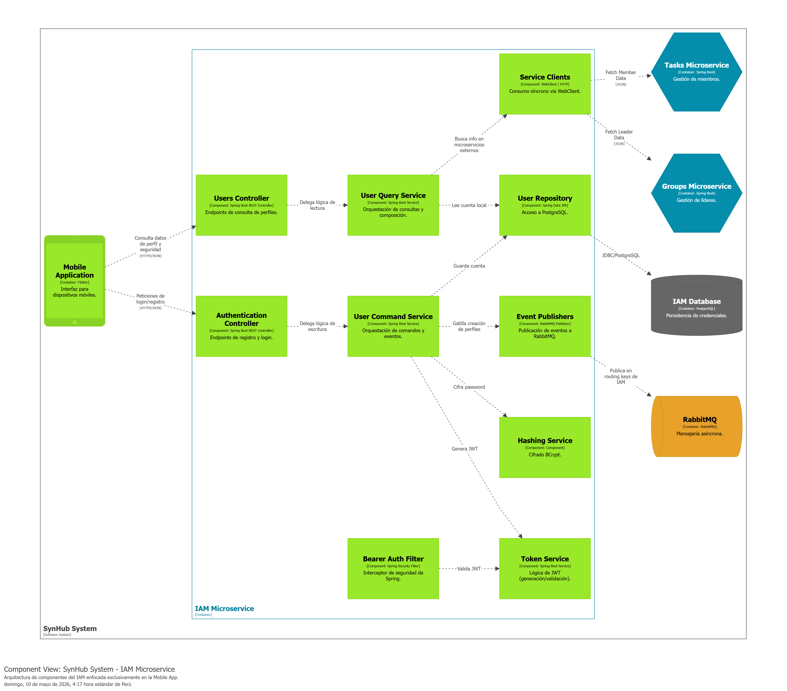

### 5.1.6. Bounded Context Software Architecture Code Level Diagrams

#### 5.1.6.1. Bounded Context Domain Layer Class Diagrams

El diagrama de la capa de dominio de IAM ilustra la lógica central de identidad mediante patrones tácticos de `DDD`. Se destaca el Agregado Raíz `User`, que gestiona el estado del usuario y se vincula con entidades de `Role` para la seguridad. El modelo utiliza `Value Objects` (`LeaderId`, `MemberId`) para referenciar perfiles externos y define `Interfaces` de servicios y repositorios que garantizan la independencia tecnológica. Finalmente, los `Eventos de Dominio` aseguran la sincronización asíncrona con otros contextos tras el registro de usuarios.

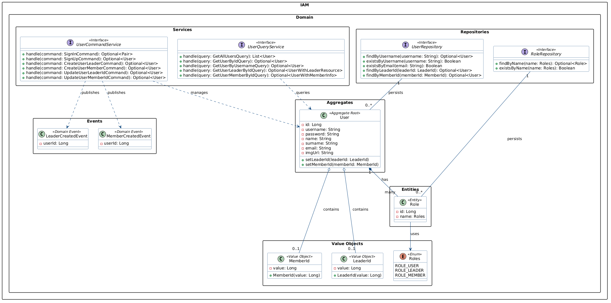

#### 5.1.6.2. Bounded Context Database Design Diagram

El diseño de persistencia para el microservicio de IAM se basa en un esquema relacional normalizado para la gestión segura de identidades y accesos. El modelo se compone de tres tablas clave: `users`, que almacena las credenciales y referencias externas (`leader_id`, `member_id`); `roles`, que centraliza el catálogo de permisos; y `user_roles`, que actúa como tabla de unión para permitir una asignación flexible de roles de tipo muchos a muchos. Este diseño garantiza la integridad referencial y una alta eficiencia en los procesos de `autenticación` y `autorización`.

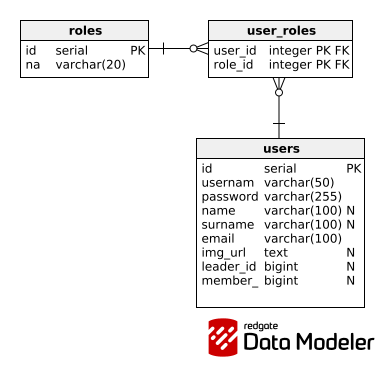

## 5.2. Bounded Context: Groups

### 5.2.1. Domain Layer

El bounded context **Groups Management** es responsable de la gestión de grupos colaborativos dentro de la plataforma SynHub. Este contexto maneja la creación de grupos, invitaciones a miembros y asignación de líderes.

#### Aggregate Root: `Group`

**Descripción:** Representa un grupo colaborativo dentro de la plataforma. Es el aggregate root principal de este bounded context. Contiene un código único de invitación, un líder, una descripción, una imagen y el conteo actual de miembros.

##### Atributos

| Atributo | Tipo | Visibilidad | Invariante / Regla de negocio |
| :--- | :--- | :--- | :--- |
| `id` | Long | Private | Autogenerado, único |
| `code` | GroupCode | Private | Value Object con validación propia (9 caracteres alfanuméricos). No puede ser nulo. |
| `name` | String | Private | No puede ser nulo. Define el nombre visible del grupo. |
| `description` | String | Private | No puede ser nulo. Texto descriptivo del grupo (formato largo). |
| `imgUrl` | ImgUrl | Private | Value Object. No puede ser nulo ni estar en blanco. |
| `leader` | Leader | Private | Relación OneToOne. Un grupo tiene exactamente un líder. |
| `memberCount` | Integer | Private | No puede ser nulo. Comienza en 0. No puede ser negativo. |

##### Métodos

| Método | Retorno | Visibilidad | Descripción |
| :--- | :--- | :--- | :--- |
| `Group(name, description, imgUrl, leader, code)` | Group | Public | Constructor que crea un nuevo grupo. Inicializa `memberCount = 0`. |
| `updateInformation(UpdateGroupCommand)` | void | Public | Actualiza nombre, descripción o imagen. Solo modifica los campos que vienen en el comando. |
| `increaseMemberCount()` | void | Public | Incrementa en 1 el conteo de miembros. |
| `decreaseMemberCount()` | void | Public | Decrementa en 1 el conteo de miembros. |

##### Invariantes de negocio

- El código del grupo (`code`) debe ser único en todo el sistema.
- `memberCount` nunca puede ser negativo (se controla mediante métodos específicos).
- Al crear un grupo, `memberCount` comienza en 0 (el líder aún no cuenta como miembro hasta que se une explícitamente).

---

#### Aggregate Root: `Invitation`

**Descripción:** Representa una invitación enviada a un usuario para que se una a un grupo. Permite rastrear qué invitaciones están pendientes y a qué grupo pertenecen.

##### Atributos

| Atributo | Tipo | Visibilidad | Invariante / Regla de negocio |
| :--- | :--- | :--- | :--- |
| `id` | Long | Private | Autogenerado, único |
| `memberId` | MemberId | Private | Value Object. Puede ser nulo (invitación pendiente sin usuario asignado). Si existe, debe ser > 0. |
| `group` | Group | Private | Relación ManyToOne. No puede ser nulo. Una invitación siempre pertenece a un grupo existente. |

##### Métodos

| Método | Retorno | Visibilidad | Descripción |
| :--- | :--- | :--- | :--- |
| `Invitation(memberId, group)` | Invitation | Public | Constructor que crea una nueva invitación. |
| `Invitation()` | Invitation | Public | Constructor por defecto (requerido por JPA). |

##### Invariantes de negocio

- Una invitación debe estar asociada a un `Group` válido (no nulo).

---

#### Aggregate Root: `Leader`

**Descripción:** Representa al líder de un grupo. Encapsula métricas de rendimiento como el tiempo promedio de solución de solicitudes y la cantidad de solicitudes resueltas.

##### Atributos

| Atributo | Tipo | Visibilidad | Invariante / Regla de negocio |
| :--- | :--- | :--- | :--- |
| `id` | Long | Private | Autogenerado, único |
| `averageSolutionTime` | Time | Private | Inicializado en 0 (00:00:00). Representa el tiempo promedio en resolver solicitudes. |
| `solvedRequests` | Integer | Private | Inicializado en 0. No puede ser negativo. |

##### Métodos

| Método | Retorno | Visibilidad | Descripción |
| :--- | :--- | :--- | :--- |
| `Leader()` | Leader | Public | Constructor por defecto. Inicializa `averageSolutionTime = new Time(0)` y `solvedRequests = 0`. |

##### Invariantes de negocio

- `solvedRequests` nunca puede ser negativo.
- El líder se asocia a un único grupo mediante la relación `@OneToOne` en el aggregate `Group`.

---

#### Value Object: `GroupCode`

**Descripción:** Código alfanumérico único que identifica a un grupo. Se utiliza para invitaciones y acceso rápido al grupo.

##### Atributos

| Atributo | Tipo | Visibilidad | Invariante |
| :--- | :--- | :--- | :--- |
| `code` | String | Private | Longitud exacta de 9 caracteres. Solo permite dígitos (0-9) y letras mayúsculas (A-Z). |

##### Métodos

| Método | Retorno | Visibilidad | Descripción |
| :--- | :--- | :--- | :--- |
| `GroupCode(code)` | GroupCode | Public | Constructor. Valida formato y longitud. Lanza excepción si no cumple. |
| `random()` | GroupCode | Public static | Factory method. Genera un código aleatorio válido usando `SecureRandom`. |

##### Invariantes

- El código debe tener exactamente 9 caracteres.
- Solo caracteres permitidos: `0123456789ABCDEFGHIJKLMNOPQRSTUVWXYZ`.

---

#### Value Object: `ImgUrl`

**Descripción:** Representa la URL de la imagen asociada a un grupo (avatar, banner, etc.).

##### Atributos

| Atributo | Tipo | Visibilidad | Invariante |
| :--- | :--- | :--- | :--- |
| `imgUrl` | String | Private | No puede ser nulo ni estar en blanco. |

##### Métodos

| Método | Retorno | Visibilidad | Descripción |
| :--- | :--- | :--- | :--- |
| `ImgUrl(imgUrl)` | ImgUrl | Public | Constructor. Valida que la URL no sea nula ni vacía. Lanza excepción si no cumple. |

##### Invariantes

- La URL no puede ser `null`, vacía (`""`) ni contener solo espacios en blanco.

---

#### Value Object: `MemberId`

**Descripción:** Identificador numérico de un miembro dentro del sistema. Se utiliza en invitaciones para referenciar al usuario invitado.

##### Atributos

| Atributo | Tipo | Visibilidad | Invariante |
| :--- | :--- | :--- | :--- |
| `value` | Long | Private | No puede ser nulo. Debe ser mayor a 0. |

##### Métodos

| Método | Retorno | Visibilidad | Descripción |
| :--- | :--- | :--- | :--- |
| `MemberId(value)` | MemberId | Public | Constructor. Valida que `value` no sea nulo ni negativo. Lanza excepción si no cumple. |

##### Invariantes

- `value` no puede ser `null`.
- `value` debe ser mayor a 0.

### 5.2.2. Interface Layer

#### Recursos de entrada (Request)

Estos recursos representan los datos que el cliente envía al servidor para realizar operaciones de escritura.

##### `CreateGroupResource`

**Propósito:** Transporta los datos necesarios para crear un nuevo grupo.

| Campo | Tipo | Descripción |
| :--- | :--- | :--- |
| `name` | String | Nombre del grupo |
| `imgUrl` | String | URL de la imagen del grupo |
| `description` | String | Descripción detallada del grupo |

---

##### `UpdateGroupResource`

**Propósito:** Transporta los datos para actualizar un grupo existente.

| Campo | Tipo | Descripción |
| :--- | :--- | :--- |
| `name` | String | Nuevo nombre del grupo |
| `imgUrl` | String | Nueva URL de la imagen |
| `description` | String | Nueva descripción |

---

#### Recursos de salida (Response)

Estos recursos representan los datos que el servidor devuelve al cliente como respuesta a sus peticiones.

##### `GroupResource`

**Propósito:** Devuelve la información completa de un grupo.

| Campo | Tipo | Descripción |
| :--- | :--- | :--- |
| `id` | Long | Identificador único del grupo |
| `name` | String | Nombre del grupo |
| `imgUrl` | String | URL de la imagen |
| `description` | String | Descripción del grupo |
| `code` | String | Código alfanumérico único (9 caracteres) para invitaciones |
| `memberCount` | Integer | Número actual de miembros en el grupo |

---

##### `LeaderResource`

**Propósito:** Devuelve la información completa de un líder, incluyendo datos personales y métricas de rendimiento.

| Campo | Tipo | Descripción |
| :--- | :--- | :--- |
| `username` | String | Nombre de usuario del líder |
| `name` | String | Nombre del líder |
| `surname` | String | Apellido del líder |
| `imgUrl` | String | URL de la foto de perfil |
| `email` | String | Correo electrónico |
| `averageSolutionTime` | String | Tiempo promedio de solución de solicitudes (formato HH:MM:SS) |
| `solvedRequests` | Integer | Cantidad de solicitudes resueltas |

---

##### `LeaderDetailsResource`

**Propósito:** Devuelve únicamente las métricas de rendimiento de un líder (versión simplificada).

| Campo | Tipo | Descripción |
| :--- | :--- | :--- |
| `id` | Long | Identificador único del líder |
| `averageSolutionTime` | String | Tiempo promedio de solución (formato HH:MM:SS) |
| `solvedRequests` | Integer | Cantidad de solicitudes resueltas |

---

##### `GroupMemberResource`

**Propósito:** Representa la información básica de un miembro dentro de un grupo.

| Campo | Tipo | Descripción |
| :--- | :--- | :--- |
| `id` | Long | Identificador único del miembro |
| `username` | String | Nombre de usuario |
| `name` | String | Nombre |
| `surname` | String | Apellido |
| `imgUrl` | String | URL de la foto de perfil |

---

##### `InvitationMemberResource`

**Propósito:** Información del miembro destinatario de una invitación (versión anidada dentro de `InvitationResource`).

| Campo | Tipo | Descripción |
| :--- | :--- | :--- |
| `id` | Long | Identificador del miembro |
| `username` | String | Nombre de usuario |
| `name` | String | Nombre |
| `surname` | String | Apellido |
| `imgUrl` | String | URL de la foto de perfil |

---

##### `InvitationResource`

**Propósito:** Representa una invitación a un grupo, incluyendo información del miembro invitado y del grupo destino.

| Campo | Tipo | Descripción |
| :--- | :--- | :--- |
| `id` | Long | Identificador único de la invitación |
| `member` | `InvitationMemberResource` | Miembro invitado (puede ser nulo para invitaciones públicas) |
| `group` | `GroupResource` | Grupo al que se invita |

---

#### Resumen de recursos

| Recurso | Tipo | Dirección | Propósito principal |
| :--- | :--- | :--- | :--- |
| `CreateGroupResource` | Request | Entrada | Crear un nuevo grupo |
| `UpdateGroupResource` | Request | Entrada | Actualizar un grupo existente |
| `GroupResource` | Response | Salida | Representación completa de un grupo |
| `LeaderResource` | Response | Salida | Información completa del líder |
| `LeaderDetailsResource` | Response | Salida | Métricas de rendimiento del líder |
| `GroupMemberResource` | Response | Salida | Información básica de un miembro |
| `InvitationResource` | Response | Salida | Invitación con grupo y miembro |
| `InvitationMemberResource` | Response | Salida | Miembro dentro de una invitación |

#### Controllers

##### 1. `GroupController`

**Propósito:** Gestiona operaciones de consulta (queries) relacionadas con grupos. Este controlador solo maneja peticiones de lectura, separando las responsabilidades de escritura (commands) en `LeaderGroupController`.

**Dependencias inyectadas:**

| Dependencia | Tipo | Propósito |
| :--- | :--- | :--- |
| `groupQueryService` | `GroupQueryService` | Servicio de dominio para ejecutar consultas sobre grupos |
| `leaderQueryService` | `LeaderQueryService` | Servicio de dominio para consultar líderes |

**Endpoints expuestos:**

| Método | Endpoint | Descripción | Servicio invocado |
| :--- | :--- | :--- | :--- |
| `GET` | `/api/v1/groups/{groupId}` | Obtiene un grupo por su ID | `groupQueryService.handle(GetGroupByIdQuery)` |
| `GET` | `/api/v1/groups/search?code={code}` | Busca un grupo por su código único | `groupQueryService.handle(GetGroupByCodeQuery)` |
| `GET` | `/api/v1/groups/members` | Obtiene todos los miembros del grupo del líder autenticado | `leaderQueryService.handle(GetLeaderByUsernameQuery)` `groupQueryService.handle(GetGroupByLeaderIdQuery)` |
| `GET` | `/api/v1/groups/tasks` | Obtiene todas las tareas asociadas al grupo del líder autenticado | `leaderQueryService.handle(GetLeaderByUsernameQuery)` `groupQueryService.handle(GetGroupByLeaderIdQuery)` |

---

##### 2. `InvitationController`

**Propósito:** Gestiona operaciones de creación, consulta y cancelación de invitaciones a grupos.

**Dependencias inyectadas:**

| Dependencia | Tipo | Propósito |
| :--- | :--- | :--- |
| `invitationQueryService` | `InvitationQueryService` | Servicio de dominio para ejecutar consultas sobre invitaciones |
| `invitationCommandService` | `InvitationCommandService` | Servicio de dominio para ejecutar comandos sobre invitaciones |
| `leaderQueryService` | `LeaderQueryService` | Servicio de dominio para consultar líderes |
| `groupQueryService` | `GroupQueryService` | Servicio de dominio para consultar grupos |

**Endpoints expuestos:**

| Método | Endpoint | Descripción | Servicio invocado |
| :--- | :--- | :--- | :--- |
| `POST` | `/api/v1/invitations/groups/{groupId}` | Crea una nueva invitación para un grupo | `invitationCommandService.handle(CreateInvitationCommand)` |
| `GET` | `/api/v1/invitations/group` | Obtiene todas las invitaciones del grupo del líder autenticado | `leaderQueryService.handle(GetLeaderByUsernameQuery)` `groupQueryService.handle(GetGroupByLeaderIdQuery)` `invitationQueryService.handle(GetInvitationsByGroupIdQuery)` |
| `DELETE` | `/api/v1/invitations/member` | Cancela la invitación de un miembro autenticado | `invitationQueryService.handle(GetInvitationByMemberIdQuery)` `invitationCommandService.handle(CancelInvitationCommand)` |
| `GET` | `/api/v1/invitations/member` | Obtiene la invitación de un miembro autenticado | `invitationQueryService.handle(GetInvitationByMemberIdQuery)` |

---

##### 3. `LeaderController`

**Propósito:** Gestiona operaciones de consulta (queries) relacionadas con líderes.

**Dependencias inyectadas:**

| Dependencia | Tipo | Propósito |
| :--- | :--- | :--- |
| `leaderQueryService` | `LeaderQueryService` | Servicio de dominio para ejecutar consultas sobre líderes |

**Endpoints expuestos:**

| Método | Endpoint | Descripción | Servicio invocado |
| :--- | :--- | :--- | :--- |
| `GET` | `/api/v1/leader/{leaderId}` | Obtiene las métricas de rendimiento de un líder por su ID | `leaderQueryService.handle(GetLeaderByIdQuery)` |
| `GET` | `/api/v1/leader/details` | Obtiene la información completa del líder autenticado | `leaderQueryService.handle(GetLeaderByUsernameQuery)` |

---

##### 4. `LeaderGroupController`

**Propósito:** Gestiona operaciones de escritura (commands) y consulta relacionadas con grupos, ejecutadas exclusivamente por líderes autenticados.

**Dependencias inyectadas:**

| Dependencia | Tipo | Propósito |
| :--- | :--- | :--- |
| `groupQueryService` | `GroupQueryService` | Servicio de dominio para ejecutar consultas sobre grupos |
| `groupCommandService` | `GroupCommandService` | Servicio de dominio para ejecutar comandos sobre grupos |
| `leaderQueryService` | `LeaderQueryService` | Servicio de dominio para consultar líderes |

**Endpoints expuestos:**

| Método | Endpoint | Descripción | Servicio invocado |
| :--- | :--- | :--- | :--- |
| `POST` | `/api/v1/leader/group` | Crea un nuevo grupo asociado al líder autenticado | `leaderQueryService.handle(GetLeaderByUsernameQuery)` `groupCommandService.handle(CreateGroupCommand)` |
| `PUT` | `/api/v1/leader/group` | Actualiza la información del grupo del líder autenticado | `leaderQueryService.handle(GetLeaderByUsernameQuery)` `groupCommandService.handle(UpdateGroupCommand)` |
| `DELETE` | `/api/v1/leader/group` | Elimina el grupo del líder autenticado | `leaderQueryService.handle(GetLeaderByUsernameQuery)` `groupCommandService.handle(DeleteGroupCommand)` |
| `GET` | `/api/v1/leader/group` | Obtiene el grupo del líder autenticado | `leaderQueryService.handle(GetLeaderByUsernameQuery)` `groupQueryService.handle(GetGroupByLeaderIdQuery)` |
| `DELETE` | `/api/v1/leader/group/members/{memberId}` | Elimina un miembro del grupo del líder autenticado | `leaderQueryService.handle(GetLeaderByUsernameQuery)` `groupCommandService.handle(RemoveMemberFromGroupCommand)` |

---

##### 5. `LeaderInvitationController`

**Propósito:** Gestiona el procesamiento de invitaciones (aceptar o rechazar) por parte de líderes autenticados.

**Dependencias inyectadas:**

| Dependencia | Tipo | Propósito |
| :--- | :--- | :--- |
| `invitationCommandService` | `InvitationCommandService` | Servicio de dominio para ejecutar comandos sobre invitaciones |
| `leaderQueryService` | `LeaderQueryService` | Servicio de dominio para consultar líderes |

**Endpoints expuestos:**

| Método | Endpoint | Descripción | Servicio invocado |
| :--- | :--- | :--- | :--- |
| `PATCH` | `/api/v1/group/invitations/{invitationId}?accept={boolean}` | Acepta o rechaza una invitación (por defecto `false`) | `leaderQueryService.handle(GetLeaderByUsernameQuery)` `invitationCommandService.handle(AcceptInvitationCommand)` o `invitationCommandService.handle(RejectInvitationCommand)` |

---

#### Resumen de Controllers

| Controller | Base Path | Propósito principal |
| :--- | :--- | :--- |
| `GroupController` | `/api/v1/groups` | Consultas públicas de grupos, miembros y tareas |
| `InvitationController` | `/api/v1/invitations` | Gestión completa de invitaciones (CRUD) |
| `LeaderController` | `/api/v1/leader` | Consultas de líderes y sus métricas |
| `LeaderGroupController` | `/api/v1/leader/group` | Gestión de grupos por el líder (escritura y consulta) |
| `LeaderInvitationController` | `/api/v1/group/invitations` | Procesamiento de invitaciones por el líder |

### 5.2.3. Application Layer

#### Command Services

##### 1. `GroupCommandServiceImpl`

**Propósito:** Ejecuta comandos relacionados con la gestión de grupos (crear, actualizar, eliminar, gestionar miembros).

**Dependencias inyectadas:**

| Dependencia | Tipo | Propósito |
| :--- | :--- | :--- |
| `groupRepository` | `GroupRepository` | Repositorio para persistir agregados `Group` |
| `leaderRepository` | `LeaderRepository` | Repositorio para consultar líderes |
| `tasksEventPublisher` | `TasksEventPublisher` | Publicador de eventos hacia el contexto de Tasks |

**Comandos manejados:**

| Comando | Descripción | Servicio invocado |
| :--- | :--- | :--- |
| `CreateGroupCommand` | Crea un nuevo grupo asociado a un líder | Genera `GroupCode` aleatorio único, persiste el grupo |
| `UpdateGroupCommand` | Actualiza información de un grupo existente | Obtiene grupo por líder, ejecuta `updateInformation()` |
| `DeleteGroupCommand` | Elimina un grupo | Valida existencia, elimina de la base de datos |
| `RemoveMemberFromGroupCommand` | Elimina un miembro del grupo | Ejecuta `decreaseMemberCount()`, publica evento `memberRemoved` |
| `LeaveGroupCommand` | Un miembro abandona un grupo | Ejecuta `decreaseMemberCount()` |

---

##### 2. `InvitationCommandServiceImpl`

**Propósito:** Ejecuta comandos relacionados con la gestión de invitaciones a grupos.

**Dependencias inyectadas:**

| Dependencia | Tipo | Propósito |
| :--- | :--- | :--- |
| `invitationRepository` | `InvitationRepository` | Repositorio para persistir invitaciones |
| `groupRepository` | `GroupRepository` | Repositorio para consultar grupos |
| `leaderRepository` | `LeaderRepository` | Repositorio para validar líderes |
| `tasksEventPublisher` | `TasksEventPublisher` | Publicador de eventos hacia el contexto de Tasks |

**Comandos manejados:**

| Comando | Descripción | Servicio invocado |
| :--- | :--- | :--- |
| `CreateInvitationCommand` | Crea una nueva invitación | Valida existencia del grupo y que el miembro no tenga invitación previa |
| `CancelInvitationCommand` | Cancela una invitación existente | Valida que el miembro sea propietario de la invitación |
| `RejectInvitationCommand` | Rechaza una invitación (líder) | Valida que el líder sea dueño del grupo, elimina invitación |
| `AcceptInvitationCommand` | Acepta una invitación (líder) | Valida líder, ejecuta `increaseMemberCount()`, publica evento `invitationAccepted`, elimina invitación |

---

##### 3. `LeaderCommandServiceImpl`

**Propósito:** Ejecuta comandos relacionados con la creación de líderes.

**Dependencias inyectadas:**

| Dependencia | Tipo | Propósito |
| :--- | :--- | :--- |
| `leaderRepository` | `LeaderRepository` | Repositorio para persistir líderes |
| `iamEventPublisher` | `IamEventPublisher` | Publicador de eventos hacia el contexto de IAM |

**Comandos manejados:**

| Comando | Descripción | Servicio invocado |
| :--- | :--- | :--- |
| `CreateLeaderCommand` | Crea un nuevo líder | Persiste el líder, publica evento `leaderCreatedSuccessfully` hacia IAM |

---

#### Query Services

##### 1. `GroupQueryServiceImpl`

**Propósito:** Ejecuta consultas relacionadas con grupos.

**Dependencias inyectadas:**

| Dependencia | Tipo | Propósito |
| :--- | :--- | :--- |
| `groupRepository` | `GroupRepository` | Repositorio para consultar grupos |

**Consultas manejadas:**

| Consulta | Descripción |
| :--- | :--- |
| `GetGroupByIdQuery` | Obtiene un grupo por su ID |
| `GetGroupByCodeQuery` | Busca un grupo por su código único |
| `GetGroupByLeaderIdQuery` | Obtiene el grupo asociado a un líder |
| `GetGroupByMemberIdQuery` | Obtiene el grupo de un miembro (pendiente de implementación) |

---

##### 2. `InvitationQueryServiceImpl`

**Propósito:** Ejecuta consultas relacionadas con invitaciones.

**Dependencias inyectadas:**

| Dependencia | Tipo | Propósito |
| :--- | :--- | :--- |
| `invitationRepository` | `InvitationRepository` | Repositorio para consultar invitaciones |

**Consultas manejadas:**

| Consulta | Descripción |
| :--- | :--- |
| `GetInvitationByMemberIdQuery` | Obtiene la invitación de un miembro específico |
| `GetInvitationsByGroupIdQuery` | Obtiene todas las invitaciones de un grupo |

##### 3. `LeaderQueryServiceImpl`

**Propósito:** Ejecuta consultas relacionadas con líderes, incluyendo integración con el contexto de IAM.

**Dependencias inyectadas:**

| Dependencia | Tipo | Propósito |
| :--- | :--- | :--- |
| `leaderRepository` | `LeaderRepository` | Repositorio para consultar líderes |
| `iamServiceClient` | `IamServiceClient` | Puerto para consultar información de usuarios en IAM |

**Consultas manejadas:**

| Consulta | Descripción |
| :--- | :--- |
| `GetLeaderByIdQuery` | Obtiene un líder por su ID |
| `GetLeaderByUsernameQuery` | Obtiene un líder por su nombre de usuario, validando rol en IAM |

#### Clients / Ports (Interfaces hacia Infraestructura)

Estas interfaces definen los **puertos** que la capa de aplicación utiliza para comunicarse con servicios externos (otros microservicios). Las implementaciones concretas residen en la capa de infraestructura, respetando el principio de inversión de dependencias.

##### 1. `IamServiceClient`

**Propósito:** Puerto para comunicarse con el microservicio de IAM (Identity and Access Management).

**Métodos:**

| Método | Descripción |
| :--- | :--- |
| `fetchUserByUsername(username, authHeader)` | Obtiene un usuario por su nombre de usuario |
| `fetchUserByMemberId(memberId, authHeader)` | Obtiene un usuario por su ID de miembro |

---

##### 2. `TasksServiceClient`

**Propósito:** Puerto para comunicarse con el microservicio de Tasks (gestión de tareas).

**Métodos:**

| Método | Descripción |
| :--- | :--- |
| `fetchMemberByMemberId(memberId)` | Obtiene un miembro por su ID |
| `fetchMemberByUsername(username, authHeader)` | Obtiene un miembro por su nombre de usuario |
| `fetchMembersByGroupId(groupId, authHeader)` | Obtiene todos los miembros de un grupo |
| `fetchTasksByGroupId(groupId, authHeader)` | Obtiene todas las tareas de un grupo |

### 5.2.4. Infrastructure Layer

#### Persistencia (JPA Repositories)

##### 1. `GroupRepository`

**Propósito:** Repositorio JPA para el agregado `Group`.

**Métodos personalizados:**

| Método | Descripción |
| :--- | :--- |
| `findByLeaderId(leaderId)` | Busca el grupo asociado a un líder específico |
| `existsByCode(code)` | Verifica si ya existe un grupo con el código dado |
| `findByCode(code)` | Busca un grupo por su código único |

---

##### 2. `InvitationRepository`

**Propósito:** Repositorio JPA para el agregado `Invitation`.

**Métodos personalizados:**

| Método | Descripción |
| :--- | :--- |
| `findByMemberId(memberId)` | Busca la invitación asociada a un miembro |
| `findByGroup_Id(groupId)` | Lista todas las invitaciones de un grupo |
| `existsByMemberId(memberId)` | Verifica si un miembro ya tiene una invitación activa |

---

##### 3. `LeaderRepository`

**Propósito:** Repositorio JPA para el agregado `Leader`.

**Métodos personalizados:**

| Método | Descripción |
| :--- | :--- |
| `findById(id)` | Busca un líder por su ID |

#### Configuración (Configuration)

Clases de configuración técnicas que definen beans y parámetros de infraestructura.

##### 1. `RabbitMQConfig`

**Propósito:** Configura los exchanges, colas y bindings de RabbitMQ para la comunicación asíncrona entre microservicios.

**Exchanges definidos:**

| Exchange | Propósito |
| :--- | :--- |
| `iam-events-exchange` | Recibe eventos provenientes del contexto de IAM |
| `tasks-events-exchange` | Envía eventos hacia el contexto de Tasks |

##### 2. `WebClientConfig`

**Propósito:** Configura el cliente WebClient con balanceo de carga para comunicación síncrona entre microservicios.

**Beans expuestos:**

| Bean | Tipo | Propósito |
| :--- | :--- | :--- |
| `loadBalancedWebClientBuilder()` | `WebClient.Builder` | Builder de WebClient con `@LoadBalanced` para descubrimiento de servicios |

#### Mensajería (Messaging)

La capa de infraestructura de mensajería maneja la comunicación asíncrona con otros microservicios a través de RabbitMQ. Se divide en dos responsabilidades:

- **Publishers:** Envían eventos desde Groups hacia otros contextos (IAM, Tasks).
- **Listeners (Consumidores):** Reciben eventos desde otros contextos y ejecutan los comandos correspondientes.

##### Publishers

###### 1. `IamEventPublisher`

**Propósito:** Publica eventos desde el contexto de Groups hacia el contexto de IAM a través de RabbitMQ.

**Dependencias inyectadas:**

| Dependencia | Tipo | Propósito |
| :--- | :--- | :--- |
| `rabbitTemplate` | `RabbitTemplate` | Template de RabbitMQ para enviar mensajes |

**Métodos:**

| Método | Evento | Descripción |
| :--- | :--- | :--- |
| `publishLeaderCreatedSuccessfully(userId, leaderId, avgTime, solvedRequests)` | `LeaderCreatedSuccessfullyEvent` | Notifica a IAM que un líder fue creado exitosamente en Groups |

---

###### 2. `TasksEventPublisher`

**Propósito:** Publica eventos desde el contexto de Groups hacia el contexto de Tasks a través de RabbitMQ.

**Dependencias inyectadas:**

| Dependencia | Tipo | Propósito |
| :--- | :--- | :--- |
| `rabbitTemplate` | `RabbitTemplate` | Template de RabbitMQ para enviar mensajes |

**Métodos:**

| Método | Evento | Descripción |
| :--- | :--- | :--- |
| `publishInvitationAccepted(groupId, memberId)` | `AcceptInvitationEvent` | Notifica a Tasks que una invitación fue aceptada y el miembro se unió al grupo |
| `publishMemberRemoved(groupId, memberId)` | `RemoveMemberEvent` | Notifica a Tasks que un miembro fue eliminado del grupo |

---

##### Listeners (Consumidores)

###### 1. `LeaderCreatedEventListener`

**Propósito:** Escucha eventos de creación de líder provenientes del contexto de IAM y crea el líder en el contexto de Groups.

**Dependencias inyectadas:**

| Dependencia | Tipo | Propósito |
| :--- | :--- | :--- |
| `leaderCommandService` | `LeaderCommandService` | Servicio de aplicación para ejecutar comandos de líder |

**Evento esperado:** `LeaderCreatedEvent`

| Acción | Descripción |
| :--- | :--- |
| Al recibir el evento | Extrae `userId` del evento |
| Comando ejecutado | `CreateLeaderCommand` con el `userId` |
| Resultado | El líder es creado en el contexto de Groups |

---

##### 2. `MemberLeftEventListener`

**Propósito:** Escucha eventos de miembros que abandonan un grupo, provenientes del contexto de Tasks, y actualiza el conteo de miembros en Groups.

**Dependencias inyectadas:**

| Dependencia | Tipo | Propósito |
| :--- | :--- | :--- |
| `groupCommandService` | `GroupCommandService` | Servicio de aplicación para ejecutar comandos de grupo |

**Evento esperado:** `MemberLeftEvent`

| Acción | Descripción |
| :--- | :--- |
| Al recibir el evento | Extrae `memberId` y `groupId` del evento |
| Comando ejecutado | `LeaveGroupCommand(memberId, groupId)` |
| Resultado | El contador de miembros del grupo (`memberCount`) se decrementa |

---

#### Resumen de la capa de infraestructura

| Categoría | Componentes | Cantidad |
| :--- | :--- | :--- |
| **JPA Repositories** | `GroupRepository`, `InvitationRepository`, `LeaderRepository` | 3 |
| **Configuración** | `RabbitMQConfig`, `WebClientConfig` | 2 |
| **Messaging (Publishers)** | `IamEventPublisher`, `TasksEventPublisher` | 2 |
| **Messaging (Listeners)** | `LeaderCreatedEventListener`, `MemberLeftEventListener` | 2 |

### 5.2.5. Bounded Context Software Architecture Component Level Diagrams

Se visualiza el diagrama de componentes de manera general:

Se muestra de manera más detallada cada parte del diagrama de componentes:

### 5.2.6. Bounded Context Software Architecture Code Level Diagrams

#### 5.2.6.1. Bounded Context Domain Layer Class Diagrams

Diagrama de clases para GroupController:

Diagrama ded clases para un CommadServiceComponent:

#### 5.2.6.2 Bounded Context Database Design Diagram

Diagrama de bases de datos de Groups

## 5.3. Bounded Context: Tasks

### 5.3.1. Domain Layer

El bounded context Tasks Management es responsable de la gestión de tareas colaborativas dentro de la plataforma SynHub. Este contexto maneja la creación de tareas, asignación de responsables, actualización de estados y seguimiento del tiempo de ejecución de cada tarea.

#### Aggregate Root: `Task`

Descripción: Representa una tarea dentro de la plataforma. Es el aggregate root principal de este bounded context. Contiene información sobre el título, descripción, estado, fecha límite, miembro asignado y métricas relacionadas al progreso de la tarea.

| Atributo          | Tipo           | Visibilidad | Invariante / Regla de negocio                                                                       |
| :---------------- | :------------- | :---------- | :-------------------------------------------------------------------------------------------------- |
| `id`              | Long           | Private     | Heredado de `AuditableAbstractAggregateRoot`. Autogenerado y único.                                 |
| `title`           | String         | Private     | No puede ser nulo. Representa el título de la tarea.                                                |
| `description`     | String         | Private     | No puede ser nulo. Contiene la descripción detallada de la tarea.                                   |
| `status`          | TaskStatus     | Private     | Enumerado (`IN_PROGRESS`, `COMPLETED`, `ON_HOLD`, `EXPIRED`). Se inicializa en `IN_PROGRESS`.       |
| `dueDate`         | OffsetDateTime | Private     | No puede ser nulo. Representa la fecha límite de la tarea.                                          |
| `member`          | Member         | Private     | Relación ManyToOne. Representa el miembro asignado a la tarea. Puede ser nulo inicialmente.         |
| `groupId`         | GroupId        | Private     | Value Object embebido. Representa el grupo al que pertenece la tarea.                               |
| `timesRearranged` | Integer        | Private     | No puede ser nulo. Inicia en 0. Cuenta las veces que una tarea vuelve a estado `IN_PROGRESS`.       |
| `timePassed`      | Long           | Private     | No puede ser nulo. Inicia en 0. Almacena el tiempo acumulado transcurrido hasta completar la tarea. |

##### Métodos
| Método                                          | Retorno | Visibilidad | Descripción                                                                                                                           |
| :---------------------------------------------- | :------ | :---------- | :------------------------------------------------------------------------------------------------------------------------------------ |
| `Task()`                                        | Task    | Public      | Constructor por defecto. Inicializa `status = IN_PROGRESS` y `timesRearranged = 0`.                                                   |
| `Task(CreateTaskCommand command)`               | Task    | Public      | Constructor que crea una nueva tarea utilizando la información del comando recibido.                                                  |
| `updateStatus(UpdateTaskStatusCommand command)` | void    | Public      | Actualiza el estado de la tarea y registra métricas relacionadas al tiempo y reorganización de la tarea.                              |
| `updateTask(UpdateTaskCommand command)`         | void    | Public      | Actualiza el título, descripción y fecha límite de la tarea. También actualiza automáticamente el estado según la nueva fecha límite. |

##### Invariantes de negocio
* Toda tarea debe tener un `title`, `description` y `dueDate` válidos.
* El estado inicial de una tarea siempre es `IN_PROGRESS`.
* `timesRearranged` nunca puede ser negativo.
* Cuando una tarea cambia de `IN_PROGRESS` a `COMPLETED`, se calcula y almacena el tiempo transcurrido en `timePassed`.
* Si una tarea cambia desde `COMPLETED`, `ON_HOLD` o `EXPIRED` hacia `IN_PROGRESS`, se incrementa `timesRearranged`.
* Si la nueva `dueDate` es anterior a la fecha actual, la tarea automáticamente cambia su estado a `EXPIRED`.
* Una tarea pertenece únicamente a un grupo mediante `groupId`.
* Una tarea puede estar asignada a un único `Member`.
* `timePassed` debe representar únicamente el tiempo acumulado válido de ejecución de la tarea.

#### Aggregate Root: `Member`

Descripción: Representa un miembro perteneciente a un grupo colaborativo dentro de la plataforma SynHub. Este aggregate root administra la relación entre los miembros y las tareas asignadas.

| Atributo  | Tipo       | Visibilidad | Invariante / Regla de negocio                                                                                                    |
| :-------- | :--------- | :---------- | :------------------------------------------------------------------------------------------------------------------------------- |
| `id`      | Long       | Private     | Heredado de `AuditableAbstractAggregateRoot`. Autogenerado y único.                                                              |
| `tasks`   | List<Task> | Private     | Relación OneToMany. Contiene las tareas asignadas al miembro. Puede estar vacía, pero nunca debe contener referencias inválidas. |
| `groupId` | GroupId    | Private     | Value Object embebido. Representa el grupo al que pertenece el miembro. No puede ser nulo.                                       |

##### Métodos
| Método                                | Retorno | Visibilidad | Descripción                                                                                        |
| :------------------------------------ | :------ | :---------- | :------------------------------------------------------------------------------------------------- |
| `Member()`                            | Member  | Public      | Constructor por defecto requerido por JPA.                                                         |
| `Member(CreateMemberCommand command)` | Member  | Public      | Constructor que crea un nuevo miembro utilizando la información del comando recibido.              |
| `addTask(Task task)`                  | void    | Public      | Asigna una tarea al miembro y establece la relación bidireccional con la tarea.                    |
| `removeTask(Task task)`               | void    | Public      | Elimina una tarea del miembro y rompe la relación bidireccional con la tarea.                      |
| `clearTasks()`                        | void    | Public      | Elimina todas las tareas asignadas al miembro y limpia las referencias bidireccionales existentes. |

##### Invariantes de negocio
* Un miembro puede tener múltiples tareas asignadas.
* Toda tarea asignada a un miembro debe mantener correctamente la relación bidireccional con `Task`.
* Al remover una tarea, la referencia al `Member` dentro de `Task` debe establecerse en `null`.
* Al ejecutar `clearTasks()`, ninguna tarea debe conservar referencias al miembro anterior.
* Un miembro pertenece únicamente a un grupo mediante `groupId`.
* La colección `tasks` no debe contener referencias inválidas o duplicadas.

#### Value Object: `GroupId`

**Descripción:** Identificador único que representa el grupo al que pertenece una entidad dentro del bounded context Tasks Management.

##### Atributos

| Atributo | Tipo | Visibilidad | Invariante                              |
| :------- | :--- | :---------- | :-------------------------------------- |
| `value`  | Long | Private     | No puede ser nulo y debe ser mayor a 0. |

##### Métodos

| Método           | Retorno | Visibilidad | Descripción                                                                           |
| :--------------- | :------ | :---------- | :------------------------------------------------------------------------------------ |
| `GroupId(value)` | GroupId | Public      | Constructor del record. Valida que el identificador no sea nulo ni menor o igual a 0. |

##### Invariantes

* `value` no puede ser nulo.
* `value` debe ser mayor a 0.
* El identificador representa un grupo válido dentro del sistema.

---

#### Value Object: `TaskStatus`

**Descripción:** Enumeración que representa los posibles estados de una tarea dentro de la plataforma.

##### Valores

| Valor         | Descripción                                                |
| :------------ | :--------------------------------------------------------- |
| `ON_HOLD`     | La tarea se encuentra temporalmente pausada.               |
| `IN_PROGRESS` | La tarea está actualmente en progreso.                     |
| `COMPLETED`   | La tarea fue completada correctamente.                     |
| `DONE`        | Estado finalizado alternativo definido dentro del sistema. |
| `EXPIRED`     | La tarea excedió su fecha límite.                          |

##### Métodos

| Método               | Retorno    | Visibilidad   | Descripción                                                                                                            |
| :------------------- | :--------- | :------------ | :--------------------------------------------------------------------------------------------------------------------- |
| `fromString(status)` | TaskStatus | Public static | Convierte un texto en un valor válido del enum ignorando mayúsculas/minúsculas. Lanza excepción si el valor no existe. |

##### Invariantes

* El estado de una tarea solo puede ser uno de los valores definidos en `TaskStatus`.
* `fromString(status)` debe recibir un valor válido reconocido por el enum.
* No se permiten estados arbitrarios fuera de la enumeración definida.

### 5.3.2. Interface Layer

### Recursos de entrada (Request)

Estos recursos representan los datos que el cliente envía al servidor para realizar operaciones de escritura dentro del bounded context Tasks Management.

##### `CreateTaskResource`

**Propósito:** Transporta los datos necesarios para crear una nueva tarea.

| Campo         | Tipo           | Descripción                       |
| :------------ | :------------- | :-------------------------------- |
| `title`       | String         | Título de la tarea                |
| `description` | String         | Descripción detallada de la tarea |
| `dueDate`     | OffsetDateTime | Fecha límite de la tarea          |

---

##### `UpdateTaskResource`

**Propósito:** Transporta los datos necesarios para actualizar una tarea existente y asignar un miembro responsable.

| Campo         | Tipo           | Descripción                        |
| :------------ | :------------- | :--------------------------------- |
| `title`       | String         | Nuevo título de la tarea           |
| `description` | String         | Nueva descripción                  |
| `dueDate`     | OffsetDateTime | Nueva fecha límite                 |
| `memberId`    | Long           | Identificador del miembro asignado |

---

##### `CreateMemberResource`

**Propósito:** Representa la solicitud para crear un nuevo miembro dentro del contexto de tareas.

| Campo          | Tipo | Descripción                                          |
| :------------- | :--- | :--------------------------------------------------- |
| *(sin campos)* | —    | Recurso vacío utilizado para inicializar un miembro. |

---

#### Recursos de salida (Response)

Estos recursos representan los datos que el servidor devuelve al cliente como respuesta a sus peticiones.

##### `TaskResource`

**Propósito:** Devuelve la información completa de una tarea.

| Campo         | Tipo                 | Descripción                      |
| :------------ | :------------------- | :------------------------------- |
| `id`          | Long                 | Identificador único de la tarea  |
| `title`       | String               | Título de la tarea               |
| `description` | String               | Descripción detallada            |
| `dueDate`     | String               | Fecha límite de la tarea         |
| `createdAt`   | String               | Fecha de creación                |
| `updatedAt`   | String               | Fecha de última actualización    |
| `status`      | String               | Estado actual de la tarea        |
| `member`      | `TaskMemberResource` | Miembro asignado a la tarea      |
| `groupId`     | Long                 | Identificador del grupo asociado |

---

##### `TaskMemberResource`

**Propósito:** Representa información básica del miembro asignado a una tarea.

| Campo      | Tipo   | Descripción                |
| :--------- | :----- | :------------------------- |
| `id`       | Long   | Identificador del miembro  |
| `name`     | String | Nombre del miembro         |
| `surname`  | String | Apellido del miembro       |
| `urlImage` | String | URL de la imagen de perfil |

---

##### `MemberResource`

**Propósito:** Devuelve la información completa de un miembro dentro del sistema de tareas.

| Campo      | Tipo   | Descripción                              |
| :--------- | :----- | :--------------------------------------- |
| `id`       | Long   | Identificador único del miembro          |
| `username` | String | Nombre de usuario                        |
| `name`     | String | Nombre del miembro                       |
| `surname`  | String | Apellido del miembro                     |
| `imgUrl`   | String | URL de la imagen de perfil               |
| `email`    | String | Correo electrónico                       |
| `groupId`  | Long   | Identificador del grupo al que pertenece |

---

##### `MemberOnlyResource`

**Propósito:** Representa una versión simplificada de un miembro mostrando únicamente sus identificadores principales.

| Campo     | Tipo | Descripción                      |
| :-------- | :--- | :------------------------------- |
| `id`      | Long | Identificador único del miembro  |
| `groupId` | Long | Identificador del grupo asociado |

---

##### `ExtendedGroupResource`

**Propósito:** Devuelve información extendida de un grupo junto con la lista de miembros asociados.

| Campo         | Tipo                 | Descripción                               |
| :------------ | :------------------- | :---------------------------------------- |
| `id`          | Long                 | Identificador único del grupo             |
| `name`        | String               | Nombre del grupo                          |
| `imgUrl`      | String               | URL de la imagen del grupo                |
| `description` | String               | Descripción del grupo                     |
| `code`        | String               | Código único de invitación                |
| `members`     | List<MemberResource> | Lista de miembros pertenecientes al grupo |

---

#### Resumen de recursos

| Recurso                 | Tipo     | Dirección | Propósito principal                            |
| :---------------------- | :------- | :-------- | :--------------------------------------------- |
| `CreateTaskResource`    | Request  | Entrada   | Crear una nueva tarea                          |
| `UpdateTaskResource`    | Request  | Entrada   | Actualizar una tarea existente                 |
| `CreateMemberResource`  | Request  | Entrada   | Crear un nuevo miembro                         |
| `TaskResource`          | Response | Salida    | Representación completa de una tarea           |
| `TaskMemberResource`    | Response | Salida    | Información básica del miembro asignado        |
| `MemberResource`        | Response | Salida    | Información completa de un miembro             |
| `MemberOnlyResource`    | Response | Salida    | Representación simplificada de un miembro      |
| `ExtendedGroupResource` | Response | Salida    | Información extendida de un grupo con miembros |

#### Controllers

##### 1. `MemberController`

**Propósito:** Gestiona operaciones de consulta relacionadas con miembros autenticados, grupos asociados y tareas asignadas.

**Dependencias inyectadas:**

| Dependencia           | Tipo                  | Propósito                                                      |
| :-------------------- | :-------------------- | :------------------------------------------------------------- |
| `memberQueryService`  | `MemberQueryService`  | Servicio de dominio para ejecutar consultas sobre miembros     |
| `groupsServiceClient` | `GroupsServiceClient` | Cliente externo para obtener información de grupos             |
| `taskQueryService`    | `TaskQueryService`    | Servicio de dominio para consultar tareas                      |
| `taskCommandService`  | `TaskCommandService`  | Servicio de dominio para ejecutar comandos sobre tareas        |
| `iamServiceClient`    | `IamServiceClient`    | Cliente externo para obtener información de usuarios desde IAM |

**Endpoints expuestos:**

| Método   | Endpoint                            | Descripción                                                             | Servicio invocado                                                                                         |
| :------- | :---------------------------------- | :---------------------------------------------------------------------- | :-------------------------------------------------------------------------------------------------------- |
| `GET`    | `/api/v1/member?groupId={groupId}`  | Obtiene todos los miembros de un grupo                                  | `memberQueryService.handle(GetMembersByGroupIdQuery)`                                                     |
| `GET`    | `/api/v1/member/details`            | Obtiene la información del miembro autenticado                          | `memberQueryService.handle(GetMemberByUsernameQuery)`                                                     |
| `GET`    | `/api/v1/member/details/{memberId}` | Obtiene la información detallada de un miembro por ID                   | `memberQueryService.handle(GetMemberInfoByIdQuery)`                                                       |
| `GET`    | `/api/v1/member/{memberId}`         | Obtiene información básica de un miembro                                | `memberQueryService.handle(GetMemberByIdQuery)`                                                           |
| `GET`    | `/api/v1/member/group`              | Obtiene el grupo asociado al miembro autenticado                        | `memberQueryService.handle(GetMemberByUsernameQuery)` `groupsServiceClient.fetchGroupByGroupId()`      |
| `GET`    | `/api/v1/member/tasks`              | Obtiene todas las tareas del miembro autenticado                        | `memberQueryService.handle(GetMemberByUsernameQuery)` `taskQueryService.handle(GetAllTasksByMemberId)` |
| `DELETE` | `/api/v1/member/group/leave`        | Permite que un miembro abandone su grupo y elimina sus tareas asociadas | `taskCommandService.handle(DeleteTasksByMemberId)`                                                        |
| `GET`    | `/api/v1/member/tasks/next`         | Obtiene la próxima tarea pendiente del miembro autenticado              | `memberQueryService.handle(GetMemberByUsernameQuery)` `taskQueryService.handle(GetAllTasksByMemberId)` |

---

##### 2. `MemberTaskController`

**Propósito:** Gestiona operaciones relacionadas con tareas asociadas a miembros específicos.

**Dependencias inyectadas:**

| Dependencia          | Tipo                 | Propósito                                               |
| :------------------- | :------------------- | :------------------------------------------------------ |
| `taskCommandService` | `TaskCommandService` | Servicio de dominio para ejecutar comandos sobre tareas |
| `taskQueryService`   | `TaskQueryService`   | Servicio de dominio para consultar tareas               |
| `iamServiceClient`   | `IamServiceClient`   | Cliente externo para obtener información de usuarios    |

**Endpoints expuestos:**

| Método | Endpoint                                | Descripción                                        | Servicio invocado                                |
| :----- | :-------------------------------------- | :------------------------------------------------- | :----------------------------------------------- |
| `POST` | `/api/v1/members/{memberId}/tasks`      | Crea una nueva tarea asociada a un miembro         | `taskCommandService.handle(CreateTaskCommand)`   |
| `GET`  | `/api/v1/members/{memberId}/tasks`      | Obtiene todas las tareas de un miembro             | `taskQueryService.handle(GetAllTasksByMemberId)` |
| `GET`  | `/api/v1/members/{memberId}/tasks/next` | Obtiene la siguiente tarea pendiente de un miembro | `taskQueryService.handle(GetAllTasksByMemberId)` |

---

##### 3. `TaskController`

**Propósito:** Gestiona operaciones de consulta, actualización y eliminación de tareas dentro del sistema.

**Dependencias inyectadas:**

| Dependencia          | Tipo                 | Propósito                                                |
| :------------------- | :------------------- | :------------------------------------------------------- |
| `taskQueryService`   | `TaskQueryService`   | Servicio de dominio para ejecutar consultas sobre tareas |
| `taskCommandService` | `TaskCommandService` | Servicio de dominio para ejecutar comandos sobre tareas  |
| `iamServiceClient`   | `IamServiceClient`   | Cliente externo para obtener información de usuarios     |

**Endpoints expuestos:**

| Método   | Endpoint                                 | Descripción                                   | Servicio invocado                                    |
| :------- | :--------------------------------------- | :-------------------------------------------- | :--------------------------------------------------- |
| `GET`    | `/api/v1/tasks/{taskId}`                 | Obtiene una tarea por su ID                   | `taskQueryService.handle(GetTaskByIdQuery)`          |
| `GET`    | `/api/v1/tasks/status/{status}`          | Obtiene todas las tareas filtradas por estado | `taskQueryService.handle(GetAllTaskByStatusQuery)`   |
| `PUT`    | `/api/v1/tasks/{taskId}/status/{status}` | Actualiza el estado de una tarea              | `taskCommandService.handle(UpdateTaskStatusCommand)` |
| `PUT`    | `/api/v1/tasks/{taskId}`                 | Actualiza la información de una tarea         | `taskCommandService.handle(UpdateTaskCommand)`       |
| `DELETE` | `/api/v1/tasks/{taskId}`                 | Elimina una tarea por ID                      | `taskCommandService.handle(DeleteTaskCommand)`       |
| `GET`    | `/api/v1/tasks?groupId={groupId}`        | Obtiene todas las tareas asociadas a un grupo | `taskQueryService.handle(GetAllTasksByGroupIdQuery)` |

---

#### Resumen de Controllers

| Controller             | Base Path         | Propósito principal                                                 |
| :--------------------- | :---------------- | :------------------------------------------------------------------ |
| `MemberController`     | `/api/v1/member`  | Gestión de miembros autenticados, grupos y tareas asociadas         |
| `MemberTaskController` | `/api/v1/members` | Gestión de tareas asociadas a miembros específicos                  |
| `TaskController`       | `/api/v1/tasks`   | Gestión completa de tareas (consultas, actualización y eliminación) |

### 5.3.3. Application Layer

#### Command Services

##### 1. `MemberCommandServiceImpl`

**Propósito:** Ejecuta comandos relacionados con la gestión de miembros y su relación con grupos y tareas.

**Dependencias inyectadas:**

| Dependencia         | Tipo                | Propósito                                              |
| :------------------ | :------------------ | :----------------------------------------------------- |
| `memberRepository`  | `MemberRepository`  | Repositorio para persistir agregados `Member`          |
| `iamEventPublisher` | `IamEventPublisher` | Publicador de eventos hacia el contexto IAM            |
| `taskRepository`    | `TaskRepository`    | Repositorio para gestionar tareas asociadas a miembros |

**Comandos manejados:**

| Comando                         | Descripción                                           | Servicio invocado                                                          |
| :------------------------------ | :---------------------------------------------------- | :------------------------------------------------------------------------- |
| `CreateMemberCommand`           | Crea un nuevo miembro                                 | Persiste el miembro y publica el evento `publishMemberCreatedSuccessfully` |
| `AddGroupToMemberCommand`       | Asocia un grupo a un miembro                          | Actualiza el `groupId` del miembro                                         |
| `RemoveMemberFromGroupCommand`  | Elimina un miembro de un grupo                        | Elimina sus tareas y rompe la relación con el grupo                        |
| `DeleteMembersByGroupIdCommand` | Elimina la relación de todos los miembros de un grupo | Elimina tareas y limpia el `groupId` de cada miembro                       |

---

##### 2. `TaskCommandServiceImpl`

**Propósito:** Ejecuta comandos relacionados con la creación, actualización, eliminación y gestión de tareas.

**Dependencias inyectadas:**

| Dependencia            | Tipo                   | Propósito                                      |
| :--------------------- | :--------------------- | :--------------------------------------------- |
| `taskRepository`       | `TaskRepository`       | Repositorio para persistir agregados `Task`    |
| `memberRepository`     | `MemberRepository`     | Repositorio para consultar miembros            |
| `groupsServiceClient`  | `GroupsServiceClient`  | Cliente externo para validar grupos            |
| `groupEventsPublisher` | `GroupEventsPublisher` | Publicador de eventos hacia el contexto Groups |

**Comandos manejados:**

| Comando                       | Descripción                                     | Servicio invocado                                                                |
| :---------------------------- | :---------------------------------------------- | :------------------------------------------------------------------------------- |
| `CreateTaskCommand`           | Crea una nueva tarea asociada a un miembro      | Valida miembro y grupo, persiste la tarea                                        |
| `UpdateTaskCommand`           | Actualiza información y asignación de una tarea | Reasigna tareas entre miembros y ejecuta `updateTask()`                          |
| `DeleteTaskCommand`           | Elimina una tarea                               | Rompe relación con el miembro y elimina la tarea                                 |
| `UpdateTaskStatusCommand`     | Actualiza el estado de una tarea                | Ejecuta `updateStatus()` y persiste cambios                                      |
| `DeleteTasksByMemberId`       | Elimina todas las tareas de un miembro          | Elimina tareas, rompe relación con el grupo y publica evento `publishMemberLeft` |
| `DeleteTasksByGroupIdCommand` | Elimina todas las tareas de un grupo            | Elimina tareas y limpia relaciones con miembros                                  |

---

#### Query Services

##### 1. `MemberQueryServiceImpl`

**Propósito:** Ejecuta consultas relacionadas con miembros e integración con el contexto IAM.

**Dependencias inyectadas:**

| Dependencia        | Tipo               | Propósito                                      |
| :----------------- | :----------------- | :--------------------------------------------- |
| `memberRepository` | `MemberRepository` | Repositorio para consultar miembros            |
| `iamServiceClient` | `IamServiceClient` | Cliente externo para consultar usuarios en IAM |

**Consultas manejadas:**

| Consulta                   | Descripción                                                    |
| :------------------------- | :------------------------------------------------------------- |
| `GetMemberByIdQuery`       | Obtiene un miembro por su ID                                   |
| `GetMemberByUsernameQuery` | Obtiene un miembro por username validando el rol `ROLE_MEMBER` |
| `GetAllMembersQuery`       | Obtiene todos los miembros registrados                         |
| `GetMembersByGroupIdQuery` | Obtiene todos los miembros de un grupo                         |
| `GetMemberInfoByIdQuery`   | Obtiene información detallada de un miembro desde IAM          |

---

##### 2. `TaskQueryServiceImpl`

**Propósito:** Ejecuta consultas relacionadas con tareas.

**Dependencias inyectadas:**

| Dependencia      | Tipo             | Propósito                         |
| :--------------- | :--------------- | :-------------------------------- |
| `taskRepository` | `TaskRepository` | Repositorio para consultar tareas |

**Consultas manejadas:**

| Consulta                    | Descripción                                     |
| :-------------------------- | :---------------------------------------------- |
| `GetAllTasksQuery`          | Obtiene todas las tareas registradas            |
| `GetTaskByIdQuery`          | Obtiene una tarea por su ID                     |
| `GetAllTasksByMemberId`     | Obtiene todas las tareas asignadas a un miembro |
| `GetAllTaskByStatusQuery`   | Obtiene todas las tareas filtradas por estado   |
| `GetAllTasksByGroupIdQuery` | Obtiene todas las tareas asociadas a un grupo   |

---

#### Clients / Ports (Interfaces hacia Infraestructura)

Estas interfaces definen los puertos utilizados por la capa de aplicación para comunicarse con otros microservicios externos.

##### 1. `IamServiceClient`

**Propósito:** Puerto para comunicarse con el microservicio IAM (Identity and Access Management).

**Métodos:**

| Método                                               | Descripción                          |
| :--------------------------------------------------- | :----------------------------------- |
| `fetchUserByUsername(username, authorizationHeader)` | Obtiene un usuario por username      |
| `fetchUserByMemberId(memberId, authorizationHeader)` | Obtiene un usuario por ID de miembro |

---

##### 2. `GroupsServiceClient`

**Propósito:** Puerto para comunicarse con el microservicio Groups.

**Métodos:**

| Método                         | Descripción                                  |
| :----------------------------- | :------------------------------------------- |
| `fetchGroupByGroupId(groupId)` | Obtiene la información de un grupo por su ID |

### 5.3.4. Infrastructure Layer

#### Persistencia (JPA Repositories)

##### 1. `MemberRepository`

**Propósito:** Repositorio JPA para el agregado `Member`.

**Métodos personalizados:**

| Método                          | Descripción                                                |
| :------------------------------ | :--------------------------------------------------------- |
| `findMembersByGroupId(groupId)` | Obtiene todos los miembros asociados a un grupo específico |

---

##### 2. `TaskRepository`

**Propósito:** Repositorio JPA para el agregado `Task`.

**Métodos personalizados:**

| Método                                             | Descripción                                                         |
| :------------------------------------------------- | :------------------------------------------------------------------ |
| `findByMember_Id(memberId)`                        | Obtiene todas las tareas asignadas a un miembro                     |
| `findByStatus(status)`                             | Obtiene todas las tareas con un estado específico                   |
| `findByGroupId(groupId)`                           | Obtiene todas las tareas pertenecientes a un grupo                  |
| `findAllByStatusAndDueDateBefore(status, dueDate)` | Obtiene tareas con un estado específico cuya fecha límite ya expiró |
| `deleteAllByMember_Id(memberId)`                   | Elimina todas las tareas asociadas a un miembro                     |
| `deleteAllByGroupId(groupId)`                      | Elimina todas las tareas asociadas a un grupo                       |

---

#### Configuración (Configuration)

Clases de configuración técnicas que definen beans y parámetros de infraestructura.

##### 1. `RabbitMQConfig`

**Propósito:** Configura los exchanges, colas y bindings de RabbitMQ para la comunicación asíncrona entre microservicios.

**Exchanges definidos:**

| Exchange                | Propósito                                       |
| :---------------------- | :---------------------------------------------- |
| `iam-events-exchange`   | Recibe eventos provenientes del contexto de IAM |
| `tasks-events-exchange` | Maneja eventos relacionados con grupos y tareas |

---

**Colas principales definidas:**

| Cola                   | Evento asociado        |
| :--------------------- | :--------------------- |
| `tasks.member-created` | `member.created`       |
| `tasks.group-accepted` | `group.accepted`       |
| `tasks.group-deleted`  | `group.deleted`        |
| `tasks.member-left`    | `group.member.left`    |
| `tasks.member-removed` | `group.member.removed` |

---

##### 2. `WebClientConfig`

**Propósito:** Configura el cliente `WebClient` con balanceo de carga para comunicación síncrona entre microservicios.

**Beans expuestos:**

| Bean                             | Tipo                | Propósito                                                                 |
| :------------------------------- | :------------------ | :------------------------------------------------------------------------ |
| `loadBalancedWebClientBuilder()` | `WebClient.Builder` | Builder de WebClient con `@LoadBalanced` para descubrimiento de servicios |

---

#### Mensajería (Messaging)

La infraestructura de mensajería permite la comunicación asíncrona entre el bounded context **Tasks Management** y otros contextos del sistema mediante RabbitMQ.

Se divide en:

* **Publishers:** Publican eventos hacia otros contextos.
* **Listeners:** Consumen eventos provenientes de otros contextos y ejecutan comandos internos.

---

### Publishers

##### 1. `IamEventPublisher`

**Propósito:** Publica eventos desde el contexto de Tasks hacia el contexto de IAM.

**Dependencias inyectadas:**

| Dependencia      | Tipo             | Propósito                                |
| :--------------- | :--------------- | :--------------------------------------- |
| `rabbitTemplate` | `RabbitTemplate` | Template para enviar mensajes a RabbitMQ |

**Métodos:**

| Método                                               | Evento                           | Descripción                                                     |
| :--------------------------------------------------- | :------------------------------- | :-------------------------------------------------------------- |
| `publishMemberCreatedSuccessfully(userId, memberId)` | `MemberCreatedSuccessfullyEvent` | Notifica a IAM que un miembro fue creado correctamente en Tasks |

---

##### 2. `GroupEventsPublisher`

**Propósito:** Publica eventos desde el contexto de Tasks hacia el contexto de Groups.

**Dependencias inyectadas:**

| Dependencia      | Tipo             | Propósito                                |
| :--------------- | :--------------- | :--------------------------------------- |
| `rabbitTemplate` | `RabbitTemplate` | Template para enviar mensajes a RabbitMQ |

**Métodos:**

| Método                                 | Evento            | Descripción                                        |
| :------------------------------------- | :---------------- | :------------------------------------------------- |
| `publishMemberLeft(memberId, groupId)` | `MemberLeftEvent` | Notifica a Groups que un miembro abandonó un grupo |

---

### Listeners (Consumidores)

##### 1. `MemberCreatedEventListener`

**Propósito:** Escucha eventos de creación de miembros provenientes del contexto de IAM y crea el agregado `Member` en Tasks.

**Dependencias inyectadas:**

| Dependencia            | Tipo                   | Propósito                                  |
| :--------------------- | :--------------------- | :----------------------------------------- |
| `memberCommandService` | `MemberCommandService` | Ejecuta comandos relacionados con miembros |

**Evento esperado:** `MemberCreatedEvent`

| Acción               | Descripción                       |
| :------------------- | :-------------------------------- |
| Al recibir el evento | Extrae el `userId` del evento     |
| Comando ejecutado    | `CreateMemberCommand(userId)`     |
| Resultado            | Se crea un nuevo miembro en Tasks |

---

##### 2. `InvitationAcceptedEventListener`

**Propósito:** Escucha eventos de invitaciones aceptadas provenientes del contexto de Groups y asocia un grupo a un miembro.

**Dependencias inyectadas:**

| Dependencia            | Tipo                   | Propósito                                  |
| :--------------------- | :--------------------- | :----------------------------------------- |
| `memberCommandService` | `MemberCommandService` | Ejecuta comandos relacionados con miembros |

**Evento esperado:** `InvitationAcceptedEvent`

| Acción               | Descripción                                  |
| :------------------- | :------------------------------------------- |
| Al recibir el evento | Extrae `groupId` y `memberId`                |
| Comando ejecutado    | `AddGroupToMemberCommand(groupId, memberId)` |
| Resultado            | El miembro queda asociado a un grupo         |

---

##### 3. `MemberRemovedEventListener`

**Propósito:** Escucha eventos de miembros eliminados de un grupo y elimina sus tareas asociadas.

**Dependencias inyectadas:**

| Dependencia            | Tipo                       | Propósito                                  |
| :--------------------- | :------------------------- | :----------------------------------------- |
| `memberCommandService` | `MemberCommandServiceImpl` | Ejecuta comandos relacionados con miembros |

**Evento esperado:** `MemberRemovedEvent`

| Acción               | Descripción                                                            |
| :------------------- | :--------------------------------------------------------------------- |
| Al recibir el evento | Extrae `groupId` y `memberId`                                          |
| Comando ejecutado    | `RemoveMemberFromGroupCommand(groupId, memberId)`                      |
| Resultado            | Se eliminan las tareas del miembro y se rompe la relación con el grupo |

---

##### 4. `GroupDeletedEventListener`

**Propósito:** Escucha eventos de eliminación de grupos provenientes del contexto de Groups y elimina toda la información asociada en Tasks.

**Dependencias inyectadas:**

| Dependencia            | Tipo                   | Propósito                       |
| :--------------------- | :--------------------- | :------------------------------ |
| `memberCommandService` | `MemberCommandService` | Ejecuta comandos sobre miembros |
| `taskCommandService`   | `TaskCommandService`   | Ejecuta comandos sobre tareas   |

**Evento esperado:** `GroupDeletedEvent`

| Acción               | Descripción                                                      |
| :------------------- | :--------------------------------------------------------------- |
| Al recibir el evento | Extrae `groupId`                                                 |
| Comandos ejecutados  | `DeleteTasksByGroupIdCommand` y `DeleteMembersByGroupIdCommand`  |
| Resultado            | Se eliminan tareas y se desvinculan miembros del grupo eliminado |

---

#### Resumen de la capa de infraestructura

| Categoría                  | Componentes                                                                                                                | Cantidad |
| :------------------------- | :------------------------------------------------------------------------------------------------------------------------- | :------- |
| **JPA Repositories**       | `MemberRepository`, `TaskRepository`                                                                                       | 2        |
| **Configuración**          | `RabbitMQConfig`, `WebClientConfig`                                                                                        | 2        |
| **Messaging (Publishers)** | `IamEventPublisher`, `GroupEventsPublisher`                                                                                | 2        |
| **Messaging (Listeners)**  | `MemberCreatedEventListener`, `InvitationAcceptedEventListener`, `MemberRemovedEventListener`, `GroupDeletedEventListener` | 4        |

### 5.3.5. Bounded Context Software Architecture Component Level Diagrams

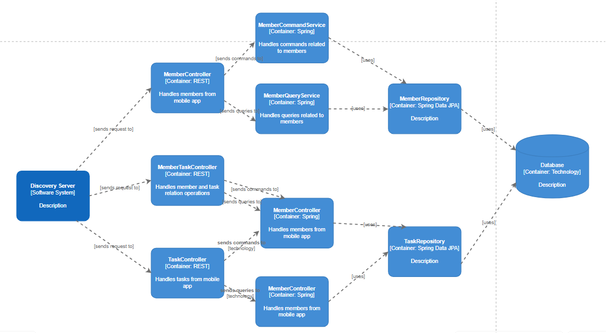

### 5.3.6. Bounded Context Software Architecture Code Level Diagrams

### 5.3.6.1 Bounded Context Domain Layer Class Diagrams

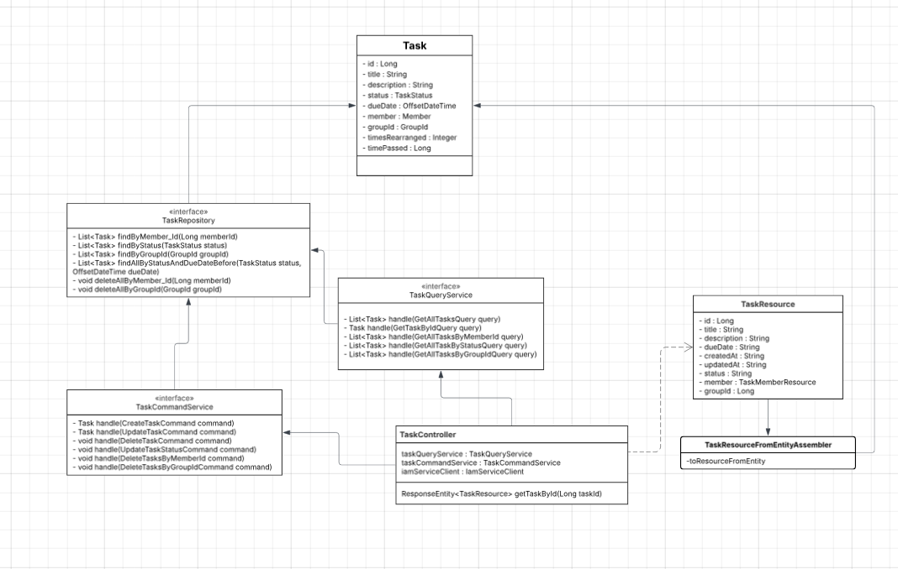

### 5.3.6.2 Bounded Context Database Design Diagram

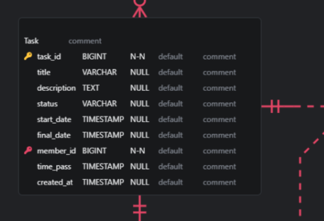

## 5.4. Bounded Context: Requests

### 5.4.1. Domain Layer

En esta capa se define el nucleo de la gestion de solicitudes asociadas a tareas, encapsulando reglas de negocio para tipo de solicitud, estado y relacion con Task.

**Aggregate: Request**

El agregado Request es la raiz que gestiona solicitudes dentro del sistema, garantizando consistencia de tipo, estado y referencia a la tarea.

| Atributos | Tipo de dato | Visibilidad | Descripcion |
|---|---|---|---|
| id | Long | Private | Identificador unico de la solicitud (heredado). |
| description | String | Private | Descripcion de la solicitud. |
| requestType | RequestType | Private | Tipo de solicitud. |
| requestStatus | RequestStatus | Private | Estado actual de la solicitud. |
| taskId | TaskId | Private | Identificador de la tarea asociada. |
| createdAt | OffsetDateTime | Private | Fecha de creacion UTC (heredado). |
| updatedAt | OffsetDateTime | Private | Fecha de ultima actualizacion UTC (heredado). |

| Metodos | Tipo de retorno | Visibilidad | Descripcion |
|---|---|---|---|
| Request(CreateRequestCommand) | Constructor | Public | Crea una solicitud a partir de un comando. |
| getRequestType() | String | Public | Devuelve el tipo de solicitud como texto. |
| getRequestStatus() | String | Public | Devuelve el estado de la solicitud como texto. |
| updateRequestStatus(String) | void | Public | Actualiza el estado de la solicitud. |
| getId() | Long | Public | Devuelve el ID de la solicitud (heredado). |
| getTaskId() | TaskId | Public | Devuelve el ID de la tarea asociada. |
| getCreatedAt() | OffsetDateTime | Public | Devuelve la fecha de creacion (heredado). |
| getUpdatedAt() | OffsetDateTime | Public | Devuelve la fecha de actualizacion (heredado). |

**Value Objects**

| Value Object | Descripcion |
|---|---|
| TaskId | Record embebible que representa el ID de tarea. Valida que no sea null ni menor o igual a cero. |
| RequestType | Enumeracion de tipos permitidos: SUBMISSION, MODIFICATION, EXPIRED. Incluye fromString con validacion. |
| RequestStatus | Enumeracion de estados permitidos: PENDING, APPROVED, REJECTED. Incluye fromString con validacion. |

**Commands**

| Command | Descripcion |
|---|---|
| CreateRequestCommand | Crea una solicitud con description, requestType y taskId. |
| UpdateRequestCommand | Actualiza el estado de una solicitud por requestId. |
| DeleteRequestCommand | Elimina una solicitud por requestId. |
| DeleteAllRequestsByTaskIdCommand | Elimina solicitudes por taskId (actualmente pendiente de implementacion). |

**Queries**

| Query | Descripcion |
|---|---|
| GetAllRequestsQuery | Recupera todas las solicitudes. |
| GetRequestsByTaskIdQuery | Recupera solicitudes de una tarea especifica. |
| GetRequestByIdQuery | Recupera una solicitud por ID. |

**Clase: RequestQueryService**

| Titulo | RequestQueryService |
|---|---|
| Descripcion | Interfaz de servicio de consultas para operaciones de lectura de solicitudes. |

**Metodos**

| Metodo | Descripcion |
|---|---|
| handle(GetAllRequestsQuery) | Recupera todas las solicitudes registradas. |
| handle(GetRequestsByTaskIdQuery) | Recupera solicitudes por ID de tarea. |
| handle(GetRequestByIdQuery) | Busca una solicitud por su identificador unico. |

**Clase: RequestCommandService**

| Titulo | RequestCommandService |
|---|---|
| Descripcion | Interfaz de servicio de comandos para gestion de solicitudes. |

**Metodos**

| Metodo | Descripcion |
|---|---|
| handle(CreateRequestCommand) | Crea una nueva solicitud y devuelve su ID. |
| handle(UpdateRequestCommand) | Actualiza una solicitud existente y devuelve el agregado actualizado. |
| handle(DeleteRequestCommand) | Elimina una solicitud por ID. |
| handle(DeleteAllRequestsByTaskIdCommand) | Elimina todas las solicitudes de una tarea. |

**Excepciones de Dominio**

| Excepcion | Descripcion |
|---|---|
| IllegalArgumentException | Se usa para validaciones de tipo, estado, existencia de request o task, y errores en update/delete. |

### 5.4.2. Interface Layer

La capa de interfaz del contexto Requests expone endpoints REST para crear, consultar, actualizar y eliminar solicitudes. Tambien expone endpoints agregados orientados a lider y miembro de grupo, apoyandose en clientes externos para validaciones y enriquecimiento de respuesta.

**Controlador: RequestController**

Maneja operaciones CRUD de solicitudes ligadas a una tarea.

**Metodos**

| Metodo | Ruta | Descripcion |
|---|---|---|
| createRequest | POST /api/v1/tasks/{taskId}/requests | Crea una solicitud para una tarea, validando miembro y pertenencia. |
| getRequestsByTaskId | GET /api/v1/tasks/{taskId}/requests | Lista solicitudes de una tarea. |
| getRequestById | GET /api/v1/tasks/{taskId}/requests/{requestId} | Recupera una solicitud especifica de la tarea. |
| updateRequestStatus | PUT /api/v1/tasks/{taskId}/requests/{requestId}/status/{status} | Actualiza el estado de una solicitud. |
| deleteRequestById | DELETE /api/v1/tasks/{taskId}/requests/{requestId} | Elimina una solicitud por ID. |

**Controlador: GroupRequestController**

Expone consultas agregadas de solicitudes para lider y miembro, combinando datos de grupos, tareas y requests.

**Metodos**

| Metodo | Ruta | Descripcion |
|---|---|---|
| getAllRequestsFromGroup | GET /api/v1/leader/group/requests | Obtiene solicitudes de todas las tareas del grupo del lider autenticado. |
| getAllRequestsFromMember | GET /api/v1/member/group/requests | Obtiene solicitudes de todas las tareas del miembro autenticado. |

**Dependencias**

| Dependencia | Descripcion |
|---|---|
| RequestCommandService | Ejecuta comandos de creacion, actualizacion y eliminacion. |
| RequestQueryService | Ejecuta consultas de lectura de solicitudes. |
| TaskServiceClient | Consulta tareas y miembros para validaciones y enriquecimiento. |
| GroupServiceClient | Consulta lider y grupo en endpoints agregados. |
| CreateRequestCommandFromResourceAssembler | Mapea recurso HTTP de creacion a CreateRequestCommand. |
| UpdateRequestCommandFromResourceAssembler | Mapea datos de actualizacion a UpdateRequestCommand. |
| RequestResourceFromEntityAssembler | Convierte entidad Request y detalles de tarea a RequestResource. |
| RequestDetailsResourceFromEntityAssembler | Convierte entidad Request a recurso de detalle. |
| TaskResourceFromEntityAssembler | Convierte recurso externo de tarea a recurso local. |
| TaskMemberResourceFromEntityAssembler | Convierte recurso externo de miembro a recurso local. |

**Recursos**

| Recurso | Descripcion |
|---|---|
| CreateRequestResource | Contiene description y requestType para crear solicitud. |
| RequestResource | Respuesta completa de solicitud con tarea enriquecida. |
| RequestDetailsResource | Respuesta resumida con taskId embebido. |
| TaskResource | Recurso local para datos de tarea remota. |
| TaskMemberResource | Recurso local para datos de miembro de tarea. |

**ACL (Anticorruption Layer)**

| Clase | Descripcion |
|---|---|
| TaskServiceClient | Interfaz ACL para comunicacion con tasks-service. |
| TaskServiceClientImpl | Implementacion ACL basada en WebClient y service discovery. |
| GroupServiceClient | Interfaz ACL para comunicacion con groups-service. |
| GroupServiceClientImpl | Implementacion ACL para obtener lider y grupo remoto. |
| GroupRequestController | Orquesta datos entre contextos para consultas agregadas. |

### 5.4.3. Application Layer

Los servicios internos implementan la orquestacion del contexto Requests. Validan reglas, llaman a repositorios y coordinan integraciones con otros microservicios.

**Clase: RequestCommandServiceImpl**

| Titulo | RequestCommandServiceImpl |
|---|---|
| Descripcion | Implementacion del servicio de comandos para crear, actualizar y eliminar solicitudes. |

**Dependencias**

| Dependencia | Descripcion |
|---|---|
| RequestRepository | Persistencia de solicitudes. |
| TaskServiceClient | Verificacion de existencia de tarea en la creacion. |

**Metodos relevantes**

| Metodo | Descripcion |
|---|---|
| handle(CreateRequestCommand) | Valida requestType, verifica task existente y persiste Request. |
| handle(UpdateRequestCommand) | Verifica existencia, actualiza estado y guarda cambios. |
| handle(DeleteRequestCommand) | Verifica existencia y elimina por ID. |
| handle(DeleteAllRequestsByTaskIdCommand) | Pendiente (TODO). |

**Clase: RequestQueryServiceImpl**

| Titulo | RequestQueryServiceImpl |
|---|---|
| Descripcion | Implementacion del servicio de consultas para lecturas de solicitudes. |

**Dependencias**

| Dependencia | Descripcion |
|---|---|
| RequestRepository | Acceso a datos para consultas por ID y por taskId. |

**Clientes de Aplicacion (Integraciones)**

| Clase | Descripcion |
|---|---|
| TaskServiceClient / TaskServiceClientImpl | Obtiene task simple, task detalle, miembro por username/memberId y tareas por grupo/miembro. |
| GroupServiceClient / GroupServiceClientImpl | Obtiene lider por username y grupo por leaderId. |

### 5.4.4. Infrastructure Layer

Esta capa implementa la persistencia JPA y configuraciones tecnicas para conectividad y documentacion.

**Clase: RequestRepository**

| Titulo | RequestRepository |
|---|---|
| Descripcion | Repositorio Spring Data JPA para operaciones CRUD y consultas por tarea. |

**Metodos**

| Metodo | Descripcion |
|---|---|
| findById(Long) | Recupera una solicitud por ID (heredado de JpaRepository). |
| findAll() | Recupera todas las solicitudes (heredado de JpaRepository). |
| save(Request) | Persiste o actualiza solicitud (heredado de JpaRepository). |
| findByTaskId(TaskId) | Recupera solicitudes por taskId. |
| deleteByTaskId(TaskId) | Elimina solicitudes por taskId. |

**Clase: WebClientConfig**

| Titulo | WebClientConfig |
|---|---|
| Descripcion | Define WebClient.Builder con @LoadBalanced para resolver servicios por nombre en Eureka. |

**Clase: OpenApiConfiguration**

| Titulo | OpenApiConfiguration |
|---|---|
| Descripcion | Configura metadatos de OpenAPI/Swagger para el servicio Requests. |

**Clase: AuditableAbstractAggregateRoot**

| Titulo | AuditableAbstractAggregateRoot |
|---|---|
| Descripcion | Base compartida para agregados con id, createdAt, updatedAt y hooks @PrePersist/@PreUpdate. |

### 5.4.5. Bounded Context Software Architecture Component Level Diagrams

Este diagrama representa como el Bounded Context de Requests gestiona solicitudes asociadas a tareas.
RequestController y GroupRequestController actuan como puertas de entrada para comandos y consultas. Ambos delegan en RequestCommandService y RequestQueryService. A su vez, la capa de aplicacion integra tareas y grupos mediante clientes ACL (TaskServiceClient y GroupServiceClient). La persistencia se realiza en base de datos relacional a traves de RequestRepository.

### 5.4.6. Bounded Context Software Architecture Code Level Diagrams

En esta seccion se explican diagramas con mayor detalle de la implementacion de componentes del bounded context Requests.

### 5.4.7. Bounded Context Domain Layer Class Diagrams

Este diagrama muestra la estructura interna del dominio de Requests, destacando el aggregate "Request", sus value objects, los commands y queries que usa para operar, y los servicios de dominio que coordinan las reglas del contexto.

### 5.4.8. Bounded Context Database Design Diagram

El diseño de este esquema de base de datos refleja una estructura de tabla única "requests" que encapsula el agregado Request dentro del bounded context. El atributo "task_id" se persiste como un Value Object embebible sin restricción de clave foránea, manteniendo autonomía del contexto y evitando acoplamiento directo con la tabla de tareas en el servicio remoto. Finalmente, resaltar que las columnas "created_at" y "updated_at" heredan del patrón "AuditableAbstractAggregateRoot".

## 5.5. Bounded Context: Metrics

### 5.5.1. Domain Layer

### 5.5.2. Interface Layer

### 5.5.3. Application Layer

### 5.5.4. Infrastructure Layer

### 5.5.5. Bounded Context Software Architecture Component Level Diagrams

### 5.5.6. Bounded Context Software Architecture Code Level Diagrams

### 5.5.7. Bounded Context Domain Layer Class Diagrams

### 5.5.8. Bounded Context Database Design Diagram

## 5.6. Bounded Context: Notifications

### 5.6.1. Domain Layer

El bounded context **Notifications** es responsable del envío de comunicaciones a los usuarios de la plataforma SynHub. Este contexto maneja el envío de correos electrónicos para invitaciones, notificaciones de eventos y alertas del sistema.

#### Aggregate Root: `Notification`

**Descripción:** Representa una notificación o pendiente de enviar a un usuario. Es el aggregate root de este bounded context. El email real del usuario se obtiene del IAM Service al momento del envío.

##### Atributos

| Atributo | Tipo | Visibilidad | Descripción |
| :--- | :--- | :--- | :--- |
| `id` | Long | Private | Autogenerado, único |
| `userId` | Long | Private | ID del usuario destino (referencia a IAM Service) |
| `subject` | String | Private | Asunto del correo |
| `content` | String | Private | Contenido del correo (formato texto) |
| `status` | NotificationStatus | Private | Value Object. Estado: PENDING, SENT, FAILED |
| `eventType` | EventType | Private | Value Object. Tipo de evento que originó la notificación |
| `createdAt` | LocalDateTime | Private | Fecha de creación |
| `sentAt` | LocalDateTime | Private | Fecha de envío (nullable) |
| `retryCount` | Integer | Private | Número de reintentos (default 0) |

##### Métodos

| Método | Retorno | Visibilidad | Descripción |
| :--- | :--- | :--- | :--- |
| `Notification(userId, subject, content, eventType)` | Notification | Public | Constructor. Inicializa `status = PENDING`, `createdAt = now()`, `retryCount = 0` |
| `markAsSent()` | void | Public | Cambia status a SENT y asigna `sentAt = now()` |
| `markAsFailed()` | void | Public | Cambia status a FAILED |
| `incrementRetryCount()` | void | Public | Incrementa `retryCount` en 1 |
| `canRetry()` | boolean | Public | Retorna true si `retryCount < 3` y `status = FAILED` |

##### Invariantes de negocio

- Una notificación no puede enviarse más de una vez.
- Si `status = SENT`, no se puede modificar el estado.
- El número máximo de reintentos es 3.

---

#### Entity: `EmailDeliveryLog`

**Descripción:** Registro histórico de cada intento de envío de una notificación. Permite auditoría y trazabilidad de todos los intentos (exitosos o fallidos).

##### Atributos

| Atributo | Tipo | Visibilidad | Descripción |
| :--- | :--- | :--- | :--- |
| `id` | Long | Private | Autogenerado, único |
| `notificationId` | Long | Private | ID de la notificación asociada |
| `attemptNumber` | Integer | Private | Número de intento (1, 2, 3) |
| `status` | NotificationStatus | Private | Estado resultante del intento |
| `errorMessage` | String | Private | Mensaje de error si falló (nullable) |
| `attemptedAt` | LocalDateTime | Private | Fecha y hora del intento |
| `responseTimeMs` | Long | Private | Tiempo de respuesta del servidor de correo (ms) |

##### Métodos

| Método | Retorno | Visibilidad | Descripción |
| :--- | :--- | :--- | :--- |
| `EmailDeliveryLog(notificationId, attemptNumber, status, errorMessage, responseTimeMs)` | EmailDeliveryLog | Public | Constructor. Registra un intento de envío |
| `wasSuccessful()` | boolean | Public | Retorna true si el intento fue exitoso |

##### Invariantes de negocio

- `attemptNumber` debe estar entre 1 y 3.
- Si `status = SENT`, `errorMessage` debe ser nulo.
- Si `status = FAILED`, `errorMessage` no puede ser nulo.

---

#### Value Object: `NotificationStatus`

**Descripción:** Estado del ciclo de vida de una notificación.

##### Atributos

| Atributo | Tipo | Visibilidad | Invariante |
| :--- | :--- | :--- | :--- |
| `value` | String | Private | Valores permitidos: PENDING, SENT, FAILED |

##### Métodos

| Método | Retorno | Visibilidad | Descripción |
| :--- | :--- | :--- | :--- |
| `NotificationStatus(value)` | NotificationStatus | Public | Constructor. Valida que el valor sea permitido |
| `getValue()` | String | Public | Retorna el valor |
| `isPending()` | boolean | Public | Retorna true si es PENDING |
| `isSent()` | boolean | Public | Retorna true si es SENT |
| `isFailed()` | boolean | Public | Retorna true si es FAILED |

##### Invariantes de negocio

- El valor debe ser uno de los permitidos: PENDING, SENT, FAILED.
- No puede ser nulo.

---

#### Value Object: `EventType`

**Descripción:** Tipo de evento que origina la notificación.

##### Atributos

| Atributo | Tipo | Visibilidad | Invariante |
| :--- | :--- | :--- | :--- |
| `value` | String | Private | Valores permitidos: INVITATION_SENT, MEMBER_JOINED, MEMBER_LEFT, TASK_ASSIGNED, GROUP_CREATED |

##### Métodos

| Método | Retorno | Visibilidad | Descripción |
| :--- | :--- | :--- | :--- |
| `EventType(value)` | EventType | Public | Constructor. Valida que el valor sea permitido |
| `getValue()` | String | Public | Retorna el valor |
| `isInvitationSent()` | boolean | Public | Retorna true si es INVITATION_SENT |
| `isMemberJoined()` | boolean | Public | Retorna true si es MEMBER_JOINED |
| `isMemberLeft()` | boolean | Public | Retorna true si es MEMBER_LEFT |
| `isTaskAssigned()` | boolean | Public | Retorna true si es TASK_ASSIGNED |
| `isGroupCreated()` | boolean | Public | Retorna true si es GROUP_CREATED |

##### Invariantes de negocio

- El valor debe ser uno de los permitidos.
- No puede ser nulo.

### 5.6.2. Interface Layer

#### Recursos de entrada (Request)

Estos recursos representan los datos que el cliente envía al servidor para realizar operaciones de escritura.

##### `CreateNotificationResource`

**Propósito:** Transporta los datos necesarios para crear una nueva notificación a partir de un evento recibido.

| Campo | Tipo | Descripción |
| :--- | :--- | :--- |
| `userId` | Long | ID del usuario destino |
| `subject` | String | Asunto del correo |
| `content` | String | Contenido del correo (formato texto) |
| `eventType` | String | Tipo de evento que originó la notificación |

---

#### Recursos de salida (Response)

Estos recursos representan los datos que el servidor devuelve al cliente como respuesta a sus peticiones.

##### `NotificationResource`

**Propósito:** Devuelve la información completa de una notificación.

| Campo | Tipo | Descripción |
| :--- | :--- | :--- |
| `id` | Long | Identificador único de la notificación |
| `userId` | Long | ID del usuario destino |
| `subject` | String | Asunto del correo |
| `content` | String | Contenido del correo |
| `status` | String | Estado actual (PENDING, SENT, FAILED) |
| `eventType` | String | Tipo de evento que originó la notificación |
| `createdAt` | String | Fecha de creación (formato ISO) |
| `sentAt` | String | Fecha de envío (formato ISO, nullable) |
| `retryCount` | Integer | Número de reintentos realizados |

---

##### `NotificationSummaryResource`

**Propósito:** Versión resumida de una notificación para listados y búsquedas rápidas.

| Campo | Tipo | Descripción |
| :--- | :--- | :--- |
| `id` | Long | Identificador único de la notificación |
| `userId` | Long | ID del usuario destino |
| `subject` | String | Asunto del correo |
| `status` | String | Estado actual (PENDING, SENT, FAILED) |
| `eventType` | String | Tipo de evento |
| `createdAt` | String | Fecha de creación (formato ISO) |

---

##### `EmailDeliveryLogResource`

**Propósito:** Representa un intento de envío de una notificación para auditoría.

| Campo | Tipo | Descripción |
| :--- | :--- | :--- |
| `id` | Long | Identificador único del log |
| `notificationId` | Long | ID de la notificación asociada |
| `attemptNumber` | Integer | Número de intento (1, 2, 3) |
| `status` | String | Estado resultante (SENT, FAILED) |
| `errorMessage` | String | Mensaje de error (si falló) |
| `attemptedAt` | String | Fecha y hora del intento (formato ISO) |
| `responseTimeMs` | Long | Tiempo de respuesta en milisegundos |

---

##### `NotificationStatusResource`

**Propósito:** Información simple del estado actual de una notificación.

| Campo | Tipo | Descripción |
| :--- | :--- | :--- |
| `notificationId` | Long | ID de la notificación |
| `status` | String | Estado actual |
| `canRetry` | Boolean | Indica si se puede reintentar el envío |
| `retryCount` | Integer | Número de reintentos realizados |

---

#### Resumen de recursos

| Recurso | Tipo | Dirección | Propósito principal |
| :--- | :--- | :--- | :--- |
| `CreateNotificationResource` | Request | Entrada | Crear una nueva notificación desde un evento |
| `NotificationResource` | Response | Salida | Representación completa de una notificación |
| `NotificationSummaryResource` | Response | Salida | Versión resumida para listados |
| `EmailDeliveryLogResource` | Response | Salida | Registro de intentos de envío |
| `NotificationStatusResource` | Response | Salida | Estado actual de una notificación |

#### Controllers

##### 1. `NotificationController`

**Propósito:** Gestiona operaciones de consulta y gestión de notificaciones. Permite obtener el estado de una notificación, listar notificaciones por usuario y cancelar notificaciones pendientes.

**Dependencias inyectadas:**

| Dependencia | Tipo | Propósito |
| :--- | :--- | :--- |
| `notificationQueryService` | `NotificationQueryService` | Servicio de dominio para ejecutar consultas sobre notificaciones |
| `notificationCommandService` | `NotificationCommandService` | Servicio de dominio para ejecutar comandos sobre notificaciones |

**Endpoints expuestos:**

| Método | Endpoint | Descripción | Servicio invocado |
| :--- | :--- | :--- | :--- |
| `GET` | `/api/v1/notifications/{notificationId}` | Obtiene una notificación por su ID | `notificationQueryService.handle(GetNotificationByIdQuery)` |
| `GET` | `/api/v1/notifications/users/{userId}` | Lista todas las notificaciones de un usuario | `notificationQueryService.handle(GetNotificationsByUserIdQuery)` |
| `GET` | `/api/v1/notifications/users/{userId}/pending` | Lista notificaciones pendientes de un usuario | `notificationQueryService.handle(GetPendingNotificationsByUserIdQuery)` |
| `GET` | `/api/v1/notifications/{notificationId}/status` | Obtiene el estado actual de una notificación | `notificationQueryService.handle(GetNotificationStatusQuery)` |
| `GET` | `/api/v1/notifications/{notificationId}/logs` | Obtiene todos los intentos de envío de una notificación | `notificationQueryService.handle(GetDeliveryLogsByNotificationIdQuery)` |
| `DELETE` | `/api/v1/notifications/{notificationId}` | Cancela una notificación pendiente (no enviada) | `notificationCommandService.handle(CancelNotificationCommand)` |

---

##### 2. `NotificationRetryController`

**Propósito:** Gestiona el reintento de notificaciones fallidas. Permite reintentar manualmente una notificación y consultar la cola de reintentos pendientes.

**Dependencias inyectadas:**

| Dependencia | Tipo | Propósito |
| :--- | :--- | :--- |
| `notificationCommandService` | `NotificationCommandService` | Servicio de dominio para ejecutar comandos de reintento |
| `notificationQueryService` | `NotificationQueryService` | Servicio de dominio para consultar notificaciones fallidas |

**Endpoints expuestos:**

| Método | Endpoint | Descripción | Servicio invocado |
| :--- | :--- | :--- | :--- |
| `POST` | `/api/v1/notifications/{notificationId}/retry` | Reintenta el envío de una notificación fallida | `notificationCommandService.handle(RetryNotificationCommand)` |
| `GET` | `/api/v1/notifications/failed` | Lista todas las notificaciones fallidas pendientes de reintento | `notificationQueryService.handle(GetFailedNotificationsQuery)` |
| `POST` | `/api/v1/notifications/failed/retry-all` | Reintenta todas las notificaciones fallidas pendientes | `notificationCommandService.handle(RetryAllFailedNotificationsCommand)` |

---

#### Resumen de Controllers

| Controller | Base Path | Propósito principal |
| :--- | :--- | :--- |
| `NotificationController` | `/api/v1/notifications` | Consulta y gestión de notificaciones (obtener, listar por usuario, cancelar pendientes, ver logs) |
| `NotificationRetryController` | `/api/v1/notifications` | Reintento de notificaciones fallidas (reintentar individual, listar fallidas, reintentar todas) |

### 5.6.3. Application Layer

#### Command Services

##### 1. `NotificationCommandServiceImpl`

**Propósito:** Ejecuta comandos relacionados con la gestión de notificaciones (crear, cancelar, reintentar, marcar como enviadas/fallidas).

**Dependencias inyectadas:**

| Dependencia | Tipo | Propósito |
| :--- | :--- | :--- |
| `notificationRepository` | `NotificationRepository` | Repositorio para persistir agregados `Notification` |
| `emailDeliveryLogRepository` | `EmailDeliveryLogRepository` | Repositorio para registrar intentos de envío |
| `notificationDeliveryService` | `NotificationDeliveryService` | Servicio de infraestructura para enviar correos vía SendGrid SMTP |
| `iamServiceClient` | `IamServiceClient` | Cliente HTTP para obtener el email del usuario desde IAM Service |

**Comandos manejados:**

| Comando | Descripción | Servicio invocado |
| :--- | :--- | :--- |
| `CreateNotificationCommand` | Crea una nueva notificación en estado PENDING | Crea `Notification` con userId, subject, content, eventType y la persiste |
| `CancelNotificationCommand` | Cancela una notificación pendiente | Verifica que `status = PENDING`, cambia estado a FAILED o elimina según política |
| `RetryNotificationCommand` | Reintenta el envío de una notificación fallida | Verifica `canRetry()`, incrementa retryCount, delega en `NotificationDeliveryService` |
| `MarkNotificationAsSentCommand` | Marca una notificación como enviada exitosamente | Ejecuta `markAsSent()`, persiste cambio, crea `EmailDeliveryLog` |
| `MarkNotificationAsFailedCommand` | Marca una notificación como fallida | Ejecuta `markAsFailed()`, persiste cambio, crea `EmailDeliveryLog` |
| `RetryAllFailedNotificationsCommand` | Reintenta todas las notificaciones fallidas pendientes | Obtiene notificaciones con `status = FAILED` y `canRetry() = true`, ejecuta reintento por cada una |

---

##### 2. `NotificationDeliveryService` (Infrastructure Service expuesto vía Application Layer)

**Propósito:** Encapsula la lógica de envío real de correos electrónicos a través de SendGrid SMTP, incluyendo la obtención del email del destinatario desde IAM Service.

**Dependencias inyectadas:**

| Dependencia | Tipo | Propósito |
| :--- | :--- | :--- |
| `sendGridClient` | `SendGridClient` | Cliente SMTP de SendGrid para enviar correos |

**Métodos principales:**

| Método | Descripción |
| :--- | :--- |
| `send()` | Obtiene la notificación, consulta el email en IAM Service, envía vía SendGrid, registra log y actualiza estado |

---

#### Query Services

##### 1. `NotificationQueryServiceImpl`

**Propósito:** Ejecuta consultas relacionadas con notificaciones para recuperar información sin modificar el estado.

**Dependencias inyectadas:**

| Dependencia | Tipo | Propósito |
| :--- | :--- | :--- |
| `notificationRepository` | `NotificationRepository` | Repositorio para consultar notificaciones |
| `emailDeliveryLogRepository` | `EmailDeliveryLogRepository` | Repositorio para consultar logs de envío |

**Consultas manejadas:**

| Consulta | Descripción | Retorno |
| :--- | :--- | :--- |
| `GetNotificationByIdQuery` | Obtiene una notificación por su ID | `Optional<Notification>` |
| `GetNotificationsByUserIdQuery` | Lista todas las notificaciones de un usuario | `List<Notification>` |
| `GetPendingNotificationsByUserIdQuery` | Lista notificaciones pendientes de un usuario | `List<Notification>` |
| `GetNotificationStatusQuery` | Obtiene el estado actual de una notificación | `NotificationStatus` con metadatos |
| `GetDeliveryLogsByNotificationIdQuery` | Obtiene todos los intentos de envío de una notificación | `List<EmailDeliveryLog>` |
| `GetFailedNotificationsQuery` | Lista notificaciones fallidas pendientes de reintento | `List<Notification>` |

---

#### Resumen de servicios de aplicación

| Servicio | Tipo | Propósito principal |
| :--- | :--- | :--- |
| `NotificationCommandServiceImpl` | Command Service | Crear, cancelar, reintentar y actualizar estado de notificaciones |
| `NotificationDeliveryService` | Infrastructure Service | Envío real de correos vía SendGrid con obtención de email desde IAM |
| `NotificationQueryServiceImpl` | Query Service | Consultas de lectura sobre notificaciones y logs |

### 5.6.4. Infrastructure Layer

#### Persistencia (JPA Repositories)

##### 1. `NotificationRepository`

**Propósito:** Repositorio JPA para el agregado `Notification`.

**Métodos personalizados:**

| Método | Descripción |
| :--- | :--- |
| `findByUserId(userId)` | Busca todas las notificaciones de un usuario específico |
| `findByUserIdAndStatus(userId, status)` | Busca notificaciones de un usuario por estado (PENDING, SENT, FAILED) |
| `findByStatus(status)` | Busca todas las notificaciones con un estado específico |
| `findByStatusAndRetryCountLessThan(status, maxRetries)` | Busca notificaciones fallidas que aún pueden reintentarse |
| `findPendingNotificationsBefore(date)` | Busca notificaciones pendientes creadas antes de una fecha (para schedulers) |

---

##### 2. `EmailDeliveryLogRepository`

**Propósito:** Repositorio JPA para la entidad `EmailDeliveryLog`.

**Métodos personalizados:**

| Método | Descripción |
| :--- | :--- |
| `findByNotificationId(notificationId)` | Busca todos los intentos de envío asociados a una notificación |
| `findByNotificationIdOrderByAttemptNumberAsc(notificationId)` | Busca los intentos ordenados por número de intento |
| `countByNotificationId(notificationId)` | Cuenta cuántos intentos tiene una notificación |

---

#### Configuración (Configuration)

Clases de configuración técnicas que definen beans y parámetros de infraestructura.

##### 1. `SendGridConfig`

**Propósito:** Configura el cliente de SendGrid para el envío de correos electrónicos vía SMTP.

**Beans expuestos:**

| Bean | Tipo | Propósito |
| :--- | :--- | :--- |
| `sendGridClient()` | `SendGrid` | Cliente de SendGrid configurado con API Key desde variables de entorno |
| `mailSender()` | `JavaMailSender` | MailSender de Spring para envío SMTP (alternativa a SendGrid directo) |

**Propiedades configuradas:**

| Propiedad | Descripción |
| :--- | :--- |
| `sendgrid.api-key` | API Key de SendGrid (desde secrets) |
| `sendgrid.from-email` | Email remitente (ej: noreply@synhub.com) |
| `sendgrid.from-name` | Nombre del remitente (ej: SynHub) |

---

##### 2. `WebClientConfig`

**Propósito:** Configura el cliente WebClient con balanceo de carga para comunicación síncrona con IAM Service.

**Beans expuestos:**

| Bean | Tipo | Propósito |
| :--- | :--- | :--- |
| `loadBalancedWebClientBuilder()` | `WebClient.Builder` | Builder de WebClient con `@LoadBalanced` para descubrimiento de servicios |
| `iamServiceWebClient()` | `WebClient` | WebClient específico para IAM Service con timeout configurado |

---

##### 3. `SchedulerConfig`

**Propósito:** Configura el scheduler para el procesamiento programado de notificaciones pendientes.

**Propiedades configuradas:**

| Propiedad | Valor | Descripción |
| :--- | :--- | :--- |
| `notifications.batch-size` | 100 | Número máximo de notificaciones a procesar por lote |
| `notifications.scheduler.cron` | `0 */5 * * * *` | Ejecutar cada 5 minutos |
| `notifications.retry-delay-ms` | 5000 | Retraso entre reintentos (5 segundos) |

**Beans expuestos:**

| Bean | Tipo | Propósito |
| :--- | :--- | :--- |
| `notificationProcessingScheduler()` | `TaskScheduler` | Scheduler para enviar notificaciones pendientes automáticamente |
| `failedNotificationRetryScheduler()` | `TaskScheduler` | Scheduler para reintentar notificaciones fallidas |

---

#### Clientes HTTP (HTTP Clients)

##### 1. `IamServiceClient`

**Propósito:** Cliente HTTP para comunicarse con IAM Service y obtener información de usuarios (email, nombre, etc.).

**Dependencias inyectadas:**

| Dependencia | Tipo | Propósito |
| :--- | :--- | :--- |
| `webClient` | `WebClient` | WebClient balanceado para IAM Service |

**Métodos:**

| Método | Endpoint | Descripción |
| :--- | :--- | :--- |
| `getUserEmail(userId, authHeader)` | `GET /api/v1/users/{userId}/email` | Obtiene el email de un usuario por su ID |
| `getUserInfo(userId, authHeader)` | `GET /api/v1/users/{userId}` | Obtiene información completa del usuario (nombre, email, etc.) |
| `userExists(userId, authHeader)` | `HEAD /api/v1/users/{userId}` | Verifica si un usuario existe |

---

#### Mensajería (Messaging)

La capa de infraestructura de mensajería maneja la comunicación asíncrona con otros microservicios a través de RabbitMQ. Para Notifications, el flujo es **entrante**: recibe eventos de otros contextos para crear notificaciones.

##### Listeners (Consumidores)

###### 1. `MemberJoinedEventListener`

**Propósito:** Escucha eventos de miembros que se unen a un grupo (provenientes de Groups Service) y crea una notificación de bienvenida.

**Dependencias inyectadas:**

| Dependencia | Tipo | Propósito |
| :--- | :--- | :--- |
| `notificationCommandService` | `NotificationCommandService` | Servicio de aplicación para crear notificaciones |

**Evento esperado:** `MemberJoinedEvent`

| Campo del evento | Descripción |
| :--- | :--- |
| `userId` | ID del miembro que se unió |
| `groupId` | ID del grupo al que se unió |
| `groupName` | Nombre del grupo |
| `joinedAt` | Fecha de unión |

| Acción | Descripción |
| :--- | :--- |
| Al recibir el evento | Extrae `userId`, `groupName` del evento |
| Comando ejecutado | `CreateNotificationCommand` con `eventType = MEMBER_JOINED` |
| Contenido generado | "Bienvenido al grupo {groupName}" |

---

###### 2. `MemberLeftEventListener`

**Propósito:** Escucha eventos de miembros que abandonan un grupo (provenientes de Groups Service) y crea una notificación de salida.

**Dependencias inyectadas:**

| Dependencia | Tipo | Propósito |
| :--- | :--- | :--- |
| `notificationCommandService` | `NotificationCommandService` | Servicio de aplicación para crear notificaciones |

**Evento esperado:** `MemberLeftEvent`

| Campo del evento | Descripción |
| :--- | :--- |
| `userId` | ID del miembro que abandonó |
| `groupId` | ID del grupo que abandonó |
| `groupName` | Nombre del grupo |
| `leftAt` | Fecha de salida |

| Acción | Descripción |
| :--- | :--- |
| Al recibir el evento | Extrae `userId`, `groupName` del evento |
| Comando ejecutado | `CreateNotificationCommand` con `eventType = MEMBER_LEFT` |
| Contenido generado | "Has salido del grupo {groupName}" |

---

###### 3. `InvitationSentEventListener`

**Propósito:** Escucha eventos de invitaciones enviadas (provenientes de Groups Service) y crea una notificación de invitación.

**Dependencias inyectadas:**

| Dependencia | Tipo | Propósito |
| :--- | :--- | :--- |
| `notificationCommandService` | `NotificationCommandService` | Servicio de aplicación para crear notificaciones |

**Evento esperado:** `InvitationSentEvent`

| Campo del evento | Descripción |
| :--- | :--- |
| `invitedUserId` | ID del usuario invitado |
| `groupId` | ID del grupo al que fue invitado |
| `groupName` | Nombre del grupo |
| `inviterName` | Nombre de quien envió la invitación |

| Acción | Descripción |
| :--- | :--- |
| Al recibir el evento | Extrae `invitedUserId`, `groupName`, `inviterName` |
| Comando ejecutado | `CreateNotificationCommand` con `eventType = INVITATION_SENT` |
| Contenido generado | "{inviterName} te ha invitado al grupo {groupName}" |

---

###### 4. `TaskAssignedEventListener`

**Propósito:** Escucha eventos de tareas asignadas (provenientes de Tasks Service) y crea una notificación de asignación.

**Dependencias inyectadas:**

| Dependencia | Tipo | Propósito |
| :--- | :--- | :--- |
| `notificationCommandService` | `NotificationCommandService` | Servicio de aplicación para crear notificaciones |

**Evento esperado:** `TaskAssignedEvent`

| Campo del evento | Descripción |
| :--- | :--- |
| `userId` | ID del usuario asignado a la tarea |
| `taskId` | ID de la tarea |
| `taskTitle` | Título de la tarea |
| `groupId` | ID del grupo |
| `assignedBy` | Nombre de quien asignó la tarea |

| Acción | Descripción |
| :--- | :--- |
| Al recibir el evento | Extrae `userId`, `taskTitle`, `assignedBy` |
| Comando ejecutado | `CreateNotificationCommand` con `eventType = TASK_ASSIGNED` |
| Contenido generado | "{assignedBy} te ha asignado la tarea: {taskTitle}" |

---

###### 5. `GroupCreatedEventListener`

**Propósito:** Escucha eventos de grupos creados (provenientes de Groups Service) y crea una notificación de confirmación para el líder.

**Dependencias inyectadas:**

| Dependencia | Tipo | Propósito |
| :--- | :--- | :--- |
| `notificationCommandService` | `NotificationCommandService` | Servicio de aplicación para crear notificaciones |

**Evento esperado:** `GroupCreatedEvent`

| Campo del evento | Descripción |
| :--- | :--- |
| `leaderId` | ID del líder que creó el grupo |
| `groupId` | ID del grupo creado |
| `groupName` | Nombre del grupo |
| `groupCode` | Código único del grupo |

| Acción | Descripción |
| :--- | :--- |
| Al recibir el evento | Extrae `leaderId`, `groupName`, `groupCode` |
| Comando ejecutado | `CreateNotificationCommand` con `eventType = GROUP_CREATED` |
| Contenido generado | "Tu grupo {groupName} ha sido creado. Código de invitación: {groupCode}" |

---

#### Resumen de la capa de infraestructura

| Categoría | Componentes | Cantidad |
| :--- | :--- | :--- |
| **JPA Repositories** | `NotificationRepository`, `EmailDeliveryLogRepository` | 2 |
| **Configuración** | `SendGridConfig`, `WebClientConfig`, `SchedulerConfig` | 3 |
| **HTTP Clients** | `IamServiceClient` | 1 |
| **Messaging (Listeners)** | `MemberJoinedEventListener`, `MemberLeftEventListener`, `InvitationSentEventListener`, `TaskAssignedEventListener`, `GroupCreatedEventListener` | 5 |

### 5.6.5. Bounded Context Software Architecture Component Level Diagrams

Vista general del diagrama de componentes:

Vistas parciales del diagrama de componentes:

### 5.6.6. Bounded Context Software Architecture Code Level Diagrams

#### 5.6.6.1. Bounded Context Domain Layer Class Diagrams

Diagrama de clases de Command Component:

Diagrama de clases de Event Manager Component:

#### 5.6.6.2. Bounded Context Database Design Diagram

# Capítulo VI: Solution UX Design

## 6.1. Style Guidelines

Este marco de diseño establece la identidad visual de SynHub, garantizando que cada interacción sea intuitiva y coherente en todas sus plataformas. Al estandarizar el uso de colores, tipografías y recursos gráficos, no solo buscamos una estética moderna, sino construir un entorno digital accesible que genere confianza y facilite la navegación. Nuestra prioridad es que el diseño actúe como un motor de eficiencia; cada detalle visual está pensado para simplificar la colaboración y reflejar un sistema tecnológico sólido y centrado plenamente en las necesidades del usuario.

### 6.1.1. General Style Guidelines

<strong style="font-size: 1.2em;">Colores</strong>
La identidad cromática de SynHub ha sido seleccionada para proyectar orden, confianza y eficiencia. Utilizamos una combinación de tonos primarios que refuerzan la solidez profesional de la herramienta, mientras que la paleta secundaria se reserva para la gestión de estados (validaciones), fondos de interfaz y legibilidad tipográfica, garantizando un entorno visualmente descansado.

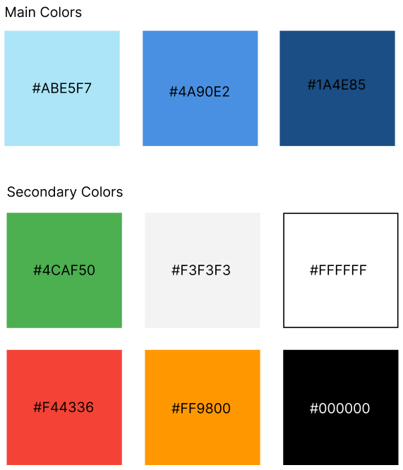

<strong style="font-size: 1.2em;">Tipografía</strong>
Se ha adoptado Lato como fuente principal debido a su naturaleza sans-serif de alta legibilidad. Sus proporciones equilibradas y líneas geométricas limpias son ideales para interfaces digitales modernas, permitiendo que el usuario procese la información rápidamente y sin distracciones, manteniendo la coherencia estética en todo el ecosistema de la plataforma.

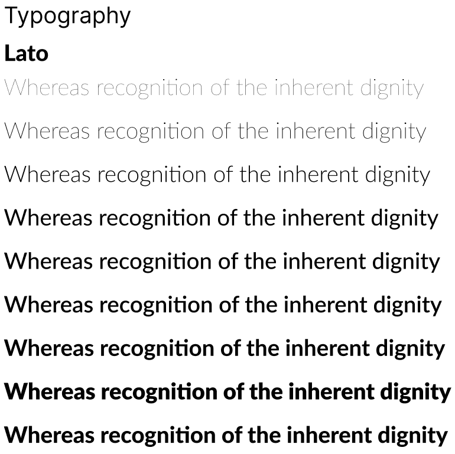

<strong style="font-size: 1.2em;">Simplicidad y Claridad</strong>
El diseño de SynHub se rige por el minimalismo funcional, eliminando cualquier ruido visual que interfiera con la gestión de tareas. Nos enfocamos en los siguientes pilares:

• **Interfaz Depurada**: Exposición exclusiva de elementos esenciales para guiar al usuario hacia la acción principal.

• **Gestión del Espacio**: Uso estratégico de áreas en blanco para prevenir la sobrecarga cognitiva y dar "aire" al contenido.

• **Flujos Optimizados**: Procesos directos que reducen la cantidad de pasos para completar una operación.

• **Estructura Visual**: Jerarquización clara mediante el uso de tamaños y contrastes para destacar la información crítica.

• **Iconografía Intuitiva**: Símbolos universales que facilitan la comprensión inmediata sin depender excesivamente del texto.

• **Comunicación Directa**: Lenguaje sencillo y sin tecnicismos innecesarios para una experiencia de usuario fluida.

• **Diseño Curvado**: Uso de bordes y transiciones redondeadas para crear una experiencia visual más suave, moderna y accesible, facilitando el flujo visual natural del usuario.

### 6.1.2. Web, Mobile & Devices Style Guidelines

Esta sección define las normativas de diseño para asegurar que la transición entre la navegación web y el uso de la aplicación móvil sea fluida y coherente. Nos enfocamos en adaptar la interfaz a las capacidades de cada dispositivo sin perder la identidad de SynHub.

**Web (Landing Page)**

El diseño web se centra en la claridad informativa y la conversión:

- Sistema de Rejilla: Rejilla de 12 columnas con márgenes laterales de 120px
- Componentes Interactivos: Botones con bordes redondeados de 8px
- Efectos Visuales: Elevación (shadows) que reaccionan al cursor (hover)
- Navegación: Fija en la parte superior para acceso rápido a las secciones

**Mobile (Native App)**

La interfaz móvil prioriza la ergonomía y la rapidez de acción:

- Adaptabilidad: Diseño de una sola columna respetando áreas seguras (safe areas)
- Zona de Contacto: Botones y controles con mínimo 44x44 dp para precisión táctil
- Navegación Intuitiva: Ubicada en la parte inferior (Bottom Nav) para uso con pulgar
- Interacción Natural: Integración de gestos como deslizamientos (swipes)

**Consistencia de Interacción**

Unificación en ambas plataformas:

- Biblioteca de Iconos: Iconos lineales compartidos
- Estética Unificada: Esquinas redondeadas en todos los contenedores
- Identidad Visual: Percepción de SynHub como herramienta moderna y consistente
- Experiencia Omnichannel: Coherencia independiente del dispositivo de acceso

## 6.2. Information Architecture

### 6.2.1. Labeling Systems

### 6.2.2. Searching Systems

### 6.2.3. SEO Tags and Meta Tags

### 6.2.4. Navigation Systems

## 6.3. Landing Page UI Design

### 6.3.1. Landing Page Wireframe

### 6.3.2. Landing Page Mock-up

## 6.4. Applications UX/UI Design

### 6.4.1. Applications Wireframes

### 6.4.2. Applications Wireflow Diagrams

## Conclusiones

### TB1:

- Se logró definir claramente el perfil de la startup y la problemática a resolver, estableciendo una propuesta de solución alineada a las necesidades del usuario.

- Se aplicaron herramientas de Lean UX que permitieron validar supuestos, identificar segmentos objetivo y estructurar una solución centrada en el usuario.

- Se realizó un adecuado levantamiento y análisis de requerimientos mediante entrevistas, permitiendo comprender las necesidades reales y comportamientos de los usuarios.

- Se definieron y organizaron los requerimientos del sistema a través de historias de usuario y backlog, asegurando coherencia y trazabilidad en el desarrollo del proyecto.

- Se diseñó la arquitectura del software a nivel estratégico, considerando atributos de calidad, restricciones y decisiones de diseño orientadas a una solución escalable y eficiente.

### TB2:
-

-

-

-

Anexo:

- GitHub: https://github.com/Collabrium-Software-Emergentes

- Canvas: https://canva.link/qvdo2sy5j3oymb7

- Report - Performance: https://docs.google.com/document/d/18V974bb9GybqhA7cpCk94X6QIRLjTvi7B1Cv5N9ZJnw/edit?usp=sharing

- Miro (DDD): https://miro.com/app/board/uXjVHf1ECEI=/?share_link_id=812951195114

- Diagram.net (C4): https://drive.google.com/file/d/1jl_4TdoMJSv2vXRpoh0_K3uaoTB0I73m/view?usp=sharing

- TB1 - Vídeo Grupal: https://upcedupe-my.sharepoint.com/:v:/g/personal/u202220294_upc_edu_pe/IQB_b05rwjo5QaGLdPw1yLh1AXde_eUvygY6fsJVKK0_R8g?e=9bOPov&nav=eyJyZWZlcnJhbEluZm8iOnsicmVmZXJyYWxBcHAiOiJTdHJlYW1XZWJBcHAiLCJyZWZlcnJhbFZpZXciOiJTaGFyZURpYWxvZy1MaW5rIiwicmVmZXJyYWxBcHBQbGF0Zm9ybSI6IldlYiIsInJlZmVycmFsTW9kZSI6InZpZXcifX0%3D

Bibliografía:

- 5W2H Explained: The Framework for Clear Problem Definition. (2025, 6 junio). Mete Kilic. https://metekilic.com/2025/04/08/5w2h-explained-the-framework-for-clear-problem-definition/ 

- A Simple Introduction to Lean UX. (2025, 25 septiembre). The Interaction Design Foundation. https://www.interaction-design.org/literature/article/a-simple-introduction-to-lean-ux 

- Drivers arquitectónicos | Genially. (2022, 19 octubre). Genially. https://view.genially.com/634f74940d7fc70018ed2a69/presentation-drivers-arquitectonicos 

- Gutiérrez, J. (2024, 3 diciembre). Patrones de Arquitectura: Guía de inicio. DEV Community. https://dev.to/goaqidev/patrones-de-arquitectura-guia-de-inicio-53ha 

- Microservices. (s. f.). Amazon Web Services, Inc. https://aws.amazon.com/microservices/ 

- Reference | Cucumber. (2025). https://cucumber.io/docs/gherkin/reference/